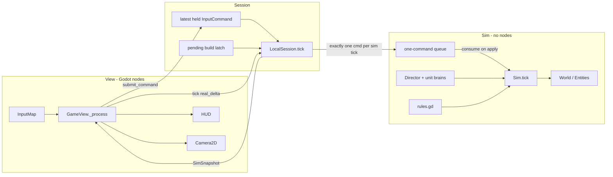
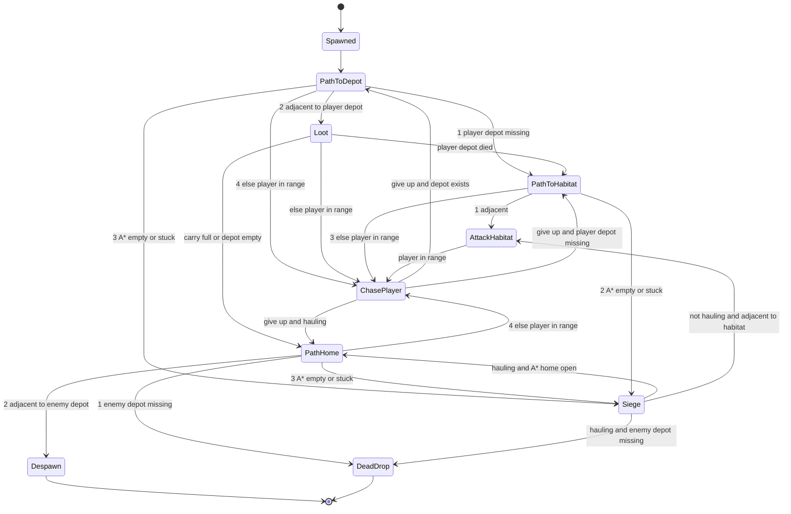
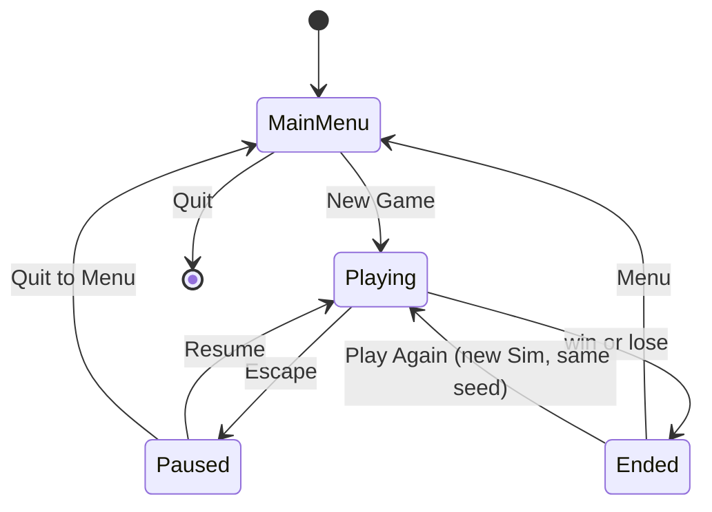
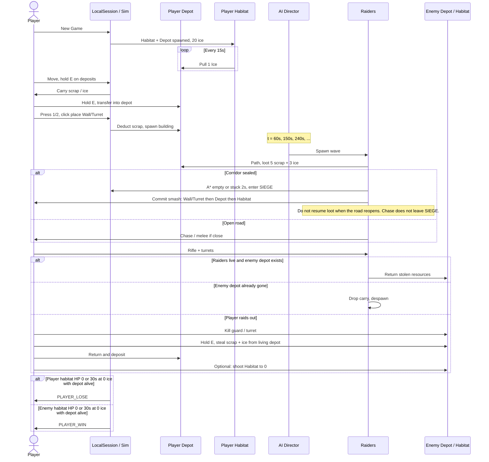

# v1 Minimum Playable Game — Design Document

| Field | Value |
| --- | --- |
| Title | v1 Minimum Playable Game |
| Author | [Author] |
| Date | 2026-08-16 |
| Status | Draft |
| Audience | Engineers implementing the game from this document alone |

This document is the exact requirements for v1. If a behavior is not specified here, it must not be implemented. New requirements must be added to this document before they are coded.

---

## Overview

v1 is a single-player, real-time, top-down 2D survival session on the Martian surface. The player is one colonist who must keep a two-building starter colony alive, expand it with a handful of defenses, survive periodic raids from one AI faction, and strike back by stealing stockpiled resources or destroying the enemy habitat.

The closed loop is: **gather two resources → spend them on buildings and life support → defend the depot and habitat from raiders → raid the enemy depot (or smash their habitat) → win or lose by a habitat-HP check or a 30 s zero-ice check.** The simulation is a fixed-tick authoritative state machine rendered by Godot 4. Single-player is sufficient for “minimally functional”; the session layer is shaped so LAN co-op can be added later without rewriting rules.

---

## Background & Motivation

There is no existing game code, engine project, or asset pipeline. The project brief requires a 2D Mars colony game with three pillars (build/maintain, defend against AI, steal from an enemy base), native Windows and Linux binaries, and a future path to LAN co-op and Steam.

Pain points this document removes:

- An unbounded “vision” scope that would block a playable loop.
- Scene-tree-as-truth architecture that would have to be thrown away for netcode.
- An engine choice that does not export both desktop targets cheaply.

v1 exists so an engineer can scaffold a repo, implement a short list of systems, and play a complete game in a single sitting (target session length **8–15 minutes**).

---

## Goals & Non-Goals

### Goals (v1)

- Launch a native window on Windows and Linux from a Godot 4 export.
- Start a session from a main menu and play one map end-to-end.
- Express all three pillars with the smallest set of systems that makes them real:
  1. Build and maintain a colony (Habitat + Depot, ice consumption, walls, turrets).
  2. Defend against at least one AI opponent that sends raiders to ravage the base (loot the depot on an open road; if blocked, committed smash of walls/turrets then depot then habitat).
  3. Walk to the enemy base, steal scrap and ice from their depot, and/or destroy their habitat.
- Deterministic-enough sim rules that can be unit-tested headless.
- Placeholder art that is readable (team color, resource color, building silhouette).
- Architecture that does not block later LAN (input commands in, snapshots out).

### Non-Goals / Out of v1

Do **not** implement any of the following in v1. They are listed so later work has a parking lot, not so they can be inferred into the code.

- LAN multiplayer, Steamworks, lobbies, NAT traversal, dedicated servers.
- Save / load / autosave (a session is one sitting; lose-or-win ends it).
- More than one map, biome, or procedural-world campaign.
- Tech tree, research, power grid, oxygen pipes, water pipes, logistics belts.
- More resource types than Scrap and Ice.
- More buildable types than Wall and Turret (Habitat and Depot are pre-placed, not buildable).
- Demolish / reclaim / refund of placed buildings (the player lives with placed walls and turrets).
- Multiple player-controlled colonists, squads, or RTS box-select.
- Vehicles, weather, day/night, fog of war, minimap.
- Narrative campaign, dialogue, cutscenes, lore codex.
- Complex crafting, weapon upgrades, ammo as an inventory item.
- Enemy that expands, builds, or gathers (enemy is a camp + wave director).
- Settings beyond window close / pause quit (no key rebind UI, no graphics menu).
- Localization, achievements, analytics SDKs, crash reporters.
- Controller / gamepad bindings (keyboard + mouse only).
- Debug cheats (set ice to 0, spawn raiders, god mode).

---

## Key Decisions

| Decision | Choice | Rationale |
| --- | --- | --- |
| Engine | **Godot 4.4+** (compatible with 4.4–4.5), **GDScript** | 2D-first, first-class Linux and Windows export, MIT license, built-in tile/camera/UI, High-level multiplayer (ENet) available when LAN is in scope. Practical for a small team with no existing code. |
| v1 multiplayer | **Single-player only** | The game is minimally functional with one human and one local AI. LAN is a later feature; shipping netcode in v1 would dominate the schedule. |
| Future net path | **`Session` interface** (`submit_command` / `tick` / `get_snapshot`). v1 implements `LocalSession` only. | Avoids baking rules into nodes. A later `LanHostSession` can run the same `Sim`. |
| Command/tick contract | **Latest-held command; one enqueue per sim tick; consume on apply.** Pause and a locked outcome drop gameplay. See Tick and update model. | Catch-up ticks, pause, and one-shot `build_kind` are otherwise unimplementable without invented rules. |
| Sim vs view | **Authoritative fixed-tick sim** (20 Hz) as plain GDScript objects. Godot nodes are a view. | Scene-tree-as-sim is faster to prototype and hostile to tests and lockstep/host-auth netcode. |
| Time model | **Real-time**, not turn-based. Sim steps `dt = 0.05s`. Render is decoupled. | Survival raids need simultaneous movement. Fixed dt keeps rules testable. |
| Space model | **64×64 tile occupancy**, **free 2D pixel movement** for units | Tiles make building, pathing, and deposits trivial. Pixel movement feels like a colonist, not a cursor. |
| Resources | **Exactly two: Scrap and Ice** | Scrap funds buildings. Ice funds life support. Both are stealable. A third resource is not required for the loop. |
| Buildings | **Habitat + Depot pre-placed; player builds Wall and Turret only** | Four building *kinds*, two of them constructible. Enough for maintain / defend. |
| Combat | **Player projectile rifle (no ammo). Turrets auto-fire. Raiders melee.** | Player must be able to kill a turret and a guard to raid. Ammo would add a third resource. |
| Ravage model | **Open road: loot-and-return.** Enter `SIEGE` only when A* to the current objective is empty or the raider has been stuck for `RAIDER_STUCK_TIME`. **Once in `SIEGE` and not hauling, they commit:** melee Wall/Turret, then Depot, then Habitat, even if a loot path later opens. Hauling raiders only break walls to go home (or `DeadDrop`). Chase does not preempt `SIEGE`. | Loot-and-return is the unblocked loop. Committing the smash after a seal makes habitat-HP lose a live path instead of a wall-break delay before more looting. |
| Win/lose | **Habitat HP 0, or ice has been 0 for 30 s while that faction still has a living Depot.** Destroying a depot spills loot and does **not** start or continue the starve clock. Smash path is habitat HP. Starve path requires emptying a living depot (steal). | Two intended win paths. Shooting the enemy depot must not be a third “wait 30 s” win. |
| AI | **One enemy camp. Wave raiders + one guard + one turret. No enemy economy.** | One opponent that ravages the base is the brief. An expanding AI is a second game. |
| Art | **32×32 pixel-art PNGs for `EMPTY` ground and `ROCK`. Everything else: colored primitives + 1px outlines, team stripe on buildings, damage flash on hit** | Terrain is the only textured layer in v1. Units and buildings stay primitives so silhouettes stay parseable. |
| Renderer | **`gl_compatibility`** | Broader Linux Mesa + older Windows GPU coverage for a desktop survival game. |
| Persistence | **None in v1** | Not required for a 8–15 minute loop. |

---

## Proposed Design

### Engine and repository layout

The Godot project root **is** the repository root. Application name in `project.godot` is `colony` (internal id, not a product title). Window title is `Colony`.

```
.
  CLAUDE.md
  design.md
  project.godot
  export_presets.cfg
  icon.svg
  .godot/
    global_script_class_cache.cfg  # tracked named-class registry
  src/
    autoload/
      app.gd                 # scene router: menu <-> game
    core/
      constants.gd           # all numeric rules (class_name Constants)
      types.gd               # enums: Faction, BuildingKind, ResourceKind, ...
    sim/
      sim.gd                 # Sim: owns world, ticks, applies commands
      world.gd               # tile grid + occupancy queries
      mapgen.gd              # seeded map
      entity.gd              # base: id, pos, radius, hp, faction
      unit.gd                # player, raider, guard
      building.gd
      projectile.gd
      deposit.gd
      loot.gd
      inventory.gd           # scrap + ice pair with capacity
      pathfind.gd            # A* on walkable tiles
      combat.gd              # damage, death, friendly-fire rules
      ai_director.gd         # wave schedule
      ai_raider.gd           # raider state machine
      ai_guard.gd            # guard state machine
      commands.gd            # InputCommand
      snapshot.gd            # immutable-enough view DTO
      rules.gd               # costs, win/lose, ice pull, validity
    session/
      session.gd             # abstract Session
      local_session.gd       # v1 implementation
    view/
      game_view.gd           # binds LocalSession to the scene
      world_view.gd          # tile background + static rocks/deposits
      unit_view.gd
      building_view.gd
      projectile_view.gd
      loot_view.gd
      camera_ctrl.gd
      build_ghost.gd
    ui/
      main_menu.gd
      hud.gd
      build_bar.gd
      pause_menu.gd
      end_screen.gd
      debug_overlay.gd
  scenes/
    boot.tscn                # main scene, loads App
    main_menu.tscn
    game.tscn
    ui/hud.tscn
    ui/pause_menu.tscn
    ui/end_screen.tscn
  assets/
    sprites/placeholder/     # ColorRect-baked or 32×32 PNG primitives (units, buildings)
    sprites/tiles/           # 32×32 terrain: ground.png, rock.png
    audio/sfx/               # optional short WAV/OGG; silence is allowed
    theme/default.tres
  tests/
    run.gd                   # test runner, exit 0/1; only via tools/test.sh
    test_inventory.gd
    test_rules.gd
    test_mapgen.gd
    test_combat.gd
    test_ai_raid.gd
    test_pathfind.gd
  tools/
    export.sh                # wraps Godot headless export for both OS targets
    test.sh                  # official test entry: private Xvfb + run.gd
```

`res://` mirrors this tree (`res://src/...`, `res://scenes/...`).

The rest of `.godot/` is editor output and is not tracked. `global_script_class_cache.cfg` is tracked: Godot registers `class_name` scripts from that file before autoloads parse. A source checkout must include it so `App` and other scripts can resolve named types (`Session`, `LocalSession`, `Constants`, …) without a prior editor import. Adding, renaming, moving, or removing a `class_name` script must update this file (the editor rewrites it on import; commit the result). Terrain textures still load from PNG when the import cache is missing.

Autoloads (only these):

| Autoload name | Script | Role |
| --- | --- | --- |
| `App` | `res://src/autoload/app.gd` | Change scene, hold `current_session` for the active run |

Do not put sim state in autoloads.

### Runtime architecture



**Rule:** nodes never mutate sim fields. They emit `InputCommand` values. The view rebuilds or patches sprites from the snapshot each rendered frame.

**Sole driver:** `GameView._process(delta)` is the only caller of `Session.submit_command` and `Session.tick(real_delta)`. Tests call `Sim` methods directly and do not go through `GameView`.

### Tick and update model

| Parameter | Value |
| --- | --- |
| `Constants.SIM_HZ` | `20` |
| `Constants.SIM_DT` | `0.05` seconds |
| Max catch-up ticks per rendered frame | `4` |
| Pause | `LocalSession.paused == true` skips accumulation, enqueue, and `Sim.tick` |
| End state | Once `outcome != NONE`, `LocalSession.tick` returns immediately; `Sim` is frozen; view shows the end screen |

#### Command / tick / pause contract (binding)

This contract is required. Implement it as a short comment on `LocalSession.tick` plus the code below. Do not invent a second queueing model later for LAN.

1. **`submit_command(cmd)` stores held state. It does not enqueue and it does not stamp `cmd.tick`.**
   - Overwrite `latest.move`, `latest.aim`, `latest.fire`, `latest.interact`.
   - If `cmd.build_kind >= 0`, latch `pending_build_kind` / `pending_build_tile`. A later `submit_command` with `build_kind < 0` must **not** clear the latch (otherwise a click on a frame that does not produce a sim tick is lost).
2. **`LocalSession.tick(real_delta)` is the only code that enqueues.**
   - If `paused` or `sim.outcome != NONE`: return immediately. Do **not** add `real_delta` to the accumulator (unpausing must not catch up pause time).
   - Otherwise `acc += real_delta`. While `acc >= SIM_DT` and catch-up count `< MAX_CATCHUP_TICKS`:
     - `acc -= SIM_DT`.
     - Clone `latest` into a command. Set `cmd.tick = sim.tick_index + 1`. Set `cmd.build_kind` / `cmd.build_tile` from the latch, then clear the latch (`pending_build_kind = -1`).
     - `sim.enqueue(cmd)` — exactly one command per sim tick.
     - `sim.tick()` — `Sim` applies that command and **consumes** it (the queue is empty after step 4 below).
   - Leftover `acc` is kept (capped implicitly by the catch-up limit; leftover above `MAX_CATCHUP_TICKS * SIM_DT` is discarded so a hitch cannot spiral).
3. **`build_kind` is one-shot.** The view sets it only on the click frame. The session latch holds it until the next sim tick consumes it, even if that tick is on a later render frame.
4. **`fire` and `interact` are held state**, not edges. `Sim` rate-limits fire with `weapon_cooldown` and rate-limits transfers with channel progress.
5. **While the player unit is dead, or `outcome != NONE`, `Sim` ignores `fire`, `interact`, `build_kind`, `move`, and `aim`.** The command is still consumed so the “one per tick” rule holds. Aim on the unit is left unchanged.
6. **`set_paused(true)`** exists on `LocalSession` (no-op view until the pause-menu task wires it). It only flips the flag that step 2 checks.

A future `LanHostSession` must preserve “one command per player per sim tick, consume on apply.” It may receive commands from the network instead of `GameView`, but it must not replay a backlog of pause-time or catch-up-uncloned commands.

#### `Sim.tick()` order

Must be this order; tests rely on it. If `outcome != NONE` at entry, return immediately (no `tick_index` increment).

1. `tick_index += 1`. Set `sim.time = tick_index * SIM_DT`.
2. **Decrement cooldowns** by `SIM_DT`, floored at 0:
   - every unit: `weapon_cooldown`, `path_recalc_in`
   - every dead player unit: `respawn_timer`
   - every building: `fire_cooldown`
   - every projectile: `life`
   - `Director.banner_timer`
   - Do **not** decrement here: `interact_progress`, `chase_timer`, `stuck_timer`, `ai_state_time`, `ice_debt_timer`, `zero_ice_timer` (those have their own steps).
3. **Ice consumption** for each faction that still has a living Habitat (`rules.tick_life_support`). This is the only life-support step.
4. **Apply and consume** all queued `InputCommand`s (v1: exactly one). Ignore gameplay fields if the player is dead or `outcome != NONE`. A `build_kind >= 0` is attempted once this tick via `rules.try_place`.
5. **AI director** (maybe spawn a wave; maybe start `banner_timer`).
6. **AI brains** write desired velocity / interact / melee-target intents on enemy units (including siege retarget).
7. **Turret fire:** for each living Turret, acquire the nearest living opposing **unit** in `TURRET_RANGE`. If a target exists, set `building.aim` toward it. If also `fire_cooldown <= 0`, spawn a projectile (faction = turret faction, damage `TURRET_DAMAGE`, speed `TURRET_PROJ_SPEED`, life `TURRET_PROJ_LIFE`) at turret center + `aim * MUZZLE_OFFSET` and set `fire_cooldown = TURRET_COOLDOWN`. If no target, leave `aim` unchanged (default `(1, 0)` at spawn).
8. **Integrate unit movement** with collision sliding. Then update each moving AI unit’s stuck detector (see AI opponent).
9. **Integrate projectiles** and resolve hits (see Combat rules). Remove projectiles with `life <= 0`.
10. **Resolve melee** for units whose `weapon_cooldown <= 0` and whose AI/player intent has a valid target in range.
11. **Resolve interact channels** (gather, loot, deposit, steal) via the single interact resolver. Movement already applied this tick: if this tick’s command had `move.length() > 0`, channels are reset and do not progress (see Player interaction rules).
12. **Process deaths**, loot drops, and player respawn (if `respawn_timer` hit 0).
13. **Evaluate win/lose** (`rules.evaluate_outcome`). On a non-`NONE` result, write `sim.outcome` and `sim.outcome_reason` and lock them. Further `Sim.tick` calls no-op.

There is no separate “increment raid / life-support timers” step. The director uses absolute `next_wave_at` compared to `sim.time`. Ice timers live entirely in step 3.

### World space

| Parameter | Value |
| --- | --- |
| Map size | **64 × 64 tiles** |
| Tile size | **32 × 32 pixels** |
| World size | **2048 × 2048 pixels** |
| Origin | Tile `(0,0)` at world `(0,0)`, +X right, +Y down (Godot 2D) |
| Tile index | `index = y * 64 + x` |

Tile terrain kinds (`types.gd` / `enum TileTerrain`): `EMPTY`, `ROCK`.

Occupancy is a second layer: a tile may also hold a building (footprint covers 1 or 4 tiles), a deposit, or loot. Rocks and buildings are **solid**. Deposits and loot are **not solid**.

A tile is **walkable** iff terrain is `EMPTY` and no solid building occupies it.

**Guaranteed connectivity:** mapgen **always** carves the L-corridor specified below (skipping tiles that fall on building footprints). After generation, flood-fill walkable tiles from the player spawn tile as a **validation assert** only: the enemy depot’s adjacent walkable tiles must be reachable. Flood-fill must not carve. If the assert fails, that is a generator bug (the always-carve geometry plus reserved rects are specified to make this pass). Tests check the assert on `DEFAULT_SEED` and on a handful of extra seeds (`2`, `3`, `4`, `5`).

### Map generation (deterministic)

`mapgen.generate(seed: int) -> World`

Use `RandomNumberGenerator` with `seed` set to the session seed. Default seed is `1` on “New Game” (v1 has no seed UI; the constant is `Constants.DEFAULT_SEED = 1`).

Algorithm:

1. Allocate 64×64 tiles, all `EMPTY`.
2. For each tile `(x,y)` not inside a **camp reserved rect**, set `ROCK` if `rng.randi_range(0, 99) < ROCK_PERCENT`.
3. Place player camp in `PLAYER_CAMP_RECT`:
   - Habitat at `PLAYER_HABITAT_TILE` (2×2: that tile and `+ (1,0)`, `+(0,1)`, `+(1,1)`), faction `PLAYER`, HP full.
   - Depot at `PLAYER_DEPOT_TILE` (2×2), faction `PLAYER`, HP full.
   - Starting stock in that depot: `START_PLAYER_SCRAP` Scrap, `START_PLAYER_ICE` Ice.
   - Player unit spawn world position: center of `PLAYER_SPAWN_TILE`.
4. Place enemy camp in `ENEMY_CAMP_RECT`:
   - Habitat at `ENEMY_HABITAT_TILE` (2×2), faction `ENEMY`, HP full.
   - Depot at `ENEMY_DEPOT_TILE` (2×2), faction `ENEMY`, HP full.
   - Starting stock in that depot: `START_ENEMY_SCRAP` Scrap, `START_ENEMY_ICE` Ice.
   - Enemy turret at `ENEMY_TURRET_TILE`, faction `ENEMY`.
   - Guard unit at center of `ENEMY_GUARD_TILE`, faction `ENEMY`.
5. **Always** carve the 3-wide L corridor (do not wait for a flood-fill failure):
   - Horizontal: all tiles with `y ∈ [CORRIDOR_H_Y0, CORRIDOR_H_Y1]` and `x ∈ [CORRIDOR_H_X0, CORRIDOR_H_X1]`.
   - Vertical: all tiles with `x ∈ [CORRIDOR_V_X0, CORRIDOR_V_X1]` and `y ∈ [CORRIDOR_V_Y0, CORRIDOR_V_Y1]`.
   - For each such tile that is not on a building footprint, set terrain `EMPTY`.
6. Place `SCRAP_DEPOSIT_COUNT` Scrap deposits and `ICE_DEPOSIT_COUNT` Ice deposits on walkable tiles that are not in either reserved rect, not on the corridor center line (`x == CORRIDOR_CENTER_X` or `y == CORRIDOR_CENTER_Y`), and at least `DEPOSIT_MIN_SEP` tiles from any other deposit. Each scrap deposit has `SCRAP_DEPOSIT_AMOUNT` remaining; each ice deposit has `ICE_DEPOSIT_AMOUNT` remaining. If a placement attempt fails `DEPOSIT_PLACE_ATTEMPTS` times, stop early; **minimum required** is `MIN_SCRAP_DEPOSITS` scrap and `MIN_ICE_DEPOSITS` ice. If minima fail, clear random non-reserved rocks and retry the failed resource once; if still failing, treat as a generator bug (test will catch it).
7. Flood-fill validate connectivity (assert only).
8. Assign incrementing `entity_id` starting at `1`.

v1 ships only this generator. No hand-authored map files.

### Camera

View-only numbers (not in `constants.gd` unless an implementer prefers them there):

- `Camera2D` child of the view, not of the player node.
- Each render frame: `position = lerp(position, player_world_pos, 1.0 - exp(-8.0 * delta))`.
- Zoom: mouse wheel. `zoom` scalar in `[0.75, 2.0]`, step `0.1`, default `1.0`. (Godot zoom of `2.0` means 2× magnification.)
- Clamp the camera so the viewport does not show space outside `[0, 2048]` on either axis. If the viewport is larger than the world (high zoom-out + large window), center the world.
- No edge-pan, no free camera detach in v1.

### Input scheme

Keyboard + mouse only. Bindings in `project.godot` Input Map:

| Action | Default | Effect |
| --- | --- | --- |
| `move_left` | A, Left | Move |
| `move_right` | D, Right | Move |
| `move_up` | W, Up | Move |
| `move_down` | S, Down | Move |
| `fire` | Mouse left (also used to confirm build) | Shoot if not in build mode |
| `interact` | E | Hold to gather / steal / deposit / pick up loot |
| `build_wall` | 1 | Enter build mode: Wall |
| `build_turret` | 2 | Enter build mode: Turret |
| `cancel` | Right mouse, Q | Leave build mode |
| `pause` | Escape | Toggle pause menu (ignored on end screen; unbound to a menu until the pause-menu task) |
| `zoom_in` | Wheel up | Zoom in |
| `zoom_out` | Wheel down | Zoom out |
| `debug_overlay` | F3 | Toggle debug overlay |

There is no reclaim / demolish key.

Movement vector is the sum of pressed cardinals, normalized if length > 1. The view writes that **unit-length (or zero)** vector into `InputCommand.move`; `Sim` multiplies by `PLAYER_SPEED`. Aim vector is `(mouse_world - player_pos).normalized()`. If mouse is on the player (length < `AIM_DEADZONE` px), reuse last non-zero aim (default `(1, 0)`).

Build mode: the view shows a tile-snapped ghost under the cursor (green if `rules.can_place`, red otherwise). Left mouse sets `build_kind` / `build_tile` on that frame’s `submit_command` only. Resources are taken from the **player depot**, not from carry. RMB / Q cancels without placing.

### Player interaction rules

The player unit is the only human-controlled entity.

**Move.** While alive, `InputCommand.move` is applied in the movement step. There is no “locked in place while channeling” flag.

**Channels vs movement.** Any command with `move.length() > 0` **prevents and resets** `interact_progress` that tick. The player must release WASD (zero movement vector) for gather / steal / deposit / loot channels to start or continue.

**Single interact resolver.** If `interact` is held, the player is alive, and `move.length() == 0`, pick exactly one target in this order:

1. **Depot** — if `distance(unit_center, depot_footprint_aabb) <= INTERACT_BUILDING_RANGE` for any living depot. Distance is point-to-AABB (0 if the point is inside). If two depots qualify, pick the nearer AABB. Own depot → **deposit**. Enemy depot → **steal**. A depot always wins over loot sitting on or next to it, and over resource deposits.
2. Else **loot** — nearest loot pile whose center is within `GATHER_RANGE` of the unit center.
3. Else **resource deposit** — nearest deposit with `remaining > 0` whose tile center is within `GATHER_RANGE` and for which the player has carry space of that kind.
4. Else none (`interact_progress = 0`).

If the resolved target’s `entity_id` changes, reset `interact_progress` to 0.

**Adjacency (buildings).** Used for player depot interact and for raider loot / despawn: `distance(unit_center, footprint_aabb) <= INTERACT_BUILDING_RANGE`. Units cannot occupy the solid footprint, so this means “stand next to it.” There is no second 40 px center-radius rule.

**Deposit (own depot).** Each tick while resolved: `interact_progress += SIM_DT`. Whenever `interact_progress >= TRANSFER_PERIOD`, subtract `TRANSFER_PERIOD` and transfer up to `TRANSFER_BATCH` Scrap (player → depot, limited by source and dest free space), then up to `TRANSFER_BATCH` Ice the same way. **First transfer occurs after one full `TRANSFER_PERIOD`**, not on the press frame.

**Steal (enemy depot).** Same cadence and batch as deposit, opposite direction (depot → player). Scrap first, then Ice, each up to `TRANSFER_BATCH`. This is the primary “steal supplies” action.

**Gather.** Same hold. After an uninterrupted `GATHER_CHANNEL`, transfer `1` unit from the deposit to the player inventory, then reset `interact_progress` (repeat while held). When `remaining` hits 0, remove the deposit entity.

**Pick up loot.** After an uninterrupted `LOOT_CHANNEL`, transfer as much of the pile as fits; leftover stays as the same pile; if both resources hit 0, remove the pile; reset `interact_progress`.

**Shoot.** If not in build mode, player alive, `fire` pressed, and `weapon_cooldown <= 0`, spawn a projectile at `unit.pos + aim * MUZZLE_OFFSET`, velocity `aim * PLAYER_PROJ_SPEED`, remaining life `PLAYER_PROJ_LIFE`, damage `PLAYER_PROJ_DAMAGE`, faction `PLAYER`. Set `weapon_cooldown = PLAYER_FIRE_COOLDOWN`. No ammo.

**Attack buildings.** Player projectiles that hit an enemy building apply damage. There is no separate “attack building” key.

**Raid-out path.** Walk across the map, kill or ignore the guard, destroy or walk around the enemy turret (destroying is the intended path), steal from the **living** enemy depot, walk home, deposit. Optionally keep shooting the enemy Habitat until it dies. Destroying the enemy depot spills loot (still stealable as piles) but does **not** starve that faction — habitat HP remains the smash path.

### Buildings

| Kind | Footprint | Max HP | Scrap cost | Buildable? | Solid | Notes |
| --- | --- | --- | --- | --- | --- | --- |
| Habitat | 2×2 | 200 | — | No (pre-placed) | Yes | Loss-condition target. Does not store ice. |
| Depot | 2×2 | 100 | — | No (pre-placed) | Yes | Stores Scrap and Ice. Capacity **50 / 50**. Raid / steal target. |
| Wall | 1×1 | 60 | 5 | Yes | Yes | Blocks units and projectiles. Raiders melee these when pathing is blocked. |
| Turret | 1×1 | 80 | 15 | Yes | Yes | Auto-fires. |

Placement rules (`rules.can_place`):

- All footprint tiles in bounds, `EMPTY`, not occupied by a building or deposit.
- No unit’s collision circle may overlap a footprint tile AABB at the moment of placement (reject; do not shove).
- Not inside `ENEMY_CAMP_RECT`. (Player reserved rect may be built in.)
- Player depot exists, is alive, and has at least `cost_scrap` Scrap.
- Total existing buildings (all factions, all kinds) `< MAX_BUILDINGS`.

On success: deduct scrap from player depot, spawn building at full HP, faction `PLAYER`, `aim = (1, 0)`. Instant (no build time).

Turret behavior (both factions, same numbers): see tick step 7 and the constants table. Turrets target units only, no lead.

**If a depot is destroyed:** remaining Scrap and Ice become **one** loot pile at the depot center. Occupancy tiles become empty. A faction with no depot cannot receive deposited resources and cannot pay for buildings. **Ice pull finds no depot and does not increment `zero_ice_timer`** (see Life support). v1 does not allow rebuilding a depot. Spilled loot is still a steal/pickup target.

**If a habitat is destroyed:** that faction is immediately eliminated (see win/lose). Do not drop ice; the match is over.

### Resources and inventories

`enum ResourceKind { SCRAP, ICE }`

`Inventory` is always a pair of non-negative integers plus a per-resource capacity:

```
class_name Inventory
var scrap: int
var ice: int
var cap_scrap: int
var cap_ice: int

func free_space(kind) -> int
func can_add(kind, n) -> bool
func add(kind, n) -> int      # returns leftover that did not fit
func remove(kind, n) -> int   # returns amount actually removed
```

| Holder | cap_scrap | cap_ice |
| --- | --- | --- |
| Player unit | 10 | 10 |
| Raider | 5 | 3 |
| Guard | 0 | 0 |
| Depot | 50 | 50 |
| Loot pile | 999 | 999 |
| Deposit | remaining is a single kind; not an Inventory |

There is no combined “weight.” Scrap and Ice do not substitute.

### Life support (maintain pillar)

`FactionLife` (`ice_debt_timer`, `zero_ice_timer`) is owned by **`Sim`**, one record per faction (`PLAYER`, `ENEMY`). It is not a field on the Habitat entity. A Habitat existing is only the predicate for running that faction’s life-support step.

`rules.tick_life_support(sim)` runs entirely in tick step 3, for each faction that still has a living Habitat:

1. `ice_debt_timer += SIM_DT`.
2. Let `depot` be that faction’s unique living Depot, or `null`.
3. **Starve clock:** if `depot != null` and `depot.inventory.ice == 0`, then `zero_ice_timer += SIM_DT`. If `depot == null`, do **not** add to `zero_ice_timer` (destroying the depot does not start or continue the starve clock).
4. If `ice_debt_timer >= ICE_PULL_PERIOD` for that faction, subtract one period. If `depot != null` and `depot.inventory.ice >= 1`, `remove(ICE, 1)` and set `zero_ice_timer = 0`.

| Faction | `ICE_PULL_PERIOD` | Starting depot ice | Time-to-empty if no income |
| --- | --- | --- | --- |
| Player | `ICE_PULL_PLAYER` **15.0 s** | 20 | 300 s (5 min) |
| Enemy | `ICE_PULL_ENEMY` **20.0 s** | 40 | 800 s (~13.3 min) |

When `zero_ice_timer >= ZERO_ICE_LIMIT` (30.0) **and** that faction still has a living Habitat, the faction is eliminated (life-support failure). Because step 3 only increments while a living depot exists with 0 ice, a starve win/lose requires emptying a **living** depot (the steal path). Smash remains habitat HP.

HUD:

- Always show player depot ice (or `—` if the player depot is missing).
- Ice readout turns `#E24A3B` when a living player depot has `ice <= 5` or `zero_ice_timer > 0`.
- Show a countdown `ceil(ZERO_ICE_LIMIT - zero_ice_timer)` **only while** the player depot is alive and (`ice == 0` or `zero_ice_timer > 0`). The value changes every sim tick (`SIM_DT`), not in 15 s steps.
- Do not show a starve countdown when the depot is missing.

Enemy does **not** gather or restock. The only way their ice decreases faster than the 20 s drip is the player stealing from the living depot.

### Units

| Unit | Faction | HP | Speed | Radius | Combat |
| --- | --- | --- | --- | --- | --- |
| Player | PLAYER | 50 | 120 px/s | 10 px | Projectile rifle, 7 dmg, 0.45 s, 400 px/s, 0.8 s life |
| Raider | ENEMY | 25 | 90 px/s | 10 px | Melee `RAIDER_MELEE_UNIT` vs units, `RAIDER_MELEE_BUILDING` vs buildings, range `RAIDER_MELEE_RANGE`, cooldown `RAIDER_MELEE_COOLDOWN` |
| Guard | ENEMY | 30 | 80 px/s | 10 px | Same melee damage and range as raiders; cooldown `GUARD_MELEE_COOLDOWN` |

Units do **not** collide with each other (they may overlap). They collide with solid tiles and slide (standard circle-vs-AABB, zero the normal component of velocity).

**Player death:** unit marked `alive = false`, carried inventory dropped as loot at the corpse, `respawn_timer = PLAYER_RESPAWN`. Camera stays on the corpse. Gameplay fields on incoming commands are ignored (see command contract). When `respawn_timer` reaches 0, if the player Habitat still exists: respawn at the original spawn tile if walkable; else the nearest walkable tile within `RESPAWN_SEARCH` tiles (Chebyshev); else the nearest walkable tile on the **entire map** by flood-fill from the habitat footprint center (push out to the first walkable tile). HP full, inventory empty, `alive = true`. If the habitat is gone, the match is already over.

**Enemy unit death:** drop carried inventory as loot if any; remove entity. Waves do not instantly replace them.

### Combat rules

- Friendly fire is **off**: a projectile never damages its own faction. Player cannot damage player buildings. Enemy melee does not damage enemy buildings.
- Projectiles are circles, radius `PROJ_RADIUS`. Each tick they move `velocity * SIM_DT`. **No swept collision** (at `PLAYER_PROJ_SPEED` this is 20 px/tick; accepted for v1).
- **Hit order (deterministic):** collect all living opposing units whose circle overlaps the projectile circle; if any, hit the one with the **smallest `entity_id`** and remove the projectile. Else, collect solid tiles whose AABB overlaps the projectile circle; if any, pick the tile with the **smallest tile index** `y * MAP_W + x`. If that tile has an opposing-faction building, apply damage to it. Rocks (and friendly buildings) eat the projectile with no damage. On hit or `life <= 0`, remove the projectile.
- Melee: if `weapon_cooldown <= 0` and a valid target is within range, apply damage and set `weapon_cooldown` to that unit’s melee cooldown. Raider/guard melee target selection is owned by their AI.
- HP is integer. At `hp <= 0`, the entity dies this tick after all damage is applied (no negative lingering).
- **Hit presentation:** the damaged entity flashes `#F2EDE6` for `HIT_FLASH` seconds of sim time (view may detect `hp` decreasing on the snapshot, or the snapshot may carry `last_hit_tick`). No world-space HP bars. HUD shows numeric HP for the player Habitat and the player Depot only.

### AI opponent

One enemy faction. No second AI.

Primary order on an **open road** is loot the player depot and return. `SIEGE` is a blocked-path state that, for a non-hauling raider, **commits to a smash** (Wall/Turret → Depot → Habitat). Habitat-HP lose is a live path: a sealed corridor is not a delay before more looting; the raiders finish the colony.

**`hauling`:** a raider is hauling iff `inventory.scrap > 0` or `inventory.ice > 0`.

Each tick, the current state's transition list is evaluated **in the written order**. Take the first match. Do not evaluate later arrows.



There is **no** `SIEGE → PATH_TO_DEPOT` arrow. A loot path opening does not exit `SIEGE`.

**Director (`ai_director.gd`):**

- `next_wave_at = FIRST_WAVE_AT` sim-seconds from session start.
- When `sim.time >= next_wave_at`: if the enemy depot is alive, spawn a wave; if the enemy depot is missing, skip spawn. In **both** cases set `next_wave_at += WAVE_PERIOD` and increment `wave_index` (no retry pile-up).
- Wave index `n` starts at 1. Raider count = `min(WAVE_CAP, WAVE_BASE + floor((n - 1) / 2))` → waves: 2, 2, 3, 3, 4, 4, …
- Spawn positions: walkable tiles adjacent to the enemy depot footprint, stacked if needed (overlap allowed).
- On a successful spawn, set `Director.banner_timer = RAID_BANNER_TIME`. HUD shows `"Raid incoming"` while `banner_timer > 0`.
- Waves fire on the clock even if the previous wave is still alive.

**Stuck detector** (movement step, every raider):

- Remember `stuck_last_pos` from last tick.
- If the unit had a desired speed `> 0` this tick and `(pos - stuck_last_pos).length() < RAIDER_STUCK_SPEED * SIM_DT`, `stuck_timer += SIM_DT`; else `stuck_timer = 0`.
- `stuck_last_pos = pos`.
- Stuck for AI purposes when `stuck_timer >= RAIDER_STUCK_TIME`.

**Raider brain:**

- Path uses A* on walkable tiles, recalculated when `path_recalc_in <= 0` (then reset to `PATH_RECALC`) or when the current path’s next node is blocked.
- Steering: seek the center of the next path tile at `RAIDER_SPEED`.
- **`PATH_TO_DEPOT` priority** (first match wins):
  1. Player depot missing or dead → `PATH_TO_HABITAT`.
  2. Adjacent to the player depot (`distance(center, depot_aabb) <= INTERACT_BUILDING_RANGE`) → `LOOT`.
  3. A* to the player depot is empty, **or** the stuck detector fired → `SIEGE`.
  4. Else if a living player is within `RAIDER_CHASE_RADIUS` → `CHASE` (resume = `PATH_TO_DEPOT`).
  5. Else follow A* toward the player depot.
- **`PATH_HOME` priority:**
  1. Enemy depot missing → `DEAD_DROP`.
  2. Adjacent to the enemy depot → `Despawn` (add carry to that depot; leftover becomes loot at the depot center; delete the raider).
  3. A* to the enemy depot is empty, **or** stuck → `SIEGE`.
  4. Else if a living player is within `RAIDER_CHASE_RADIUS` → `CHASE` (resume = `PATH_HOME`).
  5. Else follow A* home.
- **`PATH_TO_HABITAT` priority:**
  1. Adjacent to the player habitat → `ATTACK_HABITAT`.
  2. A* to the habitat is empty, **or** stuck → `SIEGE`.
  3. Else if a living player is within `RAIDER_CHASE_RADIUS` → `CHASE` (resume = `PATH_TO_HABITAT`).
  4. Else follow A* to the habitat.
- **`SIEGE` (commit rule).** Entered only from the priorities above. Do not walk-and-slide as a substitute for entering siege.
  - **Chase never preempts `SIEGE`.** A player standing on the seal does not pull raiders off the wall.
  - If **hauling**, check each tick in order: enemy depot missing → `DEAD_DROP`; else A* to the enemy depot is non-empty → `PATH_HOME`; else stay in `SIEGE` and melee only the nearest living **player Wall or Turret**. Do **not** target the player Depot or Habitat while hauling.
  - If **not hauling**, do **not** leave `SIEGE` because A* to the player depot (or any loot path) opened. Each recalc, set `siege_target_id` among living **player** buildings:
    1. Nearest Wall or Turret (distance from raider center to building AABB).
    2. Else the player Depot if alive.
    3. Else the player Habitat if alive.
  - After the last Wall/Turret dies, the target **becomes the Depot even if a walkable loot path exists**. After the Depot dies, the target **becomes the Habitat**. Raiders in this smash do not `LOOT`; they melee.
  - Move toward `siege_target_id` (A* to a walkable neighbor tile if one exists; else straight-line + slide). When `distance(center, target_aabb) <= RAIDER_MELEE_RANGE`, melee it. If the target is the Habitat and the raider is adjacent, transition to `ATTACK_HABITAT` (same melee).
- **Loot:** `RAIDER_LOOT_CHANNEL` while in `LOOT`. At the end, `remove` from the player depot up to the raider’s remaining carry and `add` to the raider. If the player depot dies mid-channel → `PATH_TO_HABITAT`. Else if carry is full (both resources at cap) **or** the depot has 0 scrap and 0 ice → `PATH_HOME`. Else if a living player is within `RAIDER_CHASE_RADIUS` → `CHASE` (progress resets; resume = `PATH_TO_DEPOT`). Else keep channeling.
- **`DeadDrop`:** drop carry as loot at the raider’s feet and delete the raider. One-tick transition. Do not idle.
- **ChasePlayer:** move toward the player; melee when in range. `chase_timer` increments by `SIM_DT` while distance `> RAIDER_CHASE_RADIUS`, else resets to 0. After `chase_timer >= RAIDER_CHASE_GIVEUP`, resume: `PATH_HOME` if hauling, else `PATH_TO_DEPOT` if the player depot exists, else `PATH_TO_HABITAT`. Chase is never entered from `SIEGE`.
- **`ATTACK_HABITAT`:** melee the habitat until it dies (player lose) or the raider dies. If a living player is within `RAIDER_CHASE_RADIUS`, `CHASE` (resume = `PATH_TO_HABITAT`).

**Guard brain:**

- Home = spawn position.
- If player is within `GUARD_AGGRO` of home, chase and melee (`RAIDER_MELEE_*` damage/range, `GUARD_MELEE_COOLDOWN`).
- Else if more than `GUARD_LEASH` from home, path home.
- Else idle.
- Guard never loots, never sieges, and never joins waves.

Enemy Habitat and Depot do not think. Enemy does not build, gather, or place walls.

### Pathfinding

A* on the 64×64 walkable grid. 4-connected (no diagonals) to avoid corner-cutting through diagonal rocks. Heuristic: Manhattan. Max nodes expanded: `MAP_W * MAP_H`. Returns an empty array if no path.

Raiders must not “walk in a straight line and stick” as their blocked-path behavior; that is `SIEGE`. Straight-line + slide is allowed only as the last steering fallback while already in `SIEGE` toward a chosen building.

### Session flow



- **Main menu** widgets: `New Game`, `Quit`. No continue, no settings.
- **Pause menu:** `Resume`, `Quit to Menu`. Pause **freezes sim time** via the command contract (no accumulator, no enqueue, no `Sim.tick`). The menu is unwired until the pause-menu task.
- **End screen:** title `Colony standing` (player win) or `Colony lost` (player lose), one-line reason from the mapping table below, buttons `Play Again` and `Menu`.
- `Quit` on the main menu calls `get_tree().quit()`.

There is no save file.

After `outcome` locks, the sim is frozen (no ice, no waves, no AI, no projectiles). The end screen is not drawn over a still-ticking raid.

### Win and lose conditions

Evaluated at the end of every sim tick in `rules.evaluate_outcome(sim) -> (Outcome, OutcomeReason)`.

```
enum Outcome { NONE, PLAYER_WIN, PLAYER_LOSE }
enum OutcomeReason { NONE, HABITAT_DESTROYED, LIFE_SUPPORT }
```

Checks, in order:

1. If player Habitat is missing or `hp <= 0` → `(PLAYER_LOSE, HABITAT_DESTROYED)`.
2. If player `zero_ice_timer >= ZERO_ICE_LIMIT` → `(PLAYER_LOSE, LIFE_SUPPORT)`.
3. If enemy Habitat is missing or `hp <= 0` → `(PLAYER_WIN, HABITAT_DESTROYED)`.
4. If enemy `zero_ice_timer >= ZERO_ICE_LIMIT` → `(PLAYER_WIN, LIFE_SUPPORT)`.
5. Else `(NONE, NONE)`.

First matching check wins (if both habitats somehow die in the same tick, the player loses — they failed to protect the colony). After a non-`NONE` outcome, `Sim` writes both enums and further ticks do not change them.

`Session.get_outcome()` returns `Outcome`. `Session.get_outcome_reason()` returns `OutcomeReason` (an int enum, **not** a free string).

End-screen / stub-label mapping (view-only strings):

| Outcome | OutcomeReason | Line |
| --- | --- | --- |
| `PLAYER_WIN` | `HABITAT_DESTROYED` | `Enemy habitat destroyed` |
| `PLAYER_WIN` | `LIFE_SUPPORT` | `Enemy life support failed` |
| `PLAYER_LOSE` | `HABITAT_DESTROYED` | `Habitat destroyed` |
| `PLAYER_LOSE` | `LIFE_SUPPORT` | `Life support failed` |

These are the only win/lose conditions. No score, no turn limit, no “survive N waves.” Destroying a depot is not a win.

### Gameplay loop (sequence)



A successful playtest of the loop is: gather ice before the 5-minute fail, spend scrap on at least one turret before the first raid, survive an **open-road** raid (raiders loot and leave), reach the enemy depot, steal at least one resource from the living depot, and then either starve that depot or destroy the enemy habitat. Sealing the corridor is a valid lose: committed siege smashes walls, then the depot, then the habitat.

### Art and audio (v1, placeholder-but-readable)

Not a production art bible. The constraint is **parseability at a glance**.

| Thing | Representation |
| --- | --- |
| Ground | 32×32 pixel-art dirt `res://assets/sprites/tiles/ground.png` (rust-orange near `#8A4B2A`), nearest-neighbor, plus a faint `#7A4024` 32 px grid |
| Rock | 32×32 pixel-art boulder `res://assets/sprites/tiles/rock.png` with transparent corners and a dark outline, drawn over ground; fills most of the tile |
| Scrap deposit | Orange `#C45C26` triangle pile, 20×16 px |
| Ice deposit | Cyan `#A8D8EA` diamond, 18×18 px |
| Loot | Yellow `#E2C044` small square |
| Player unit | Teal `#3DDC97` circle, 20 px, dark outline, a 6 px aim notch |
| Raider | Red `#C23B22` circle, slightly smaller notch |
| Guard | Dark red `#8B1E13` circle, thicker outline |
| Player buildings | Fill `#4A5560`, **teal 4 px stripe** on the top edge |
| Enemy buildings | Fill `#4A5560`, **red 4 px stripe** on the top edge |
| Habitat silhouette | 2×2 box + a semicircle “dome” on the top two tiles |
| Depot | 2×2 box + a smaller inner square |
| Wall | 28×28 square inset in the tile |
| Turret | 1×1 box + a rotating dark barrel driven by snapshot `aim` |
| Projectile (player) | Teal 4 px circle |
| Projectile (turret) | Faction-colored 4 px circle |
| Build ghost | 40% opacity, green `#3DDC97` or red `#C23B22` |
| Damage flash | Entity fill `#F2EDE6` for `HIT_FLASH` after HP decreases |
| HUD | Dark panel `Color(0,0,0,0.65)`, text `#F2EDE6`, Godot default font 16 px; numeric HP for player Habitat and Depot |
| Low ice | Ice readout turns `#E24A3B` when depot ice ≤ 5 or `zero_ice_timer > 0` |
| Raid banner | Top-center text while `banner_timer > 0` |

Audio is optional. If present, five one-shot SFX (shoot, hit, build, gather tick, raid alarm) at ≤ 200 ms each, CC0 or generated. No licensed music is required. **Visual feedback is mandatory; audio is not.** Mute must not block play.

Window default: **1280×720**, resizable, stretch mode `canvas_items`, aspect `keep`. Clear color `#5C2E1F`.

### Project settings that are requirements

In `project.godot`:

- `config/name="colony"`
- `config/windows_native_icon` unset in v1 (default icon OK)
- `application/run/main_scene="res://scenes/boot.tscn"`
- `display/window/size/viewport_width=1280`
- `display/window/size/viewport_height=720`
- `display/window/stretch/mode="canvas_items"`
- `display/window/stretch/aspect="keep"`
- `physics/common/physics_ticks_per_second=20` (view may use this; sim uses its own clock and must not depend on `_physics_process` for correctness)
- `rendering/renderer/rendering_method="gl_compatibility"`
- `rendering/renderer/rendering_method.mobile="gl_compatibility"`

Export presets in `export_presets.cfg`:

1. `Linux/X11` — executable name `colony.x86_64`
2. `Windows Desktop` — executable name `colony.exe`

Both are x86_64. No console wrapper required. `tools/export.sh` invokes Godot headless with those presets.

---

## API / Interface Changes

Greenfield: these are the initial interfaces. Names are requirements.

### Commands (player → sim)

```gdscript
# res://src/sim/commands.gd
class_name InputCommand
var tick: int
var player_id: int          # always 0 in v1
var move: Vector2           # unit-length or ZERO; Sim scales by PLAYER_SPEED
var aim: Vector2            # unit vector
var fire: bool
var interact: bool          # held
var build_kind: int         # BuildingKind or -1
var build_tile: Vector2i    # ignored if build_kind < 0
```

There is no `reclaim` field.

Held vs one-shot is defined in **Command / tick / pause contract**. The view does not stamp `tick`. `Sim` does not keep applied commands.

### Session

```gdscript
# res://src/session/session.gd
class_name Session
func start(seed: int) -> void
func submit_command(cmd: InputCommand) -> void
func set_paused(p: bool) -> void
func tick(real_delta: float) -> void
func get_snapshot() -> SimSnapshot
func get_outcome() -> int          # Outcome
func get_outcome_reason() -> int   # OutcomeReason
```

`LocalSession` is the only subclass in v1. A future `LanHostSession` must be addable without changing `Sim` public methods.

### Sim

```gdscript
# res://src/sim/sim.gd
class_name Sim
var tick_index: int
var time: float             # tick_index * SIM_DT after step 1
var outcome: int            # Outcome
var outcome_reason: int     # OutcomeReason
func setup(seed: int) -> void
func enqueue(cmd: InputCommand) -> void
func tick() -> void
func snapshot() -> SimSnapshot
```

`Sim` has **no** `Node` methods, no `autoload` access, no file I/O.

### Snapshot (sim → view)

`SimSnapshot` is a `RefCounted` with copied primitive fields the view needs: tick, time, `outcome`, `outcome_reason`, tiles (or a handle + dirty flag), arrays of unit/building/projectile/deposit/loot records (id, kind, faction, pos, hp, hp_max, **aim** — units and turrets — inventory, timers relevant to HUD), director `next_wave_at`, `wave_index`, `banner_timer`, player `respawn_timer`, each faction’s `zero_ice_timer` and whether that faction currently has a living depot with `ice == 0`.

Turret barrel rotation **must** use the building record’s `aim` from the snapshot (set in tick step 7 whenever a target exists).

The view may keep a persistent tile mesh and only rebuild entities by id.

---

## Data Model Changes

Initial model. No migrations (no saves).

### Enums (`types.gd`)

```gdscript
enum Faction { PLAYER, ENEMY }
enum BuildingKind { HABITAT, DEPOT, WALL, TURRET }
enum UnitKind { PLAYER, RAIDER, GUARD }
enum ResourceKind { SCRAP, ICE }
enum TileTerrain { EMPTY, ROCK }
enum Outcome { NONE, PLAYER_WIN, PLAYER_LOSE }
enum OutcomeReason { NONE, HABITAT_DESTROYED, LIFE_SUPPORT }
enum RaiderState {
    SPAWNED, PATH_TO_DEPOT, LOOT, PATH_HOME, CHASE,
    PATH_TO_HABITAT, ATTACK_HABITAT, SIEGE, DEAD_DROP
}
```

`NEUTRAL` is not a faction in v1. Deposits and loot have no faction field.

### Core records

```
World
  seed: int
  tiles: PackedByteArray          # 4096 entries, TileTerrain
  buildings: Dictionary[int, Building]   # by id
  occupancy: Array[int]           # 4096, building id or 0
  deposits: Dictionary[int, Deposit]
  loot: Dictionary[int, Loot]
  units: Dictionary[int, Unit]
  projectiles: Dictionary[int, Projectile]
  next_id: int

Building
  id, kind, faction, origin_tile: Vector2i, hp, hp_max
  inventory: Inventory            # only Depot uses it; others empty cap 0
  fire_cooldown: float            # Turret only
  aim: Vector2                    # Turret barrel; default (1, 0)

Unit
  id, kind, faction, pos: Vector2, hp, hp_max, radius
  vel: Vector2, aim: Vector2
  inventory: Inventory
  weapon_cooldown: float
  alive: bool
  respawn_timer: float            # player only
  # AI only:
  ai_state: int
  ai_state_time: float
  path: Array[Vector2i]
  path_recalc_in: float
  interact_progress: float
  chase_timer: float
  stuck_timer: float
  stuck_last_pos: Vector2
  siege_target_id: int

Deposit
  id, kind: ResourceKind, tile: Vector2i, remaining: int

Loot
  id, pos: Vector2, inventory: Inventory

Projectile
  id, faction, pos, vel, damage, life

Director
  wave_index: int                 # last spawned or skipped; 0 = none yet
  next_wave_at: float
  banner_timer: float

FactionLife                     # owned by Sim, not by Habitat
  ice_debt_timer: float
  zero_ice_timer: float
```

`Sim` holds one `World`, one `Director`, `FactionLife` for `PLAYER` and `ENEMY`, plus `outcome` / `outcome_reason`.

### Numeric constants (complete v1 table)

All live in `res://src/core/constants.gd`. Implementers must not invent additional tunables that change **rules**. View-only numbers (camera lerp, zoom, colors, font sizes, `HIT_FLASH` if implemented purely as a view reaction to hp deltas) may live in view scripts.

| Name | Value |
| --- | --- |
| `MAP_W`, `MAP_H` | 64, 64 |
| `TILE` | 32 |
| `SIM_HZ`, `SIM_DT` | 20, 0.05 |
| `MAX_CATCHUP_TICKS` | 4 |
| `DEFAULT_SEED` | 1 |
| `PLAYER_CAMP_RECT` | `Rect2i(2, 46, 14, 16)` |
| `ENEMY_CAMP_RECT` | `Rect2i(48, 2, 14, 16)` |
| `PLAYER_HABITAT_TILE` | `(6, 52)` |
| `PLAYER_DEPOT_TILE` | `(9, 52)` |
| `PLAYER_SPAWN_TILE` | `(8, 55)` |
| `ENEMY_HABITAT_TILE` | `(54, 6)` |
| `ENEMY_DEPOT_TILE` | `(51, 6)` |
| `ENEMY_TURRET_TILE` | `(48, 10)` |
| `ENEMY_GUARD_TILE` | `(50, 9)` |
| `CORRIDOR_H_X0`, `CORRIDOR_H_X1` | 11, 51 |
| `CORRIDOR_H_Y0`, `CORRIDOR_H_Y1` | 51, 53 |
| `CORRIDOR_V_X0`, `CORRIDOR_V_X1` | 50, 52 |
| `CORRIDOR_V_Y0`, `CORRIDOR_V_Y1` | 8, 51 |
| `CORRIDOR_CENTER_X`, `CORRIDOR_CENTER_Y` | 51, 52 |
| `DEPOSIT_PLACE_ATTEMPTS` | 200 |
| `DEPOSIT_MIN_SEP` | 2 |
| `PLAYER_SPEED` | 120.0 |
| `PLAYER_HP` | 50 |
| `PLAYER_RADIUS` | 10.0 |
| `PLAYER_FIRE_COOLDOWN` | 0.45 |
| `PLAYER_PROJ_DAMAGE` | 7 |
| `PLAYER_PROJ_SPEED` | 400.0 |
| `PLAYER_PROJ_LIFE` | 0.8 |
| `PLAYER_CARRY_SCRAP`, `PLAYER_CARRY_ICE` | 10, 10 |
| `PLAYER_RESPAWN` | 5.0 |
| `RESPAWN_SEARCH` | 4 |
| `MUZZLE_OFFSET` | 14.0 |
| `AIM_DEADZONE` | 1.0 |
| `RAIDER_HP` / `SPEED` / `RADIUS` | 25 / 90.0 / 10.0 |
| `RAIDER_MELEE_UNIT` / `RAIDER_MELEE_BUILDING` | 6 / 8 |
| `RAIDER_MELEE_RANGE` / `RAIDER_MELEE_COOLDOWN` | 18.0 / 0.7 |
| `RAIDER_CARRY_SCRAP`, `RAIDER_CARRY_ICE` | 5, 3 |
| `RAIDER_LOOT_CHANNEL` | 3.0 |
| `RAIDER_CHASE_RADIUS` | 96.0 |
| `RAIDER_CHASE_GIVEUP` | 4.0 |
| `RAIDER_STUCK_TIME` | 2.0 |
| `RAIDER_STUCK_SPEED` | 8.0 |
| `GUARD_HP` / `SPEED` / `RADIUS` | 30 / 80.0 / 10.0 |
| `GUARD_AGGRO` | 192.0 |
| `GUARD_LEASH` | 48.0 |
| `GUARD_MELEE_COOLDOWN` | 0.65 |
| `HABITAT_HP` | 200 |
| `DEPOT_HP` | 100 |
| `DEPOT_CAP_SCRAP`, `DEPOT_CAP_ICE` | 50, 50 |
| `WALL_HP` / `WALL_COST` | 60 / 5 |
| `TURRET_HP` / `TURRET_COST` | 80 / 15 |
| `TURRET_RANGE` | 160.0 |
| `TURRET_DAMAGE` / `TURRET_COOLDOWN` | 10 / 1.0 |
| `TURRET_PROJ_SPEED` / `TURRET_PROJ_LIFE` | 360.0 / 0.6 |
| `PROJ_RADIUS` | 3.0 |
| `START_PLAYER_SCRAP`, `START_PLAYER_ICE` | 15, 20 |
| `START_ENEMY_SCRAP`, `START_ENEMY_ICE` | 20, 40 |
| `ICE_PULL_PLAYER` | 15.0 |
| `ICE_PULL_ENEMY` | 20.0 |
| `ZERO_ICE_LIMIT` | 30.0 |
| `GATHER_CHANNEL` | 1.0 |
| `GATHER_RANGE` | 20.0 |
| `TRANSFER_PERIOD` | 0.2 |
| `TRANSFER_BATCH` | 5 |
| `LOOT_CHANNEL` | 0.3 |
| `INTERACT_BUILDING_RANGE` | 24.0 |
| `FIRST_WAVE_AT` | 60.0 |
| `WAVE_PERIOD` | 90.0 |
| `WAVE_BASE` | 2 |
| `WAVE_CAP` | 4 |
| `RAID_BANNER_TIME` | 3.0 |
| `SCRAP_DEPOSIT_COUNT` / `SCRAP_DEPOSIT_AMOUNT` | 18 / 8 |
| `ICE_DEPOSIT_COUNT` / `ICE_DEPOSIT_AMOUNT` | 12 / 6 |
| `MIN_SCRAP_DEPOSITS` / `MIN_ICE_DEPOSITS` | 12 / 8 |
| `ROCK_PERCENT` | 12 |
| `MAX_BUILDINGS` | 64 |
| `PATH_RECALC` | 0.5 |
| `HIT_FLASH` | 0.1 |

Guard melee **damage and range** are `RAIDER_MELEE_UNIT`, `RAIDER_MELEE_BUILDING`, and `RAIDER_MELEE_RANGE`. Only the cooldown is separate.

---

## Alternatives Considered

### Engine: Godot 4 vs Unity vs Bevy / custom

| | Godot 4 | Unity | Bevy or custom SDL |
| --- | --- | --- | --- |
| 2D | First-class | Present, 3D-first | DIY |
| Win + Linux export | Official, simple | Official, heavier toolchain | DIY |
| License / cost | MIT | Seat + runtime terms | MIT / Apache |
| LAN later | ENet / MultiplayerAPI | Netcode packages | DIY |
| Small-team speed | High | Medium | Low for a first playable |
| Testability | Headless + GDScript | Edit-mode tests | High if designed for it |

**Chosen: Godot 4.** Unity’s export and licensing overhead is unjustified for a 2D v1. Bevy is attractive for a pure sim but would spend the v1 budget on engine work (assets, UI, export) instead of the loop.

### Architecture: authoritative sim vs scene-tree-as-sim

| | Authoritative `Sim` + snapshot | Nodes as truth (`CharacterBody2D` HP, Area2D gather) |
| --- | --- | --- |
| v1 speed | Slightly slower to stand up | Faster first movement |
| Headless tests | Natural | Requires a scene tree for every rule |
| LAN later | Host runs `Sim`, clients send commands | Rewrite |
| Determinism | One `dt`, one order | `_process` / physics jitter |

**Chosen: authoritative sim.** The extra types (`InputCommand`, `SimSnapshot`) are small compared to rewriting combat and AI later.

### Space: tile occupancy + pixel units vs free-place buildings vs grid-locked units

Free-place buildings look “scrappy” but require rotation, overlap resolution, and messier pathing — not worth it for two buildable types. Grid-locked unit movement would make rifle kiting and raid approaches feel like a board game. **Hybrid** is the smallest thing that plays well.

### Multiplayer in v1 vs single-player first

LAN-in-v1 would force prediction, host migration, and a lobby before the loop exists. Single-player with `Session` as a seam is the brief’s “minimally functional” reading. Steam is out of v1 for the same reason.

### Real-time vs tick-based colony turns

Turn-based would simplify AI and tests but would not feel like defending a raid. Real-time with a fixed sim tick gets both.

### Ravage model: loot-and-return vs always-siege vs ghost walls

| | Loot-and-return + siege-when-blocked (chosen) | Always melee buildings | Walls do not block enemy units |
| --- | --- | --- | --- |
| Defend pillar | Walls delay raids; depot/habitat can die | Walls are the whole fight | Walls are projectile cover only |
| Steal pillar | Raiders still leave with stock if the road is open | Raiders never “steal and run” | Same as loot-and-return if the road is open |
| Habitat-HP lose | Live, after walls/depot fall | Live immediately | Dead unless something else damages habitat |
| v1 AI size | One extra state + stuck timer | Needs targeting priorities always | Tiny AI, corridor seal is free |

**Chosen: loot-and-return on an open road; committed smash once `SIEGE` starts (not hauling).** Leaving `SIEGE` when A* reopens would make habitat-HP lose dead (walls would only delay the next loot). Always-siege would turn every wave into a demolition crew and skip the steal-defend economy. Ghost walls would make the one player-built defense decorative against the AI.

---

## Security & Privacy Considerations

v1 is a local process with no network listener, no accounts, and no save files.

| Topic | v1 requirement |
| --- | --- |
| Network | Do not bind a port. Do not initialize `ENetMultiplayerPeer`. |
| PII | None collected. |
| Telemetry | None. |
| Mods / `user://` scripts | Do not load scripts from `user://`. |
| Log files | Optional `user://logs/` text; no home-directory crawl. |

**Save-file integrity (for the future, not implemented):** if a save format is added, it must be versioned JSON (or binary with a magic header + version), parsed without `str_to_var` of arbitrary objects, with unknown keys ignored and known keys range-checked. Saves must never contain executable code.

**Future LAN trust assumptions (document now so v1 does not violate them):**

- The host’s `Sim` is authoritative. Clients send `InputCommand` only.
- Clients must not be trusted for HP, inventory, hit confirmation, or “I stole 50 ice.”
- Do not put secrets in snapshots. Snapshots are the whole public world (v1 has no fog of war).
- When Steam is added, session membership is a transport problem; rules stay on the host.

---

## Observability

This is a local game, not a service. Observability is for developers and playtesters.

| Signal | How |
| --- | --- |
| FPS, tick, entity counts, outcome, depot stocks, next wave | F3 debug overlay (`ui/debug_overlay.gd`), drawn only when toggled |
| Failed asserts in sim (negative inventory, occupancy mismatch) | `push_error` + in debug builds `assert` |
| Automated tests | `./tools/test.sh` → stdout `PASS` / `FAIL` lines; process exit code |
| Player-facing errors | None beyond “could not initialize renderer” from Godot |

No metrics backend, no alerting, no crash dump pipeline in v1.

Log policy: `print` is allowed in `mapgen` and session start (`seed=`, `outcome=`). Do not per-tick `print`.

No debug key sets depot ice to 0. Life-support lose is proven by unit test; the manual checklist only confirms the HUD countdown appears.

---

## Rollout Plan

Not a SaaS flag rollout. v1 ships as a sequence of mergeable tasks (see **Task Plan**) that each leave `main` playable at the current layer (empty window → walkable map → full loop → packaged binaries).

**Definition of done for v1:**

1. `./tools/test.sh` exits 0 on Linux (virtual X server; never the host display).
2. Manual playtest checklist (below) passes on Linux and on a Windows export.
3. Exports exist for `Linux/X11` and `Windows Desktop` via `tools/export.sh`.
4. No feature that is not in this document is reachable in the build.

**Rollback:** revert the last merged task. Because there is no live service and no save compatibility, revert is always safe.

**Staging:** developers run the editor project. Playtesters get zipped export artifacts (`colony.x86_64` + `pck`, or `colony.exe` + `pck`).

---

## Test Strategy

### Automated unit (required)

The **only** official test command is:

```
./tools/test.sh
```

`tools/test.sh` starts a **private Xvfb** (virtual X server, default screen `1280x720x24`) on a display number that is **not** the session display (`:0` / `:0.0`), sets `DISPLAY` to that server, unsets `WAYLAND_DISPLAY`, and runs:

```
godot --display-driver x11 --audio-driver Dummy --path . -s res://tests/run.gd
```

Rules for agents and humans:

- **Do not** invoke `godot --headless` for the test runner. Headless uses the dummy display driver and is not the test environment.
- **Do not** run Godot tests against the host display manager (`DISPLAY=:0`, XWayland on the session, or an unset `DISPLAY` that falls back to the session).
- **Do not** use Xephyr or any nested window on the visible session.
- `res://tests/run.gd` **must refuse** to run unless `COLONY_TEST_XVFB=1` is set (the wrapper sets this) and `DISPLAY` is not the session X display. Direct `godot … -s res://tests/run.gd` must exit 1.
- Xvfb is a required Linux test dependency (`xvfb` package, or a user-local `Xvfb` binary on `PATH`). Software GL (`LIBGL_ALWAYS_SOFTWARE=1`) is the default so tests do not touch the session GPU.
- Automated tests are Linux-only in v1. Windows coverage is the manual playtest checklist, not this runner.

No third-party addon (no GUT/GdUnit dependency in v1). `run.gd` instantiates each test script, calls `run() -> PackedStringArray` of failure messages, prints a summary, `quit(1)` if any failure.

Required cases:

| File | Cases |
| --- | --- |
| `test_inventory.gd` | add/remove/clamp; leftover on overflow; empty remove returns 0 |
| `test_rules.gd` | `can_place` rejects rock, overlap, enemy rect, unaffordable, max buildings, missing depot; ice pull decrements depot; with depot ice at 0, `zero_ice_timer` increases by `SIM_DT` each tick and hits `ZERO_ICE_LIMIT` in exactly 600 ticks → lose; destroying the depot **stops** further `zero_ice_timer` growth; a missing depot from t=0 never starts the timer; enemy habitat 0 → win; same-tick both habitats dead → player lose; build deducts scrap; first depot transfer occurs after one `TRANSFER_PERIOD`, amount `TRANSFER_BATCH` |
| `test_mapgen.gd` | seed 1 is deterministic (tile hash equal across two runs); seeds 1–5 pass the connectivity assert **without** additional carving; deposit minima met; camps in reserved rects; starting stocks match constants; L-corridor tiles that are not footprints are `EMPTY` |
| `test_combat.gd` | projectile damages opposing unit; does not damage same faction; two overlapping units → lowest `entity_id` is hit; melee respects cooldown (second hit requires waiting the cooldown); death at 0; depot death spills loot equal to remaining stock and does not by itself set `LIFE_SUPPORT` |
| `test_pathfind.gd` | A* finds a path on an empty map; returns empty on boxed-in start; does not cut a diagonal through two corner rocks |
| `test_ai_raid.gd` | at `t=60` exactly two raiders exist; a raider adjacent to a stocked depot for 3 s reduces depot stock and increases carry; director `next_wave_at` advances by 90; A* blocked by player walls → raider enters `SIEGE` and damages a wall; after those walls die, a **non-hauling** raider stays in `SIEGE` and damages the player Depot even though A* to the depot is now open; a living player inside `RAIDER_CHASE_RADIUS` at the wall does **not** pull a sieging raider into `CHASE`; `hauling` is `scrap > 0 or ice > 0`; a hauling raider whose home A* is open leaves `SIEGE` for `PATH_HOME` and does not melee the player Depot; enemy depot removed while a hauling raider is mid-map → raider deleted and loot dropped at its last position; skipped spawn when enemy depot is missing still advances `next_wave_at` |

Tests construct `Sim` / `Inventory` / `World` directly. They must not create a `game.tscn` tree.

### Manual playtest checklist (required before calling v1 done)

Play on default seed `1`, default window 1280×720.

1. Main menu shows New Game and Quit. Quit closes the process.
2. New Game spawns the player in the SW camp; Habitat and Depot are visible with teal stripes.
3. WASD moves; mouse-aim notch follows the cursor; wheel zooms and clamps.
4. Holding E on a scrap pile **while standing still** increments carry by 1/s; walking cancels the channel; the pile empties and disappears.
5. Holding E on the player depot (stand next to it) moves carry into the HUD depot counts in batches of 5 after 0.2 s.
6. 1 then click on a valid tile spends 5 scrap and places a wall; invalid tiles flash red and spend nothing.
7. 2 then click places a turret for 15 scrap. The turret fires at a raider during the first wave without further input; its barrel tracks the target.
8. LMB fires teal projectiles that kill a raider in several hits. Hits flash the target.
9. First raid banner appears at ~60 s; raiders path toward the depot, not randomly off the map.
10. A raider that reaches the depot and lives 3 s reduces depot stock.
11. Player can walk to the NE camp, see red-stripe buildings, kill the guard, steal from the **living** enemy depot, walk home, and deposit.
12. Life-support **lose** is unit-tested (do not idle 5 minutes in manual play). Manual only: when player depot ice is 0, HUD shows a per-frame 30 s countdown; destroying a depot does not start that countdown.
13. Destroying the enemy habitat shows the win screen with `Enemy habitat destroyed`. Play Again starts a fresh sim.
14. Escape pauses movement and raid timers; Resume continues. (after the pause-menu task)
15. F3 toggles an overlay that shows tick and FPS. Linux and Windows exports both boot to the menu.
16. Walling the L-corridor causes raiders to enter `SIEGE` and melee the blocking walls, **then the depot, then the habitat**, even if the player stands at the wall (chase does not pull them off) and even after the corridor is walkable again (they do not resume looting). If they finish the habitat, the lose screen shows `Habitat destroyed`.

---

## Open Questions

None that block v1. Defaults above are binding.

Parking-lot questions for *later* documents (do not implement answers in v1):

- Product title and window branding.
- Whether LAN is host-authoritative lockstep or snapshot interpolation.
- Whether a second human shares one colonist or each has an avatar.
- Save format, if sessions grow past 15 minutes.

---

## References

- `CLAUDE.md` — project constraints (2D Mars survival, design.md is law, no product-title references, LAN/Steam as future, Windows + Linux).
- Godot 4 documentation: project settings, Input Map, `Camera2D`, export presets, `--script`.
- Xvfb (`xvfb` / `xvfb-run`) — virtual X server for the official test runner.
- Godot High-level multiplayer / ENet (future LAN; do not initialize in v1).

---

## Risks

| Risk | Severity | Mitigation |
| --- | --- | --- |
| Authoritative sim is more code than node-HP prototypes | Medium | Keep `Sim` tiny (one file-group, no ECS framework). Tasks below land movement before combat. |
| A* + many raiders on 64×64 is cheap; bad paths feel broken | Medium | Always-carve corridor; 4-connected A*; siege-when-blocked; connectivity tests on seeds 1–5. |
| Player seals the corridor with 3 walls | Medium (was High) | Non-hauling `SIEGE` **commits** to Wall/Turret → Depot → Habitat; does not leave when A* reopens. Playtest 16. |
| Placeholder art is unreadable in combat | Medium | Mandatory team stripe, damage flash, distinct silhouettes; playtest item 11. |
| Ice timer is unfun if the player does not understand it | Low | HUD always shows depot ice and a per-tick failing countdown. |
| Players cannot find the enemy camp (no minimap) | Low | Map is 64×64 and the corridor is a visible cleared L. Debug overlay can show positions during development. |
| gl_compatibility visual gaps | Low | v1 uses unshaded colored primitives. |
| Scope creep (power, more buildings, LAN, reclaim) | High | This document’s Non-Goals; reject tasks that add unspecified types. |

---

## Task Plan

Work items in this document are **tasks**, not PRs. A GitHub pull request may carry one or more tasks; the unit of scope, dependency, and completion is the task.

Each task must merge independently, keep tests that already exist green, and not add features owned by a later task. File lists are the expected new/changed set; incidental `project.godot` input-map edits ride with the task that first needs the action.

### How to maintain this plan

1. When a task is completed (merged to `main`), **delete that task’s entire subsection** from this plan. Do not strike through it. Do not leave a “done” marker.
2. After deleting a completed task, **remove that task from every remaining `Depends on` list**. If a remaining task’s list becomes empty, set it to `none`.
3. Do **not** renumber surviving tasks. Numbers are stable identifiers; gaps are expected.
4. Do **not** cite task numbers in sections outside this plan. Use the feature name so deletions do not leave dangling references.
5. Tasks that share no files and whose remaining `Depends on` lists are empty (or already deleted) may be implemented in parallel.
6. Same-file work is serialized on purpose: if two tasks would both edit `sim.gd`, `rules.gd`, `game_view.gd`, `mapgen.gd`, `world.gd`, or `hud.gd`, the later task lists the earlier one as a dependency.
7. Do not insert a Steam, LAN, save/load, or reclaim task under this document.

### Task 8 — Combat helpers

- **Title:** `feat: combat damage, hit order, and death helpers`
- **Files/components:** `src/sim/combat.gd`.
- **Depends on:** none.
- **Description:** Pure helpers: projectile hit order (lowest `entity_id` among overlapping opposing units, else lowest solid tile index; rocks/friendly buildings eat the shot), friendly fire off, melee apply + cooldown, `hp <= 0` death, depot death spills one loot pile at center and does **not** touch `zero_ice_timer`. No `Sim.tick` wiring. Do not add `test_combat.gd` here.

### Task 19 — World and prop placeholder sprites

- **Title:** `chore: placeholder sprites for ground, rock, deposits, loot`
- **Files/components:** `assets/sprites/placeholder/` (ground/rock/scrap/ice/loot only).
- **Depends on:** none.
- **Description:** Optional 32×32 (or smaller) PNGs matching the color spec. Views may keep ColorRects; this task only adds files. No view rewiring.

### Task 20 — Unit and building placeholder sprites

- **Title:** `chore: placeholder sprites for units, buildings, projectiles`
- **Files/components:** `assets/sprites/placeholder/` (units, habitat, depot, wall, turret, projectiles).
- **Depends on:** none.
- **Description:** Optional PNGs matching the color-and-stripe spec. No view rewiring.

### Task 21 — Default theme

- **Title:** `chore: default UI theme`
- **Files/components:** `assets/theme/default.tres`.
- **Depends on:** none.
- **Description:** Godot theme: default font 16 px, text `#F2EDE6`. File only; HUD and menus apply it when they are mounted. No new widgets.

### Task 23 — Remaining input actions and command fields

- **Title:** `feat: bind fire, interact, build, pause, and debug actions`
- **Files/components:** `src/view/game_view.gd`, `project.godot` Input Map.
- **Depends on:** none.
- **Description:** Bind `fire` (LMB), `interact` (E), `build_wall` (1), `build_turret` (2), `cancel` (RMB, Q), `pause` (Escape), `debug_overlay` (F3). `_read_command` writes `fire` and `interact` as held state. Do **not** enter build mode, show a ghost, toggle pause, or toggle F3. `build_kind` stays `-1`. Sim already ignores unused fields.

### Task 24 — Unit inventories

- **Title:** `feat: attach Inventory to units`
- **Files/components:** `src/sim/unit.gd`, `src/sim/mapgen.gd` (player carry caps only).
- **Depends on:** none.
- **Description:** Each unit gets an `Inventory` with the caps table (player 10/10, raider 5/3, guard 0/0). Mapgen’s player unit uses those caps. No gather. No HUD.

### Task 25 — AI director class

- **Title:** `feat: Director wave schedule class`
- **Files/components:** `src/sim/ai_director.gd`.
- **Depends on:** none.
- **Description:** `class_name Director` with `wave_index`, `next_wave_at = FIRST_WAVE_AT`, `banner_timer`. `maybe_spawn(sim)` implements the clock: if `sim.time >= next_wave_at`, spawn `min(WAVE_CAP, WAVE_BASE + floor((n-1)/2))` raiders on walkable tiles adjacent to the living enemy depot, or skip spawn if that depot is missing; **always** `next_wave_at += WAVE_PERIOD` and increment `wave_index`. On a successful spawn set `banner_timer = RAID_BANNER_TIME`. Do **not** re-add `pathfind.gd`. Not called from `Sim.tick`.

### Task 26 — AI raider brain

- **Title:** `feat: raider state machine`
- **Files/components:** `src/sim/ai_raider.gd`.
- **Depends on:** none.
- **Description:** `think(unit, sim)` implements the full raider diagram and priority lists (`PATH_TO_DEPOT`, `PATH_HOME`, `PATH_TO_HABITAT`, `SIEGE` commit, `LOOT`, `CHASE`, `ATTACK_HABITAT`, `DEAD_DROP`, despawn). `hauling` is `scrap > 0 or ice > 0`. Uses existing `pathfind.gd` (4-connected A*). Movement, melee target, and `siege_target_id` are intents for later tick steps. `LOOT` channel transfers, home-depot despawn (add carry to that depot; leftover loot at depot center; delete the raider), and `DEAD_DROP` (loot at feet; delete the raider) are applied here because they are diagram actions, not movement. Chase never preempts `SIEGE`. Non-hauling `SIEGE` does not exit when A* reopens. Not called from `Sim.tick`.

### Task 27 — AI guard brain

- **Title:** `feat: guard aggro and leash`
- **Files/components:** `src/sim/ai_guard.gd`.
- **Depends on:** none.
- **Description:** Home = spawn position. Chase+melee if player within `GUARD_AGGRO` of home; else path home if farther than `GUARD_LEASH`; else idle. Never loots, sieges, or joins waves. Not called from `Sim.tick`.

### Task 28 — Export script hardening

- **Title:** `chore: harden export.sh and resource filters`
- **Files/components:** `tools/export.sh`, `export_presets.cfg`.
- **Depends on:** none.
- **Description:** Both presets export `Linux/X11` → `colony.x86_64` and `Windows Desktop` → `colony.exe`. Resource filter includes `res://` game assets and excludes test-only junk if any. Script is invokable; booting the artifacts is verified in the export-verification task, not here. No new rules.

### Task 29 — World collections and occupancy

- **Title:** `feat: World dictionaries and occupy/vacate`
- **Files/components:** `src/sim/world.gd`.
- **Depends on:** none.
- **Description:** Add `buildings`, `deposits`, `loot`, `projectiles` dictionaries. Helpers: occupy/vacate a footprint, query building at tile, point-to-AABB, nearest living depot. Occupancy still makes tiles unwalkable. No mapgen placement.

### Task 30 — Snapshot entity and HUD fields

- **Title:** `feat: snapshot buildings, props, combat, and HUD timers`
- **Files/components:** `src/sim/snapshot.gd`, `src/sim/sim.gd` (`snapshot()` only).
- **Depends on:** Task 24, Task 29.
- **Description:** Snapshot copies buildings, deposits, loot, projectiles (id, kind, faction, pos, hp, hp_max, aim, inventory), director `next_wave_at` / `wave_index` / `banner_timer` (0 if no director yet), player `respawn_timer`, each faction’s `zero_ice_timer` and whether that faction has a living depot with `ice == 0`. Extend the existing unit records with `inventory` (scrap, ice, caps) so the HUD can show carry without reading `Sim` fields. Depot stocks stay on building records. Do not change `tick()` order. Views may start binding these fields.

### Task 31 — Mapgen camps, stocks, and deposits

- **Title:** `feat: mapgen places buildings, guard, turret, and deposits`
- **Files/components:** `src/sim/mapgen.gd`, `tests/test_mapgen.gd`.
- **Depends on:** Task 24, Task 29.
- **Description:** Place player/enemy Habitat + Depot (2×2, occupancy, starting stocks), enemy turret, enemy guard, then scrap/ice deposits per the generator steps (minima, separation, no reserved rects, no corridor center line, retry-once). Extend `test_mapgen.gd`: deposit minima, camps in reserved rects, starting stocks, L-corridor non-footprint tiles stay `EMPTY`. Connectivity tests remain.

### Task 32 — Placement rules and apply

- **Title:** `feat: can_place / try_place walls and turrets`
- **Files/components:** `src/sim/rules.gd` (create), `tests/test_rules.gd` (create; placement cases only), `src/sim/sim.gd` (`_apply_player_command` build branch only).
- **Depends on:** Task 29, Task 30.
- **Description:** `can_place` / `try_place` as specified (bounds, empty, no building/deposit, no unit overlap, not in `ENEMY_CAMP_RECT`, living player depot has scrap, `MAX_BUILDINGS`). Success deducts scrap and spawns a full-HP player building, `aim = (1, 0)`. `_apply_player_command` calls `try_place` once when `build_kind >= 0`. **No reclaim.** Turrets do not fire. No pause menu. Tests: reject rock, overlap, enemy rect, unaffordable, max buildings, missing depot; build deducts scrap.

### Task 33 — Combat unit tests

- **Title:** `test: projectile, melee, death, and depot spill cases`
- **Files/components:** `tests/test_combat.gd`.
- **Depends on:** Task 8, Task 29.
- **Description:** Construct `Sim` / `World` / entities in code (no `game.tscn`). Cases: projectile damages opposing unit; not same faction; two overlapping units → lowest `entity_id`; melee respects cooldown; death at 0; depot death spills remaining stock and does not set `LIFE_SUPPORT`.

### Task 34 — Interact resolver

- **Title:** `feat: gather, loot, deposit, and steal channels`
- **Files/components:** `src/sim/rules.gd` (resolver helpers), `src/sim/sim.gd` (tick step 11 only), `tests/test_rules.gd` (gather / transfer / steal cases).
- **Depends on:** Task 24, Task 31, Task 32.
- **Description:** Single resolver in the specified priority (depot deposit vs steal, else loot, else resource deposit). Movement with `move.length() > 0` resets progress. Cadence: `GATHER_CHANNEL` (1 unit), `LOOT_CHANNEL` (as much as fits), `TRANSFER_PERIOD` / `TRANSFER_BATCH` (scrap then ice) for both deposit and steal. First transfer after one full period. Empty deposit removed. Do not increment `zero_ice_timer`. Tests: first depot transfer after one period, amount `TRANSFER_BATCH`; gather and steal branches.

### Task 35 — Combat tick wiring

- **Title:** `feat: rifle, turret fire, projectiles, melee, death, respawn`
- **Files/components:** `src/sim/sim.gd` (tick steps 2 building/projectile cooldowns, 4 fire apply, 7 turret fire, 9 projectiles, 10 melee, 12 deaths/respawn).
- **Depends on:** Task 8, Task 31, Task 33, Task 34.
- **Description:** Player fire from held `fire` + `weapon_cooldown`. Turrets acquire nearest living opposing **unit** in range, write `aim`, spawn faction projectiles. Integrate projectiles via `combat.gd`. Resolve melee intents. Process deaths (player drops carry, `respawn_timer = PLAYER_RESPAWN`, ignore gameplay commands; enemy units drop carry and are removed). Respawn at 0 with the walkable-tile fallback. Do not attach `Director` or decrement `banner_timer` (that is the AI-wiring task). No outcome stub — win/lose is the life-support task. No debug spawn key.

### Task 36 — Life support and outcomes

- **Title:** `feat: ice pull, starve clock, and evaluate_outcome`
- **Files/components:** `src/sim/sim.gd` (`FactionLife` on `Sim`; tick steps 3 and 13), `src/sim/rules.gd` (`tick_life_support`, `evaluate_outcome`), `tests/test_rules.gd` (ice / outcome cases).
- **Depends on:** Task 34, Task 35.
- **Description:** 15 s / 20 s ice pull. `zero_ice_timer += SIM_DT` only while that faction has a living Habitat **and** a living depot with 0 ice. Destroying a depot does not start or continue the clock. `evaluate_outcome` checks in order (player habitat, player starve, enemy habitat, enemy starve). Same-tick both habitats dead → player lose. Tests: ice pull decrements depot; 600 ticks at 0 ice → lose; destroying the depot stops the timer; missing depot from t=0 never starts it; enemy habitat 0 → win; same-tick both dead → player lose. No end-screen UI.

### Task 37 — Wire AI into the tick

- **Title:** `feat: director, raider, and guard step plus raid tests`
- **Files/components:** `src/sim/sim.gd` (tick steps 5, 6, stuck detector in step 8), `tests/test_ai_raid.gd`.
- **Depends on:** Task 25, Task 26, Task 27, Task 31, Task 35, Task 36.
- **Description:** Call `Director.maybe_spawn`, then each living raider/guard `think`, then stuck detector on moving AI. Decrement `banner_timer` in step 2. Do **not** re-add `pathfind.gd`. `test_ai_raid.gd` implements every case in the Test Strategy table (wave at t=60, loot channel, `next_wave_at` += 90, siege on blocked A*, committed smash through depot after walls die, chase does not leave `SIEGE`, hauling definition, hauling leaves `SIEGE` for `PATH_HOME`, missing home depot deletes hauling raider and drops loot, skipped spawn still advances the clock).

### Task 38 — World view deposits

- **Title:** `feat: draw scrap and ice deposits`
- **Files/components:** `src/view/world_view.gd`.
- **Depends on:** Task 30.
- **Description:** Draw scrap triangles and ice diamonds from snapshot deposits (or keep ColorRect primitives matching the spec). Rocks unchanged. No loot (that is `LootView`).

### Task 39 — Mount play views and build mode

- **Title:** `feat: mount HUD, buildings, loot, projectiles, and build mode`
- **Files/components:** `src/view/game_view.gd`, `src/ui/hud.gd` (bind live snapshot), `scenes/game.tscn` if needed.
- **Depends on:** Task 21, Task 23, Task 30, Task 31, Task 32, Task 38.
- **Description:** Sync building/loot/projectile views by id. Mount HUD and build bar. Apply `assets/theme/default.tres` to them. Bind HUD to snapshot carry (`units[].inventory`), depot stocks, HP, ice countdown, raid banner. Build mode: keys 1/2 select kind, ghost under cursor colored by `rules.can_place`, LMB sets the session build latch for that frame, RMB/Q cancel. Resources come from the player depot. **No reclaim.** Do not mount pause, end, or F3.

### Task 40 — Pause, end screen, and F3

- **Title:** `feat: pause menu, end screen, Play Again, F3 overlay`
- **Files/components:** `src/view/game_view.gd`, `src/ui/{pause_menu,end_screen,debug_overlay}.gd`, `src/autoload/app.gd` (Play Again / Menu routing if needed).
- **Depends on:** Task 36, Task 39.
- **Description:** Escape toggles the pause menu and `set_paused` (ignored on the end screen). Resume / Quit to Menu. When `outcome != NONE`, show `end_screen.tscn` with the mapped reason (no centered stub string). Apply `assets/theme/default.tres` to pause and end screens. Play Again starts a new `Sim` at the same seed. Menu returns to the main menu. F3 toggles the debug overlay. Closed loop is now fully gated.

### Task 41 — Art pass and export verification

- **Title:** `chore: apply placeholders, leftover HUD colors, verify exports`
- **Files/components:** views that still use programmer rects (`src/view/*`, `src/ui/hud.gd`), `tools/export.sh` invocation notes only if a filter is still wrong.
- **Depends on:** Task 19, Task 20, Task 21, Task 28, Task 37, Task 40.
- **Description:** Replace leftover ColorRects with the color-and-stripe spec and any sprites from Tasks 19–20. Confirm raid-banner and low-ice colors. Confirm Linux and Windows exports boot to the menu. Manual checklist executed. No new rules. README is **not** required.

These tasks are the only implementation sequence. Do not insert a Steam, LAN, save/load, or reclaim task under this document.
