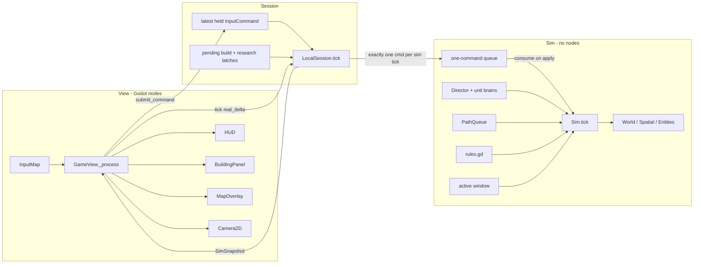
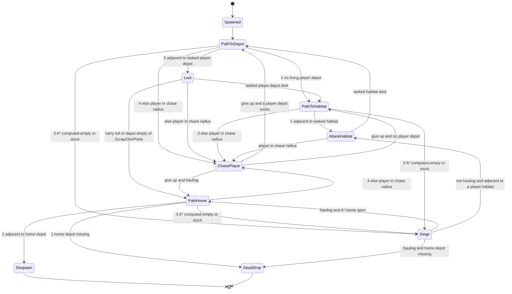
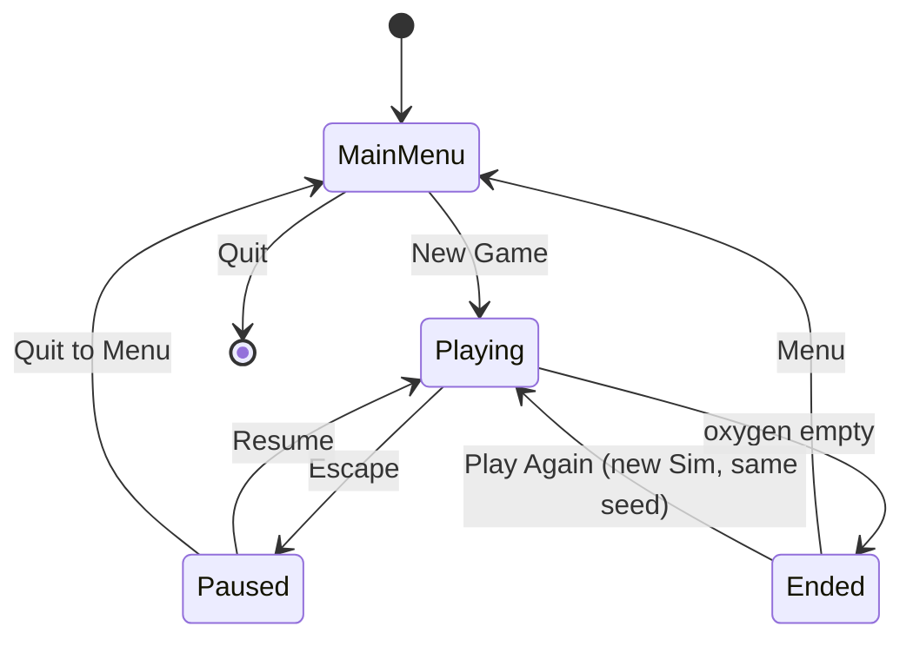

# Requirements (v0.2)

17 August 2026

This document is the exact requirements for the game. If a behavior is not specified here, it must not be implemented. New requirements must be added to this document before they are coded. It is present-tense law, not a historical pitch.

Internal application id is `colony`. Window title is `Colony`. Do not put a product name in UI strings, comments, or this document.

---

## Overview

This document is the exact requirements for the game as it must exist after the v0.2 playable layer: a single-player, real-time, top-down 2D **open-world** survival session on the Martian surface. The player is one colonist who explores a **256 × 256** tile map, places and restocks Habitats so personal oxygen does not hit zero, gathers five haulable resources, expands with defenses and mid-session buildings, researches a small bush of techs at a Lab they must physically attend, and fights **enemy camps scattered across the map** under a local density cap. Destroying a Habitat — theirs or the enemy’s — does not end the session. The only session lock is oxygen empty.

The closed loop is: **explore and discover terrain → gather haulable resources → spend them from pooled Depots (Scrap / Ore / Parts) and pooled Habitats (Ice) → keep at least one living Habitat stocked with Ice so its O2 bubble stays on → eat carry Food or take hunger HP pulses → raid nearby camps for stockpiles → place outpost Habitats / Depots / Radar so the walk home is not a suffocation.** The simulation is a fixed-tick authoritative state machine rendered by Godot 4. Single-player is sufficient; the session layer stays a command-in / snapshot-out seam so LAN co-op can be added later without rewriting rules.

There is **no win condition**. A sitting ends when personal oxygen hits 0, or when the player quits. Typical length is **15–40 minutes**; that is a sit-down, not a factory and not a defend-one-camp match.

---

## Background & Motivation

The current session already delivers the three pillars (build/maintain, defend against AI, steal from an enemy base) on native Windows and Linux, with an authoritative 20 Hz sim and a `Session` seam. It is still a **tower-defence camp**: one 64 × 64 map, one pre-placed player Habitat + Depot in the SW, one enemy camp in the NE, timed waves down an L-corridor, Habitat-HP and 30 s zero-ice as the match clocks, Depot as both warehouse and O2 station, hunger as a hard lose. Playable sessions expose the gaps this document closes:

- A 64 × 64 pad is an arena. There is nowhere to go except the opposite corner, and the L-corridor is the whole geography.
- Losing the Habitat, or idling a Depot at 0 ice for 30 s, or missing a Food meal, ends the sitting. That trains “defend this one pad” instead of “stay breathing while you move.”
- The Depot is a second set of lungs. Ice lives there, O2 refills there, and the player never has to place a Habitat.
- One NE camp plus a global wave clock is the only threat. Clearing it (or walling the corridor) solves the map.
- One-tile rocks are the only impassable feature. The map has no landmarks worth putting on a map view.

This layer converts that session into an open map with local camps, Habitat-tethered oxygen as the only lose, and the simulation tricks a 256 × 256 tick must actually use.

---

## Goals & Non-Goals

### Goals

- Launch a native window on Windows and Linux from a Godot 4 export; start from a main menu; play one map; the sitting ends only on oxygen-empty or quit.
- Express the three pillars on an open map:
  1. **Build and maintain** a colony the player can **extend**: Habitat and Depot are player-buildable (starter pair is pre-placed). Ice lives on Habitats and fuels the O2 bubble. Walls, turrets, workshop, farm, lab, medbay, gate, radar.
  2. **Defend** against one AI opponent that occupies **multiple camps** on the map. Local guards and raiders. The law is the density cap (`ENEMY_DENSITY_N` × `ENEMY_DENSITY_N` window, `ENEMY_DENSITY_CAP` living enemy units). Camps aggro locally; they do not all march across the world to one pad.
  3. **Raid out**: walk under an oxygen clock, steal from living enemy Depots (Scrap / Ore / Parts) and living enemy Habitats (Ice), smash buildings if you want. Smashing an enemy Habitat is loot and a quieter neighborhood, not a win.
- Five haulable resources (Scrap, Ice, Ore, Parts, Food). No sixth. Food is not a depot resource. Ice is not a depot resource.
- A small tech bush: three parallel techs plus one Parts-gated capstone. Research is player-present at a Lab.
- Icon HUD and icon build bar. Habitat HP and Depot HP are **not** on the HUD. Building health lives in a building inspect panel. Colony Ice on the HUD is the **sum of living player Habitat ice**.
- Map view on `M`: the whole 256 × 256, fogged until discovered, landmarks on discovered tiles, Radar blips for nearby enemies / enemy bases.
- Deterministic-enough sim rules that can be unit-tested through `./tools/test.sh`.
- Placeholder art at the same parseability bar (team stripe, silhouettes, colors), including cliff / crater / radar primitives.
- Architecture that does not block later LAN (input commands in, snapshots out).
- Concrete **structural** performance bindings so a mid-map load on 256 × 256 does not hitch: chunked spatial buckets, sleep outside an active window, PathQueue (extended, still 1 new A* per tick), expand-capped A*, chunked terrain cache (no full-world redraw). `TICK_BUDGET_MSEC` / `VIEW_BUDGET_MSEC` remain F3 guidance, not fail-the-CI law.

### Non-Goals

Do **not** implement any of the following. They are listed so later work has a parking lot, not so they can be inferred into the code.

- LAN multiplayer, Steamworks, lobbies, NAT traversal, dedicated servers.
- Save / load / autosave (a sitting is one process; oxygen-empty or quit ends it).
- More than one map, biome, or procedural-world campaign. One generated 256 × 256 is the map.
- Conveyor belts, inserters, pipes-as-logistics, auto-haulers, extractors that auto-pipe, or any network that moves items. Visit-gated state is allowed (Lab progress that **pauses** while the player is away). **Farm food stock is the one allowed passive output:** it grows while the player is elsewhere, up to a per-building cap. Harvest still requires the player to stand there and hold `E`. Workshop craft is not passive: it only advances while `E` is held with the full recipe, and walking away resets it. A production queue that runs after the player walks away is not allowed.
- Power grid, oxygen *pipes*, water pipes.
- A sixth haulable resource.
- A second turret type, demolish / reclaim / refund of placed buildings.
- Multiple player-controlled colonists, squads, or RTS box-select.
- Vehicles, weather-as-a-system, day/night.
- Combat fog of war on the camera view (the world around the camera is fully drawn). Discovery fog exists **only** on the `M` map overlay.
- A win condition, score, turn limit, or “survive N waves.”
- A 30 s zero-ice starve lose. Ice empty turns an O2 bubble off; it does not lock the sitting.
- Hunger as a session-lose. Hunger damages HP.
- Timed global waves from a single NE camp as the only threat.
- Narrative campaign, dialogue, cutscenes, lore codex.
- Ammo as an inventory item, weapon pickups, extra unit kinds.
- Enemy that expands, builds, gathers, or researches (enemy is camps + a local raid director).
- Settings beyond window close / pause quit (no key rebind UI, no graphics menu).
- Localization, achievements, analytics SDKs, crash reporters.
- Controller / gamepad bindings (keyboard + mouse only).
- Debug cheats (set ice to 0, spawn raiders, god mode, skip research, reveal map).

---

## Key Decisions

| Decision | Choice | Rationale |
| --- | --- | --- |
| Engine | **Godot 4.4+** (compatible with 4.4–4.5), **GDScript** | Already shipping. 2D-first, first-class Linux and Windows export, MIT license, ENet available when LAN is in scope. |
| Multiplayer | **Single-player only.** `Session` interface (`submit_command` / `tick` / `get_snapshot`). `LocalSession` is the current implementation. | LAN is a later feature. The seam already exists; do not add a second session subclass here. |
| Command/tick contract | **Latest-held command; one enqueue per sim tick; consume on apply.** Pause and a locked outcome drop gameplay. | Catch-up ticks, pause, and one-shot `build_kind` / `research_kind` are otherwise unimplementable. |
| Sim vs view | **Authoritative fixed-tick sim** (20 Hz) as plain GDScript objects. Godot nodes are a view. | Scene-tree-as-sim is hostile to tests and host-auth netcode. |
| Time / space | Real-time, `dt = 0.05s`. **256 × 256 tile occupancy**, free 2D pixel movement for units. World **8192 × 8192 px**. | 16× the old 64 × 64 arena. Crossing 8192 px at `PLAYER_SPEED` is **68.3 s > 60 s O2**, so outpost Habitats are required. 64 × 64 crosses in **17.1 s** (still an arena). 192 × 192 crosses in **51.2 s** (still one-charge); it *does* tile 8- and 32-tile grids (`192/8 = 24`, `192/32 = 6`) — rejected because of O2 geography, not divisors. 384 is more map than the sleep window can hide. 256 also tiles 8-tile spatial chunks (32 × 32 = 1024 buckets), 32-tile terrain chunks (8 × 8 = 64 caches), and **aligned** 32-tile density cells (8 × 8 = 64). |
| Large-map sim | **Spatial buckets** (`SPATIAL_CHUNK_TILES = 8`). **Sleep** units / turrets / projectiles outside `ACTIVE_WINDOW_TILES` (48 Chebyshev) of the **player or any living player Habitat origin**. **`CAMP_AGGRO_TILES = 48`** (same number). **PathQueue** still 1 new A* per tick; `PATH_MAX_EXPAND = 8192`; cap hit returns a **partial** path, not empty. **Chunked terrain cache** ships in the same cut as 256 × 256; camera draws visible chunks only. Occupancy is a flat `PackedInt32Array` for O(1) tile lookup. | A 65 536-tile full scan + full-map A* + one 8192² blit is the hitch. Unifying sleep and aggro at 48 means a legal near-camp raid is awake. Sleeping around Habitats means an outpost you are not standing on still wakes its neighborhood. Partial path avoids false SIEGE on a long hallway. F3 4 / 8 ms stay guidance. |
| Resources | **Exactly five haulable: Scrap, Ice, Ore, Parts, Food.** Five-integer `Inventory` with per-kind caps. No weight. Personal **oxygen is not a haulable**. **Food is not a depot resource.** **Ice is not a depot resource** — Ice lives on Habitats. | Scrap is cheap construction. Ice is the O2-station fuel. Ore is scarcer mid-tier. Parts are crafted-only premium. Food is personal rations grown at a Farm. |
| Buildings | Starter Habitat + Depot **pre-placed** and **rebuildable**. Player also builds **Wall, Turret, Workshop, Farm, Lab, Medbay, Gate, Radar**. Multiple Habitats and Depots are allowed. | Pre-place keeps the first minutes playable (lungs + warehouse + start stocks). Rebuildable so a smashed pad is not a sitting-end. Radar is the map-intel building. |
| Payment | Player **Depots are a shared pool** for Scrap / Ore / Parts. Player **Habitats are a shared pool** for Ice. Deduct in ascending `entity_id` (Ice pay can extinguish the lowest-id bubble). Habitat **pool** place cost is 20 Scrap. When **no** living player Depot exists, Depot place may charge **`LAST_PAD_DEPOT_SCRAP` (10)** from carry (`PLAYER_CARRY_SCRAP`). When **no** living player Habitat exists, Habitat place may charge **`LAST_PAD_HABITAT_SCRAP` (10)** from carry, and that Habitat starts with `LAST_HABITAT_ICE` (1). Last Depot death with 0 Scrap spills `LAST_DEPOT_SCRAP` (10). All three last-pad numbers fit one pack. | Owner rule: pay from any placed Depots; Ice from Habitats. Carry is not a general build currency — only the last-pad recovery exceptions. Do not raise `PLAYER_CARRY_SCRAP` to make wipe recovery work. |
| Tech tree | **Small bush:** Hydroponics, Metallurgy, Field Medicine in parallel; **Ballistics** behind Metallurgy (costs Parts). Lab and Workshop start-unlocked; Farm / Gate / Medbay / Radar gated. Habitat and Depot start-unlocked. | Research can begin without a prior tech. Early nearby raid still works with start scrap (Wall + Turret). Radar costs Parts so it sits on the ore path. |
| Oxygen | **60 s** full charge. Instant refill to max only while adjacent to a living **player Habitat with `ice >= 1`**. Depot does **not** refill. Habitat with `ice == 0` is not an O2 station. The first tick a living player’s `o2 == 0` is **`PLAYER_LOSE` / `SUFFOCATION`**. No O2 HP pulse. | Oxygen is the only sitting lock. Depot-as-lungs recreated the camp tether. Ice-empty turns the bubble off; it does not kill. 60 s is the walk budget; a second Habitat is how you go farther. |
| Hunger | Player auto-eats **1 Food from carry** every `FOOD_EAT_PERIOD` (15 s). Missing that meal sets `sim.hunger_starving` (not a lose). Pulse **`PLAYER_HUNGER_HP_PER_PULSE` (1) HP every `PLAYER_HUNGER_PULSE_TICKS` (5)** only while `hunger_starving`. Clear the latch on any carry Food and on respawn (`food_debt_timer = 0`) — that is a full 15 s grace after respawn before the next meal can re-set the latch. Ice empty does not start a starve lose. | Oxygen is the only lose. A latch, not a raw `food == 0` pulse, is the only way the 15 s grace and the tick step agree. |
| Combat death | Combat or hunger death **always respawns** (`PLAYER_RESPAWN` 5 s) at the starter spawn / nearest Habitat, with **`o2 = PLAYER_O2_MAX`** and empty carry, **even if every Habitat is gone**. Suffocation does **not** respawn. Same-tick `hp` driven to 0 **and** `o2 == 0` is **SUFFOCATION** (step 10 still sees `alive`; deaths have not run). | Oxygen is the only sitting lock. Dying on purpose (walk into rifles, wait out the hunger pulse) **is an O2 reset**; you pay the corpse pile. That is intended, not an exploit to close. Habitat smash is not a lose, so respawn cannot require a living Habitat. |
| Win/lose | **No win.** `evaluate_outcome` writes `(PLAYER_LOSE, SUFFOCATION)` when `sim.oxygen_failed`, else `(NONE, NONE)`. Habitat HP 0, Depot HP 0, ice 0, missed meal: none of these lock the sitting. | Open-world survival. Smash and steal change the map; they do not flip a match flag. |
| Workshop | Player-present, **one recipe**, consume **Scrap+Ore from player carry**, produce Parts into carry. No queue. Own-depot `E` dumps Scrap/Ore/Parts; `Shift+E` pulls back. Own-Habitat `E` dumps Ice; `Shift+E` pulls Ice. | A workbench, not a factory. Ice dump is a Habitat verb. |
| Interact resolve | **Nearest valid target by distance-to-AABB.** Equal distances use the priority list (depot, **habitat**, loot, deposit, workshop, lab, farm). | Habitat is the Ice counter. Depot-first still wins a strict closer depot. |
| Medbay | **2 HP/s** while adjacent. Costs scrap + ice (ice from the Habitat pool). | Parallel to the ore path. Better than dying when you are carrying Ore/Parts/Ice. |
| Gate | Solid to raiders/guards and to **all** projectiles (like a Wall). **Not** solid to the player. Costs scrap + Parts. | Player-only door in a wall line. First-integrate ignore of a friendly Gate the shooter’s circle overlaps. |
| Radar | **2 × 2**, 50 HP, 10 Scrap + 4 Parts, Metallurgy, smash-set member. While living, the `M` map shows enemy units and enemy Habitat / Depot / **Turret** within `RADAR_RANGE_TILES` (48 Chebyshev) of its footprint. | Map view without Radar is terrain + your own pads. Radar is the intel sink on the Parts path. Turrets plot so a red 2×2 Habitat is not sitting next to a 1×1 hole. |
| Combat | Player projectile rifle (no ammo). Turrets auto-fire at units. **Raiders and guards use the player rifle’s speed × life as range (320 px)** and a much lower DPS. Melee is a fallback only inside `RAIDER_MELEE_RANGE`. | Same range so they shoot as soon as a target is in range. Different DPS so a local pack cannot snipe a Habitat from 320 px in a few seconds. |
| Ranged AI | Shooting is **orthogonal** to the state machine. Target priority: living player in range, else the tasked / siege building, else nearest player building. `CHASE_RADIUS` stays **96 px**. `SIEGE` still never chases. | Raising chase to 320 px would make every pack abandon loot to hunt the player across the map. |
| Ravage model | Open road: loot-and-return **to the raider’s home depot**. Enter `SIEGE` when A* to the objective is **computed-empty** or stuck `RAIDER_STUCK_TIME`. Non-hauling `SIEGE` commits: blockers → nearest player Depot → nearest player Habitat. **Hauling smash = nearest solid player building that is not Depot/Habitat** (includes Radar). Chase does not preempt `SIEGE`. | Multiple pads: smash the nearest, not “the” pad. A Workshop or Radar on the road must be smashable while hauling. Every PR that adds a solid updates this smash set. |
| Enemy placement | **`ENEMY_CAMP_COUNT` (8)** camps of Habitat + Depot + Turret + Guard, scattered. **`ENEMY_DENSITY_N = 32`**, **`ENEMY_DENSITY_CAP = 6`** living enemy units in the **aligned** 32 × 32 cell that contains the spawn tile (origins at `(0,0)`, `(32,0)`, … — 8 × 8 = 64 cells). Local dispatch only if the player **or** a living player Habitat is within `CAMP_AGGRO_TILES` (48). Near camp Chebyshev from spawn is in `[PLAYER_SAFE_RADIUS, CAMP_AGGRO_TILES]` (40–48). No global NE-wave clock. | Density is the law and matches `SpatialIndex` chunk counts (**16** 8-tile chunks per 32 × 32 cell). Aligning sleep and aggro at 48 keeps the starter raid awake. Local aggro stops eight camps from recreating a single siege. |
| Terrain | `EMPTY`, `ROCK` (1-tile), **`CLIFF`**, **`CRATER`**. Cliff and crater are stamped multi-tile features; they block movement, pathing, and projectiles like rock; they are distinct kinds for art and the map view. | One-tile rocks are clutter. Cliffs and craters are landmarks and pathing walls. |
| Map view | **`M`** toggles a full-map overlay (not a second sim, not combat fog). A tile is **discovered** when the living player’s tile is within `MAP_DISCOVER_RADIUS` (16) Chebyshev; persisted for the session on `World.discovered`. Undiscovered tiles are blank. Discovered tiles show terrain + cliffs/craters. Player Habitat / Depot / Radar always plot. Enemy units and enemy bases plot only via Radar. | Open-world needs a map. Discovery is cheap sim state. Camera view stays unfogged. |
| UI | HUD resource **icons + counts** for carry (five kinds) and player depot pool (**three** kinds: Scrap, Ore, Parts — no Ice, no Food) plus **colony Ice** (Habitat pool). Build bar is **building sprites**. **No Habitat/Depot HP on the HUD.** Inspect (`F`, or RMB on a player building when not in build mode) opens a building panel that owns HP. Personal O2 is on the HUD. Low carry Food uses the low-ice color. No 30 s ice countdown. | Names are not the primary label. Ice moved off the Depot row. |
| Performance | Binding: heap A*, **1 new A\* per tick**, spawn stagger, pending ≠ empty, expand cap + partial path, spatial buckets, sleep outside the active window, chunked terrain cache, dirty `queue_redraw`. `4 ms` / `8 ms` are F3 **guidance** on the project Linux box (software GL, 1280×720, `gl_compatibility`), not failing test law. | The 256 × 256 hitch is full-map A*, full-map entity scans, and full-map terrain redraw. Tests bind the tricks, not wall-clock ms. |
| Art | 32×32 pixel-art PNGs for `EMPTY` ground, `ROCK`, `CLIFF`, `CRATER`. Everything else: colored primitives + 1 px outlines, or matching placeholder PNGs under `assets/sprites/placeholder/`, team stripe on buildings, damage flash on hit. | Same parseability bar. New icons/buildings/features must meet it. |
| Renderer | **`gl_compatibility`** | Broader Linux Mesa + older Windows GPU coverage. |
| Persistence | **None** | Not required for a 15–40 minute loop. |
| Automation | **Forbidden** except Farm stock growth (passive, capped). No belts, inserters, pipes-as-logistics, auto-haulers, extractors that pipe, or queues that run while the player is elsewhere. Harvest still requires `E`. | This is a survival game, not a factory. Player-as-logistics is the loop. |

---

## Proposed Design

### Engine and repository layout

The Godot project root **is** the repository root. Application name in `project.godot` is `colony` (internal id, not a product title). Window title is `Colony`.

```
.
  CLAUDE.md
  design.md
  project.godot
  export_presets.cfg
  icon.svg
  .godot/
    global_script_class_cache.cfg  # tracked named-class registry
  src/
    autoload/
      app.gd                 # scene router: menu <-> game
    core/
      constants.gd           # all numeric rules (class_name Constants)
      types.gd               # enums: Faction, BuildingKind, ResourceKind, TechKind, ...
    sim/
      sim.gd                 # Sim: owns world, ticks, applies commands
      world.gd               # tile grid + occupancy + faction-aware walk queries
      spatial.gd             # 8×8 tile buckets for units / projectiles / deposits / loot
      mapgen.gd              # seeded map
      entity.gd              # base: id, pos, radius, hp, faction
      unit.gd                # player, raider, guard
      building.gd
      projectile.gd
      deposit.gd
      loot.gd
      inventory.gd           # five-resource bag with per-kind capacity
      pathfind.gd            # A* on walkable tiles (binary-heap open set, expand cap)
      path_queue.gd          # at most one new A* per sim tick
      combat.gd              # damage, death, friendly-fire, projectile spatial query
      research.gd            # tech defs, costs, prereqs, unlocks
      ai_director.gd         # per-camp local dispatch + density
      ai_raider.gd           # raider state machine + fire intent
      ai_guard.gd            # guard state machine + fire intent
      commands.gd            # InputCommand
      snapshot.gd            # immutable-enough view DTO
      rules.gd               # costs, unlocks, win/lose, ice drain, pools, validity
    session/
      session.gd             # abstract Session
      local_session.gd       # current implementation
    view/
      game_view.gd           # binds LocalSession to the scene
      world_view.gd          # chunked terrain cache + deposit overlay
      unit_view.gd
      building_view.gd
      projectile_view.gd
      loot_view.gd
      camera_ctrl.gd
      build_ghost.gd
      gather_bar.gd
    ui/
      main_menu.gd
      hud.gd
      build_bar.gd
      building_panel.gd      # inspect panel (HP + kind state)
      map_overlay.gd         # M key full-map view
      pause_menu.gd
      end_screen.gd
      debug_overlay.gd
  scenes/
    boot.tscn                # main scene, loads App
    main_menu.tscn
    game.tscn
    ui/hud.tscn
    ui/pause_menu.tscn
    ui/end_screen.tscn
  assets/
    sprites/placeholder/     # 32×32 PNG primitives (units, buildings, resources)
    sprites/tiles/           # 32×32 terrain: ground.png, rock.png, cliff.png, crater.png
    audio/sfx/               # optional short WAV/OGG; silence is allowed
    theme/default.tres
  tests/
    run.gd                   # test runner, exit 0/1; only via tools/test.sh
    test_inventory.gd
    test_rules.gd
    test_mapgen.gd
    test_combat.gd
    test_ai_raid.gd
    test_ai_raider.gd
    test_ai_ranged.gd
    test_pathfind.gd
    test_research.gd
    test_oxygen.gd
    test_food.gd
    test_hud.gd
    test_workshop.gd
    test_medbay.gd
    test_perf.gd
    test_snapshot.gd
    test_debug_overlay.gd
    test_world_view.gd
    test_gather_bar.gd
    test_building_panel.gd
    test_spatial.gd
    test_density.gd
    test_terrain_features.gd
    test_map_overlay.gd
    test_radar.gd
  tools/
    export.sh                # wraps Godot headless export for both OS targets
    test.sh                  # official test entry: private Xvfb + run.gd
```

`res://` mirrors this tree (`res://src/...`, `res://scenes/...`).

The rest of `.godot/` is editor output and is not tracked. `global_script_class_cache.cfg` is tracked: Godot registers `class_name` scripts from that file before autoloads parse. A source checkout must include it so `App` and other scripts can resolve named types (`Session`, `LocalSession`, `Constants`, …) without a prior editor import. Adding, renaming, moving, or removing a `class_name` script must update this file (the editor rewrites it on import; commit the result). Terrain textures still load from PNG when the import cache is missing.

Autoloads (only these):

| Autoload name | Script | Role |
| --- | --- | --- |
| `App` | `res://src/autoload/app.gd` | Change scene, hold `current_session` for the active run |

Do not put sim state in autoloads.

### Runtime architecture



**Rule:** nodes never mutate sim fields. They emit `InputCommand` values. The view rebuilds or patches sprites from the snapshot each rendered frame.

**Sole driver:** `GameView._process(delta)` is the only caller of `Session.submit_command` and `Session.tick(real_delta)`. Tests call `Sim` methods directly and do not go through `GameView`.

### Tick and update model

| Parameter | Value |
| --- | --- |
| `Constants.SIM_HZ` | `20` |
| `Constants.SIM_DT` | `0.05` seconds |
| Max catch-up ticks per rendered frame | `4` |
| Pause | `LocalSession.paused == true` skips accumulation, enqueue, and `Sim.tick` |
| End state | Once `outcome != NONE`, `LocalSession.tick` returns immediately; `Sim` is frozen; view shows the end screen |

#### Command / tick / pause contract (binding)

This contract is required. Implement it as a short comment on `LocalSession.tick` plus the code below. Do not invent a second queueing model later for LAN.

1. **`submit_command(cmd)` stores held state. It does not enqueue and it does not stamp `cmd.tick`.**
   - Overwrite `latest.move`, `latest.aim`, `latest.fire`, `latest.interact`, `latest.withdraw`.
   - If `cmd.build_kind >= 0`, latch `pending_build_kind` / `pending_build_tile`. A later `submit_command` with `build_kind < 0` must **not** clear the latch (otherwise a click on a frame that does not produce a sim tick is lost).
   - If `cmd.research_kind >= 0`, latch `pending_research_kind`. A later `submit_command` with `research_kind < 0` must **not** clear that latch.
2. **`LocalSession.tick(real_delta)` is the only code that enqueues.**
   - If `paused` or `sim.outcome != NONE`: return immediately. Do **not** add `real_delta` to the accumulator (unpausing must not catch up pause time).
   - Otherwise `acc += real_delta`. While `acc >= SIM_DT` and catch-up count `< MAX_CATCHUP_TICKS`:
     - `acc -= SIM_DT`.
     - Clone `latest` into a command. Set `cmd.tick = sim.tick_index + 1`. Set `cmd.build_kind` / `cmd.build_tile` from the build latch, then clear the build latch (`pending_build_kind = -1`). Set `cmd.research_kind` from the research latch, then clear the research latch (`pending_research_kind = -1`).
     - `sim.enqueue(cmd)` — exactly one command per sim tick.
     - `sim.tick()` — `Sim` applies that command and **consumes** it (the queue is empty after the apply step below).
   - Leftover `acc` is kept (capped implicitly by the catch-up limit; leftover above `MAX_CATCHUP_TICKS * SIM_DT` is discarded so a hitch cannot spiral).
3. **`build_kind` and `research_kind` are one-shot.** The view sets each only on the click / key frame. The session latch holds it until the next sim tick consumes it, even if that tick is on a later render frame.
4. **`fire`, `interact`, and `withdraw` are held state**, not edges. `Sim` rate-limits fire with `weapon_cooldown` and rate-limits transfers / craft / research with channel progress. `withdraw` is meaningful only with `interact` on the **own** depot or the **own** habitat.
5. **While the player unit is dead, or `outcome != NONE`, `Sim` ignores `fire`, `interact`, `withdraw`, `build_kind`, `research_kind`, `move`, and `aim`.** The command is still consumed so the “one per tick” rule holds. Aim on the unit is left unchanged.
6. **`set_paused(true)`** exists on `LocalSession`. The pause menu is wired: Escape toggles it; Resume unpauses; Quit to Menu returns to the main menu. It only flips the flag that step 2 checks. The `M` map overlay does **not** pause.

A future `LanHostSession` must preserve “one command per player per sim tick, consume on apply.” It may receive commands from the network instead of `GameView`, but it must not replay a backlog of pause-time or catch-up-uncloned commands.

#### Active window and sleep (binding)

Let `player_tile = world.world_to_tile(player.pos)` (if the player unit exists; if dead, use the corpse pos — camera stays on the corpse, so the window stays with it).

A world tile `t` is **active** iff Chebyshev(`t`, `player_tile`) `<= ACTIVE_WINDOW_TILES` (48) **or** Chebyshev(`t`, any living player Habitat `origin_tile`) `<= ACTIVE_WINDOW_TILES`. `CAMP_AGGRO_TILES` is the **same number** (48). Inclusive on the boundary.

- **Always tick** (cheap, not windowed): life-support ice drain (player Habitats always; enemy Habitats only after that camp has been aggro’d at least once — see Life support), Farm growth, hunger meal clock, oxygen drain/refill, Medbay heal, discovery stamp, director dispatch **decisions**, `PathQueue.service` (but see below), command apply, outcome eval, cooldown decrement on **active** entities only.
- **Asleep** (skip brains, movement, fire, melee, stuck detector): every living Raider, Guard, and Turret whose origin/pos tile is not active. Asleep units do **not** `PathQueue.request`. Their `ai_state`, carry, and HP are unchanged. They **do** count toward density.
- **Projectiles** whose tile is not active are **removed** with no hit (they expire). Do not integrate them.
- **Wake:** the first tick a unit’s tile is active, it thinks normally (may request a path). No catch-up of skipped movement.
- **Director spawn:** a camp may dispatch only if it is aggro’d **and** at least one candidate spawn tile is active. Combined with `CAMP_AGGRO_TILES = ACTIVE_WINDOW_TILES` and Habitat-relative sleep, a legal near-camp raid (Chebyshev 40–48 of spawn) is awake on tick 1 of the dispatch. An outpost Habitat within 48 of a camp keeps that camp’s units active even if the player then walks 80 tiles away.
- Far camps therefore sit still until the player or a living player Habitat is within 48 tiles. They do not spawn new raiders until then.

`Sim` records `active_unit_count` and `sleeping_unit_count` for F3.

#### `Sim.tick()` order

Must be this order; tests rely on it. If `outcome != NONE` at entry, return immediately (no `tick_index` increment).

1. `tick_index += 1`. Set `sim.time = tick_index * SIM_DT`.
2. **Decrement cooldowns** by `SIM_DT`, floored at 0, for entities that are **active** (or always for the dead player’s `respawn_timer` and `Director.banner_timer`):
   - every **active** unit: `weapon_cooldown`, `path_recalc_in`
   - every dead player unit: `respawn_timer`
   - every **active** building: `fire_cooldown`
   - every projectile (active ones only; inactive are removed in step 12)
   - `Director.banner_timer`
   - Do **not** decrement here: `interact_progress`, `chase_timer`, `stuck_timer`, `ai_state_time`, habitat `ice_debt_timer`, `research_progress`, farm `food_grow_timer`, player `o2`, player `food_debt_timer` (those have their own steps).
3. **Colony systems (life support + farm growth + hunger):**
   - Once per tick, `Rules.tick_life_support(sim)` drains Ice from **every living Habitat** (see Life support). This is the only life-support step. There is no depot ice pull and no `zero_ice_timer`.
   - For each living Farm (all of them, not windowed): `food_grow_timer += SIM_DT`; when `food_grow_timer >= FARM_GROW_PERIOD`, subtract one period and, if `food_stock < FARM_FOOD_CAP`, add 1 Food to that farm’s stock.
   - **Hunger** (living player only): if `inventory.food >= 1`, set `sim.hunger_starving = false` (**every** living tick, not only on a meal). Then `food_debt_timer += SIM_DT`; when `food_debt_timer >= FOOD_EAT_PERIOD`, subtract one period. If `inventory.food >= 1`, `remove(FOOD, 1)`. Else set `sim.hunger_starving = true` (do **not** set a lose flag). Then, if the player is alive and `sim.hunger_starving` and `tick_index % PLAYER_HUNGER_PULSE_TICKS == 0`: `Combat.apply_damage(player, PLAYER_HUNGER_HP_PER_PULSE)`. That is 1 HP every 5 ticks (4 HP/s) **only while the latch is set**. `Combat.apply_damage` decrements HP only; `alive` flips in step 15. Do not run hunger while the player is dead. `hunger_starving` is a field on `Sim`, default `false` at `setup` and cleared on respawn. Harvest / loot (step 14) must also set `hunger_starving = false` the same tick they add Food to carry, so a pickup mid-tick does not wait for the next step-3.
4. **Apply and consume** all queued `InputCommand`s (exactly one from `LocalSession`). Ignore gameplay fields if the player is dead or `outcome != NONE`. A `build_kind >= 0` is attempted once this tick via `rules.try_place`. A `research_kind >= 0` is applied via `Research.select` (see Tech tree).
5. **AI director** (maybe dispatch raiders from each **aggro’d** camp, subject to density; maybe start `banner_timer`). New raiders get staggered `path_recalc_in` (see Large-map performance).
6. **AI brains** write desired velocity / interact / melee-target / **fire-target** intents on **active** enemy units (including siege retarget). Asleep units are skipped. Brains **request** paths from `PathQueue`; they do not call `Pathfind.find_path*` directly except through the queue. SIEGE is entered only on a **computed-empty** path or stuck, never on a pending request, never on an expand-cap **partial** path.
7. **Service `PathQueue`:** compute **at most `MAX_PATHS_PER_TICK` (1)** new A* this tick. Remaining requests stay pending. Do not service a request whose unit is now asleep (leave it pending).
8. **Ranged fire** (active buildings / units only):
   - **Turrets:** for each living **active** Turret, acquire the nearest living opposing **unit** in that turret’s range (`TURRET_RANGE`, or `TURRET_RANGE_UPGRADED` for **player** turrets if Ballistics is complete). If a target exists, set `building.aim` toward it. If also `fire_cooldown <= 0`, spawn a projectile (faction = turret faction, damage `TURRET_DAMAGE`, speed `TURRET_PROJ_SPEED`, life `TURRET_PROJ_LIFE`) at turret center + `aim * MUZZLE_OFFSET` and set `fire_cooldown = TURRET_COOLDOWN`. If no target, leave `aim` unchanged (default `(1, 0)` at spawn).
   - **Enemy unit rifles:** for each living **active** Raider and Guard with `fire_target_id` pointing at a still-valid opposing unit or player building, if that target is **not** inside `RAIDER_MELEE_RANGE` and **is** inside `ENEMY_RIFLE_RANGE` and `weapon_cooldown <= 0`: set `unit.aim` toward the target, spawn a projectile (faction `ENEMY`, damage `RAIDER_PROJ_DAMAGE`, speed `PLAYER_PROJ_SPEED`, life `PLAYER_PROJ_LIFE`) at `unit.pos + aim * MUZZLE_OFFSET`, set `weapon_cooldown = RAIDER_FIRE_COOLDOWN` (guards use `GUARD_FIRE_COOLDOWN`). Range metric is the same as target acquisition: **units use center-to-center**; **buildings use point-to-AABB** (the melee helper). Enemy projectiles are ordinary `Projectile`s and use the existing friendly-fire-off hit rules.
9. **Integrate unit movement** with collision sliding (`World.blocks_movement` — Gates are not solid to the player) for **active** living units. Then update each moving **active** AI unit’s stuck detector (see **Enemy range and AI**). After a unit changes tile, `Spatial.move_unit` updates its chunk.
10. **Personal oxygen** (player unit only, and only while `alive`):
    - If adjacent (`point_aabb_distance <= INTERACT_BUILDING_RANGE`) to a living **player Habitat** whose `inventory.ice >= 1`: set `o2 = PLAYER_O2_MAX`. A Depot does **not** refill O2. A Habitat with `ice == 0` does **not** refill O2. A Farm does **not** refill O2.
    - Else: `o2 = max(0, o2 - SIM_DT)`.
    - If `o2 == 0`: set `sim.oxygen_failed = true`. Do **not** apply HP. Evaluate in step 17 writes the lose.
11. **Medbay heal:** if the player is `alive`, `hp > 0`, adjacent to any living **player** Medbay, and `hp < hp_max`, increment a `medbay_heal_acc` on `Sim` by `SIM_DT`. Whenever `medbay_heal_acc >= MEDBAY_HEAL_PERIOD`, subtract one period and `hp += 1` (clamp to `hp_max`). If the player is not adjacent to a living Medbay, is dead, or `hp <= 0` this tick, set `medbay_heal_acc = 0` and do **not** heal. A lethal hunger pulse in step 3 is not undone here; deaths run in step 15. Multiple Medbays do **not** stack.
12. **Integrate projectiles** that are still active and resolve hits (see Combat rules). Remove projectiles with `life <= 0`. Remove projectiles whose tile is not active (no hit).
13. **Resolve melee** for **active** units whose `weapon_cooldown <= 0` and whose AI intent has a valid target **inside `RAIDER_MELEE_RANGE`**. Melee is the close-range fallback; a unit that melee’d this tick already has `weapon_cooldown > 0` and cannot also have fired in step 8.
14. **Resolve interact channels** (gather, loot, deposit, steal, workshop craft, farm harvest, lab research, **habitat ice transfer**) via the single interact resolver. Movement already applied this tick: if this tick’s command had `move.length() > 0`, channels are reset and do not progress (see Player interaction rules). Research progress **pauses** (is not reset) when the player is not channeling the Lab; workshop craft **resets** if the player walks away or cannot pay.
15. **Process deaths**, loot drops, and player respawn (if `respawn_timer` hit 0). Respawn sets `o2 = PLAYER_O2_MAX`, `food_debt_timer = 0`, `sim.hunger_starving = false`, and empty carry. The next meal is a full `FOOD_EAT_PERIOD` later, so the latch cannot re-set for 15 s — enough to pick up a food-bearing corpse pile. Suffocation is not this path.
16. **Stamp discovery** if the living (or corpse) player tile changed: every tile within `MAP_DISCOVER_RADIUS` Chebyshev of `player_tile` is set to 1 in `world.discovered`. Increment `world.discovered_generation` if any bit flipped.
17. **Evaluate outcome** (`rules.evaluate_outcome`). On a non-`NONE` result, write `sim.outcome` and `sim.outcome_reason` and lock them. Further `Sim.tick` calls no-op.

There is no starve-clock step. The director uses per-camp `next_raid_at` compared to `sim.time`. Habitat ice timers live entirely in step 3.

`Sim` records `last_tick_usec` (microseconds spent in this `tick()` body, including path service) for the debug overlay. Do not `print` it.

### World space

| Parameter | Value |
| --- | --- |
| Map size | **256 × 256 tiles** |
| Tile size | **32 × 32 pixels** |
| World size | **8192 × 8192 pixels** |
| Origin | Tile `(0,0)` at world `(0,0)`, +X right, +Y down (Godot 2D) |
| Tile index | `index = y * MAP_W + x` = `y * 256 + x` |

**Why 256.** 64 × 64 is an arena: 2048 / 120 = **17.1 s** to cross, and the playable content is two camps ~50 tiles apart. 256 × 256 is 16× the area and 8192 / 120 = **68.3 s** to cross — longer than `PLAYER_O2_MAX`, so a second Habitat is the only legal way to operate far from home. 192 × 192 tiles 8- and 32-tile grids (`192/8 = 24`, `192/32 = 6`) but crosses in 51.2 s, still one O2 charge. 256 is the smallest power of two whose **cross time exceeds 60 s** and that tiles `SPATIAL_CHUNK_TILES` (8), `TERRAIN_CHUNK_TILES` (32), and aligned `ENEMY_DENSITY_N` (32) with no remainder. Occupancy is 65 536 × 4 B ≈ 256 KB; discovered is 64 KB; tiles are 64 KB. That is cheap. 384 × 384 would be 2.25× the A* / sleep perimeter with no new systems.

Tile terrain kinds (`types.gd` / `enum TileTerrain`): `EMPTY`, `ROCK`, `CLIFF`, `CRATER`.

Occupancy is a second layer: a tile may also hold a building (footprint covers 1 or 4 tiles), a deposit, or loot. Rocks, **cliffs, craters**, and buildings are **solid to pathfinding and projectiles**. Deposits and loot are **not solid**. **Gates are solid to pathfinding, projectiles, raiders, and guards, and are not solid to the player.**

`World.is_solid_terrain(terrain)` is true for `ROCK`, `CLIFF`, and `CRATER`.

A tile is **walkable** (`World.is_walkable`) iff terrain is `EMPTY` and no building occupies it (Gates occupy, so they are not walkable). A* and raider/guard steering use `is_walkable`.

`World.blocks_movement(x, y, unit)` is the collision predicate for **unit sliding**:
- Out of bounds → blocked.
- Terrain is solid (`ROCK` / `CLIFF` / `CRATER`) → blocked.
- Occupying building is `null` → not blocked.
- Occupying building `kind == GATE` and `unit.kind == PLAYER` → **not** blocked.
- Any other occupying building → blocked.

**Guaranteed connectivity:** mapgen **always** carves 3-wide Manhattan corridors along a spanning tree from the player spawn tile to every enemy depot origin (skipping tiles that fall on building footprints). After generation, flood-fill walkable tiles from the player spawn tile as a **validation assert** only: every enemy depot’s adjacent walkable tiles must be reachable. Flood-fill must not carve. If the assert fails, that is a generator bug. Tests check the assert on `DEFAULT_SEED` and on seeds `2`, `3`, `4`, `5`.

### Spatial index

`src/sim/spatial.gd`, `class_name SpatialIndex`.

| Parameter | Value |
| --- | --- |
| `SPATIAL_CHUNK_TILES` | `8` |
| Chunk grid | `32 × 32` chunks (256 / 8) |
| Chunk index | `cy * 32 + cx` |

Buckets: units, projectiles, deposits, loot. Occupancy stays a flat `PackedInt32Array` of length `MAP_W * MAP_H` for O(1) `building_at`.

```gdscript
class_name SpatialIndex
func chunk_of_tile(tile: Vector2i) -> Vector2i
func chunk_of_pos(pos: Vector2) -> Vector2i
func insert_unit(unit: Unit) -> void
func remove_unit(unit: Unit) -> void
func move_unit(unit: Unit, old_tile: Vector2i, new_tile: Vector2i) -> void
func units_in_chunk(c: Vector2i) -> Array
func units_near_tile(tile: Vector2i, chebyshev: int) -> Array
func enemy_units_in_aabb(rect: Rect2i) -> int
```

`World.spatial` is rebuilt at the end of `Mapgen.generate` and kept current on spawn / despawn / tile change. Combat projectile queries, density counts, nearest-building scans for AI fire, and the sleep predicate **must** use buckets (or the occupancy array for buildings). Scanning `world.units` / `world.projectiles` in full for those queries is forbidden once the index exists.

`test_spatial.gd` inserts three units in different chunks, moves one across a chunk boundary, and asserts membership. A density helper on a 32 × 32 window returns the enemy count in that window only.

### Map generation (deterministic)

`mapgen.generate(seed: int) -> World`

Use `RandomNumberGenerator` with `seed` set to the session seed. Default seed is `1` on “New Game” (no seed UI; the constant is `Constants.DEFAULT_SEED = 1`).

`World.camps` is an `Array` of `Camp` records (plain RefCounted or Dictionary) written by mapgen and read by the director:

```
Camp
  reserved: Rect2i
  habitat_tile: Vector2i
  depot_tile: Vector2i
  turret_tile: Vector2i
  guard_tile: Vector2i
  habitat_id: int
  depot_id: int
  next_raid_at: float    # set to CAMP_RAID_FIRST at generate
  ever_aggro: bool       # false at generate; set true the first tick the camp is aggro'd
```

Interior offsets inside an enemy reserved rect whose origin is `(ox, oy)` (published constants; `test_mapgen.gd` binds them):

| Piece | Tile |
| --- | --- |
| Habitat | `(ox + CAMP_HABITAT_OX, oy + CAMP_HABITAT_OY)` = `(ox+2, oy+2)` |
| Depot | `(ox + CAMP_DEPOT_OX, oy + CAMP_DEPOT_OY)` = `(ox+6, oy+2)` |
| Turret | `(ox + CAMP_TURRET_OX, oy + CAMP_TURRET_OY)` = `(ox+2, oy+6)` |
| Guard | `(ox + CAMP_GUARD_OX, oy + CAMP_GUARD_OY)` = `(ox+6, oy+6)` |

Algorithm:

1. Allocate 256 × 256 tiles, all `EMPTY`. Allocate `discovered` (`PackedByteArray`, 65 536 zeros). Stamp discovery around `PLAYER_SPAWN_TILE` at radius `MAP_DISCOVER_RADIUS` so the starter pad is visible on `M` from tick 0.
2. **Choose reserved rects before any feature stamp.** `PLAYER_CAMP_RECT` is fixed. Then pick `ENEMY_CAMP_COUNT` (8) enemy reserved rects (`ENEMY_CAMP_RECT_SIZE` 14 × 14) with this order and these constraints:
   - Whole rect in bounds; no overlap with `PLAYER_CAMP_RECT` or another camp rect.
   - Chebyshev from `PLAYER_SPAWN_TILE` to the **depot tile** (`(ox+6, oy+2)`) `>= PLAYER_SAFE_RADIUS` (40).
   - Chebyshev between camp rect origins `>= ENEMY_CAMP_MIN_SEP` (28).
   - **First** successful pick must be a **near camp**: depot Chebyshev from `PLAYER_SPAWN_TILE` in `[PLAYER_SAFE_RADIUS, CAMP_AGGRO_TILES]` (40–48 inclusive). If `CAMP_PLACE_ATTEMPTS` (200) tries fail to land that near camp, treat as a generator bug (the 40–48 annulus around spawn is large; this is not a coin flip).
   - Remaining camps: `CAMP_PLACE_ATTEMPTS` (200) tries each. **Minimum required** is `MIN_ENEMY_CAMPS` (6), including the near camp. If the minimum fails, one retry after clearing random rocks **outside** all reserved rects; if still failing, generator bug.
   - Adding the Guard at `(ox+6, oy+6)` must not put the aligned density cell over `ENEMY_DENSITY_CAP` (a lone guard never should; if it would, reject that origin).
3. For each tile `(x,y)` not inside **any** reserved rect (`PLAYER_CAMP_RECT` or an enemy camp rect), set `ROCK` if `rng.randi_range(0, 99) < ROCK_PERCENT` (8).
4. **Stamp cliffs** (after reserved rects exist). Repeat `CLIFF_COUNT` (20) times: pick a start tile **not** in any reserved rect, a cardinal direction, a length in `[CLIFF_MIN_LEN, CLIFF_MAX_LEN]` (4–16), width 1. Set those in-bounds tiles to `CLIFF` only if they are not in a reserved rect. A cliff is a linear ridge, not a 1-tile rock.
5. **Stamp craters** (after reserved rects). Repeat `CRATER_COUNT` (14) times: pick a center **not** in any reserved rect, radius `r` in `[CRATER_MIN_R, CRATER_MAX_R]` (2–4). Set every tile whose Euclidean distance to the center is `<= r` to `CRATER`, skipping reserved rects. A crater is a solid disk.
6. Place the **player camp** in `PLAYER_CAMP_RECT` (`Rect2i(18, 210, 20, 20)`). Clear every tile in the rect to `EMPTY` first.
   - Habitat at `PLAYER_HABITAT_TILE` `(22, 216)` (2×2), faction `PLAYER`, HP full. Inventory `Inventory.new(0, HABITAT_CAP_ICE, 0, 0, 0)`. Add `START_PLAYER_ICE` (20) Ice. `ice_debt_timer = 0`.
   - Depot at `PLAYER_DEPOT_TILE` `(24, 216)` (2×2, immediately east of the Habitat), faction `PLAYER`, HP full. Inventory `Inventory.new(DEPOT_CAP_SCRAP, 0, DEPOT_CAP_ORE, DEPOT_CAP_PARTS, 0)` — Ice cap **0**, Food cap **0**. Add `START_PLAYER_SCRAP` (15) Scrap, `START_PLAYER_ORE` (0) Ore, `START_PLAYER_PARTS` (0) Parts. No Ice. No Food.
   - Player unit spawn world position: center of `PLAYER_SPAWN_TILE` `(23, 218)`. Habitat AABB is `(22, 216) × 2` tiles = `(704, 6912)–(768, 6976)`. Spawn center is `(23.5 * 32, 218.5 * 32) = (752, 6992)`. `point_aabb_distance` to the Habitat AABB is `6992 − 6976 = 16 px`, inside `INTERACT_BUILDING_RANGE` (24). The player starts in the O2 bubble. `o2 = PLAYER_O2_MAX`. Carry Food = `START_PLAYER_FOOD` (24). `food_debt_timer = 0`. `hunger_starving = false`.
7. For each enemy reserved rect, **clear every tile in the rect to `EMPTY`** (rocks, cliffs, and craters — all solids), then place using the interior offsets above:
   - Habitat (2×2) with `Inventory.new(0, HABITAT_CAP_ICE, 0, 0, 0)` and `START_ENEMY_ICE` (16) Ice.
   - Depot (2×2) with depot caps (no Ice, no Food) and `START_ENEMY_SCRAP` (12) Scrap, `START_ENEMY_ORE` (3) Ore, `START_ENEMY_PARTS` (0) Parts.
   - Turret at the turret tile; Guard at the guard tile (`home_pos` = tile center).
   - `next_raid_at = CAMP_RAID_FIRST`. `ever_aggro = false`.
8. **Always** carve 3-wide corridors (`CORRIDOR_WIDTH = 3`):
   - A **Manhattan corridor** from tile `A` to tile `B` is: walk **horizontal first** (change `x` until `B.x`, then change `y` until `B.y`), 4-connected. At each step paint the current tile and its two perpendicular neighbors (`CORRIDOR_WIDTH` 3). Skip tiles on a building footprint (do not `set_terrain` them). All other corridor tiles become `EMPTY` (overwrites rocks / cliffs / craters).
   - **Spanning tree:** start from `PLAYER_SPAWN_TILE`. The remaining nodes are every enemy **depot origin**. Repeatedly add the unused depot whose Chebyshev to any already-connected node is smallest; ties → smallest `(x, y)` of the unused depot (then smallest `(x, y)` of the connected endpoint). That is Prim, deterministic. Carve a Manhattan corridor along each tree edge.
9. Place deposits on walkable tiles that are not in `PLAYER_CAMP_RECT` or any enemy camp reserved rect, and at least `DEPOSIT_MIN_SEP` (4) tiles from any other deposit (Chebyshev). Place in this order: `SCRAP_DEPOSIT_COUNT` (48) Scrap (`SCRAP_DEPOSIT_AMOUNT` 8 each), `ICE_DEPOSIT_COUNT` (36) Ice (`ICE_DEPOSIT_AMOUNT` 6 each), `ORE_DEPOSIT_COUNT` (20) Ore (`ORE_DEPOSIT_AMOUNT` 5 each). If a placement attempt fails `DEPOSIT_PLACE_ATTEMPTS` (400) times, stop that resource early. **Minimum required** is `MIN_SCRAP_DEPOSITS` (32), `MIN_ICE_DEPOSITS` (24), `MIN_ORE_DEPOSITS` (14). If any minimum fails, clear random non-reserved rocks and retry the failed resource(s) once; if still failing, treat as a generator bug. There are **no** Parts deposits and **no** Food deposits.
10. Flood-fill validate connectivity (assert only): from `PLAYER_SPAWN_TILE`, every enemy depot has at least one reachable adjacent walkable tile.
11. Assign incrementing `entity_id` starting at `1`. Rebuild `World.spatial`.

This generator is the only map. No hand-authored map files. There is no single `ENEMY_CAMP_RECT` / `ENEMY_HABITAT_TILE` constant pair — those names are removed from `constants.gd`.

### Camera

View-only numbers (not in `constants.gd` unless an implementer prefers them there):

- `Camera2D` child of the view, not of the player node.
- Each render frame: `position = lerp(position, player_world_pos, 1.0 - exp(-8.0 * delta))`.
- Zoom: mouse wheel. `zoom` scalar in `[0.75, 2.0]`, step `0.1`, default `1.0`. (Godot zoom of `2.0` means 2× magnification.) The `M` map is how the player sees the whole world; do not widen zoom-out to fit 8192 px.
- Clamp the camera so the viewport does not show space outside `[0, 8192]` on either axis. If the viewport is larger than the world (high zoom-out + large window), center the world.
- No edge-pan, no free camera detach.

### Input scheme

Keyboard + mouse only. Bindings in `project.godot` Input Map (and ensured at runtime by `GameView._ensure_actions`):

| Action | Default | Effect |
| --- | --- | --- |
| `move_left` | A, Left | Move |
| `move_right` | D, Right | Move |
| `move_up` | W, Up | Move |
| `move_down` | S, Down | Move |
| `fire` | Mouse left (also used to confirm build) | Shoot if not in build mode and map overlay is closed |
| `interact` | E | Hold to gather / steal / deposit / pick up loot / craft / harvest / research / Habitat ice |
| `withdraw` | Left Shift, Right Shift (held with `E`) | Reverse own-depot (Scrap/Ore/Parts) or own-habitat (Ice) transfer. Ignored on enemy buildings. |
| `build_wall` | 1 | Enter build mode: Wall (start-unlocked) |
| `build_turret` | 2 | Enter build mode: Turret (start-unlocked) |
| `build_workshop` | 3 | Enter build mode: Workshop (start-unlocked) |
| `build_lab` | 4 | Enter build mode: Lab (start-unlocked) |
| `build_farm` | 5 | Enter build mode: Farm if Hydroponics is complete; else flash the locked icon |
| `build_gate` | 6 | Enter build mode: Gate if Metallurgy is complete; else flash the locked icon |
| `build_medbay` | 7 | Enter build mode: Medbay if Field Medicine is complete; else flash the locked icon |
| `build_habitat` | 8 | Enter build mode: Habitat (start-unlocked) |
| `build_depot` | 9 | Enter build mode: Depot (start-unlocked) |
| `build_radar` | 0 | Enter build mode: Radar if Metallurgy is complete; else flash the locked icon |
| `inspect` | F | Toggle the building panel on the nearest living **player** building in `INTERACT_BUILDING_RANGE`. If none, close the panel. |
| `map_view` | M | Toggle the map overlay |
| `cancel` | Right mouse, Q | Leave build mode if building; else if the map overlay is open, close it; else if the building panel is open, close it. When **not** in build mode and map is closed, RMB on a player building footprint **opens** inspect on that building (does not fire). |
| `pause` | Escape | If the map overlay is open, close it (do not pause). Else toggle pause menu (ignored on end screen) |
| `zoom_in` | Wheel up | Zoom in (ignored while map overlay is open) |
| `zoom_out` | Wheel down | Zoom out (ignored while map overlay is open) |
| `debug_overlay` | F3 | Toggle debug overlay |

There is no reclaim / demolish key.

**Inspect vs fire (binding).** LMB is never inspect. LMB is fire, or confirm-place when in build mode, **only for world clicks**. While the pointer is over the building panel, the map overlay, or any other consuming HUD widget, the view must **not** set `cmd.fire` and must **not** confirm-place. Godot `mouse_filter = STOP` does not hide the InputMap `fire` action; the view must test the pointer against those rects before writing `fire`. Inspect is `F` (nearest player building in interact range) or **RMB on a player building footprint when not in build mode and map is closed**. RMB in build mode still cancels build and does not inspect. Q cancels build first; if not in build mode it closes the map if open, else the panel. **Opening inspect cancels build mode** (clears the ghost and `_build_kind`). `F` while a ghost is up therefore closes build and may open the panel in the same press. Opening the map overlay cancels build mode and does not close inspect (inspect can stay up under the map; closing the map leaves it).

**Lab panel vs build keys.** While the building panel is open on a Lab, keys `1`–`4` select research (Hydroponics, Metallurgy, Field Medicine, Ballistics) and do **not** enter build mode. They set `cmd.research_kind` one-shot. LMB on a tech icon in the panel does the same (and does not fire; see above). Keys `5`–`9` and `0` are **ignored** while a Lab panel is open (they do not close the panel and do not enter Farm / Gate / Medbay / Habitat / Depot / Radar build). While the panel is not a Lab panel, keys `1`–`9` and `0` are build keys as in the table.

Movement vector is the sum of pressed cardinals, normalized if length > 1. The view writes that **unit-length (or zero)** vector into `InputCommand.move`; `Sim` multiplies by `PLAYER_SPEED`. Aim vector is `(mouse_world - player_pos).normalized()`. If mouse is on the player (length < `AIM_DEADZONE` px), reuse last non-zero aim (default `(1, 0)`).

Build mode: the view shows a tile-snapped ghost under the cursor (green if `rules.can_place`, red otherwise), sized to the kind’s footprint (1×1 or 2×2). Left mouse sets `build_kind` / `build_tile` on that frame’s `submit_command` only. Resources are taken from the **player pools** (Depots for Scrap/Ore/Parts, Habitats for Ice), not from carry. RMB / Q cancels without placing. A locked kind never enters build mode.

### Player interaction rules

The player unit is the only human-controlled entity.

**Move.** While alive, `InputCommand.move` is applied in the movement step. There is no “locked in place while channeling” flag.

**Channels vs movement.** Any command with `move.length() > 0` **prevents and resets** `interact_progress` that tick. The player must release WASD (zero movement vector) for gather / steal / deposit / loot / workshop / farm / lab / habitat channels to start or continue. **Exception:** Lab research progress on `Sim` is **not** zeroed when the player walks away; only `interact_progress` (the interact-resolver’s local channel clock) resets. `Sim.research_progress` pauses.

**Single interact resolver.** If `interact` is held, the player is alive, and `move.length() == 0`, collect every **valid** candidate below and pick the one with the **smallest distance**. Building distance is `point_aabb_distance(unit_center, footprint_aabb)`. Loot / resource-deposit distance is center-to-center. A candidate is valid only if it is in range and meets its extra predicate.

| Kind | Range | Extra predicate |
| --- | --- | --- |
| Living depot | `INTERACT_BUILDING_RANGE` | Always (own → deposit or withdraw Scrap/Ore/Parts; enemy → steal Scrap/Ore/Parts) |
| Living habitat | `INTERACT_BUILDING_RANGE` | Always (own → deposit or withdraw Ice; enemy → steal Ice) |
| Loot pile | `GATHER_RANGE` | — |
| Resource deposit | `GATHER_RANGE` | `remaining > 0` and player has carry space of that kind |
| Living player Workshop | `INTERACT_BUILDING_RANGE` | Metallurgy complete **and** carry has the full recipe **and** free Parts space |
| Living player Lab | `INTERACT_BUILDING_RANGE` | `research_selected >= 0`, that tech is not complete, prereq (if any) is complete |
| Living player Farm | `INTERACT_BUILDING_RANGE` | — (Food harvest; a 0-food transfer is still this channel) |

**Ties** (equal distance, including two AABBs both at 0 because the point is inside neither in practice — player cannot occupy a solid footprint except a Gate): use this priority list, first match wins: **depot, habitat, loot, resource deposit, workshop, lab, farm**.

A Workshop, Lab, Farm, or Habitat that is **closer** than any depot therefore wins. A depot that is strictly closer still wins.

If no candidate exists, `interact_progress = 0`.

If the resolved target’s `entity_id` **or transfer direction** (deposit vs withdraw on the own depot / own habitat) changes, reset `interact_progress` to 0.

Medbay and Radar are **not** interact targets. Oxygen refill and Medbay heal are automatic in their tick steps.

**Adjacency (buildings).** Used for player depot / habitat / workshop / lab / farm interact, oxygen refill, medbay heal, and raider loot / despawn: `distance(unit_center, footprint_aabb) <= INTERACT_BUILDING_RANGE`. Units cannot occupy a solid footprint (except the player on a Gate), so this means “stand next to it” (or on a Gate next to it). There is no second 40 px center-radius rule.

**Deposit (own depot, default).** Default own-depot `E` is **dump**: player → depot. Each tick while resolved and `cmd.withdraw == false`: `interact_progress += SIM_DT`. Whenever `interact_progress >= TRANSFER_PERIOD`, subtract `TRANSFER_PERIOD` and transfer up to `TRANSFER_BATCH` of each depot haulable in order **Scrap, Ore, Parts** (player → depot, limited by source and dest free space). **Food is not a depot resource** and is never transferred. **Ice is not a depot resource** and is never transferred. **First transfer occurs after one full `TRANSFER_PERIOD`**, not on the press frame.

**Withdraw (own depot).** Own-depot transfer reverses when `cmd.withdraw == true`. Same cadence, same `TRANSFER_BATCH`, same Scrap → Ore → Parts order, opposite direction (depot → player), limited by depot stock and carry caps. Food and Ice are never withdrawn from a depot. `cmd.withdraw` is held state. The view sets it **only** when `withdraw` (Left or Right Shift) is held together with `interact`. The depot inspect panel has **no** Deposit/Withdraw buttons and does **not** set `cmd.withdraw`. Switching direction mid-channel resets `interact_progress`. There is no per-kind filter — withdraw is the full bag, same as deposit. Withdraw pulls **leftover / dumped** stock. It is **not** a refund of Metallurgy’s 6 Ore (that payment is consumed). After paying the tech, craft still needs a later 2 Ore in carry (second gather trip, or ore dumped and not spent).

**Steal (enemy depot).** Same cadence and batch as deposit, opposite direction (depot → player). Same order: Scrap, then Ore, then Parts, each up to `TRANSFER_BATCH`. Food and Ice are never stolen from a depot. `withdraw` is **ignored** on an enemy depot (steal is already depot → player). This is the primary “steal supplies” action for Scrap / Ore / Parts.

**Deposit (own habitat, default).** Own-habitat `E` dumps **Ice only** (player → habitat), same cadence and `TRANSFER_BATCH`. Other kinds do not move.

**Withdraw (own habitat).** `Shift+E` on own habitat pulls Ice habitat → player, same cadence. Switching direction resets the channel.

**Steal (enemy habitat).** `E` on an enemy habitat pulls Ice habitat → player, same cadence. `withdraw` is ignored. This is the steal path for Ice.

**Gather.** Same hold. After an uninterrupted `GATHER_CHANNEL`, transfer `1` unit from the deposit to the player inventory, then reset `interact_progress` (repeat while held). When `remaining` hits 0, remove the deposit entity. Ore deposits use the same channel and range as Scrap and Ice.

**Gather channel presentation.** While the player is gathering a deposit (`interact` held, `move` is zero, the resolver target is that deposit, and `interact_progress > 0`), the view draws a short progress bar **above that deposit**. Fill is `interact_progress / GATHER_CHANNEL` (clamped to `[0, 1]`). Hide the bar when the channel is not a gather: movement reset, target change, deposit gone, `interact_progress == 0`, or any other interact target. Track `Color(0,0,0,0.65)`, fill `#F2EDE6`. This is channel feedback only — not a world-space HP bar. Loot pickup, depot / habitat transfer, workshop, farm, and lab have no world-space bar (lab progress lives on the building panel).

**Pick up loot.** After an uninterrupted `LOOT_CHANNEL`, transfer as much of the pile as fits (all five kinds); leftover stays as the same pile; if all five resources hit 0, remove the pile; reset `interact_progress`. If any Food was added, set `sim.hunger_starving = false` this tick.

**Workshop craft.** Requires Metallurgy complete. After an uninterrupted `WORKSHOP_CRAFT_CHANNEL`, if carry still has at least `WORKSHOP_SCRAP_COST` Scrap and `WORKSHOP_ORE_COST` Ore and `free_space(PARTS) >= WORKSHOP_PARTS_OUT`: remove the inputs, add `WORKSHOP_PARTS_OUT` Parts, reset `interact_progress`. If at complete-time the player cannot pay or has no Parts space, do **not** consume inputs and reset `interact_progress`. Channel progress **only advances** while the full input cost is in carry and Parts space exists; otherwise reset. Walking away resets. There is **no** craft queue. The recipe is the only recipe.

**Farm harvest.** Same transfer cadence as a depot, **Food only**: after each full `TRANSFER_PERIOD`, move up to `TRANSFER_BATCH` Food from that farm’s `food_stock` → player carry, limited by `food_stock` and `free_space(FOOD)`. First transfer after one full `TRANSFER_PERIOD`. If any Food was added, set `sim.hunger_starving = false` this tick. The farm is not a depot for Scrap, Ice, Ore, or Parts. Growth continues while the player is away; harvest does not.

**Lab research.** While resolved on a Lab and a valid selected tech exists: `Sim.research_progress += SIM_DT`. The first tick that would make `research_progress > 0` for a freshly selected tech **pays** that tech’s cost from the **player pools** (see Tech tree / Payment). If the pools cannot pay, do not increment progress. When `research_progress >=` that tech’s duration, mark it complete, clear selection, set progress to 0. Walking away **pauses** `research_progress` (does not reset it). Destroying the Lab does **not** wipe `research_progress` or completed techs (they live on `Sim`).

**Shoot.** If not in build mode, map overlay closed, player alive, `fire` pressed, and `weapon_cooldown <= 0`, spawn a projectile at `unit.pos + aim * MUZZLE_OFFSET`, velocity `aim * PLAYER_PROJ_SPEED`, remaining life `PLAYER_PROJ_LIFE`, damage `PLAYER_PROJ_DAMAGE`, faction `PLAYER`. Set `weapon_cooldown = PLAYER_FIRE_COOLDOWN`. No ammo.

**Attack buildings.** Player projectiles that hit an enemy building apply damage. There is no separate “attack building” key.

**Raid-out path.** Walk across the map under the oxygen clock, kill or ignore a camp’s guard, destroy or walk around its turret, steal Scrap/Ore/Parts from the **living** enemy depot and/or Ice from the **living** enemy habitat, walk home (O2 is Habitat-with-ice only — pack Food for the HP clock). Destroying the enemy depot or habitat spills loot and does **not** end the sitting. Place a second Habitat before a walk that exceeds 60 s.

### Buildings

`World.footprint_span(kind)` is the single source of truth (2 for Habitat, Depot, Farm, Lab, **Radar**; 1 otherwise). `Combat` must call it, not duplicate the match.

| Kind | Footprint | Max HP | Cost | Buildable? | Solid | Unique feeling |
| --- | --- | --- | --- | --- | --- | --- |
| Habitat | 2×2 | 200 | 20 Scrap | Yes, start (one pre-placed) | Yes | **Only** O2 refill, and only while `ice >= 1`. Stores Ice (cap 50). Smash is not a lose. |
| Depot | 2×2 | 100 | 12 Scrap | Yes, start (one pre-placed) | Yes | Stores Scrap, Ore, Parts. Caps 50 / **0 Ice** / 30 / 20 / **0 Food**. Raid / steal target. Not an O2 station. |
| Wall | 1×1 | 60 | 5 Scrap | Yes, start | Yes | Projectile **cover** + path block. |
| Turret | 1×1 | 80 | 15 Scrap | Yes, start | Yes | Auto-fires at opposing **units**. Start-unlocked so the first local raid is survivable. |
| Workshop | 1×1 | 70 | 10 Scrap | Yes, start | Yes | Player-present workbench. Placeable immediately; **cannot craft until Metallurgy**. |
| Farm | 2×2 | 80 | 12 Scrap + 4 Ice | Yes, after Hydroponics | Yes | Grows Food into a capped stock. Harvest with E. Not a second depot. Not an O2 station. |
| Lab | 2×2 | 70 | 8 Scrap | Yes, start | Yes | Player-present research. The tech tree *is* standing here. |
| Medbay | 1×1 | 60 | 10 Scrap + 4 Ice | Yes, after Field Medicine | Yes | Keep-your-loot healing. Automatic while adjacent. |
| Gate | 1×1 | 50 | 4 Scrap + 2 Parts | Yes, after Metallurgy | Yes to AI + all projectiles; **no** to the player | Player-only door in a wall line. |
| Radar | 2×2 | 50 | 10 Scrap + 4 Parts | Yes, after Metallurgy | Yes | While living, reveals nearby enemy units and enemy Habitat/Depot/**Turret** on the `M` map. |

Placement rules (`rules.can_place`):

- Kind is player-buildable **and** unlocked (`Research.building_unlocked`). Habitat and Depot are unlocked. Radar requires Metallurgy.
- All footprint tiles in bounds, `EMPTY` (not `ROCK` / `CLIFF` / `CRATER`), not occupied by a building or deposit.
- No unit’s collision circle may overlap a footprint tile AABB at the moment of placement (reject; do not shove). The player standing on a Gate still occupies that tile’s AABB for this check.
- Not inside any enemy camp `reserved` rect. (`PLAYER_CAMP_RECT` may be built in.)
- Player pools can pay the full `rules.cost(kind)` (see Payment), **or** the last-pad carry exceptions apply (Depot from carry when no living Depot; Habitat from carry when no living Habitat). A Scrap/Ore/Parts **pool** cost requires enough **summed** living player Depot stock. An Ice cost requires enough **summed** living player Habitat ice. Habitat’s own place cost is Scrap only.
- Total existing buildings (all factions, all kinds) `< MAX_BUILDINGS` (192).

On success: deduct the full cost from the pools (`Rules.pay_player`, or carry for the last-pad exceptions below), spawn building at full HP, faction `PLAYER`, `aim = (1, 0)`. Instant (no build time). Farm starts with `food_stock = 0` and `food_grow_timer = 0`. `try_place` **must** assign inventories (do not leave `Building.inventory = Inventory.new()`):
- Habitat: `Inventory.new(0, HABITAT_CAP_ICE, 0, 0, 0)`. `ice_debt_timer = 0`. `ice = LAST_HABITAT_ICE` (1) if this is the only living player Habitat after place; else `ice = 0`.
- Depot: `Inventory.new(DEPOT_CAP_SCRAP, 0, DEPOT_CAP_ORE, DEPOT_CAP_PARTS, 0)` — empty, Ice cap 0, Food cap 0.
- Radar and every other kind: leave the default all-cap-0 inventory.

`Rules.living_player(world, kind) -> Array` returns every living player building of that kind, sorted by ascending `id`. Pools, O2, director Habitat-aggro, and sleep **must** use this helper (not a first-match `_living_building` / `_player_habitat`).

Turret behavior (both factions, same numbers except Ballistics on **player** turrets only): see tick step 8 and the constants table. Turrets target units only, no lead.

**Payment (`Rules.player_pool_amount` / `Rules.pay_player`).**

- `ICE`: sum `inventory.ice` across `living_player(world, HABITAT)`. Pay by iterating that array in **ascending `id`**, `remove` until the cost is met. Paying Ice **can extinguish the lowest-id Habitat’s O2 bubble** if that building’s ice hits 0; that is intended and must be obvious in the HUD pool count.
- `SCRAP` / `ORE` / `PARTS`: sum across `living_player(world, DEPOT)`. Pay by ascending `id`.
- `FOOD`: never a build or research currency.
- `can_place` / research payment use `player_pool_amount >= cost` for each kind in the price dict, **except** the last-pad carry rules below. If any kind is short, fail and deduct nothing.
- Carry is **not** a general build currency.

**If any Depot is destroyed:** remaining Scrap, Ore, and Parts become **one** loot pile at the depot center. Occupancy tiles become empty. If it was the last living player Depot and that pile would have 0 Scrap, add `LAST_DEPOT_SCRAP` (10).

**If any Habitat is destroyed:** remaining Ice becomes **one** loot pile at the habitat center. Occupancy tiles become empty. That faction is **not** eliminated.

**Last-pad recovery (law, no ellipsis).**

1. **Last Depot death.** As above, plus the `LAST_DEPOT_SCRAP` floor.
2. **Last Habitat death.** As above. Other player Habitats (if any) with ice still refill.
3. **Place Depot with 0 living player Depots:** `can_place` / `try_place` may charge `LAST_PAD_DEPOT_SCRAP` (**10**) from **player carry** (not the empty pool, not `DEPOT_COST_SCRAP` 12). Other kinds still cannot charge carry for Scrap. Pool-paid Depots (when any Depot lives) still cost 12 Scrap from the Depot pool.
4. **Place Habitat with 0 living player Habitats:** `can_place` / `try_place` may charge `LAST_PAD_HABITAT_SCRAP` (**10**) from **player carry** (not `HABITAT_COST_SCRAP` 20). The new Habitat starts with `LAST_HABITAT_ICE` (1) so `habitat_gives_o2` is true the same tick — the player does not have to dump Ice before the bubble turns on. Pool-paid Habitats (when any Habitat already lives, or when a Depot pool can pay) still cost 20 Scrap from the Depot pool.
5. **Recovery sequence** (test-bound): 0 Habitats, 0 Depots, **10** Scrap in carry (one full pack; pick up the last-depot pile of 10). Place Habitat from carry → `ice == 1` → adjacent refill works. Place Depot from carry (**10** Scrap) after gathering another pack, or pick up leftover pile Scrap if any. Ice loot on the ground is optional. All last-pad charges fit `PLAYER_CARRY_SCRAP`. The bubble is on the tick the Habitat lands, so the 60 s O2 charge is not spent on a gather-for-20 puzzle.

A faction with no depot cannot receive deposited Scrap/Ore/Parts and cannot pay Scrap/Ore/Parts **pool** costs (carry-pay Depot still works). Habitat Ice payments still work while any Habitat lives.

**If a farm is destroyed:** remaining `food_stock` is **not** spilled. Occupancy tiles become empty.

**If a radar is destroyed:** its map reveal ends immediately. No resource drop.

**If any other player building is destroyed:** no resource drop. Occupancy tiles become empty.

**Enemy buildings:** each enemy camp is Habitat + Depot + one Turret + one Guard. Enemy does not place Workshop, Farm, Lab, Medbay, Gate, Radar, extra walls, or extra turrets. The enemy does not eat Food. Enemy does not rebuild.

### Resources and inventories

`enum ResourceKind { SCRAP, ICE, ORE, PARTS, FOOD }`

`Inventory` is always five non-negative integers plus a per-resource capacity. Do not invent weight. Resources do not substitute.

```
class_name Inventory
var scrap: int
var ice: int
var ore: int
var parts: int
var food: int
var cap_scrap: int
var cap_ice: int
var cap_ore: int
var cap_parts: int
var cap_food: int

func _init(p_cap_scrap, p_cap_ice, p_cap_ore := 0, p_cap_parts := 0, p_cap_food := 0)
func free_space(kind) -> int
func can_add(kind, n) -> bool
func add(kind, n) -> int      # returns leftover that did not fit
func remove(kind, n) -> int   # returns amount actually removed
```

Public API is the ten fields plus `free_space` / `can_add` / `add` / `remove`. Callers read `.scrap` / `.ice` / `.ore` / `.parts` / `.food`. Private `_amount` / `_cap` / `_set_amount` may exist as implementation; they are not a second public surface.

Two-argument `Inventory.new(a, b)` remains valid and sets ore/parts/food caps to **0**. Four-argument `Inventory.new(a, b, c, d)` remains valid and sets the food cap to **0**. Those are **footguns**: a missed five-arg update silently cannot hold Food. Every constructor that must accept Food **must** pass five caps:

| Call site | Ctor |
| --- | --- |
| `Unit.inventory_for(PLAYER)` | `Inventory.new(PLAYER_CARRY_SCRAP, PLAYER_CARRY_ICE, PLAYER_CARRY_ORE, PLAYER_CARRY_PARTS, PLAYER_CARRY_FOOD)` |
| `Unit.inventory_for(RAIDER)` | `Inventory.new(RAIDER_CARRY_SCRAP, RAIDER_CARRY_ICE, RAIDER_CARRY_ORE, RAIDER_CARRY_PARTS, RAIDER_CARRY_FOOD)` |
| `Unit.inventory_for(GUARD)` | `Inventory.new(0, 0, 0, 0, 0)` (or two-arg; zero food) |
| `Mapgen` / `try_place` player + enemy **depots** | `Inventory.new(DEPOT_CAP_SCRAP, 0, DEPOT_CAP_ORE, DEPOT_CAP_PARTS, 0)` — Ice cap **must** be 0; Food cap **must** be 0 |
| `Mapgen` / `try_place` player + enemy **habitats** | `Inventory.new(0, HABITAT_CAP_ICE, 0, 0, 0)` — only Ice |
| `Loot._init` | `Inventory.new(999, 999, 999, 999, 999)` |
| Combat depot spill / habitat spill / unit death drop / DeadDrop / home leftover | same five-cap 999 loot pile |

`test_inventory.gd` / `test_combat.gd` must assert that `Inventory.new(999, 999)` **rejects** ore, parts, and food; that a four-arg bag **rejects** food; that `Loot` / player / raider five-arg bags accept food; that a **depot** inventory **rejects** Food and **rejects** Ice (`cap_food == 0`, `cap_ice == 0`); that a **habitat** inventory **accepts** Ice and **rejects** Scrap / Ore / Parts / Food.

| Holder | cap_scrap | cap_ice | cap_ore | cap_parts | cap_food |
| --- | --- | --- | --- | --- | --- |
| Player unit | 10 | 10 | 6 | 5 | 24 |
| Raider | 5 | 3 | 2 | 2 | 3 |
| Guard | 0 | 0 | 0 | 0 | 0 |
| Depot | 50 | **0** | 30 | 20 | **0** |
| Habitat | 0 | 50 | 0 | 0 | 0 |
| Loot pile | 999 | 999 | 999 | 999 | 999 |
| Farm stock | — | — | — | — | `FARM_FOOD_CAP` (12) (not an `Inventory`) |
| Deposit | remaining is a single kind; not an Inventory. Parts and Food have no deposits. |

**How obtained / role**

| Resource | How obtained | Role |
| --- | --- | --- |
| Scrap | World deposits (`SCRAP_DEPOSIT_*`). Start depot 15. | Cheap construction (Wall, Turret, Workshop, Lab, Habitat, Depot, and part of every other building). Workshop input. |
| Ice | World deposits (`ICE_DEPOSIT_*`). Start **Habitat** 20. Stolen from enemy Habitats. | Habitat stock. Fuels that Habitat’s O2 bubble (1 / 15 s player, 1 / 20 s enemy). Hydroponics / Field Medicine / Farm **build** / Medbay cost (from the Habitat pool). |
| Ore | World deposits (`ORE_DEPOSIT_*`), scarcer. Start depot 0. Enemy start 3 per camp. | Metallurgy cost. Workshop input. Meaningfully rarer than scrap, not a luck gate. |
| Parts | **Crafted only** at the Workshop after Metallurgy. Never a world deposit. Start 0. | Gate cost. Radar cost. Ballistics cost. The premium sink. |
| Food | **Grown only** at a Farm. Never a world deposit. Never stored in a depot or habitat. Start **24 on player carry**. | Personal hunger. Auto-eaten from carry. Missing a meal is an HP pulse, not a lose. |

**Personal oxygen** is a float seconds-remaining on the player unit (`unit.o2`). It is not a `ResourceKind`, does not enter `Inventory`, cannot be stolen, deposited, or dropped.

**Food** is a `ResourceKind`. It lives in **player / raider / loot** inventories, and in Farm `food_stock`. It does **not** live in a Depot or Habitat. Hunger consumes carry Food; it is not a second personal float.

**Ice** is a `ResourceKind`. It lives in **player / raider / loot** inventories, Habitat inventories, and Ice deposits. It does **not** live in a Depot.

### Life support (maintain pillar)

There is **no** `FactionLife.zero_ice_timer` and no ice-starve lose. `Sim.life` is removed.

Each living Habitat owns `ice_debt_timer: float`.

Once per tick, `Rules.tick_life_support(sim)` loops every living Habitat (PLAYER then ENEMY, each group in ascending `id`):

1. **Enemy pause:** if `faction == ENEMY`, find the `Camp` whose `habitat_id` is this building. If that camp’s `ever_aggro` is false, **skip** this Habitat (do not add to `ice_debt_timer`, do not remove Ice). Player Habitats never pause.
2. `building.ice_debt_timer += SIM_DT`.
3. Let `period = ICE_PULL_PLAYER` (15.0) if `faction == PLAYER`, else `ICE_PULL_ENEMY` (20.0).
4. If `ice_debt_timer >= period`, subtract one period. If `inventory.ice >= 1`, `remove(ICE, 1)`.
5. If `ice == 0`, the pull no-ops. Do **not** start a lose clock. Do **not** damage anyone.

Director sets `camp.ever_aggro = true` the first tick the camp is aggro’d (player or any living player Habitat within `CAMP_AGGRO_TILES` of the depot tile). It stays true even if the player leaves.

| Faction | `ICE_PULL_PERIOD` | Starting Habitat ice | Time-to-empty bubble if no income |
| --- | --- | --- | --- |
| Player (per Habitat) | `ICE_PULL_PLAYER` **15.0 s** | 20 on the starter | 300 s (5 min) until **that** Habitat stops refilling O2 |
| Enemy (per Habitat), after first aggro | `ICE_PULL_ENEMY` **20.0 s** | 16 | 320 s after **first aggro**. A never-visited camp still has 16 Ice at t = 600 s and at t = 40 min. |

Empty Ice does **not** kill the player, does **not** start a 30 s starve, and does **not** eliminate a faction. It turns **that Habitat’s** O2 bubble off. Other player Habitats with ice still refill. If **every** player Habitat is missing or at 0 ice, the player has whatever `o2` is left (full 60 s if they just left a bubble, or less). Hitting 0 is the lose.

HUD (colony-level, not a building HP):

- Always show **colony Ice** as an **icon + count** = sum of living player Habitat ice (or `—` if there is no living player Habitat).
- Ice count turns `#E24A3B` when a living player Habitat exists and the pool is `<= 5`.
- Do **not** show a 30 s starve countdown. That UI is deleted.
- Depot row does **not** show Ice.

Enemy does **not** gather, restock, or research. The only way their Habitat ice decreases faster than the 20 s drip is the player stealing from the living Habitat.

`Rules.habitat_gives_o2(building) -> bool` is `building != null and building.kind == HABITAT and building.faction == PLAYER and building.hp > 0 and building.inventory != null and building.inventory.ice >= 1`. Tick step 10 uses this.

### Personal oxygen

Player-only. Starts at `PLAYER_O2_MAX` (60.0 s) on session start and on every **combat** respawn.

- **Refill:** each tick after movement, if the living player is adjacent to any Habitat for which `Rules.habitat_gives_o2` is true, set `o2 = PLAYER_O2_MAX`. Instant, not a channel. Enemy Habitat / Depot do not refill the player. A player Depot does not refill. A Farm does not refill. A player Habitat with `ice == 0` does not refill.
- **Drain:** otherwise `o2 -= SIM_DT`, floored at 0. Drain does not run while the player is dead.
- **Empty:** the first tick the living player has `o2 == 0`, set `sim.oxygen_failed = true`. Step 17 writes `(PLAYER_LOSE, SUFFOCATION)`. This is **not** combat death: no corpse drop from the fail itself, no respawn, sitting over. There is no O2 HP pulse.
- **HUD:** a dedicated O2 bar (or icon + bar) is always visible. Color: `#3DDC97` when `o2 > PLAYER_O2_WARN` (20 s), `#E2C044` when `10 < o2 <= 20`, `#E24A3B` when `o2 <= 10`. At `o2 == 0` the bar is empty and pulses `#E24A3B` (the end screen follows on the same tick). This is the danger telegraph.
- Oxygen is not shown as a depot resource and is not inspect-panel state.

**Home workplace.** Starter Habitat AABB is `(22, 216) × 2` tiles = `(704, 6912)–(768, 6976)`. Starter Depot is immediately east: `(768, 6912)–(832, 6976)`. Spawn tile `(23, 218)` center `(752, 6992)` is **16 px** south of the Habitat AABB (`6976`), inside `INTERACT_BUILDING_RANGE` (24). New Game starts **inside** the O2 bubble: after `setup(DEFAULT_SEED)`, one tick at the untouched spawn leaves `o2 == PLAYER_O2_MAX` while the starter Habitat has ice. Standing on the south face of the Habitat snaps O2 to full **while that Habitat has ice**. Standing only on the east face of the Depot (tile `(26, 217)` center, 80 px from the Habitat AABB) is **not** an O2 refill. Dump Ice at the Habitat, or dump Scrap at the Depot then step west.

Off-pad gathering drains O2. Coming home to a stocked Habitat refills. First-raid defense that is not adjacent to a stocked Habitat **is** on the 60 s clock — stand on the Habitat’s south face.

**Raid-out budget (60 s).** 60 s at 120 px/s is 7200 px ≈ **225 tiles** Manhattan. A near camp at Chebyshev 40–48 tiles is a 21–26 s walk; round trip 42–52 s. A clean walk to the near camp and back fits if you do not linger; a firefight or a second camp does not. Outpost Habitats (20 Scrap; `LAST_HABITAT_ICE` 1 if it is the only Habitat, else dump Ice) extend range. There is no mid-map O2 station other than a Habitat you placed and stocked.

### Hunger

Player-only. Food is eaten from **carry**, not from a depot, not from a Habitat, and not from a Farm stock.

- **Start:** player carry Food = `START_PLAYER_FOOD` (24). `food_debt_timer = 0`. Depots and Habitats do not store Food.
- **Meal:** every `FOOD_EAT_PERIOD` (15.0 s) of living time, remove 1 Food from carry. That is 24 meals = **360 s / 6 minutes** before the first Farm must have been harvested (or the pulse starts).
- **Budget:** Hydroponics is 8 Ice from the starter Habitat plus 20 s at a Lab. Farm costs 12 Scrap + 4 Ice from the pools. Start Habitat ice covers both Ice payments if the player has not dumped the Habitat dry. Six minutes is the intended slack; do not silently retune if a playtest is slow — change this document first.
- **Missed meal:** if a meal is due and carry Food is 0, set `sim.hunger_starving = true`. Do **not** set a lose flag. Pulse 1 HP every 5 ticks **only while `hunger_starving`**. **Clear rule:** if carry Food `>= 1` at the start of step 3, set `hunger_starving = false` that tick (before the pulse). Harvest and loot also clear the latch the same tick they add Food (step 14), so a pickup does not wait for the next meal clock. 50 HP → 12.5 s to a combat death once the latch is set.
- **Respawn grace:** respawn clears `hunger_starving` and sets `food_debt_timer = 0`. The next meal is a full 15 s later, so there is no pulse until that meal is missed. `test_food.gd` binds both the latch and this grace.
- **Combat death:** carry (including leftover Food) drops as loot. Respawn carry is empty and `food_debt_timer = 0`. Pick up the pile or harvest a Farm before the next meal.
- **Depots and Habitats reject Food.** Transfers never move Food into them.
- **HUD:** carry Food uses the low-ice color `#E24A3B` when `food <= FOOD_WARN` (4). The depot row has no Food icon. There is no “Starved” end screen.
- **Farm growth vs hunger:** one Farm grows 1 Food / 10 s (6 / min) up to 12. The player eats 4 / min. A living Farm is a surplus once you harvest it.

**Farm vs Habitat ice.** Habitat drain is 1 / 15 s per living Habitat and only turns a bubble off. Farm growth is 1 / 10 s per living farm, stock 12. Filling a stock and walking away does not feed the player — harvest is visit-gated. Ice is the O2-station fuel; Food is the personal HP clock.

### Tech tree

`enum TechKind { HYDROPONICS, METALLURGY, FIELD_MEDICINE, BALLISTICS }`

Start-unlocked **buildings** (no tech): Wall, Turret, Workshop, Lab, **Habitat, Depot**. Radar requires Metallurgy.

Three parallel techs, plus one capstone that sits behind Metallurgy because it costs Parts:

| Tech | Unlocks | Paid from player pools on first progress tick | Duration at Lab | Prereq |
| --- | --- | --- | --- | --- |
| Hydroponics | Farm | 8 Ice (Habitat pool) | 20.0 s | none |
| Metallurgy | Gate + Radar + Workshop Parts recipe | 6 Ore (Depot pool) | 25.0 s | none |
| Field Medicine | Medbay | 6 Ice (Habitat pool) + 4 Scrap (Depot pool) | 20.0 s | none |
| Ballistics | Player turret range `TURRET_RANGE` → `TURRET_RANGE_UPGRADED` (160 → 224). Not a new building. | 4 Parts (Depot pool) | 20.0 s | Metallurgy complete |

**One selected research at a time**, stored on `Sim`:

```
Sim.research_selected: int   # TechKind or -1
Sim.research_progress: float # seconds accumulated while channeling
Sim.research_paid: bool      # true after the current selection’s cost has been deducted
Sim.techs_done: int          # bitmask, bit i set ⇒ TechKind i complete
```

`Research.select(sim, kind)` (command apply):

- If `kind` is already complete, ignore.
- If `kind` is `BALLISTICS` and Metallurgy is not complete, ignore.
- If `kind == research_selected`, ignore (do not reset).
- Otherwise: set `research_selected = kind`, `research_progress = 0`, `research_paid = false`. **No refund** of a previously paid incomplete tech.

Payment happens on the first Lab-channel tick that would increment progress: if `not research_paid`, try `Rules.pay_player(world, Research.cost(kind))`; on success set `research_paid = true` and increment; on failure do not increment. Switching discards unpaid or paid incomplete progress with no refund.

Completion is faction-wide for the player. Enemy has no techs. Ballistics does **not** upgrade enemy turrets.

Multiple Labs: any living player Lab is a valid channel point; state is on `Sim`, not on the building. Progress does not run twice if two Labs exist.

`Research.building_unlocked_bits` start-unlocked set is Wall, Turret, Workshop, Lab, Habitat, Depot. Farm → Hydroponics. Gate and Radar → Metallurgy. Medbay → Field Medicine.

### Map view and discovery

View script: `src/ui/map_overlay.gd` (`class_name MapOverlay`). Child of `GameView` (or HUD), full-rect `Control`, `mouse_filter = STOP` while visible.

- Toggle on `map_view` (`M`). Does **not** pause the sim. Escape / Q / RMB close it (see input table). While open: no fire, no confirm-place, no camera zoom.
- Renders the **entire** 256 × 256. 2 px per tile (512 × 512 `ImageTexture`), nearest-neighbor, centered in the overlay with a dark `Color(0,0,0,0.80)` frame. Not a second sim: it reads the snapshot.
- **Discovery.** `World.discovered` is a `PackedByteArray` of length `MAP_W * MAP_H`, values 0 or 1. A tile becomes 1 when Chebyshev(tile, player_tile) `<= MAP_DISCOVER_RADIUS` (16), including at generate around spawn, and every tick the player tile changes (living or corpse). Session-only. No save. The camera view is **not** fogged.
- **Undiscovered** tiles: `#1A120C` (blank / fog). No terrain, no landmarks, no blips.
- **Discovered** tiles show terrain only:
  - `EMPTY`: `#8A4B2A`
  - `ROCK`: `#3A241C`
  - `CLIFF`: `#3A3A42`
  - `CRATER`: `#4A3020`
- **Landmarks (discovered tiles only):** cliffs and craters *are* the terrain colors above. No extra icon.
- **Player pads (always, if the building is alive):** Habitat, Depot, and Radar plot as 2 × 2 teal `#3DDC97` pixels on their footprint, even if those tiles are undiscovered (you built them; you know where they are). Other player buildings do not plot.
- **Radar blips.** For each living player Radar, every enemy unit whose tile is within `RADAR_RANGE_TILES` (48) Chebyshev of any tile of that Radar’s footprint plots as a 1 px `#C23B22` dot. Every living enemy Habitat, Depot, or **Turret** whose footprint has any tile in that range plots: Habitat/Depot as a 2 × 2 `#C23B22` square, Turret as a 1 × 1 `#C23B22` pixel. Multiple Radars union. Without a living Radar, enemy units and enemy buildings do **not** appear, even on discovered tiles (discovered `EMPTY` under an enemy pad is dirt, not a base mark). Radar blips do **not** paint or unfog terrain. The overlay **must** filter the snapshot: `SimSnapshot` still carries every unit position and the full `tiles` array (acceptable while the camera is unfogged; not acceptable to draw them all on the map, and not acceptable to trust them on a later fog-on-camera LAN client).
- Rebuild the texture when `discovered_generation` changes, when a player Habitat/Depot/Radar is placed or dies, or when the radar-blip set changes (enemy unit / enemy pad enter or leave range). Do not rebuild every render frame if nothing listed changed.
- A small crosshair marks the player tile (`#F2EDE6`).

`test_map_overlay.gd` is pure logic: a helper `MapOverlay.paint_model(...)` (or a sibling `MapViewModel`) marks discovery, asserts fog on an undiscovered cliff, asserts a discovered crater’s color key, asserts a player Habitat plots (including one whose tiles are still undiscovered — you built it), asserts an enemy depot **and enemy unit** do **not** plot without Radar, asserts they **do** plot inside Radar range, asserts an enemy Turret plots as 1×1 when in range, asserts discovered EMPTY under an enemy pad is not a base mark, and asserts Radar blips do not change terrain color keys.

### Radar

`BuildingKind.RADAR` appended after `GATE`. Smash-set member (solid, not Depot/Habitat).

- Footprint 2 × 2, HP 50, cost `{SCRAP: 10, PARTS: 4}`, Metallurgy, key `0`.
- While `hp > 0`, contributes a Chebyshev 48-tile reveal on the map overlay as specified above. No sim effect on AI, pathing, or the camera.
- Destroyed: reveal ends. No loot.
- Enemy never owns a Radar.

`test_radar.gd`: place a player Radar; an enemy depot 40 tiles away is in the reveal set; one at 50 tiles is not; killing the Radar empties the set; `can_place` rejects Radar before Metallurgy and when the Parts pool is short.

### Balance (numbers and why)

Numbers that stay: start 15 scrap / 20 ice (ice now on the Habitat); Habitat drain 1 / 15 s → 5 min to an empty **bubble** with no income; scrap deposits 48 × 8 (min 32); ice 36 × 6 (min 24); Habitat 200 HP; Depot 100 HP; player rifle 7 / 0.45 s / 400 px/s / 0.8 s life.

**Session window.** There is no match clock. Mid-session sinks (Lab 8 scrap, Workshop 10 scrap, Farm 12+4 ice, Medbay 10+4 ice, Habitat 20 scrap, Depot 12 scrap, Radar / Gates in Parts, 20–25 s attended research × up to 4 techs, ore trips, workshop crafts, Food harvest, outpost walks) fill **15–40 min**. A determined smash of a nearby enemy Habitat is still possible around 6–10 min; it just does not end the sitting. Do not turn this into a 45-minute factory.

**Start scrap and the first local raid.** 15 scrap buys **one turret** or **three walls**, not both a turret and a Lab (8) / Workshop (10) / second Habitat (20). The near camp dispatches 2 raiders at `CAMP_RAID_FIRST` (50 s) if density allows. Turret (15) is the intended survive-the-first-pack spend. A Lab-rush (8 scrap) is a deliberate risk: rifle-kite two raiders with no turret. **Ore, Parts, and techs are not required** to survive the first pack. Defending from the Habitat’s south face is an O2 refill (stocked Habitat adjacency); defending only at the Depot’s east face is on the 60 s clock.

**Ore scarcity.** Scrap on the map is 48 × 8 = 384 (min 256). Ore is **20 × 5 = 100** (min 70). Metallurgy costs 6 ore — a small slice, two deposits, not a seed-luck gate. Eight enemy camps start with 3 ore each (24 stealable backup). `DEPOSIT_MIN_SEP` and reserved-rect exclusion keep ore out of camps.

**Parts cadence.** Recipe `3 Scrap + 2 Ore → 1 Part` in 1.5 s of standing. First Gate is 2 Parts. First Radar is 4 Parts (same as Ballistics). World ore supports Metallurgy (6) + a Gate or two + Radar + Ballistics without emptying the map.

Metallurgy **consumes** 6 Ore from the living player **Depot pool** on the first Lab-channel tick. **No refund.** `PLAYER_CARRY_ORE = 6`, so a full pack must be deposited to pay; after payment, spent ore is gone. Craft still needs **2 Ore in carry** later — a second gather trip, or withdraw of **leftover** ore that was dumped and **not** spent on the tech (e.g. deposit 8, pay 6, withdraw 2). Withdraw is a required verb for mixed dumps, not a way to resurrect the tech payment.

**Caps.** Depot 50 / 0 / 30 / 20 / 0. Habitat ice 50. Scrap and ice caps stay 50 so a raid can still empty a pad in a few trips (raider 5 scrap / 3 ice). Ore 30 and Parts 20 are mid-session stockpiles, not 999.

**Building cap.** `MAX_BUILDINGS` is 192 for **all** factions and kinds. Eight camps are 24 buildings (8 × Habitat+Depot+Turret). That leaves 168 for the player. A long wall line plus outposts plus turrets can hit the cap; `can_place` then fails. Do not raise the cap silently — change this document first.

**Raider steal.** Carry 5/3/2/2/3. `hauling` is `scrap > 0 or ice > 0 or ore > 0 or parts > 0 or food > 0`. Loot channel still 3.0 s. From a **depot** it transfers Scrap, Ore, Parts only. Raiders do not loot Habitats and do not pick up piles; Ice/Food in raider carry is fixture-only (see hauling).

**Ranged DPS (must not delete a Habitat instantly).** Player effective range is `PLAYER_PROJ_SPEED * PLAYER_PROJ_LIFE` = 400 × 0.8 = **320 px**. Enemies use that same product (`ENEMY_RIFLE_RANGE`). They must **not** use player DPS.

| Attacker | Damage | Cooldown | DPS | Time-to-kill Habitat (200) | Time-to-kill Depot (100) | Time-to-kill Wall (60) | Time-to-kill player (50) |
| --- | --- | --- | --- | --- | --- | --- | --- |
| Player rifle | 7 | 0.45 s | 15.56 | 12.9 s | 6.4 s | 3.9 s | — |
| 1 raider rifle | 3 | 1.0 s | 3.00 | 66.7 s | 33.3 s | 20.0 s | 16.7 s |
| Pack of 2 |  |  | 6.00 | 33.3 s | 16.7 s | 10.0 s | 8.3 s |
| Density cap 6 |  |  | 18.00 | 11.1 s | 5.6 s | 3.3 s | 2.8 s |
| Player turret | 10 | 1.0 s | 10.00 | — (units only) | — | — | 2.5 s per raider |

A density-capped pack **can** threaten a Habitat (11.1 s) and **will** delete a player who stands in the open (2.8 s). Walls eat shots (a Wall soaks 20 raider bullets). First pack (2 raiders + 1 guard rifles, but the guard stays home) vs a start turret is survivable. The cap exists so eight camps cannot legally stack 16 rifles on the starter pad.

**Cover.** Walls and Gates occupy tiles; projectiles that hit those tiles are eaten (and damage the building if it is opposing-faction). Standing behind a wall line is the answer to 320 px sniping.

**O2 lose.** 60 s charge, then the sitting ends on the tick `o2` hits 0. No 12.5 s of pulse. A 49 s walk-only near-camp raid lives; a botched long firefight dies on the walk home unless an outpost Habitat is stocked.

**Hunger pulse.** 4 HP/s after the pantry is empty. 12.5 s to a respawn, then 15 s grace. Not a sitting lock.

### Units

| Unit | Faction | HP | Speed | Radius | Combat |
| --- | --- | --- | --- | --- | --- |
| Player | PLAYER | 50 | 120 px/s | 10 px | Projectile rifle, 7 dmg, 0.45 s, 400 px/s, 0.8 s life. Personal O2. |
| Raider | ENEMY | 25 | 90 px/s | 10 px | Rifle: 3 dmg, 1.0 s, **same 400×0.8 range**. Melee fallback `RAIDER_MELEE_UNIT` / `RAIDER_MELEE_BUILDING` inside `RAIDER_MELEE_RANGE` (18 px), cooldown `RAIDER_MELEE_COOLDOWN`. |
| Guard | ENEMY | 30 | 80 px/s | 10 px | Same rifle damage and range as raiders; fire cooldown `GUARD_FIRE_COOLDOWN`. Melee fallback uses `RAIDER_MELEE_*` damage/range and `GUARD_MELEE_COOLDOWN`. |

Units do **not** collide with each other (they may overlap). They collide with tiles that `blocks_movement` reports as solid, and slide (standard circle-vs-AABB, zero the normal component of velocity). The player may occupy a Gate tile. Raiders and guards may not.

Each Raider and Guard stores `home_depot_id: int` (the camp depot they spawned from) and `home_pos: Vector2` (guard leash origin).

**Player death (combat / hunger pulse):** unit marked `alive = false`, carried inventory (all five kinds) dropped as loot at the corpse, `respawn_timer = PLAYER_RESPAWN`. Camera stays on the corpse (active window follows). Gameplay fields on incoming commands are ignored (see command contract). When `respawn_timer` reaches 0: respawn at `PLAYER_SPAWN_TILE` if walkable; else the nearest walkable tile within `RESPAWN_SEARCH` tiles (Chebyshev) of the nearest living player Habitat origin (if any); else the nearest walkable tile within `RESPAWN_SEARCH` of `PLAYER_SPAWN_TILE`; else the nearest walkable tile on the **entire map** by flood-fill from the spawn tile (push out to the first walkable tile). HP full, inventory empty, `o2 = PLAYER_O2_MAX` (combat death **is** an O2 reset; you paid the corpse pile), `food_debt_timer = 0`, `sim.hunger_starving = false`, `alive = true`. A missing Habitat does **not** block respawn. Suffocation is not this path. Same-tick hunger-lethal HP and `o2 == 0`: step 10 still sees `alive == true`, so `oxygen_failed` is set and the sitting ends — the exploit only works while `o2 > 0`.

**Enemy unit death:** drop carried inventory as loot if any (all five kinds); remove entity; `Spatial.remove_unit`. Camps do not instantly replace them.

### Combat rules

- Friendly fire is **off**: a projectile never damages its own faction. Player cannot damage player buildings (a player shot that hits a player Wall, Gate, or Radar is eaten with no damage). Enemy melee does not damage enemy buildings. Enemy projectiles do not damage enemy buildings.
- Projectiles are circles, radius `PROJ_RADIUS`. Each tick they move `velocity * SIM_DT`. **No swept collision** (at `PLAYER_PROJ_SPEED` this is 20 px/tick; accepted).
- **Friendly-Gate ignore (first integrate only):** do **not** ignore `floor(muzzle / TILE)`. On fire, if the firing **unit**’s collision circle overlaps a living **friendly** Gate footprint, set `proj.ignore_gate_id` to that gate’s id (ties → smallest id). On the **first** `Combat.integrate_projectile` only, skip solid-tile hits against tiles occupied by that building. Every other solid — including a neighboring Wall whose tile contains the muzzle, and including `CLIFF` / `CRATER` / `ROCK` — is tested normally and **eats** the shot. After that first integrate, clear `ignore_gate_id`. Units not overlapping a friendly Gate (hugging a Wall, standing in the open) ignore nothing. This lets a player standing **on** a Gate fire out; it is not a murder-hole through a one-tile wall.
- **Hit order (deterministic):** collect all living opposing units whose circle overlaps the projectile circle; if any, hit the one with the **smallest `entity_id`** and remove the projectile. Else, collect solid tiles whose AABB overlaps the projectile circle **except**, on the first integrate, tiles occupied by `ignore_gate_id` if set; if any, pick the tile with the **smallest tile index** `y * MAP_W + x`. If that tile has an opposing-faction building, apply damage to it. Rocks, cliffs, craters (and friendly buildings, including friendly Gates after the first integrate) eat the projectile with no damage. On hit or `life <= 0`, remove the projectile.
- **Spatial query:** `Combat._lowest_id_opposing_unit` must not scan the entire `world.units` dictionary. Use `World.spatial` (chunk buckets). Query every chunk whose tiles could overlap `PROJ_RADIUS + max_unit_radius` (a one-chunk halo is enough at these radii: 3 + 10 = 13 < 8 × 32). A projectile whose circle stays inside one tile can still overlap a unit whose center is in a neighbor; those hits are required. Correctness (lowest `entity_id` among circle–circle overlaps) is unchanged.
- **Melee fallback:** if `weapon_cooldown <= 0` and a valid target is within `RAIDER_MELEE_RANGE`, apply damage and set `weapon_cooldown` to that unit’s melee cooldown. Used only inside melee range; rifles cover everything beyond that out to `ENEMY_RIFLE_RANGE`.
- HP is integer. At `hp <= 0`, the entity dies this tick after all damage is applied (no negative lingering).
- **Hit presentation:** the damaged entity flashes `#F2EDE6` for `HIT_FLASH` seconds of sim time (view may detect `hp` decreasing on the snapshot, or the snapshot may carry `last_hit_tick`). No world-space HP bars. Building HP is on the inspect panel. Player HP is a compact HUD bar (needed for Medbay / hunger). Habitat and Depot HP are **not** on the HUD.

### Enemy range and AI

One enemy faction. No second AI.

`ENEMY_RIFLE_RANGE` is **derived**, not a second magic number:

```
const ENEMY_RIFLE_RANGE := PLAYER_PROJ_SPEED * PLAYER_PROJ_LIFE  # 320.0
const RAIDER_PROJ_DAMAGE := 3
const RAIDER_FIRE_COOLDOWN := 1.0
const GUARD_FIRE_COOLDOWN := 1.0
```

Enemy projectiles use `PLAYER_PROJ_SPEED` and `PLAYER_PROJ_LIFE` so range cannot drift from the player rifle. Damage and cooldown are the knobs that keep Habitat-snipe time in the table above.

**When they fire.** Every living **active** Raider and Guard, every think tick, after writing movement, acquires a fire/melee target. If a valid target is in `ENEMY_RIFLE_RANGE`, they write `fire_target_id` and aim at it. The unit-rifle fire step (with turrets, after AI brains) spawns the projectile **on the first eligible tick** (`weapon_cooldown <= 0`, target not in melee range). They do **not** wait to enter `CHASE`, do **not** wait to reach melee, and do **not** wait to arrive at a depot.

**Range metric (binding).** Units (the player) use **center-to-center**. Buildings use **point-to-AABB** (the same helper as melee / interact). Apply this on acquisition, on the fire step, and on every “in range” check below. A 2×2 Habitat whose AABB is 300 px away and whose center is 332 px away **is** in 320 px rifle range.

**What they shoot.** Player unit and **player buildings**. Target priority (first match):

1. Living player whose center is within `ENEMY_RIFLE_RANGE` of the unit center.
2. Else the building they are currently tasked with, if that building is in range (point-to-AABB): `siege_target_id` while `SIEGE` / `ATTACK_HABITAT`; the tasked player Depot while `LOOT` or `PATH_TO_DEPOT`; the tasked player Habitat while `PATH_TO_HABITAT` / `ATTACK_HABITAT`.
3. Else the nearest living **player** building in `ENEMY_RIFLE_RANGE` (distance = point-to-AABB; ties → smallest `entity_id`).

If none, `fire_target_id = 0`. They never fire at enemy buildings, deposits, or loot.

**How this interacts with the state machine.** Shooting is orthogonal. Movement states keep their purpose. A player at 200 px (outside `RAIDER_CHASE_RADIUS` 96) **gets shot** while raiders continue to their tasked depot. `SIEGE` is never preempted by chase. `DEAD_DROP` / despawn: no fire.

**Melee fallback** applies when the chosen target is within `RAIDER_MELEE_RANGE`.

**Guards.** Same rifle range and damage. Shooting is independent of aggro: a living player or player building in `ENEMY_RIFLE_RANGE` is shot even while the guard is idle or leashing. Movement still uses `GUARD_AGGRO` (192) from `home_pos` and `GUARD_LEASH` (48). Guard never loots, never sieges, never joins another camp’s dispatch. Asleep guards (player more than 48 tiles away) do not move or fire.

Primary order on an **open road** is loot the **nearest living player depot** and return to `home_depot_id`. `SIEGE` is a blocked-path state that, for a non-hauling raider, **commits to a smash**. Habitat smash is a local fight, not a sitting-end.

**`hauling`:** a raider is hauling iff `inventory.scrap > 0 or ice > 0 or ore > 0 or parts > 0 or food > 0`. Raiders **do not pick up loot piles**. They never loot Habitats, so they never acquire Ice or Food in normal play (`RAIDER_CARRY_ICE` / `RAIDER_CARRY_FOOD` stay 3 so a test fixture or a DeadDrop leftover path can still hold them). Ice/Food in `hauling` exists so those fixtures do not sit in `SIEGE` forever.

**Tasked buildings.** `Unit.task_depot_id` is the living player Depot that was nearest (point-to-AABB, ties → smallest id) when the raider last entered `PATH_TO_DEPOT` / `LOOT`. `Unit.task_habitat_id` is the nearest living player Habitat when entering `PATH_TO_HABITAT`. Recompute when the tasked building dies.

Each tick, the current state's transition list is evaluated **in the written order**. Take the first match. Do not evaluate later arrows.



There is **no** `SIEGE → PATH_TO_DEPOT` arrow. A loot path opening does not exit `SIEGE`. “A* empty” means **computed and no path**, never “request still pending,” never “expand cap returned a partial path.”

**Director (`ai_director.gd`):**

There is **no** global `FIRST_WAVE_AT` / `WAVE_PERIOD` / `WAVE_BASE` / `WAVE_CAP` clock. Those constants are removed.

- `Director.camps` is a reference to `world.camps` (or a copy of ids). `wave_index` is a monotonically increasing dispatch counter (F3 / snapshot only). `banner_timer` is unchanged.
- Each tick, for each camp whose `depot_id` still names a living enemy Depot:
  - A camp is **aggro’d** iff Chebyshev(camp.depot.origin_tile, player_tile) `<= CAMP_AGGRO_TILES` (48) **or** any living player Habitat origin is within `CAMP_AGGRO_TILES` of that depot tile.
  - If it is aggro’d and `camp.ever_aggro` is false, set `camp.ever_aggro = true` (starts that Habitat’s ice drain).
  - If `sim.time >= camp.next_raid_at`: if aggro’d **and** at least one adjacent spawn tile is **active**, try to spawn up to `CAMP_RAID_SIZE` (2) raiders on walkable tiles adjacent to that depot (stack / overlap allowed), each subject to `Rules.can_spawn_enemy(world, tile)` (aligned density). Spawn as many as density allows (0..2). On any successful spawn, set `Director.banner_timer = RAID_BANNER_TIME`. Always set `camp.next_raid_at += CAMP_RAID_PERIOD` and increment `wave_index` (no retry pile-up), whether aggro’d or not.
- On spawn of raider `i` in that dispatch (0-based): `path_recalc_in = i * PATH_STAGGER` (`PATH_STAGGER = 0.10`), `home_depot_id = camp.depot_id`, `home_pos = spawn pos`.
- HUD shows `"Raid incoming"` while `banner_timer > 0`.
- A camp with a missing depot never dispatches. Destroying the depot does not dispatch a farewell wave.

**Density (`Rules.enemy_density_cell` / `Rules.can_spawn_enemy`).**

`ENEMY_DENSITY_N = 32`. `ENEMY_DENSITY_CAP = 6`.

Living enemy units are Raiders and Guards with `hp > 0` (asleep still count). Buildings do not count.

A **cell** is one **aligned** 32 × 32 square whose origin is `(ox, oy)` with `ox` in `{0, 32, …, 224}` and `oy` in `{0, 32, …, 224}` — **64 cells**, not sliding. Cell of tile `t` is `(floor(t.x / 32) * 32, floor(t.y / 32) * 32)`.

`Rules.enemy_density_cell(world, tile) -> int` is the number of living enemy units whose tile is in that cell. `can_spawn_enemy(world, tile)` is `enemy_density_cell(world, tile) + 1 <= ENEMY_DENSITY_CAP`.

Implementation: each aligned cell is a **4 × 4** block of `SPATIAL_CHUNK_TILES` (8) chunks — **16 chunks**. Sum those chunk enemy counts. Do **not** implement sliding windows. Tests may use a small fixture of placed units. Six units in cell A do not block a spawn in neighboring cell B; six units straddling the boundary count toward whichever cell each unit’s tile is in.

**Stuck detector** (movement step, every **active** raider and guard): unchanged (`RAIDER_STUCK_TIME` 2.0, `RAIDER_STUCK_SPEED` 8.0).

**Raider brain** (movement / transitions; fire intent is the priority list above; **active units only**):

- Path uses A* on walkable tiles via `PathQueue`. Recalculate when `path_recalc_in <= 0` (then reset to `PATH_RECALC`) or when the current path’s next node is blocked. A pending request is not treated as empty. A partial path (expand cap) is treated as a real path; follow it.
- Steering: seek the center of the next path tile at `RAIDER_SPEED`. Then overwrite `aim` toward `fire_target_id` if set.
- **`PATH_TO_DEPOT` priority** (first match wins):
  1. No living player depot → `PATH_TO_HABITAT` (pick nearest living player Habitat; if none, `SIEGE` with smash-set / wait).
  2. Adjacent to the tasked player depot → `LOOT`.
  3. A* to the tasked player depot is **computed-empty**, **or** the stuck detector fired → `SIEGE`.
  4. Else if a living player is within `RAIDER_CHASE_RADIUS` → `CHASE` (resume = `PATH_TO_DEPOT`).
  5. Else follow A* toward the tasked player depot.
- **`PATH_HOME` priority:**
  1. Home depot missing → `DEAD_DROP`.
  2. Adjacent to the home depot → `Despawn` (add Scrap/Ore/Parts carry to that depot; leftover, **including all Ice and Food**, becomes loot at the depot center; delete the raider). Home depot rejects Ice and Food.
  3. A* to the home depot is computed-empty, **or** stuck → `SIEGE`.
  4. Else if a living player is within `RAIDER_CHASE_RADIUS` → `CHASE` (resume = `PATH_HOME`).
  5. Else follow A* home.
- **`PATH_TO_HABITAT` priority:**
  1. Adjacent to the tasked player habitat → `ATTACK_HABITAT`.
  2. A* to the habitat is computed-empty, **or** stuck → `SIEGE`.
  3. Else if a living player is within `RAIDER_CHASE_RADIUS` → `CHASE` (resume = `PATH_TO_HABITAT`).
  4. Else follow A* to the habitat.
- **`SIEGE` (commit rule).** Entered only from the priorities above. Do not walk-and-slide as a substitute for entering siege.
  - **Chase never preempts `SIEGE`.** A player standing on the seal does not pull raiders off the wall. They **will** shoot that player if in 320 px.
  - If **hauling**, check each tick in order: home depot missing → `DEAD_DROP`; else A* to the home depot is non-empty → `PATH_HOME`; else stay in `SIEGE` and smash the nearest living **solid player building that is not Depot or Habitat** (Wall, Turret, Gate, Workshop, Farm, Lab, Medbay, **Radar** — whichever exist). Distance = raider center to building AABB; ties → smallest id. **Do not smash Depot or Habitat while hauling.** If that blocker set is empty, `vel = 0` and wait (home path still blocked by the camp itself).
  - If **not hauling**, do **not** leave `SIEGE` because A* to a player depot (or any loot path) opened. Each recalc, set `siege_target_id` among living **player** buildings:
    1. Nearest solid player building that is not Depot or Habitat (same set as the hauling smash, includes Radar).
    2. Else the nearest living player Depot.
    3. Else the nearest living player Habitat.
  - After the last blocker dies, the target **becomes the nearest Depot even if a walkable loot path exists**. After that Depot dies, the target **becomes the nearest Habitat**. After that Habitat dies, retarget the next nearest Depot / Habitat; if none, idle. Raiders in this smash do not `LOOT`. Killing a Habitat does **not** end the sitting and does **not** despawn the raider.
  - Move toward `siege_target_id` (A* to a walkable neighbor tile if one exists; else straight-line + slide). Shoot / melee by the range rules. If the target is a Habitat and the raider is adjacent, transition to `ATTACK_HABITAT`.
- **Loot:** `RAIDER_LOOT_CHANNEL` while in `LOOT`. At the end, `remove` from the tasked player depot up to the raider’s remaining carry of Scrap, Ore, and Parts and `add` to the raider. Ice and Food are not taken from the depot. If the tasked depot dies mid-channel → `PATH_TO_HABITAT`. Else if carry is full for every depot kind the raider can still hold **or** the depot has 0 Scrap, Ore, and Parts → `PATH_HOME`. Else if a living player is within `RAIDER_CHASE_RADIUS` → `CHASE` (progress resets; resume = `PATH_TO_DEPOT`). Else keep channeling.
- **`DeadDrop`:** drop carry as loot at the raider’s feet (all five kinds) and delete the raider. One-tick transition. Do not idle. Do not fire.
- **ChasePlayer:** move toward the player; shoot / melee by range. `chase_timer` increments by `SIM_DT` while distance `> RAIDER_CHASE_RADIUS`, else resets to 0. After `chase_timer >= RAIDER_CHASE_GIVEUP`, resume: `PATH_HOME` if hauling, else `PATH_TO_DEPOT` if a player depot exists, else `PATH_TO_HABITAT`. Chase is never entered from `SIEGE`.
- **`ATTACK_HABITAT`:** smash the tasked habitat until it dies or the raider dies. If it dies, `PATH_TO_DEPOT` if a player depot exists, else retarget `PATH_TO_HABITAT`. If a living player is within `RAIDER_CHASE_RADIUS`, `CHASE` (resume = `PATH_TO_HABITAT`).

**Guard brain:**

- Home = `home_pos` (spawn position).
- Fire intent every **active** tick (player and player buildings in `ENEMY_RIFLE_RANGE`).
- If player is within `GUARD_AGGRO` of home, chase (move toward player).
- Else if more than `GUARD_LEASH` from home, path home (through `PathQueue`).
- Else idle (`vel = 0`).
- Guard never loots, never sieges, and never joins another camp’s dispatch.

Enemy Habitat and Depot do not think. Enemy does not build, gather, research, or place walls.

### Pathfinding

A* on the 256 × 256 walkable grid (`World.is_walkable`, so Gates, cliffs, craters, and rocks block). 4-connected (no diagonals) to avoid corner-cutting through diagonal solids. Heuristic: Manhattan. **Max nodes expanded: `PATH_MAX_EXPAND` (8192), not `MAP_W * MAP_H`.**

If the open set empties before a goal: return `[]` (computed-empty). If `expanded` hits `PATH_MAX_EXPAND` before a goal: reconstruct the path to the **best-f** node seen (partial path). Partial is **not** empty. SIEGE only on computed-empty or stuck.

**Open set:** binary heap (or integer bucket queue) keyed by `f = g + manhattan`. A linear min-scan of an `Array` is forbidden.

Raiders must not “walk in a straight line and stick” as their blocked-path behavior; that is `SIEGE`. Straight-line + slide is allowed only as the last steering fallback while already in `SIEGE` toward a chosen building.

`PathQueue` (`src/sim/path_queue.gd`):

- `request(unit: Unit, start: Vector2i, goals: Array[Vector2i]) -> void` records a pending request (overwrites an older pending request for that unit) and sets `unit.path_pending = true`.
- `service(world) -> void` computes at most `MAX_PATHS_PER_TICK` requests per call (FIFO). Skip (leave pending, do not count as completed) if the unit is asleep. Writes the resulting tile array onto `unit.path`, sets `unit.path_pending = false`, `unit.path_computed = true`. Computed-empty is `not unit.path_pending and unit.path_computed and unit.path.is_empty()`.
- **Both** raider brains and the guard leash-home path **must** enqueue through `PathQueue`. They do not call `Pathfind.find_path*` directly.
- Brains treat pending as “keep last path, or sit, do not enter SIEGE.” Partial paths are followed.

### Large-map performance

A 256 × 256 world with eight camps hitches if the old full-map habits stay. Diagnosis against the current 64 × 64 bindings (heap A*, PathQueue, terrain cache, dirty redraw, projectile buckets): those stay, and these are added.

**Binding requirements** (structural — these are law; tests fail if they are violated):

1. **Heap A*** in `pathfind.gd` (binary heap or integer bucket queue). The linear min-scan of `open` is forbidden.
2. **`PathQueue`:** at most `MAX_PATHS_PER_TICK` (1) new A* per `Sim.tick`. Director staggers spawn `path_recalc_in = i * PATH_STAGGER`. Asleep units do not complete a path this tick.
3. **Pending ≠ empty.** SIEGE only on a computed-empty path or stuck. Partial (expand cap) is not empty. `test_ai_raider.gd` and `test_ai_raid.gd` must go through `PathQueue.service` / `Sim.tick`.
4. **`PATH_MAX_EXPAND = 8192`.** A boxed-in start still returns empty. A long hallway shorter than the cap finds the goal. A search that hits the cap returns a non-empty prefix. `test_pathfind.gd` binds all three.
5. **`SpatialIndex` 8 × 8 buckets** for units, projectiles, deposits, loot. Combat, density, and nearest-unit queries use it. `test_spatial.gd` binds membership and a window count.
6. **Sleep** outside `ACTIVE_WINDOW_TILES` (48 Chebyshev) of the player **and** of every living player Habitat. `test_perf.gd` / `test_spatial.gd`: a raider 60 tiles from the player and from every Habitat does not change `pos` across 10 ticks; moving the player to Chebyshev 40 lets the next tick change `pos` (or at least run a think that may request a path). A raider 40 tiles from a player Habitat is active even if the player is 80 tiles away. Turrets outside the window do not spawn projectiles.
7. **`WorldView` chunked terrain cache:** `TERRAIN_CHUNK_TILES = 32` (8 × 8 chunks). Each chunk is an `ImageTexture` (or equivalent). `rebuild_chunk` runs at session start and when that chunk’s tiles change (`World.chunk_generation[ci]` bumps only when a tile in that chunk is `set_terrain`). Camera `_draw` blits **only chunks intersecting the viewport** (plus a 1-chunk halo). Subsequent frames do not walk 65 536 tiles. Deposit overlay redraws only when the deposit id-set or any `remaining` changes, and only deposits in visible chunks. `test_world_view.gd` still requires that a removed deposit disappears, and asserts that mutating a tile in chunk A does not rebuild chunk B.
8. **No full view rebuild on unit spawn.** `GameView._sync_records` already patches by id; keep that. Do not spawn a sprite for an asleep unit more than 1 chunk outside the viewport if the implementer wants extra culling — not required, not forbidden.
9. **`queue_redraw` only on visual change.** `UnitView`: pos/aim/kind/alive/flash. `BuildingView`: origin/kind/faction/aim/flash (aim only for turrets). `ProjectileView`: first apply or faction change.
10. **`tiles_generation` tracks terrain only** (global, still incremented by `set_terrain`). Per-chunk counters additionally exist. Do **not** increment on `occupy` / `vacate` / building death. Snapshot recopies `tiles` only when `tiles_generation` changes. The view must **not** rasterize the whole 256 × 256 into one texture every generation bump — only dirty chunks.
11. **Projectile spatial bucket** via `SpatialIndex` as specified under Combat.
12. **No per-tick `print`.** `print` remains allowed in `mapgen.generate` and `LocalSession.start` (`seed=`).
13. **Do not full-redraw the world.** The existing single-`ImageTexture` cache that rasterizes every ground tile is illegal at 256 × 256. Chunk it.

**Guidance (not failing test law):** on the project’s Linux CI-like box — software GL (`LIBGL_ALWAYS_SOFTWARE=1`), 1280×720, `gl_compatibility` — F3 should show `sim_ms` **around or under 4** and `view_ms` **around or under 8** with a mid-map load (player at a camp, density-capped enemies, existing turrets/projectiles, map overlay closed). `TICK_BUDGET_MSEC` / `VIEW_BUDGET_MSEC` are overlay amber thresholds only. Playtest 24 is a human looking at F3, not a red-CI gate. `test_perf.gd` does **not** assert wall-clock milliseconds.

**Tests:** `test_pathfind.gd` still finds paths and refuses diagonal corner-cuts after the heap change, plus expand-cap / partial. `test_perf.gd` constructs a `Sim`, injects `ENEMY_DENSITY_CAP` raiders that all request paths, ticks `ENEMY_DENSITY_CAP + 2` times, and asserts that **no single tick** ran more than `MAX_PATHS_PER_TICK` A* completions (`PathQueue.completed_this_tick`). It also asserts a raider does not enter `SIEGE` on a pending path, and that a unit outside the active window does not complete a path.

### UI

**HUD (`src/ui/hud.gd`, `scenes/ui/hud.tscn`)**

- Resource readouts are a row of **icons + integer counts**, not `"Carry scrap"` / `"Depot ice"` strings as the primary label. Three groups: **Carry** (Scrap, Ice, Ore, Parts, Food), **Colony Ice** (one Ice icon + the Habitat-pool sum, or `—`), **Depot** (Scrap, Ore, Parts — **no Ice, no Food**; counts are the **sum** across living player Depots, or `—` if none).
- Icons are the same placeholder sprites as the world (`assets/sprites/placeholder/scrap.png`, `ice.png`, `ore.png`, `parts.png`, `food.png`), drawn nearest-neighbor at 16–20 px.
- Missing depot: depot counts show `—`. Missing habitat: colony Ice shows `—`.
- Colony Ice uses the low-ice color when the pool is `<= 5`. Carry Food uses the same `#E24A3B` when `food <= FOOD_WARN` (4).
- **No** ice-starve countdown widget.
- Raid banner stays top-center (`"Raid incoming"` while `banner_timer > 0`).
- **Do not** show Habitat HP or Depot HP on the HUD. There are no `HabitatHp` / `DepotHp` nodes.
- Personal **O2 bar** (always visible) with the color/pulse rules above.
- Compact **player HP bar**, always visible, in the same HUD panel as O2 (the row under O2). Same chrome as O2: label `HP`, dark track `Color(0,0,0,0.65)`, fill width = `hp / hp_max` clamped to `[0, 1]`, numeric `hp / hp_max` to the right in the 16 px font.
  - Fill `#E07A5F` when `hp * 2 > hp_max`.
  - Fill `#E2C044` when `hp > 10` and `hp * 2 <= hp_max`.
  - Fill `#E24A3B` when `0 < hp <= 10`.
  - When `hp <= 0` or the player unit is dead, the bar is empty and the number is `0 / hp_max`.
  - Read `hp` / `hp_max` / `alive` from the snapshot player unit (`units[].kind == PLAYER`). Do not add a second HP field on the snapshot. This is personal combat/hunger/Medbay state, not a building HP. Habitat and Depot HP stay off the HUD.

**Build bar (`src/ui/build_bar.gd`)**

- Entries are **building sprites** (the player-team placeholder PNG for that kind), not the words Wall / Turret / ….
- Hotkey digit may sit in a corner of the icon. Cost is a small row of resource icons + numbers, not `"15 scrap"`.
- Selected kind: teal `#3DDC97` border.
- Locked kinds (Farm / Gate / Medbay / Radar before their tech): icon drawn at 40% modulate, lock overlay, key does not enter build mode (flashes the icon).
- Start-unlocked: Wall, Turret, Workshop, Lab, Habitat, Depot.

**Building panel (`src/ui/building_panel.gd`)**

Inspecting a living **player** building opens a panel (bottom-center or next to the HUD, dark `Color(0,0,0,0.65)`, text `#F2EDE6`):

- Building sprite / icon.
- Kind-appropriate stats (cost is not repeated unless useful; range on turrets; recipe on workshop; reveal range on Radar).
- **HP bar** (`hp / hp_max`) — this is where Habitat and Depot HP live.
- Kind state:
  - Depot: three resource icons + counts / caps (Scrap, Ore, Parts — no Ice, no Food). **No** Deposit/Withdraw buttons or toggle. Transfer direction is keyboard-only (`E` dump, `Shift+E` withdraw).
  - Habitat: Ice icon + `ice / HABITAT_CAP_ICE`. One-line hint: `O2 refill while Ice > 0`. Keyboard Ice transfer (`E` / `Shift+E`).
  - Farm: Food stock / `FARM_FOOD_CAP`, growing or full.
  - Lab: four tech icons; selected highlight; progress bar `research_progress / duration`; completed techs marked; Ballistics disabled until Metallurgy; LMB or keys 1–4 select.
  - Workshop: recipe `3 scrap-icon + 2 ore-icon → 1 parts-icon`; locked hint if Metallurgy is incomplete.
  - Medbay: one-line heal hint (`+2 HP/s while adjacent`).
  - Radar: one-line hint (`Map reveal 48 tiles`).
  - Gate / Wall / Turret: HP (turret also shows current range, 160 or 224).
- Closing the panel: `F` (toggle), `Q` when not in build mode and map is closed, RMB on empty ground / a non-player building, selecting a different building, player death, pause, end screen, or the building dying.
- Inspect is **view-only**. It does not add a sim command. Research selection is the only panel action that affects `InputCommand`. The depot / habitat panel does not set `cmd.withdraw`.

**Player HP / O2** are HUD, not the building panel.

**Map overlay** is specified under **Map view and discovery**.

### Session flow



- **Main menu** widgets: `New Game`, `Quit`. No continue, no settings.
- **Pause menu:** `Resume`, `Quit to Menu`. Pause **freezes sim time** via the command contract (no accumulator, no enqueue, no `Sim.tick`). Wired.
- **End screen:** title `Colony lost` (the only lock), one-line reason `Ran out of oxygen`, buttons `Play Again` and `Menu`. `Colony standing` is **not** shown (there is no `PLAYER_WIN` path).
- `Quit` on the main menu calls `get_tree().quit()`.

There is no save file.

After `outcome` locks, the sim is frozen (no ice drain, no oxygen drain, no dispatches, no AI, no projectiles, no research). The end screen is not drawn over a still-ticking raid.

### Win and lose conditions

Evaluated at the end of every sim tick in `rules.evaluate_outcome(sim) -> (Outcome, OutcomeReason)`.

```
enum Outcome { NONE, PLAYER_WIN, PLAYER_LOSE }
enum OutcomeReason { NONE, SUFFOCATION }
```

`PLAYER_WIN` remains on the enum so `Session.get_outcome` does not change shape. It is **never written**.

Checks, in order:

1. If `sim.oxygen_failed` → `(PLAYER_LOSE, SUFFOCATION)`.
2. Else `(NONE, NONE)`.

`oxygen_failed` is set in tick step 10 when the living player’s `o2 == 0`. After a non-`NONE` outcome, `Sim` writes both enums and further ticks do not change them.

These do **not** lock the sitting: player Habitat HP 0, enemy Habitat HP 0, any Depot HP 0, any Habitat `ice == 0`, missed Food meal, hunger-pulse death, combat death.

`Session.get_outcome()` returns `Outcome`. `Session.get_outcome_reason()` returns `OutcomeReason` (an int enum, **not** a free string).

End-screen / stub-label mapping (view-only strings):

| Outcome | OutcomeReason | Line |
| --- | --- | --- |
| `PLAYER_LOSE` | `SUFFOCATION` | `Ran out of oxygen` |

These are the only win/lose conditions. No score, no turn limit, no “survive N waves.” Destroying a depot or habitat is not a win or a lose. Hunger is player-only and is not a lose. The enemy does not suffocate.

### Gameplay loop (sequence)

```mermaid
sequenceDiagram
  actor P as Player
  participant S as LocalSession / Sim
  participant H as Player Habitat
  participant D as Player Depot
  participant L as Lab / Workshop
  participant G as Farm
  participant A as Director
  participant R as Near-camp raiders
  participant E as Enemy camps

  P->>S: New Game
  S->>H: Starter Habitat 20 Ice, Depot 15 Scrap, O2 full, 24 carry Food
  loop Every 15s
    H->>H: Drain 1 Ice if any
    S->>P: Eat 1 Food or hunger-pulse 1 HP / 5 ticks
  end
  P->>S: Move, hold E on scrap / ice / ore
  P->>D: E dump Scrap/Ore/Parts, Shift+E withdraw
  P->>H: E dump Ice, Shift+E withdraw Ice
  P->>S: 1/2 place Wall/Turret from start scrap
  Note over A: t = 50s near camp dispatches 2 if density allows
  A->>R: Spawn, stagger paths
  R->>P: Shoot at 320px while pathing
  alt Road sealed
    R->>S: SIEGE blockers then Depot then Habitat
  else Open road
    R->>D: Loot Scrap/Ore/Parts, return home
  end
  P->>L: Place Lab, research; Workshop crafts Parts
  P->>G: Farm after Hydroponics, harvest Food
  P->>S: Place outpost Habitat + Ice, Depot, Radar
  P->>E: Walk under O2, steal, smash if you want
  alt Living player o2 hits 0
    S->>P: PLAYER_LOSE / SUFFOCATION
  end
```

A successful playtest of the loop is: keep the starter Habitat stocked so the O2 bubble stays on; spend start scrap on a turret and/or walls **without** needing Ore/Parts/tech; survive an **open-road** first local raid (raiders loot and leave, and they **shoot** on the approach); place a Lab and complete Hydroponics; place a Farm and harvest Food before hunger pulses get ugly; craft at least one Part **or** place a Medbay; walk to the near camp under the O2 clock; steal at least one resource from a living enemy depot or ice from a living enemy habitat; place a second Habitat as an outpost; open `M` and see discovered cliffs/craters; smash or ignore an enemy Habitat — the sitting continues. Sealing a road is a valid local fight: committed siege smashes blockers, then a depot, then a habitat, now also from rifle range, and you still have to breathe.

### Art and audio (placeholder-but-readable)

The constraint is **parseability at a glance**. New icons, buildings, and terrain must meet the same bar as the shipped sprites.

| Thing | Representation | Path |
| --- | --- | --- |
| Ground | 32×32 pixel-art dirt, rust-orange near `#8A4B2A`, nearest-neighbor, plus a faint `#7A4024` 32 px grid | `res://assets/sprites/tiles/ground.png` |
| Rock | 32×32 pixel-art boulder with transparent corners and a dark outline, drawn over ground | `res://assets/sprites/tiles/rock.png` |
| Cliff | 32×32 slate ledge `#3A3A42`, dark outline, reads as a ridge (not a boulder) | `res://assets/sprites/tiles/cliff.png` |
| Crater | 32×32 darker rust bowl `#4A3020`, circular depression | `res://assets/sprites/tiles/crater.png` |
| Scrap deposit | Orange `#C45C26` triangle pile, 20×16 px | `res://assets/sprites/placeholder/scrap.png` |
| Ice deposit | Cyan `#A8D8EA` diamond, 18×18 px | `res://assets/sprites/placeholder/ice.png` |
| Ore deposit | Slate-iron `#5A6A78` trapezoid / chunk, 18×16 px | `res://assets/sprites/placeholder/ore.png` |
| Parts (HUD / loot tint) | Pale plate-and-peg `#C4B7A6`, 16×16 | `res://assets/sprites/placeholder/parts.png` |
| Food (HUD / farm / loot tint) | Leaf-and-ration `#6B8F4E`, 16×16 | `res://assets/sprites/placeholder/food.png` |
| Loot | Yellow `#E2C044` small square | `res://assets/sprites/placeholder/loot.png` |
| Player unit | Teal `#3DDC97` circle, 20 px, dark outline, a 6 px aim notch | `res://assets/sprites/placeholder/player.png` |
| Raider | Red `#C23B22` circle, slightly smaller notch | `res://assets/sprites/placeholder/raider.png` |
| Guard | Dark red `#8B1E13` circle, thicker outline | `res://assets/sprites/placeholder/guard.png` |
| Player buildings | Fill `#4A5560`, **teal 4 px stripe** on the top edge | `*_player.png` |
| Enemy buildings | Fill `#4A5560`, **red 4 px stripe** on the top edge | `*_enemy.png` |
| Habitat silhouette | 2×2 box + a semicircle “dome” on the top two tiles | `habitat_player.png` / `habitat_enemy.png` |
| Depot | 2×2 box + a smaller inner square | `depot_player.png` / `depot_enemy.png` |
| Wall | 28×28 square inset in the tile | `wall_player.png` / `wall_enemy.png` |
| Turret | 1×1 box + a rotating dark barrel driven by snapshot `aim` | `turret_player.png` / `turret_enemy.png` |
| Workshop | 1×1 box + a bench / anvil notch on the lower edge | `workshop_player.png` |
| Farm | 2×2 box + green `#4A7C3F` crop rows; stripe still teal | `farm_player.png` |
| Lab | 2×2 box + a small triangular antenna on the top stripe | `lab_player.png` |
| Medbay | 1×1 box + a 2 px `#E24A3B` cross | `medbay_player.png` |
| Gate | 1×1 with an arched gap through the middle | `gate_player.png` |
| Radar | 2×2 box + a dish / concentric-arc notch on the top stripe | `radar_player.png` |
| Projectile (player) | Teal 4 px circle | `projectile_player.png` |
| Projectile (enemy / turret) | Faction-colored 4 px circle | `projectile_enemy.png` / player sprite for player turrets |
| Build ghost | 40% opacity, green `#3DDC97` or red `#C23B22`, footprint-sized | — |
| Damage flash | Entity fill `#F2EDE6` for `HIT_FLASH` after HP decreases | — |
| HUD | Dark panel `Color(0,0,0,0.65)`, text `#F2EDE6`, Godot default font 16 px; **icons** for resources and buildings; O2 + player HP bars (HP under O2); colony Ice; no Habitat/Depot HP; no starve countdown |
| Low ice / low food / low O2 / low HP | Colony Ice `<= 5`, carry Food ≤ `FOOD_WARN`, and O2 bar turn `#E24A3B`; player HP bar uses `#E07A5F` / `#E2C044` / `#E24A3B` by remaining HP |
| Raid banner | Top-center text while `banner_timer > 0` |
| Gather channel | Short bar above the deposit being gathered; dark track `Color(0,0,0,0.65)`, fill `#F2EDE6` |
| Map overlay | 2 px/tile texture; fog `#1A120C`; terrain colors as in Map view; teal pads; red radar blips |

Missing new PNGs fall back to the primitive described in the table (same as today’s fallback path in `BuildingView` / `WorldView`). Primitive fallbacks must still be parseable (stripe + silhouette; cliff vs rock vs crater must be distinguishable at 32 px and at 2 px on the map). Enemy variants of Workshop / Farm / Lab / Medbay / Gate / Radar are not required (enemy never owns them).

Audio is optional. If present, five one-shot SFX (shoot, hit, build, gather tick, raid alarm) at ≤ 200 ms each, CC0 or generated. No licensed music is required. **Visual feedback is mandatory; audio is not.** Mute must not block play.

Window default: **1280×720**, resizable, stretch mode `canvas_items`, aspect `keep`. Clear color `#5C2E1F`.

### Project settings that are requirements

In `project.godot`:

- `config/name="colony"`
- `config/windows_native_icon` unset (default icon OK)
- `application/run/main_scene="res://scenes/boot.tscn"`
- `display/window/size/viewport_width=1280`
- `display/window/size/viewport_height=720`
- `display/window/stretch/mode="canvas_items"`
- `display/window/stretch/aspect="keep"`
- `physics/common/physics_ticks_per_second=20` (view may use this; sim uses its own clock and must not depend on `_physics_process` for correctness)
- `rendering/renderer/rendering_method="gl_compatibility"`
- `rendering/renderer/rendering_method.mobile="gl_compatibility"`

Input Map contains every action in the input table, including the new build keys (`build_habitat`, `build_depot`, `build_radar`), `inspect`, `withdraw`, and `map_view`.

Export presets in `export_presets.cfg`:

1. `Linux/X11` — executable name `colony.x86_64`
2. `Windows Desktop` — executable name `colony.exe`

Both are x86_64. No console wrapper required. `tools/export.sh` invokes Godot headless with those presets.

---

## API / Interface Changes

Names are requirements.

### Commands (player → sim)

```gdscript
# res://src/sim/commands.gd
class_name InputCommand
var tick: int
var player_id: int          # always 0
var move: Vector2           # unit-length or ZERO; Sim scales by PLAYER_SPEED
var aim: Vector2            # unit vector
var fire: bool
var interact: bool          # held
var withdraw: bool          # held; own-depot or own-habitat reverse transfer
var build_kind: int         # BuildingKind or -1
var build_tile: Vector2i    # ignored if build_kind < 0
var research_kind: int      # TechKind or -1
```

There is no `reclaim` field, no `inspect` field, and no `map` field (inspect and map are view-only).

Held vs one-shot is defined in **Command / tick / pause contract**. The view does not stamp `tick`. `Sim` does not keep applied commands. `clone()` copies `research_kind` and `withdraw`.

### Session

```gdscript
# res://src/session/session.gd
class_name Session
func start(seed: int) -> void
func submit_command(cmd: InputCommand) -> void
func set_paused(p: bool) -> void
func tick(real_delta: float) -> void
func get_snapshot() -> SimSnapshot
func get_outcome() -> int          # Outcome
func get_outcome_reason() -> int   # OutcomeReason
```

`LocalSession` is the current implementation. A future `LanHostSession` must be addable without changing `Sim` public methods.

### Sim

```gdscript
# res://src/sim/sim.gd
class_name Sim
var tick_index: int
var time: float             # tick_index * SIM_DT after step 1
var outcome: int            # Outcome
var outcome_reason: int     # OutcomeReason
var oxygen_failed: bool
var hunger_starving: bool
var research_selected: int
var research_progress: float
var research_paid: bool
var techs_done: int
var medbay_heal_acc: float
var last_tick_usec: int
var active_unit_count: int
var sleeping_unit_count: int
func setup(seed: int) -> void
func enqueue(cmd: InputCommand) -> void
func tick() -> void
func snapshot() -> SimSnapshot
func tech_complete(kind: int) -> bool
```

`Sim` has **no** `Node` methods, no `autoload` access, no file I/O. There is no `hunger_failed` and no `life` / `FactionLife` starve record. `hunger_starving` is the hunger-pulse latch (not a lose flag).

### Research

```gdscript
# res://src/sim/research.gd
class_name Research
static func cost(kind: int) -> Dictionary          # ResourceKind -> int
static func duration(kind: int) -> float
static func prereq(kind: int) -> int               # TechKind or -1
static func building_unlocked(sim: Sim, building_kind: int) -> bool
static func workshop_unlocked(sim: Sim) -> bool    # Metallurgy
static func turret_range(sim: Sim, faction: int) -> float
static func select(sim: Sim, kind: int) -> void
static func mark_complete(sim: Sim, kind: int) -> void
```

Habitat, Depot start-unlocked. Radar unlocked by Metallurgy.

### Path queue

```gdscript
# res://src/sim/path_queue.gd
class_name PathQueue
var completed_this_tick: int
func request(unit: Unit, start: Vector2i, goals: Array[Vector2i]) -> void
func service(world: World) -> void
```

`request` takes the `Unit` so `service` can write `unit.path` / `unit.path_pending` without a second lookup. Computed-empty is `not unit.path_pending and unit.path_computed and unit.path.is_empty()`. Guards use this queue for leash-home; they do not call `Pathfind` directly.

### Rules

```gdscript
static func cost(kind: int) -> Dictionary
static func can_place(world: World, sim: Sim, kind: int, tile: Vector2i) -> bool
static func try_place(world: World, sim: Sim, kind: int, tile: Vector2i) -> bool
static func living_player(world: World, kind: int) -> Array
static func player_pool_amount(world: World, kind: int) -> int
static func pay_player(world: World, price: Dictionary) -> bool
static func habitat_gives_o2(building: Building) -> bool
static func tick_life_support(sim: Sim) -> void
static func evaluate_outcome(sim: Sim) -> Vector2i
static func can_spawn_enemy(world: World, tile: Vector2i) -> bool
static func enemy_density_cell(world: World, tile: Vector2i) -> int
```

`cost` for Wall is `{SCRAP: 5}`, Turret `{SCRAP: 15}`, Workshop `{SCRAP: 10}`, Lab `{SCRAP: 8}`, Farm `{SCRAP: 12, ICE: 4}`, Medbay `{SCRAP: 10, ICE: 4}`, Gate `{SCRAP: 4, PARTS: 2}`, Habitat `{SCRAP: 20}`, Depot `{SCRAP: 12}`, Radar `{SCRAP: 10, PARTS: 4}`. Unknown → `{}` and is not placeable. Last-pad carry-pay does **not** change `cost()`: when no living Depot / Habitat exists, `can_place` / `try_place` charge `LAST_PAD_DEPOT_SCRAP` / `LAST_PAD_HABITAT_SCRAP` (10) from carry instead of the pool price.

### Snapshot (sim → view)

`SimSnapshot` is a `RefCounted` with copied primitive fields the view needs: tick, time, `outcome`, `outcome_reason`, tiles (or a handle + `tiles_generation` + per-chunk generations), arrays of unit/building/projectile/deposit/loot records (id, kind, faction, pos, hp, hp_max, **aim**, inventory with five resources + five caps, timers relevant to HUD), director `next_wave_at` **removed** (replace with `next_raid_at` = min of living camps’ `next_raid_at`, or 0), `wave_index`, `banner_timer`, player `respawn_timer`, gather-channel fields `gather_deposit_id` and `gather_progress` (0 / 0.0 when the player is not gathering a deposit), plus:

- `player_o2`, `player_o2_max`
- Player HP is **not** a top-level snapshot field. HUD reads `hp` / `hp_max` / `alive` from the player unit record.
- `research_selected`, `research_progress`, `research_paid`, `techs_done`
- `sim_ms` (from `last_tick_usec`)
- Building records include `food_stock` / `food_stock_cap` for Farms (0 otherwise) and Habitat `ice` via `inventory`
- `oxygen_failed` (bool)
- `hunger_starving` (bool)
- `habitat_ice_pool` (int), `depot_scrap_pool` / `depot_ore_pool` / `depot_parts_pool` (ints)
- `discovered: PackedByteArray`, `discovered_generation: int` — `snapshot()` **caches** `discovered` the same way it caches `tiles`: recopy the 64 KB array only when `discovered_generation` changes. Do not allocate a fresh 64 KB copy every render frame.
- `active_unit_count`, `sleeping_unit_count`
- `map_w`, `map_h` (so the overlay does not hardcode)

**Removed from the snapshot:** `player_zero_ice_timer`, `enemy_zero_ice_timer`, `player_living_depot_ice_empty`, `enemy_living_depot_ice_empty`, `hunger_failed`.

Turret barrel rotation **must** use the building record’s `aim` from the snapshot (set in tick step 8 whenever a target exists).

The view keeps a persistent **chunked** terrain cache and only patches entities by id.

---

## Data Model Changes

No migrations (no saves). New fields are created at `Sim.setup` / `Mapgen.generate`.

### Enums (`types.gd`)

```gdscript
enum Faction { PLAYER, ENEMY }
enum BuildingKind { HABITAT, DEPOT, WALL, TURRET, WORKSHOP, FARM, LAB, MEDBAY, GATE, RADAR }
enum UnitKind { PLAYER, RAIDER, GUARD }
enum ResourceKind { SCRAP, ICE, ORE, PARTS, FOOD }
enum TechKind { HYDROPONICS, METALLURGY, FIELD_MEDICINE, BALLISTICS }
enum TileTerrain { EMPTY, ROCK, CLIFF, CRATER }
enum Outcome { NONE, PLAYER_WIN, PLAYER_LOSE }
enum OutcomeReason { NONE, SUFFOCATION }
enum RaiderState {
    SPAWNED, PATH_TO_DEPOT, LOOT, PATH_HOME, CHASE,
    PATH_TO_HABITAT, ATTACK_HABITAT, SIEGE, DEAD_DROP
}
```

Keep the existing integer values for `HABITAT`..`GATE`, `SCRAP`/`ICE`/`ORE`/`PARTS`/`FOOD`, `EMPTY`/`ROCK`, and `RaiderState`. Append `RADAR` after `GATE`. Append `CLIFF`, `CRATER` after `ROCK`. **Replace** `OutcomeReason`: drop `HABITAT_DESTROYED`, `LIFE_SUPPORT`, `HUNGER`. `SUFFOCATION = 1`.

`NEUTRAL` is not a faction. Deposits and loot have no faction field.

### Core records

```
World
  seed: int
  tiles: PackedByteArray          # 65536 entries, TileTerrain
  tiles_generation: int           # bumped only when tiles[] changes
  chunk_generation: PackedInt32Array  # 64 entries, TERRAIN_CHUNK_TILES grid
  discovered: PackedByteArray     # 65536, 0/1
  discovered_generation: int
  buildings: Dictionary[int, Building]
  occupancy: PackedInt32Array     # 65536, building id or 0
  deposits: Dictionary[int, Deposit]
  loot: Dictionary[int, Loot]
  units: Dictionary[int, Unit]
  projectiles: Dictionary[int, Projectile]
  camps: Array                    # Camp records
  spatial: SpatialIndex
  next_id: int

Building
  id, kind, faction, origin_tile: Vector2i, hp, hp_max
  inventory: Inventory            # Habitat: ice only; Depot: scrap/ore/parts; others cap 0
  fire_cooldown: float            # Turret only
  aim: Vector2                    # Turret barrel; default (1, 0)
  food_stock: int                 # Farm only
  food_grow_timer: float          # Farm only
  ice_debt_timer: float           # Habitat only

Unit
  id, kind, faction, pos: Vector2, hp, hp_max, radius
  vel: Vector2, aim: Vector2
  inventory: Inventory
  weapon_cooldown: float
  alive: bool
  respawn_timer: float            # player only
  o2: float                       # player only
  food_debt_timer: float          # player only
  fire_target_id: int             # AI
  path_pending: bool              # AI
  path_computed: bool             # AI
  home_depot_id: int              # AI
  home_pos: Vector2               # guard
  task_depot_id: int              # raider
  task_habitat_id: int            # raider
  ai_state: int
  ai_state_time: float
  path: Array[Vector2i]
  path_recalc_in: float
  interact_progress: float
  chase_timer: float
  stuck_timer: float
  stuck_last_pos: Vector2
  siege_target_id: int

Deposit
  id, kind: ResourceKind, tile: Vector2i, remaining: int

Loot
  id, pos: Vector2, inventory: Inventory   # five caps at 999

Projectile
  id, faction, pos, vel, damage, life
  ignore_gate_id: int

Director
  wave_index: int
  banner_timer: float

PathQueue
  pending: Array
  completed_this_tick: int
```

`Sim` holds one `World`, one `Director`, one `PathQueue`, research fields, `medbay_heal_acc`, `oxygen_failed`, `hunger_starving`, `last_tick_usec`, active/sleep counts, plus `outcome` / `outcome_reason`.

### Numeric constants (complete table)

All live in `res://src/core/constants.gd`. Implementers must not invent additional tunables that change **rules**. View-only numbers (camera lerp, zoom, colors, font sizes, `HIT_FLASH` if implemented purely as a view reaction to hp deltas, map fog color) may live in view scripts.

| Name | Value |
| --- | --- |
| `MAP_W`, `MAP_H` | 256, 256 |
| `TILE` | 32 |
| `SIM_HZ`, `SIM_DT` | 20, 0.05 |
| `MAX_CATCHUP_TICKS` | 4 |
| `DEFAULT_SEED` | 1 |
| `PLAYER_CAMP_RECT` | `Rect2i(18, 210, 20, 20)` |
| `PLAYER_HABITAT_TILE` | `(22, 216)` |
| `PLAYER_DEPOT_TILE` | `(24, 216)` |
| `PLAYER_SPAWN_TILE` | `(23, 218)` |
| `ENEMY_CAMP_COUNT` | 8 |
| `MIN_ENEMY_CAMPS` | 6 |
| `ENEMY_NEAR_CAMPS` | 1 |
| `ENEMY_CAMP_RECT_SIZE` | 14 |
| `ENEMY_CAMP_MIN_SEP` | 28 |
| `PLAYER_SAFE_RADIUS` | 40 |
| `CAMP_PLACE_ATTEMPTS` | 200 |
| `CAMP_HABITAT_OX`, `CAMP_HABITAT_OY` | 2, 2 |
| `CAMP_DEPOT_OX`, `CAMP_DEPOT_OY` | 6, 2 |
| `CAMP_TURRET_OX`, `CAMP_TURRET_OY` | 2, 6 |
| `CAMP_GUARD_OX`, `CAMP_GUARD_OY` | 6, 6 |
| `ENEMY_DENSITY_N` | 32 |
| `ENEMY_DENSITY_CAP` | 6 |
| `CAMP_AGGRO_TILES` | 48 (equal to `ACTIVE_WINDOW_TILES`) |
| `CAMP_RAID_FIRST` | 50.0 |
| `CAMP_RAID_PERIOD` | 80.0 |
| `CAMP_RAID_SIZE` | 2 |
| `SPATIAL_CHUNK_TILES` | 8 |
| `ACTIVE_WINDOW_TILES` | 48 |
| `PATH_MAX_EXPAND` | 8192 |
| `TERRAIN_CHUNK_TILES` | 32 |
| `MAP_DISCOVER_RADIUS` | 16 |
| `CORRIDOR_WIDTH` | 3 |
| `CLIFF_COUNT` / `CLIFF_MIN_LEN` / `CLIFF_MAX_LEN` | 20 / 4 / 16 |
| `CRATER_COUNT` / `CRATER_MIN_R` / `CRATER_MAX_R` | 14 / 2 / 4 |
| `DEPOSIT_PLACE_ATTEMPTS` | 400 |
| `DEPOSIT_MIN_SEP` | 4 |
| `PLAYER_SPEED` | 120.0 |
| `PLAYER_HP` | 50 |
| `PLAYER_RADIUS` | 10.0 |
| `PLAYER_FIRE_COOLDOWN` | 0.45 |
| `PLAYER_PROJ_DAMAGE` | 7 |
| `PLAYER_PROJ_SPEED` | 400.0 |
| `PLAYER_PROJ_LIFE` | 0.8 |
| `PLAYER_CARRY_SCRAP`, `PLAYER_CARRY_ICE` | 10, 10 |
| `PLAYER_CARRY_ORE`, `PLAYER_CARRY_PARTS` | 6, 5 |
| `PLAYER_CARRY_FOOD` | 24 |
| `FOOD_EAT_PERIOD` | 15.0 |
| `FOOD_WARN` | 4 |
| `PLAYER_HUNGER_HP_PER_PULSE` | 1 |
| `PLAYER_HUNGER_PULSE_TICKS` | 5 |
| `PLAYER_RESPAWN` | 5.0 |
| `RESPAWN_SEARCH` | 4 |
| `PLAYER_O2_MAX` | 60.0 |
| `PLAYER_O2_WARN` | 20.0 |
| `MUZZLE_OFFSET` | 14.0 |
| `AIM_DEADZONE` | 1.0 |
| `RAIDER_HP` / `SPEED` / `RADIUS` | 25 / 90.0 / 10.0 |
| `RAIDER_MELEE_UNIT` / `RAIDER_MELEE_BUILDING` | 6 / 8 |
| `RAIDER_MELEE_RANGE` / `RAIDER_MELEE_COOLDOWN` | 18.0 / 0.7 |
| `RAIDER_PROJ_DAMAGE` / `RAIDER_FIRE_COOLDOWN` | 3 / 1.0 |
| `ENEMY_RIFLE_RANGE` | `PLAYER_PROJ_SPEED * PLAYER_PROJ_LIFE` (320.0) |
| `RAIDER_CARRY_SCRAP`, `RAIDER_CARRY_ICE` | 5, 3 |
| `RAIDER_CARRY_ORE`, `RAIDER_CARRY_PARTS` | 2, 2 |
| `RAIDER_CARRY_FOOD` | 3 |
| `RAIDER_LOOT_CHANNEL` | 3.0 |
| `RAIDER_CHASE_RADIUS` | 96.0 |
| `RAIDER_CHASE_GIVEUP` | 4.0 |
| `RAIDER_STUCK_TIME` | 2.0 |
| `RAIDER_STUCK_SPEED` | 8.0 |
| `GUARD_HP` / `SPEED` / `RADIUS` | 30 / 80.0 / 10.0 |
| `GUARD_AGGRO` | 192.0 |
| `GUARD_LEASH` | 48.0 |
| `GUARD_MELEE_COOLDOWN` | 0.65 |
| `GUARD_FIRE_COOLDOWN` | 1.0 |
| `HABITAT_HP` | 200 |
| `HABITAT_COST_SCRAP` | 20 |
| `HABITAT_CAP_ICE` | 50 |
| `DEPOT_HP` | 100 |
| `DEPOT_COST_SCRAP` | 12 |
| `DEPOT_CAP_SCRAP` | 50 |
| `DEPOT_CAP_ICE` | **0** |
| `DEPOT_CAP_ORE`, `DEPOT_CAP_PARTS` | 30, 20 |
| `DEPOT_CAP_FOOD` | **0** |
| `LAST_DEPOT_SCRAP` | 10 (equal to `PLAYER_CARRY_SCRAP`; one pack) |
| `LAST_PAD_DEPOT_SCRAP` | 10 (carry-pay Depot when no living Depot; pool cost stays `DEPOT_COST_SCRAP` 12) |
| `LAST_PAD_HABITAT_SCRAP` | 10 (carry-pay Habitat when no living Habitat; pool cost stays `HABITAT_COST_SCRAP` 20) |
| `LAST_HABITAT_ICE` | 1 |
| `WALL_HP` / `WALL_COST` | 60 / 5 |
| `TURRET_HP` / `TURRET_COST` | 80 / 15 |
| `TURRET_RANGE` | 160.0 |
| `TURRET_RANGE_UPGRADED` | 224.0 |
| `TURRET_DAMAGE` / `TURRET_COOLDOWN` | 10 / 1.0 |
| `TURRET_PROJ_SPEED` / `TURRET_PROJ_LIFE` | 360.0 / 0.6 |
| `WORKSHOP_HP` / `WORKSHOP_COST` | 70 / 10 |
| `WORKSHOP_CRAFT_CHANNEL` | 1.5 |
| `WORKSHOP_SCRAP_COST` / `WORKSHOP_ORE_COST` / `WORKSHOP_PARTS_OUT` | 3 / 2 / 1 |
| `FARM_HP` | 80 |
| `FARM_COST_SCRAP` / `FARM_COST_ICE` | 12 / 4 |
| `FARM_FOOD_CAP` | 12 |
| `FARM_GROW_PERIOD` | 10.0 |
| `LAB_HP` / `LAB_COST` | 70 / 8 |
| `MEDBAY_HP` | 60 |
| `MEDBAY_COST_SCRAP` / `MEDBAY_COST_ICE` | 10 / 4 |
| `MEDBAY_HEAL_PERIOD` | 0.5 |
| `GATE_HP` | 50 |
| `GATE_COST_SCRAP` / `GATE_COST_PARTS` | 4 / 2 |
| `RADAR_HP` | 50 |
| `RADAR_COST_SCRAP` / `RADAR_COST_PARTS` | 10 / 4 |
| `RADAR_RANGE_TILES` | 48 |
| `TECH_HYDROPONICS_ICE` / `TECH_HYDROPONICS_TIME` | 8 / 20.0 |
| `TECH_METALLURGY_ORE` / `TECH_METALLURGY_TIME` | 6 / 25.0 |
| `TECH_FIELD_MED_ICE` / `TECH_FIELD_MED_SCRAP` / `TECH_FIELD_MED_TIME` | 6 / 4 / 20.0 |
| `TECH_BALLISTICS_PARTS` / `TECH_BALLISTICS_TIME` | 4 / 20.0 |
| `PROJ_RADIUS` | 3.0 |
| `START_PLAYER_SCRAP`, `START_PLAYER_ICE` | 15 (Depot), 20 (Habitat) |
| `START_PLAYER_ORE`, `START_PLAYER_PARTS` | 0, 0 |
| `START_PLAYER_FOOD` | 24 (player carry) |
| `START_ENEMY_SCRAP`, `START_ENEMY_ICE` | 12 (per Depot), 16 (per Habitat) |
| `START_ENEMY_ORE`, `START_ENEMY_PARTS` | 3, 0 |
| `ICE_PULL_PLAYER` | 15.0 |
| `ICE_PULL_ENEMY` | 20.0 |
| `GATHER_CHANNEL` | 1.0 |
| `GATHER_RANGE` | 20.0 |
| `TRANSFER_PERIOD` | 0.2 |
| `TRANSFER_BATCH` | 5 |
| `LOOT_CHANNEL` | 0.3 |
| `INTERACT_BUILDING_RANGE` | 24.0 |
| `RAID_BANNER_TIME` | 3.0 |
| `SCRAP_DEPOSIT_COUNT` / `SCRAP_DEPOSIT_AMOUNT` | 48 / 8 |
| `ICE_DEPOSIT_COUNT` / `ICE_DEPOSIT_AMOUNT` | 36 / 6 |
| `ORE_DEPOSIT_COUNT` / `ORE_DEPOSIT_AMOUNT` | 20 / 5 |
| `MIN_SCRAP_DEPOSITS` / `MIN_ICE_DEPOSITS` / `MIN_ORE_DEPOSITS` | 32 / 24 / 14 |
| `ROCK_PERCENT` | 8 |
| `MAX_BUILDINGS` | 192 |
| `PATH_RECALC` | 0.5 |
| `PATH_STAGGER` | 0.10 |
| `MAX_PATHS_PER_TICK` | 1 |
| `HIT_FLASH` | 0.1 |
| `TICK_BUDGET_MSEC` | 4.0 (F3 amber guidance only) |
| `VIEW_BUDGET_MSEC` | 8.0 (F3 amber guidance only) |

**Removed from `constants.gd`:** `ENEMY_CAMP_RECT`, `ENEMY_HABITAT_TILE`, `ENEMY_DEPOT_TILE`, `ENEMY_TURRET_TILE`, `ENEMY_GUARD_TILE`, `CORRIDOR_H_*`, `CORRIDOR_V_*`, `CORRIDOR_CENTER_*`, `FIRST_WAVE_AT`, `WAVE_PERIOD`, `WAVE_BASE`, `WAVE_CAP`, `ZERO_ICE_LIMIT`, `PLAYER_O2_HP_PER_PULSE`, `PLAYER_O2_PULSE_TICKS`, `START_PLAYER_DEPOT_FOOD`, `START_ENEMY_FOOD`.

Guard melee **damage and range** are `RAIDER_MELEE_UNIT`, `RAIDER_MELEE_BUILDING`, and `RAIDER_MELEE_RANGE`. Guard rifle **damage** is `RAIDER_PROJ_DAMAGE`. Only the melee and fire cooldowns are separate.

---

## Alternatives Considered

### (a) 192 × 192 vs 256 × 256 vs 384 × 384

| | 192 × 192 | **256 × 256 (chosen)** | 384 × 384 |
| --- | --- | --- | --- |
| Area vs 64 × 64 | 9× | 16× | 36× |
| Cross time at 120 px/s | 51.2 s (fits in 60 s O2) | 68.3 s (does **not** fit) | 102.4 s |
| Density windows | 6 × 6 if N=32 (not exact) | 8 × 8 exact | 12 × 12 exact |
| Outpost Habitat | Optional | Required for far work | Required, plus more sleep pressure |
| Occupancy RAM | 144 KB | 256 KB | 576 KB |

**Chosen: 256 × 256.** 192 × 192 *does* divide by 8 and 32 (`192/8 = 24`, `192/32 = 6`); it is rejected because 51.2 s still fits in one 60 s O2 charge. 384 is more map than `ACTIVE_WINDOW_TILES` 48 can hide without a second LOD. 256 is the smallest power of two whose cross time exceeds 60 s **and** that tiles the chunk / aligned-density grids.

### (b) Immediate O2 lose vs pulse-then-die vs 30 s O2 grace

| | **o2 == 0 is SUFFOCATION (chosen)** | Keep 1 HP / 5 ticks, death is lose | 30 s at 0 then lose |
| --- | --- | --- | --- |
| Telegraph | HUD bar hitting empty | 12.5 s of HP tick after the bar | A second countdown widget |
| Combat death | Unrelated; still respawns | Must distinguish O2 death from bullets | Unrelated |
| Fits “oxygen is the only lose” | Yes | Yes, but two clocks | Recreates the ice-starve UI |

**Chosen: first tick `o2 == 0` locks `SUFFOCATION`.** The 60 s bar *is* the clock. A pulse would reintroduce “you have a few seconds after empty,” which the owner’s oxygen-empty lose does not ask for. Combat / hunger deaths still respawn with full O2.

### (c) Hunger HP pulse vs slow vs lose

| | **HP pulse (chosen)** | Move-speed 0.6× | Missed meal is a lose |
| --- | --- | --- | --- |
| Sitting lock | No | No | Yes (forbidden) |
| Existing code | Same cadence as the old O2 pulse | New speed scale in movement | Already implemented; must be removed |
| Recoverable | Respawn + 15 s grace, or eat | Instant when you eat | No |

**Chosen: 1 HP / 5 ticks while carry Food is 0.** Oxygen stays the only lose. Speed-slow is softer but invents a second movement rule; the pulse reuses `Combat.apply_damage` and the respawn path.

### (d) Local camp aggro + density vs global waves

| | **Local aggro + density cap (chosen)** | Keep one NE camp + timed waves | All 8 camps always dispatch at the player Habitat |
| --- | --- | --- | --- |
| Open world | Camps are places you walk to | Arena with a longer commute | Every pad is the old tower-defence |
| Sleep | Far camps truly idle | One camp, always “near” after scale | 16 raiders path 200 tiles |
| Law | `ENEMY_DENSITY_CAP` 6 / 32 × 32 | `WAVE_CAP` 4 | Density would hard-reject most spawns |

**Chosen: 8 camps, `CAMP_AGGRO_TILES = ACTIVE_WINDOW_TILES = 48`, aligned density 6 / 32.** Global waves on a 256 map recreate the corridor siege. Always-on 8-camp dispatch fights the density cap and the sleep window.

### (e) Pre-placed starter pair vs place-the-first-Habitat

| | **Pre-place Habitat + Depot (chosen)** | Player places both |
| --- | --- | --- |
| First 30 s | Lungs on, 20 Ice, 15 Scrap, dump works | Suffocation puzzle before the first wall |
| Ice pool | Exists so Farm / Hydroponics ice costs can pay | No Habitat ⇒ no Ice pool ⇒ cannot place ice-cost buildings; Habitat itself is scrap-only so it is placeable, but O2 is already ticking |

**Chosen: pre-place one Habitat and one Depot**, start Ice on the Habitat, start Scrap on the Depot, start Food on carry. Both kinds remain player-buildable.

### (f) Sliding 32×32 density vs aligned cells

| | **Aligned 32×32 cells (chosen)** | Sliding every origin |
| --- | --- | --- |
| Count of windows | 8 × 8 = 64 | ~50 000 |
| `SpatialIndex` | Each cell is 16 chunks of 8×8; sum chunk counts | Chunk totals over/undercount at cuts |
| Key Decisions “64 aligned cells” | True | False |
| Straddle | Each unit counts in exactly one cell | Six units on a boundary can block two cells |

**Chosen: aligned cells.** Sliding is the High risk a sliding spec would write into existence. `test_density.gd` binds cell membership, not a sliding shared window.

### (g) Sleep window vs aggro window

| | **Both 48, sleep around player or any Habitat (chosen)** | Aggro 64 / sleep 48 of player only |
| --- | --- | --- |
| Near camp at Chebyshev 55 | Illegal (near band is 40–48) | Legal, spawn, then immediately sleep |
| Outpost Habitat 40 from a camp, player 80 away | Camp is active (Habitat window) | Camp aggros, raiders sleep, density zombies |
| Far side of the map | Asleep, no dispatch | Same |

**Chosen: one number (48) and Habitat-relative sleep.** Director also refuses to spawn unless a spawn tile is active.

### (h) Combat-death O2 reset vs keep residual O2

| | **Respawn at `PLAYER_O2_MAX` (chosen)** | Respawn at `min(MAX, o2_at_death)` | Respawn O2 only next to a stocked Habitat |
| --- | --- | --- | --- |
| “Oxygen is the only lose” | You can reset the clock by dying; you pay carry | Dying with 5 s left stays lethal | Habitat wipe becomes a soft lose |
| Field play | Walk into rifles if the bar is red and you can afford the pile | Punishes the already-dead | Contradicts Habitat-smash-is-not-a-lose |

**Chosen: full O2 on combat/hunger respawn.** It is a Key Decision, a playtest bullet, and not a bug. Same-tick `hp <= 0` and `o2 == 0` is still `SUFFOCATION`.

Rejected: Depot still refills O2 (recreates the camp tether). Rejected: Ice stays on the Depot (contradicts the owner). Rejected: hunger remain a lose. Rejected: belts. Rejected: a sixth haulable. Rejected: enemy ice drain from t=0 (steal Ice would die at minute five on a 15–40 min map).

---

## Security & Privacy Considerations

This is a local process with no network listener, no accounts, and no save files.

| Topic | Requirement |
| --- | --- |
| Network | Do not bind a port. Do not initialize `ENetMultiplayerPeer`. |
| PII | None collected. |
| Telemetry | None. |
| Auth | None. No accounts. |
| Mods / `user://` scripts | Do not load scripts from `user://`. |
| Log files | Optional `user://logs/` text; no home-directory crawl. |
| Map / discovery | Session memory only. Not written to disk. |

**Save-file integrity (for the future, not implemented):** if a save format is added, it must be versioned JSON (or binary with a magic header + version), parsed without `str_to_var` of arbitrary objects, with unknown keys ignored and known keys range-checked. Saves must never contain executable code.

**Future LAN trust assumptions (do not violate them):**

- The host’s `Sim` is authoritative. Clients send `InputCommand` only.
- Clients must not be trusted for HP, inventory, oxygen, research progress, hit confirmation, discovery bits, unit positions, or “I stole 50 ice.”
- Snapshots today carry full `tiles` and the full unit list (the camera is unfogged; the overlay **filters**). A later fog-on-camera LAN client must not treat those arrays as “what this client is allowed to know.”
- When Steam is added, session membership is a transport problem; rules stay on the host.

---

## Observability

This is a local game, not a service. Observability is the **F3** debug overlay (`src/ui/debug_overlay.gd`), drawn only when toggled.

| Signal | How |
| --- | --- |
| FPS, tick, `sim_ms`, `view_ms` (amber at `TICK_BUDGET_MSEC` / `VIEW_BUDGET_MSEC`) | F3 |
| Entity counts, `active_unit_count`, `sleeping_unit_count`, `PathQueue.completed_this_tick` | F3 |
| Outcome, `oxygen_failed`, `player_o2` | F3 |
| Colony Ice pool, depot Scrap/Ore/Parts pools, carry Food | F3 |
| Research selected / progress / done | F3 |
| Next raid (`min` camp `next_raid_at`), `wave_index` | F3 |
| Discovered tile count / `MAP_W * MAP_H`, player tile, density at player tile | F3 |
| Failed asserts in sim (negative inventory, occupancy mismatch, path-pending treated as empty, density spawn over cap) | `push_error` + in debug builds `assert` |
| Automated tests | `./tools/test.sh` → stdout `PASS` / `FAIL` lines; process exit code |
| Player-facing errors | None beyond “could not initialize renderer” from Godot |

No metrics backend, no alerting, no crash dump pipeline.

Log policy: `print` is allowed in `mapgen` and session start (`seed=`). Do not per-tick `print`.

No debug key sets Habitat ice to 0, fills Parts, completes techs, or reveals the map. Suffocation and research payment are proven by unit test.

---

## Rollout Plan

Not a SaaS flag rollout. This layer ships as a sequence of mergeable pull requests (see **PR Plan**) that each leave `main` playable at the current layer.

**Definition of done:**

1. `./tools/test.sh` exits 0 on Linux (virtual X server; never the host display).
2. Manual playtest checklist (below) passes on Linux and on a Windows export.
3. Exports exist for `Linux/X11` and `Windows Desktop` via `tools/export.sh`.
4. No feature that is not in this document is reachable in the build.
5. A mid-map load meets the **structural** performance bindings (heap A*, one new path per tick, spawn stagger, expand cap, spatial buckets, sleep, chunked terrain cache, dirty redraw, pending ≠ empty). `TICK_BUDGET_MSEC` / `VIEW_BUDGET_MSEC` stay F3 amber guidance, not a fail gate.

**Rollback:** revert the last merged PR. Because there is no live service and no save compatibility, revert is always safe.

**Staging:** developers run the editor project. Playtesters get zipped export artifacts (`colony.x86_64` + `pck`, or `colony.exe` + `pck`).

---

## Test Strategy

### Automated unit (required)

The **only** official test command is:

```
./tools/test.sh
```

`tools/test.sh` starts a **private Xvfb** (virtual X server, default screen `1280x720x24`) on a display number that is **not** the session display (`:0` / `:0.0`), sets `DISPLAY` to that server, unsets `WAYLAND_DISPLAY`, and runs:

```
godot --display-driver x11 --audio-driver Dummy --path . -s res://tests/run.gd
```

Rules for agents and humans:

- **Do not** invoke `godot --headless` for the test runner. Headless uses the dummy display driver and is not the test environment.
- **Do not** run Godot tests against the host display manager (`DISPLAY=:0`, XWayland on the session, or an unset `DISPLAY` that falls back to the session).
- **Do not** use Xephyr or any nested window on the visible session.
- `res://tests/run.gd` **must refuse** to run unless `COLONY_TEST_XVFB=1` is set (the wrapper sets this) and `DISPLAY` is not the session X display. Direct `godot … -s res://tests/run.gd` must exit 1.
- Xvfb is a required Linux test dependency (`xvfb` package, or a user-local `Xvfb` binary on `PATH`). Software GL (`LIBGL_ALWAYS_SOFTWARE=1`) is the default so tests do not touch the session GPU.
- Automated tests are Linux-only. Windows coverage is the manual playtest checklist, not this runner.

No third-party addon (no GUT/GdUnit dependency). `run.gd` instantiates each test script, calls `run() -> PackedStringArray` of failure messages, prints a summary, `quit(1)` if any failure. New scripts must be appended to `TEST_SCRIPTS`.

Required cases:

| File | Cases |
| --- | --- |
| `test_inventory.gd` | add/remove/clamp for all **five** kinds; leftover on overflow; empty remove returns 0; two-arg ctor still zeros ore/parts/food caps **and rejects ore/parts/food**; four-arg ctor sets ore/parts and **rejects food**; five-arg ctor sets food; `Loot` / player / raider five-arg bags accept food; **depot `cap_food == 0` and `cap_ice == 0` reject Food and Ice**; **habitat ctor accepts Ice and rejects Scrap / Ore / Parts / Food** |
| `test_rules.gd` | `can_place` rejects rock, **cliff, crater**, overlap, enemy camp rect, unaffordable pool, max buildings, locked tech; ice drain decrements **Habitat** ice, not depot; a never-aggro’d enemy Habitat at t = 600 s still has `START_ENEMY_ICE`; Habitat at 0 ice does **not** set any lose; destroying a Habitat or Depot leaves `outcome == NONE`; destroying an enemy Habitat leaves `outcome == NONE`; `evaluate_outcome` with `oxygen_failed` is `(PLAYER_LOSE, SUFFOCATION)`; same-tick oxygen fail + habitat death still `SUFFOCATION`; same-tick hunger-lethal HP + `o2 == 0` is `SUFFOCATION`; build deducts from **pools** (two Depots share Scrap; two Habitats share Ice) in ascending id; Ice pay can zero the lowest-id Habitat; Habitat place cost is Scrap only; `try_place(HABITAT)` sets `cap_ice = HABITAT_CAP_ICE` and `ice == 0` when another Habitat lives, `ice == LAST_HABITAT_ICE` when it is the only one; `try_place(DEPOT)` sets `cap_ice == 0`; last living Depot dead + **10** carry scrap can place a Depot; last Depot death with 0 scrap spills `LAST_DEPOT_SCRAP` (10); **full lungs recovery:** 0 Habitats, 0 Depots, **10** carry scrap → place Habitat from carry (`LAST_PAD_HABITAT_SCRAP`), `habitat_gives_o2` true (`LAST_HABITAT_ICE`); 0 Depots + **10** carry scrap → place Depot from carry (`LAST_PAD_DEPOT_SCRAP`); a full pack cannot pay the pool Habitat cost 20 — that path is pool-only; first depot transfer is Scrap/Ore/Parts after one `TRANSFER_PERIOD` (no Ice, no Food); **own-depot `withdraw` reverses that bag**; own-habitat `E` / `Shift+E` moves Ice only; farm harvest moves `TRANSFER_BATCH` Food per `TRANSFER_PERIOD`; player in the overlap of depot + workshop (workshop closer, Metallurgy done, full recipe in carry) crafts, does not deposit; player integrates onto a Gate tile, a raider with the same velocity is blocked; `can_place` Habitat / Depot / Radar footprints |
| `test_mapgen.gd` | seed 1 is deterministic (tile hash equal across two runs); seeds 1–5 pass the connectivity assert **without** additional carving; deposit minima met **including ore**; no Parts deposits; player camp in `PLAYER_CAMP_RECT`; starter Habitat ice / Depot scrap match constants; depot start ice is 0; spawn tile is `(23, 218)`; `camps.size()` in `[MIN_ENEMY_CAMPS, ENEMY_CAMP_COUNT]`; at least one near camp in `[PLAYER_SAFE_RADIUS, CAMP_AGGRO_TILES]` (40–48); no camp inside `PLAYER_SAFE_RADIUS`; each camp Habitat/Depot/Turret/Guard matches the published interior offsets; cliffs and craters exist, are solid, and do **not** overlap reserved rects; carved corridors are `EMPTY` off footprints |
| `test_combat.gd` | projectile damages opposing unit; does not damage same faction; two overlapping units → lowest `entity_id` is hit; melee respects cooldown; death at 0; depot death spills leftover Scrap/Ore/Parts and does not set a lose; habitat death spills leftover Ice and does not set a lose; two-arg `Inventory.new(999, 999)` spill/loot **cannot** hold ore; enemy projectile uses friendly-fire-off; projectile hitting a player Wall/Gate/Radar is eaten; **player centered on a Gate, fire +X into empty ground, shot lives after first integrate**; **player on a Gate (or hugging a Wall) with a friendly Wall in the muzzle tile, shot is eaten on the first integrate**; **projectile and unit in adjacent tiles whose circles overlap is a hit**; cliff / crater tiles eat shots with no damage |
| `test_pathfind.gd` | A* finds a path on an empty map; returns empty on boxed-in start; does not cut a diagonal through two corner rocks **or two corner cliffs**; heap implementation matches those results; expand cap on a long forced hallway returns a **non-empty** prefix when the goal is beyond `PATH_MAX_EXPAND`; a goal inside the cap is reached |
| `test_ai_raid.gd` | a camp in aggro with a living depot at `t = CAMP_RAID_FIRST` spawns at most `CAMP_RAID_SIZE` raiders subject to density **and those raiders change `pos`** (near camp at Chebyshev 40–48 is awake; a fixture camp at Chebyshev 45 still moves toward the depot); a camp out of aggro does not spawn; Habitat-only aggro (player 80 tiles away, a player Habitat within 48 of the camp) either keeps new raiders **active** or does not spawn; director `next_raid_at` advances by `CAMP_RAID_PERIOD` even when not aggro’d; A* blocked by player walls → raider enters `SIEGE` and damages a wall; after those walls die, a **non-hauling** raider stays in `SIEGE` and damages the nearest player Depot even though A* to the depot is now open; a living player inside `RAIDER_CHASE_RADIUS` at the wall does **not** pull a sieging raider into `CHASE`; `hauling` is any of the five kinds > 0; a hauling raider whose home A* is open leaves `SIEGE` for `PATH_HOME` and does not smash the player Depot; **a hauling raider boxed in by a Workshop or Radar enters `SIEGE` and damages that building**; home depot removed while a hauling raider is mid-map → raider deleted and loot dropped at its last position; killing the tasked player Habitat does **not** set `outcome`. After PathQueue lands, these cases tick `Sim` (or call `PathQueue.service`); they must not treat a pending path or a partial path as SIEGE-empty. |
| `test_ai_ranged.gd` | a raider with a living player in `ENEMY_RIFLE_RANGE` and `weapon_cooldown = 0` spawns an enemy projectile on the **first** tick (still in `PATH_TO_DEPOT`, player outside `RAIDER_CHASE_RADIUS`); a raider/guard with **no** player in range and a player building in range fires at that building; they do **not** need to enter `CHASE` or melee first; a guard idle at home fires at a player who is inside rifle range but outside `GUARD_AGGRO`; a 2×2 Habitat whose AABB is inside 320 px and whose center is outside 320 px **is** in range (point-to-AABB); friendly-fire-off holds; an **asleep** guard does not fire |
| `test_research.gd` | Lab interact advances `research_progress` only while standing still; walking away pauses (does not reset); payment deducts from the **pools** on the first progress tick and not before; Hydroponics ice comes from a Habitat, not a Depot; cannot select Ballistics before Metallurgy; completion sets the bitmask and unlocks the building / recipe / turret range / Radar; switching discards unpaid/paid progress with no refund |
| `test_oxygen.gd` | `o2` starts at `PLAYER_O2_MAX`; **after `setup(DEFAULT_SEED)`, one tick at the untouched spawn leaves `o2 == PLAYER_O2_MAX` while the starter Habitat has ice** (spawn is in the bubble); adjacent to a Habitat with `ice >= 1` refills; adjacent to a Habitat with `ice == 0` does **not**; adjacent to a Depot does **not**; adjacent to a Farm does **not**; the first tick `o2 == 0` sets `oxygen_failed` and `evaluate_outcome` is `(PLAYER_LOSE, SUFFOCATION)` — no respawn, no HP pulse; combat death with a destroyed Habitat still respawns with full O2; sitting continues after every Habitat is destroyed until `o2` hits 0 |
| `test_food.gd` | start carry Food is 24; after `FOOD_EAT_PERIOD` / `SIM_DT` ticks, carry Food is 23; a Farm with `food_stock = 0` gains 1 after `FARM_GROW_PERIOD` / `SIM_DT` ticks and stops at `FARM_FOOD_CAP`; harvest after one `TRANSFER_PERIOD` moves `TRANSFER_BATCH` Food farm → carry; meal with 0 carry Food sets `hunger_starving` and does **not** set a lose; pulse runs only while `hunger_starving`; **harvest or loot that adds Food while `hunger_starving` clears the latch the same tick** (no pulse on the following step 3 while `food >= 1`); respawn clears the latch and the next `FOOD_EAT_PERIOD` of `food == 0` does **not** pulse (15 s grace); a lethal hunger pulse with `o2 > 0` is combat death (respawn, `outcome == NONE`); same-tick lethal hunger + `o2 == 0` is `SUFFOCATION`; Farm does not refill `o2`; **depot dump and habitat dump leave carry Food unchanged** |
| `test_hud.gd` | existing icon / no-building-HP / player HP bar cases stay; carry row has Food; **depot row has Scrap/Ore/Parts and no Ice and no Food**; **colony Ice reads the Habitat pool**; no starve-countdown node |
| `test_workshop.gd` | craft does not run before Metallurgy; 1.5 s channel with 3 scrap + 2 ore in carry produces 1 part; walking away resets; missing inputs reset; no Parts space does not consume; **deposit leftover ore that was not spent on Metallurgy, withdraw it, then craft** (do **not** test “withdraw the 6 Ore tech payment”) |
| `test_medbay.gd` | 10 ticks adjacent to one Medbay → +1 HP; two Medbays still +1 per `MEDBAY_HEAL_PERIOD`; walking away resets `medbay_heal_acc`; `hp <= 0` skips heal |
| `test_perf.gd` | `ENEMY_DENSITY_CAP` simultaneous path requests complete at most `MAX_PATHS_PER_TICK` per tick; a pending path is not treated as SIEGE-empty; a unit outside `ACTIVE_WINDOW_TILES` does not complete a path and does not move; does **not** assert wall-clock ms |
| `test_snapshot.gd` | five-resource inventory copied; `player_o2`, carry Food, research fields, `oxygen_failed`, `hunger_starving`, `habitat_ice_pool`, `discovered` present; **no** `zero_ice` / `hunger_failed` fields required; two `snapshot()` calls with unchanged `discovered_generation` share the same `discovered` buffer (or equal generation + no extra copy — the cache contract) |
| `test_building_panel.gd` | panel model maps depot/habitat/farm/lab/workshop/medbay/gate/radar to the specified fields; **depot inspect is three stocks (no Ice, no Food)**; habitat inspect is Ice / cap; depot and habitat panels have **no** Deposit/Withdraw buttons and `withdraw_active()` is always false; HUD snapshot helpers do not read Habitat/Depot HP into HUD strings; pointer-over-panel must not set `cmd.fire` |
| `test_spatial.gd` | unit inserted in chunk `(cx,cy)`; move across an 8-tile boundary updates membership; `enemy_units_in_aabb` counts only that rect; projectile insert/remove |
| `test_density.gd` | 6 living enemy units in one **aligned** 32 × 32 cell ⇒ `can_spawn_enemy` on a tile in that cell is false; a tile in a neighboring cell is true; a 7th unit must not be spawned by the director in the full cell; 6 units straddling an aligned 32-boundary count per-cell (3+3 does **not** block either cell) |
| `test_terrain_features.gd` | `is_walkable` is false on `CLIFF` and `CRATER`; `blocks_movement` is true for player and raider; A* does not step on them; `can_place` rejects them; a 4-tile cliff stamp and a r=2 crater stamp from a seeded helper match expected tiles |
| `test_map_overlay.gd` | undiscovered cliff is fog; discovered crater is the crater color key; player Habitat plots (including on still-undiscovered tiles); enemy depot **and enemy unit** do not plot without Radar; they do plot inside Radar range; enemy Turret plots 1×1 in range; discovered EMPTY under an enemy pad is not a base mark; Radar blips do not change terrain keys; discovery stamp at radius 16 marks the Chebyshev disk and not a tile at 17 |
| `test_radar.gd` | Radar locked before Metallurgy; place after Metallurgy pays 10 Scrap + 4 Parts from pools; enemy depot at Chebyshev 40 is in the reveal set, 50 is not; an enemy unit at 40 is in the set, at 50 is not; destroying the Radar clears the set; Radar is in the hauling smash set |

Tests construct `Sim` / `Inventory` / `World` directly. They must not create a `game.tscn` tree.

### Manual playtest checklist (required before calling this layer done)

Play on default seed `1`, default window 1280×720.

1. Main menu shows New Game and Quit. Quit closes the process.
2. New Game spawns the player in the SW inset camp on tile `(23, 218)`; Habitat and Depot are visible with teal stripes, adjacent. The O2 bar stays full if you stand still (spawn is in the Habitat bubble). HUD shows **icons** for carry (scrap, ice, ore, parts, food), colony Ice at 20, depot scrap at 15 (no depot ice, no depot food), carry Food at 24, an O2 bar at full, a player HP bar at `50 / 50`, and **no** Habitat HP / Depot HP numbers and **no** 30 s ice countdown.
3. WASD moves; mouse-aim notch follows the cursor; wheel zooms and clamps to the 8192 world.
4. Holding E on a scrap, ice, or ore pile **while standing still** increments carry by 1/s; a short bar fills above the pile during the channel and hides when walking or the pile is gone; walking cancels the channel; the pile empties and disappears.
5. Holding E on the player depot moves Scrap, Ore, and Parts into the HUD depot counts in batches of 5 after 0.2 s. **Carry Food and Carry Ice do not move into the depot.** Holding E on the Habitat moves Ice. **Shift+E** on the depot / habitat pulls leftover dumped stock back out. Inspect panels have no Deposit/Withdraw buttons. After dumping extra ore you can withdraw it and craft. Metallurgy’s 6 Ore payment is consumed and cannot be withdrawn.
6. 1 then click on a valid tile spends 5 scrap and places a wall (icon on the build bar); invalid tiles (rock / cliff / crater / occupied) flash red and spend nothing.
7. 2 then click places a turret for 15 scrap. The turret fires at a raider during the first local raid without further input; its barrel tracks the target.
8. LMB fires teal projectiles that kill a raider in several hits. Hits flash the target. LMB never opens inspect. LMB does not fire through the map overlay.
9. `F` next to the Habitat opens a building panel with an HP bar and Ice / 50. RMB on the Depot (not in build mode) opens the Depot panel with three stocks (Scrap, Ore, Parts — **no Ice, no Food**). Q / `F` / RMB on dirt closes it. HUD still has no Habitat/Depot HP.
10. First raid banner appears at ~50 s; the near camp is in `[40, 48]` so raiders **path** toward the depot (they are not asleep). They **shoot the player and/or buildings as soon as they are in 320 px**, including while still pathing, without waiting to melee.
11. A raider that reaches the depot and lives 3 s reduces depot Scrap/Ore/Parts, not Ice.
12. 3 places a Workshop (10 scrap). 4 places a Lab (8 scrap). 8 places a Habitat (20 scrap) on a valid tile; if the starter Habitat still lives it starts at 0 Ice and does **not** refill O2 until you dump Ice into it. 9 places a Depot (12 scrap). Standing at the Lab and selecting Hydroponics spends 8 ice from the Habitat pool and fills a progress bar only while you stand there; walking pauses it.
13. After Metallurgy, the Workshop consumes 3 scrap + 2 ore from **carry** over 1.5 s and produces 1 part. Walking away cancels the craft. After Hydroponics, a Farm grows Food up to 12 and holding E harvests it into carry. After Field Medicine, a Medbay heals 2 HP/s while adjacent. After Metallurgy + Parts, 0 places a Radar.
14. A Gate (after Metallurgy + Parts) lets the player walk through and blocks raiders and projectiles.
15. Walking away from every stocked player Habitat drops the O2 bar. Standing next to a stocked Habitat snaps it full. Standing next to a Depot or a 0-ice Habitat does **not**. A Farm does **not** refill O2. Letting O2 hit 0 ends the sitting (`Ran out of oxygen`) — no respawn. Carry Food ticks down every 15 s; letting it hit 0 sets the hunger latch and starts the HP pulse; dying from it **respawns with full O2** (combat/hunger death is an O2 reset; you drop carry). Destroying the starter Habitat does **not** end the sitting. Dying on purpose while `o2 > 0` (walk into a turret) also respawns with a full O2 bar.
16. Player can walk toward a near camp (O2 matters), see red-stripe buildings, take fire from the guard at rifle range, steal from the **living** enemy depot and/or Ice from the enemy habitat, walk home, and deposit. Smashing that habitat does **not** show a win screen.
17. `M` opens the map. Starter pad is discovered. Walking reveals a Chebyshev disk. Cliffs and craters appear on discovered tiles; undiscovered areas stay blank. Without Radar, enemy camps do not plot as bases. With a living Radar, nearby enemy units and pads plot red. `M` / Esc / Q closes the map; the sim did not pause.
18. Life-support **lose is gone**. Manual only: emptying the Habitat ice turns the O2 bubble off; the 60 s bar is the remaining clock. Destroying a depot or habitat does not start a 30 s countdown.
19. There is no win screen. Play Again after a suffocation starts a fresh sim on the same seed.
20. Escape pauses movement, raid timers, O2 drain, hunger, farm growth, and research; Resume continues. Escape while the map is open closes the map instead of pausing.
21. F3 toggles an overlay that shows tick, FPS, `sim_ms`, `view_ms`, habitat ice pool, depot three-counts (no Ice, no Food), carry Food, O2, research, next raid, active/sleeping units, discovered count. Linux and Windows exports both boot to the menu.
22. Walling a camp road causes raiders to enter `SIEGE` and smash the blocking walls (now also by rifle), **then a depot, then a habitat**, even if the player stands at the wall (chase does not pull them off) and even after the road is walkable again (they do not resume looting). The sitting continues after that habitat dies.
23. A first raid with only start scrap (a turret and/or walls, **no** Ore/Parts/tech) is survivable.
24. Walking to mid-map does not hitch the window. F3 `sim_ms` / `view_ms` are **guidance** (amber near 4 / 8 on the software-GL Linux box), not a fail gate. Far camps stay asleep until you approach.
25. Cliffs and craters block walking and shots and read as distinct from 1-tile rocks. The map overlay shows them once discovered.

---

## Open Questions

None that block implementation. Defaults above are binding.

Parking-lot questions for *later* documents (do not implement answers here):

- Product title and window branding (window stays `Colony`).
- Whether LAN is host-authoritative lockstep or snapshot interpolation.
- Whether a second human shares one colonist or each has an avatar.
- Save format, if sittings grow past 40 minutes.
- Whether a second Workshop recipe (e.g. repair) is worth a later tech.
- Whether a later layer adds a soft “extract” win or a second lose (e.g. all colonists — still one unit today).
- Whether discovery should persist across Play Again (today it does not: new `Sim`, same seed, discovery resets).

If a later playtest shows Ballistics-at-224 px makes player turrets delete local packs before raiders can shoot, the bound alternative is to keep the range and lower `TURRET_DAMAGE` in this document first — do not invent a second turret type.

If a later playtest shows 256 × 256 + 8 camps is still an arena (player never leaves the starter 40 tiles), raise `PLAYER_SAFE_RADIUS` / scatter in this document first — do not add a second map.

---

## References

- `CLAUDE.md` — project constraints (2D survival, design.md is law, no product-title references, LAN/Steam as future, Windows + Linux, `./tools/test.sh` only).
- Godot 4 documentation: project settings, Input Map, `Camera2D`, export presets, `--script`.
- Xvfb (`xvfb` / `xvfb-run`) — virtual X server for the official test runner.
- Godot High-level multiplayer / ENet (future LAN; do not initialize).
- Current sources this document was checked against: `src/core/constants.gd`, `src/core/types.gd`, `src/sim/sim.gd`, `src/sim/rules.gd`, `src/sim/inventory.gd`, `src/sim/world.gd`, `src/sim/mapgen.gd`, `src/sim/ai_raider.gd`, `src/sim/ai_guard.gd`, `src/sim/ai_director.gd`, `src/sim/combat.gd`, `src/sim/pathfind.gd`, `src/sim/path_queue.gd`, `src/sim/snapshot.gd`, `src/sim/research.gd`, `src/view/game_view.gd`, `src/view/world_view.gd`, `src/ui/hud.gd`, `src/ui/end_screen.gd`, `src/ui/debug_overlay.gd`, `tests/run.gd`.

---

## Risks

| Risk | Severity | Mitigation |
| --- | --- | --- |
| 256 × 256 hitch (full A*, full scans, full terrain blit) | High | Binding: sleep 48, spatial 8, PathQueue 1, `PATH_MAX_EXPAND` 8192 + partial, chunked `WorldView`; `test_perf.gd` / `test_spatial.gd` / `test_world_view.gd`; playtest 24 is F3 guidance |
| Pending or partial path treated as empty → false SIEGE | High | `path_pending` / `path_computed` distinct from `path.is_empty()`; tests go through `Sim.tick` |
| Sleeping raiders never become a threat | Medium | Local aggro 64 + at least one near camp; sleep is 48 — a camp you are fighting is awake |
| Density query is O(map) if naive | Medium | Aligned 32×32 cells; each cell is 16 spatial chunks; `test_density.gd` binds per-cell counts |
| Immediate O2 lose feels abrupt | Medium | 60 s bar + color steps + pulse at empty on the same tick as the end screen; Habitat south-face is in the bubble |
| Last-depot / last-habitat wipe deadlock | High | `LAST_DEPOT_SCRAP` 10 (one pack); carry-pay Depot/Habitat **10** (`LAST_PAD_*_SCRAP`); pool costs stay 12/20; `LAST_HABITAT_ICE` 1 |
| Habitat wipe deadlock (cannot pay Ice / cannot pay Scrap) | Medium | Habitat costs Scrap only; carry-pay Habitat when none live; new sole Habitat starts with 1 Ice |
| Depot no longer refills O2; dump stand suffocates | Medium | Spawn is `(23, 218)`, 16 px from the Habitat AABB; `test_oxygen.gd` binds one tick at spawn leaves O2 full |
| Eight camps recreate a single siege | High | `CAMP_AGGRO_TILES` 48 + aligned density 6; far camps do not dispatch |
| Hunger pulse + O2 clock stack in the field | Medium | Intended: eat or take 4 HP/s; dying respawns with full O2 — do not make hunger a lose |
| Players never leave the starter pad | Medium | 60 s < map cross; Ice bubble is Habitat-only; playtest 16–17 |
| Placeholder cliff / crater / radar unreadable | Medium | Mandatory table; primitive fallback; playtest 25 |
| `OutcomeReason` enum swap breaks leftover HUD strings | Low | End screen mapping is one row; tests assert `SUFFOCATION` only |
| Scope creep (belts, reclaim, LAN, second turret, a win clock) | High | This document’s Non-Goals; reject tasks that add unspecified types |

---

## Work Tracking

Work items are **GitHub Issues** on this repository (`label:task`), not subsections of this document. This document is the spec. Issues do not add requirements.

A GitHub pull request may carry one or more tasks; the unit of scope, dependency, and completion is the issue. Each task must merge independently, keep tests that already exist green, and not add features owned by a later task. File lists on the issue are the expected new/changed set; incidental `project.godot` input-map edits ride with the task that first needs the action.

Do **not** encode implementation status in this document. Do not keep a live board of issue numbers here.

### Status

| State | How it is stored | Agent query |
| --- | --- | --- |
| Todo | open issue, no `in-progress` label | `is:issue is:open label:task -label:in-progress` |
| In progress | open issue, `in-progress` label | `is:issue is:open label:in-progress` |
| Completed | closed issue (keep it; do not delete) | `is:issue is:closed label:task` |

1. Before starting, list Todo issues and skip any that already have `in-progress`.
2. **Claim** by adding `in-progress` before writing code. Two sessions must not share one issue.
3. Do not start an issue whose GitHub **blocked-by** parents are still open.
4. When the work merges to `main`, close the issue (`Fixes #<n>` in the PR). Do not rewrite this document to mark the work done.
5. Tasks that share no files and whose remaining blockers are closed may be implemented in parallel.
6. Same-file work is serialized on purpose: if two issues would both edit `sim.gd`, `rules.gd`, `game_view.gd`, `mapgen.gd`, `world.gd`, or `hud.gd`, the later issue lists the earlier one as blocked-by.
7. Do not insert a Steam, LAN, save/load, belt, or reclaim task.

These GitHub issues are the only implementation sequence. The **PR Plan** below is an implementation strategy, not a status board.

---

## PR Plan (v0.2)

This is a **serial** sequence on `sim.gd` / `rules.gd` / `mapgen.gd` / `world.gd` / `game_view.gd` / `hud.gd`. PRs are independently *reviewable* and each must leave `main` playable under **that PR’s intermediate law** (stated in the What). They are **not** independently mergeable in parallel. No issue numbers, no Todo/In-progress/Done columns. Do **not** freeze final tick-step numbers in early PRs — insert new work as “after movement”, “after AI brains”, “with the interact resolver”, and renumber only when the last insertion lands.

**Do not land 256 × 256 on `main` without the chunked `WorldView`.** A single 8192² RGBA8 blit is not playable.

### PR 1 — 256 × 256 world + chunked WorldView + camera + one near camp

- **Files:** `src/core/constants.gd` (`MAP_W`/`MAP_H` 256, `PLAYER_CAMP_RECT`, `PLAYER_HABITAT_TILE`, `PLAYER_DEPOT_TILE`, `PLAYER_SPAWN_TILE` `(23, 218)`, drop the 64-map corridor constants), `src/sim/world.gd` (index, bounds, occupancy resized as **`PackedInt32Array`**, `chunk_generation`), `src/sim/mapgen.gd` (allocate 256; keep **one** enemy camp whose depot is Chebyshev 40–48 **east or north-east of the player spawn** — not south-west, which is off-map; 3-wide Manhattan corridor to that camp), `src/view/world_view.gd` (`TERRAIN_CHUNK_TILES` 32, visible chunks + halo, no 8192² blit), `src/view/camera_ctrl.gd` / `src/view/game_view.gd` (clamp `[0, 8192]`), `src/sim/snapshot.gd` (optional chunk gens), `tests/test_mapgen.gd`, `tests/test_world_view.gd`, `tests/test_pathfind.gd`
- **Depends on:** none
- **What:** The world is 256 × 256 **and** the terrain cache is chunked in the same merge. Starter Habitat + Depot + one near camp still exist so New Game is playable. Spawn is `(23, 218)`. Occupancy is `PackedInt32Array`. Do not add cliffs, density, or eight camps yet.

### PR 2 — Spatial buckets + sleep + PathQueue expand cap


- **Files:** `src/sim/spatial.gd` (new), `src/sim/world.gd` (`spatial`, rebuild after generate, `move_unit` on tile change), `src/sim/sim.gd` (active window, skip asleep brains / movement / fire, expire far projectiles, active/sleep counts), `src/sim/combat.gd` (query through `SpatialIndex`), `src/sim/pathfind.gd` (`PATH_MAX_EXPAND`, partial path), `src/sim/path_queue.gd` (skip asleep), `src/sim/ai_raider.gd` / `src/sim/ai_guard.gd` (do not request while asleep), `src/core/constants.gd`, `src/sim/snapshot.gd`, `tests/test_spatial.gd` (new), `tests/test_pathfind.gd`, `tests/test_perf.gd`, `tests/test_ai_ranged.gd` (asleep guard does not fire), `tests/run.gd`
- **Depends on:** PR 1 (`world.gd` / `sim.gd` size)
- **What:** Structural large-map tricks. Heap A* stays. 1 path/tick stays. Pending ≠ empty stays. Partial path is not SIEGE-empty. Same-file: second `sim.gd` / `world.gd` cut.

### PR 3 — Cliffs and craters

- **Files:** `src/core/types.gd` (`CLIFF`, `CRATER`), `src/core/constants.gd` (stamp counts), `src/sim/world.gd` (`is_solid_terrain`, `is_walkable`, `blocks_movement`), `src/sim/mapgen.gd` (stamps **after** reserved rects, skip reserved, corridor overwrite), `src/sim/rules.gd` (`can_place` rejects), `src/sim/combat.gd` (solid tiles eat shots), `src/view/world_view.gd` (draw + cache kinds), `assets/sprites/tiles/cliff.png`, `assets/sprites/tiles/crater.png`, `tests/test_terrain_features.gd` (new), `tests/test_mapgen.gd`, `tests/test_rules.gd`, `tests/test_combat.gd`, `tests/test_pathfind.gd`, `tests/run.gd`
- **Depends on:** PR 1 (chunked view + 256 already on `main`)
- **What:** Multi-tile impassable features, distinct from 1-tile rocks. Connectivity assert still holds on seeds 1–5.

### PR 4 — Oxygen-only lose + hunger latch + Habitat-only O2 refill

- **Files:** `src/core/types.gd` (`OutcomeReason.SUFFOCATION` only), `src/core/constants.gd` (drop O2 pulse and `ZERO_ICE_LIMIT` as lose law; add hunger pulse), `src/sim/sim.gd` (`oxygen_failed`, `hunger_starving`; O2 step: **any living player Habitat** refills, no pulse; hunger latch + pulse; drop `hunger_failed` as a lose write), `src/sim/rules.gd` (`evaluate_outcome` only oxygen; Habitat/Depot death is not a lose; stop writing ice-starve lose), `src/sim/snapshot.gd`, `src/ui/end_screen.gd` (**delete** `PLAYER_WIN` / `HABITAT_DESTROYED` / `LIFE_SUPPORT` / `HUNGER` reason strings; only `Ran out of oxygen`), `src/ui/hud.gd` (delete starve countdown), `src/ui/debug_overlay.gd`, `tests/test_oxygen.gd`, `tests/test_food.gd`, `tests/test_rules.gd`, `tests/test_hud.gd`, `tests/test_snapshot.gd`
- **Depends on:** PR 2 (`sim.gd` sleep must land first)
- **Intermediate law (until PR 5):** a living player Habitat refills O2 **regardless of ice**. Ice may still live on the Depot. `habitat_gives_o2` is `kind == HABITAT and faction == PLAYER and hp > 0`. Hunger uses the latch, not a lose. Habitat smash is not a lose; if the starter Habitat dies before PR 6 makes it rebuildable, the player has 60 s of O2 and no refill — `main` is playable as a short sit, not a 60 s death sentence on spawn (spawn is in the bubble while the Habitat lives).
- **What:** Sitting locks only on `o2 == 0`. Depot no longer refills O2. Hunger damages HP and respawns with full O2. End-screen win/starve rows go away.

### PR 5 — Ice lives on Habitat; Depot rejects Ice; pools pay Ice

- **Files:** `src/core/constants.gd` (`HABITAT_CAP_ICE`, `DEPOT_CAP_ICE = 0`), `src/sim/building.gd` (`ice_debt_timer`), `src/sim/mapgen.gd` (start Ice on Habitat, Depot ctor ice cap 0), `src/sim/rules.gd` (`tick_life_support` per Habitat; `living_player` / `player_pool_amount` / `pay_player`; interact Habitat Ice; depot transfer order Scrap/Ore/Parts), `src/sim/sim.gd` (drop `FactionLife`; research pay through pools), `src/sim/research.gd` (payment via `pay_player`), `src/sim/ai_raider.gd` (depot loot skips Ice), `src/sim/combat.gd` (habitat ice spill), `src/sim/snapshot.gd` (`habitat_ice_pool`; drop zero-ice fields), `src/ui/hud.gd` (colony Ice; depot row no Ice), `src/ui/building_panel.gd` (habitat Ice; depot three stocks), `src/ui/debug_overlay.gd`, `tests/test_inventory.gd`, `tests/test_rules.gd`, `tests/test_oxygen.gd`, `tests/test_research.gd`, `tests/test_hud.gd`, `tests/test_building_panel.gd`, `tests/test_mapgen.gd`, `tests/test_combat.gd`
- **Depends on:** PR 4
- **What:** Habitat is the Ice warehouse and the O2 fuel. `habitat_gives_o2` now requires `ice >= 1`. Depot is Scrap/Ore/Parts only. `try_place` / mapgen Habitat and Depot inventories use the five-arg ctors in this PR. Enemy ice drain still runs (single camp); `ever_aggro` pause lands with the director split.

### PR 6 — Habitat and Depot player-buildable; shared Depot pool; last-pad recovery

- **Files:** `src/core/constants.gd` (`HABITAT_COST_SCRAP`, `DEPOT_COST_SCRAP`, `LAST_DEPOT_SCRAP`, `LAST_PAD_DEPOT_SCRAP`, `LAST_PAD_HABITAT_SCRAP`, `LAST_HABITAT_ICE`, `MAX_BUILDINGS`), `src/sim/rules.gd` (`cost` / `can_place` / `try_place` for Habitat + Depot; Scrap/Ore/Parts from **all** living player Depots; last-pad carry exceptions at **10** Scrap; `try_place` assigns Habitat/Depot inventories), `src/sim/research.gd` (Habitat / Depot start-unlocked), `src/sim/sim.gd` (respawn without Habitat), `src/sim/combat.gd` (`LAST_DEPOT_SCRAP` spill), `src/view/game_view.gd` (keys 8 / 9, `_ensure_actions`), `src/view/build_ghost.gd`, `src/ui/build_bar.gd`, `project.godot` (actions), `tests/test_rules.gd` (including the lungs-recovery case), `tests/test_research.gd`, `tests/test_oxygen.gd` (second Habitat with ice refills)
- **Depends on:** PR 5
- **What:** Multiple pads. Starter pair still pre-placed. New Habitat starts at 0 Ice unless it is the only living Habitat (`LAST_HABITAT_ICE`). Pay from any Depot. Last-pad carry-pay + spill floor.

### PR 7 — Scattered enemy camp **placement** (still one director clock)

- **Files:** `src/core/constants.gd` (camp counts, interior offsets, `CAMP_PLACE_ATTEMPTS` 200; keep `FIRST_WAVE_*` for one more PR), `src/sim/mapgen.gd` (`camps` array, 8-camp placement, reserved-first, features skip reserved, Prim spanning-tree corridors, published interior offsets), `src/sim/world.gd` (`camps`), `src/sim/rules.gd` (`can_place` rejects any camp rect), `tests/test_mapgen.gd`
- **Depends on:** PR 3 (features), PR 6 (`rules.gd` / `mapgen.gd` serial)
- **What:** Eight reserved pads and buildings exist. The existing global wave clock may still dispatch from the **lowest-id** living enemy depot so `main` still has a raid. Density and per-camp dispatch are the next PR.

### PR 8 — Local director + aligned density

- **Files:** `src/core/constants.gd` (density / aggro / raid numbers; delete `FIRST_WAVE_*` / `WAVE_*` / leftover single `ENEMY_*_TILE`), `src/sim/ai_director.gd` (per-camp `next_raid_at`, `ever_aggro`, aggro, spawn only if a spawn tile is active, `can_spawn_enemy`), `src/sim/rules.gd` (`can_spawn_enemy`, `enemy_density_cell` aligned), `src/sim/sim.gd` (snapshot `next_raid_at`), `src/sim/snapshot.gd`, `src/sim/building.gd` / life-support (enemy drain pauses until `ever_aggro`), `tests/test_density.gd` (new), `tests/test_rules.gd` (never-aggro’d ice at t=600), `tests/test_ai_raid.gd`, `tests/run.gd`
- **Depends on:** PR 2 (`spatial`), PR 7 (camps exist)
- **What:** Density is the law (aligned 32×32). Local aggro 48. Far camps do not dispatch. Enemy Habitat ice is frozen until first aggro.

### PR 9 — Raider / guard retarget (home depot, nearest player pad)

- **Files:** `src/sim/ai_raider.gd` (`home_depot_id`, `task_depot_id` / `task_habitat_id`, nearest player depot / habitat, smash-set still includes Workshop/Lab/Farm/Medbay/Gate), `src/sim/ai_guard.gd` (`home_pos` per camp), `src/sim/unit.gd` (new fields), `tests/test_ai_raid.gd`, `tests/test_ai_raider.gd`
- **Depends on:** PR 8
- **What:** Raiders loot the nearest living player depot and walk home to `home_depot_id`. Smash retargets after a pad dies. Sitting does not end.

### PR 10 — Discovery + map view on M

- **Files:** `src/core/constants.gd` (`MAP_DISCOVER_RADIUS`), `src/sim/world.gd` (`discovered`, stamp), `src/sim/sim.gd` (tick step: stamp on player tile change; stamp spawn disk in `setup` so this PR does not need `mapgen.gd`), `src/sim/snapshot.gd` (cache `discovered` like `tiles`), `src/ui/map_overlay.gd` (new), `src/view/game_view.gd` (`map_view` action, no-fire while open, Esc closes map first), `project.godot`, `tests/test_map_overlay.gd` (new), `tests/run.gd`
- **Depends on:** PR 1, PR 3 (cliff/crater colors). Serial after PR 9 on `sim.gd` / `game_view.gd`.
- **What:** `M` shows the whole map. Discovered cliffs/craters visible. Undiscovered blank. Player Habitat/Depot plot. No Radar yet. Overlay filters the snapshot. Not a second sim.

### PR 11 — Radar

- **Files:** `src/core/types.gd` (`RADAR`), `src/core/constants.gd`, `src/sim/world.gd` (`footprint_span` includes Radar), `src/sim/rules.gd` (cost / place), `src/sim/research.gd` (Metallurgy unlocks Radar), `src/sim/ai_raider.gd` (**smash set includes Radar**), `src/sim/combat.gd` (friendly Radar eats player shots), `src/view/building_view.gd`, `src/view/build_ghost.gd`, `src/view/game_view.gd` (key 0), `src/ui/build_bar.gd`, `src/ui/building_panel.gd`, `src/ui/map_overlay.gd` (blips: units, Habitat, Depot, **Turret**), `assets/sprites/placeholder/radar_player.png`, `tests/test_radar.gd` (new), `tests/test_rules.gd`, `tests/test_ai_raid.gd`, `tests/test_map_overlay.gd`, `tests/run.gd`
- **Depends on:** PR 6 (build keys / pools), PR 9 (smash-set serial on `ai_raider.gd`), PR 10 (`map_overlay.gd`)
- **What:** 2 × 2, 50 HP, 10 Scrap + 4 Parts, Metallurgy. Living Radar reveals nearby enemy units and enemy Habitat/Depot/Turret on the map.

### PR 12 — Playtest polish and remaining tests

- **Files:** `tests/run.gd` (confirm every new script is listed), leftover `test_*.gd` gaps, `src/ui/debug_overlay.gd` (pools, active/sleep, discovered, next raid, `sim_ms`), placeholder PNG fill-ins (cliff, crater, radar)
- **Depends on:** PR 1–11
- **What:** Close checklist holes (icon parseability, first-raid-without-ore, O2 telegraph, map fog, Radar blips, F3 fields). No new rules. If a number in this document is wrong in play, change **this document** in a follow-up — do not silently retune.
