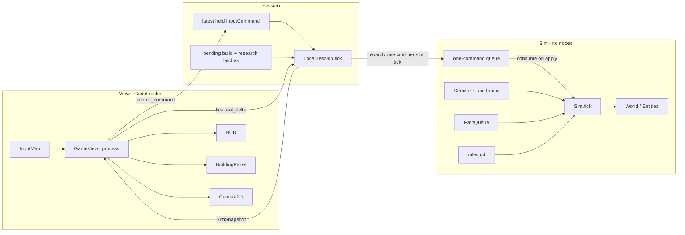
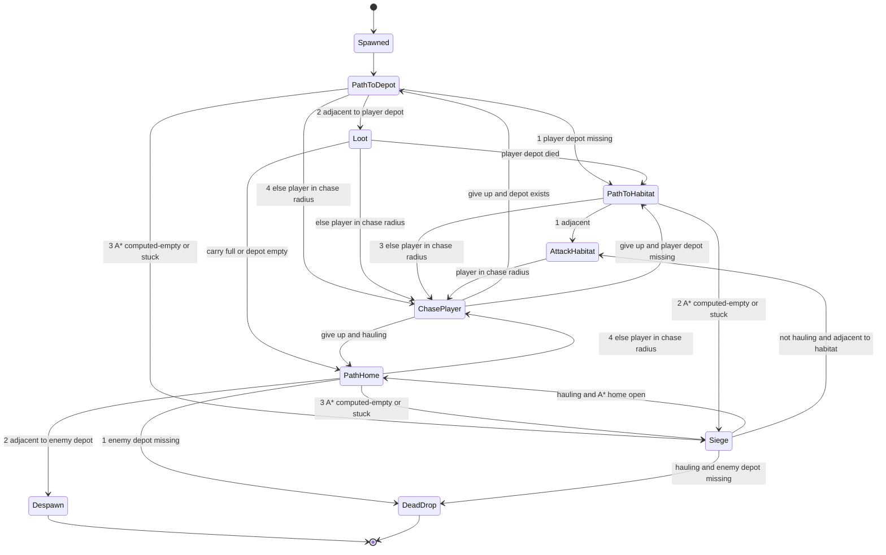
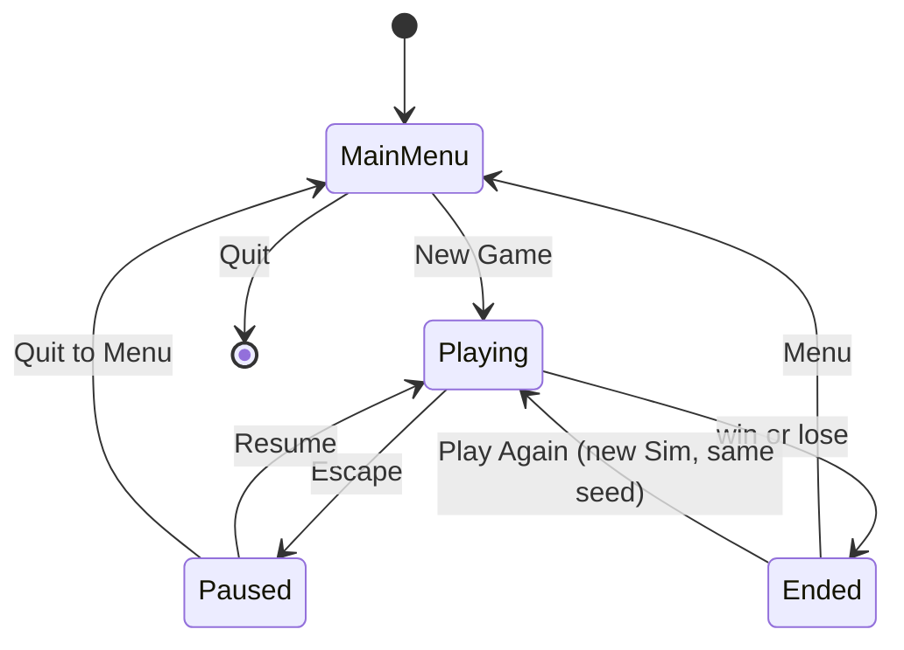
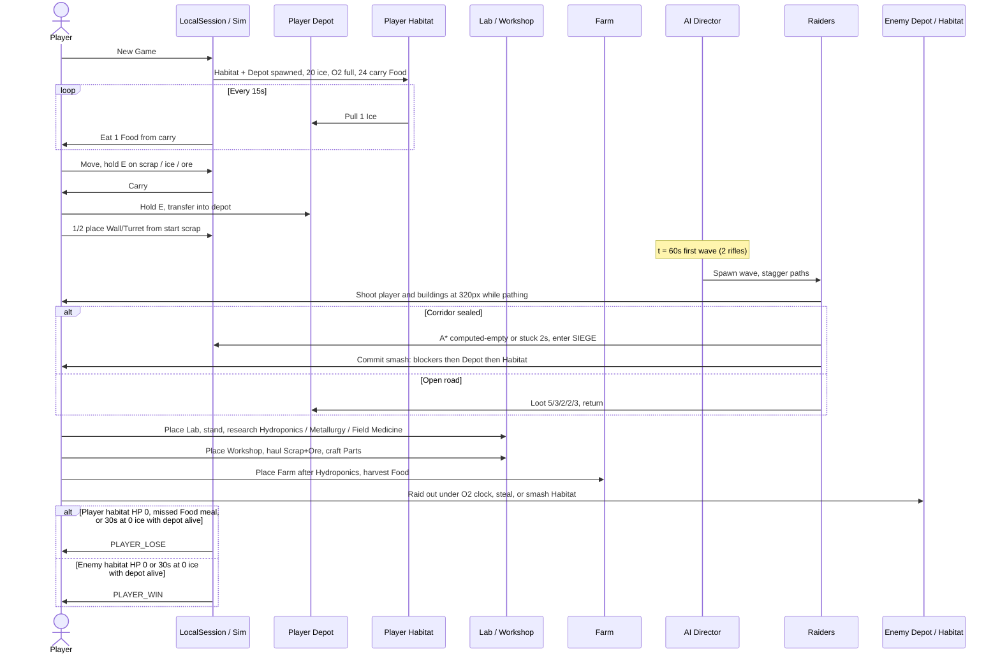

# Requirements (v0.1)

16 August 2026

This document is the exact requirements for the game as it must exist after v0.1. If a behavior is not specified here, it must not be implemented. New requirements must be added to this document before they are coded.

The shipped baseline (v0.0) is complete: a single-player, fixed-tick, two-resource, wall-and-turret session. This document restates every still-binding baseline rule at the same numeric specificity and integrates the v0.1 systems (five haulable resources, a small tech tree, new buildings, personal oxygen, hunger, icon UI, building inspect, same-range enemy rifles, raid-hitch performance budgets). It is present-tense law, not a historical pitch.

Internal application id is `colony`. Window title is `Colony`. Do not put a product name in UI strings, comments, or this document.

---

## Overview

The game is a single-player, real-time, top-down 2D survival session on the Martian surface. The player is one colonist who keeps a two-building starter colony alive, expands it with defenses and a handful of mid-session buildings, researches a small bush of techs at a Lab they must physically attend, survives periodic raids from one AI faction, and strikes back by stealing stockpiled resources or destroying the enemy habitat.

The closed loop is: **gather haulable resources → spend them on buildings, life support, and research → keep personal oxygen from running out on long walks and keep carry Food from running out → defend the depot and habitat from raiders who shoot as soon as they have range → raid the enemy depot (or smash their habitat) → win or lose by a habitat-HP check, a 30 s zero-ice check, or hunger.** The simulation is a fixed-tick authoritative state machine rendered by Godot 4. Single-player is sufficient; the session layer stays a command-in / snapshot-out seam so LAN co-op can be added later without rewriting rules.

Target session length is **12–20 minutes**. That is a stretch of the shipped 8–15 minute loop, not a factory.

---

## Background & Motivation

The shipped baseline (v0.0) already delivers the three pillars (build/maintain, defend against AI, steal from an enemy base) on native Windows and Linux, with an authoritative 20 Hz sim and a `Session` seam. Playable sessions exposed four gaps this document closes:

- The mid-session has no sink except walls and turrets. Scrap becomes a pile, and there is no reason to leave the starter pair of buildings except to raid.
- Raiders only melee. They do not threaten the player or buildings until they close to 18 px, so walls are path blockers rather than cover, and a player with a 320 px rifle kites for free.
- The HUD is a wall of resource *names* plus Habitat/Depot HP. Building health belongs on the building the player is looking at.
- When a wave spawns, the session hitches. The cause is in the code (see **Raid performance**), not a vague “too many entities” note.

v0.1 is the next playable layer on that baseline. It is still one sitting, one map, one colonist, no belts.

---

## Goals & Non-Goals

### Goals (v0.1)

- Keep everything that already makes a session a complete game: launch a native window on Windows and Linux from a Godot 4 export; start from a main menu; play one map end-to-end; win or lose by habitat HP or a 30 s zero-ice check.
- Express the three pillars with the v0.1 set:
  1. **Build and maintain** a colony: Habitat + Depot (pre-placed), ice consumption, personal oxygen, hunger, walls, turrets, workshop, farm, lab, medbay, gate.
  2. **Defend** against one AI opponent that sends raiders to ravage the base (loot the depot on an open road; if blocked, committed smash). Raiders and the guard use the **same projectile range as the player** and **shoot the player and player buildings as soon as they are in range**.
  3. **Raid out**: walk to the enemy base under an oxygen clock, steal haulable resources from their living depot, and/or destroy their habitat.
- Five haulable resources (Scrap, Ice, Ore, Parts, Food). No sixth.
- A small tech bush: three parallel techs plus one Parts-gated capstone. Research is player-present at a Lab.
- Icon HUD and icon build bar. Habitat HP and Depot HP are **not** on the HUD. Building health lives in a building inspect panel.
- Deterministic-enough sim rules that can be unit-tested through `./tools/test.sh`.
- Placeholder art at the same parseability bar as the baseline (team stripe, silhouettes, colors).
- Architecture that does not block later LAN (input commands in, snapshots out).
- Concrete performance budgets so a `WAVE_CAP` raid does not hitch (see **Raid performance**).

### Non-Goals

Do **not** implement any of the following. They are listed so later work has a parking lot, not so they can be inferred into the code.

- LAN multiplayer, Steamworks, lobbies, NAT traversal, dedicated servers.
- Save / load / autosave (a session is one sitting; lose-or-win ends it).
- More than one map, biome, or procedural-world campaign.
- Conveyor belts, inserters, pipes-as-logistics, auto-haulers, extractors that auto-pipe, or any network that moves items. Visit-gated state is allowed (Lab progress that **pauses** while the player is away). **Farm food stock is the one allowed passive output:** it grows while the player is elsewhere, up to a per-building cap. Harvest still requires the player to stand there and hold `E`. Workshop craft is not passive: it only advances while `E` is held with the full recipe, and walking away resets it. A production queue that runs after the player walks away is not allowed.
- Power grid, oxygen *pipes*, water pipes.
- A sixth haulable resource.
- A second turret type, demolish / reclaim / refund of placed buildings.
- Multiple player-controlled colonists, squads, or RTS box-select.
- Vehicles, weather-as-a-system, day/night, fog of war, minimap.
- Narrative campaign, dialogue, cutscenes, lore codex.
- Ammo as an inventory item, weapon pickups, extra unit kinds.
- Enemy that expands, builds, gathers, or researches (enemy is a camp + wave director).
- Settings beyond window close / pause quit (no key rebind UI, no graphics menu).
- Localization, achievements, analytics SDKs, crash reporters.
- Controller / gamepad bindings (keyboard + mouse only).
- Debug cheats (set ice to 0, spawn raiders, god mode, skip research).

---

## Key Decisions

| Decision | Choice | Rationale |
| --- | --- | --- |
| Engine | **Godot 4.4+** (compatible with 4.4–4.5), **GDScript** | Already shipping. 2D-first, first-class Linux and Windows export, MIT license, ENet available when LAN is in scope. |
| Multiplayer | **Single-player only.** `Session` interface (`submit_command` / `tick` / `get_snapshot`). `LocalSession` is the current implementation. | LAN is a later feature. The seam already exists; do not add a second session subclass here. |
| Command/tick contract | **Latest-held command; one enqueue per sim tick; consume on apply.** Pause and a locked outcome drop gameplay. | Catch-up ticks, pause, and one-shot `build_kind` / `research_kind` are otherwise unimplementable. Unchanged from the baseline, extended with a research latch. |
| Sim vs view | **Authoritative fixed-tick sim** (20 Hz) as plain GDScript objects. Godot nodes are a view. | Scene-tree-as-sim is hostile to tests and host-auth netcode. |
| Time / space | Real-time, `dt = 0.05s`. **64×64 tile occupancy**, free 2D pixel movement for units. | Survival raids need simultaneous movement. Tiles make building, pathing, and deposits trivial. |
| Resources | **Exactly five haulable: Scrap, Ice, Ore, Parts, Food.** Five-integer `Inventory` with per-kind caps. No weight. Personal **oxygen is not a depot resource**. | Scrap is cheap construction. Ice is colony life. Ore is scarcer mid-tier. Parts are crafted-only premium. Food is personal rations grown at a Farm. A sixth haulable is not required. |
| Buildings | Habitat + Depot pre-placed, not rebuildable. Player builds **Wall, Turret, Workshop, Farm, Lab, Medbay, Gate**. | Each has a unique job (see Buildings). Five new constructibles, no second turret, no belts. |
| Tech tree | **Small bush:** Hydroponics, Metallurgy, Field Medicine in parallel; **Ballistics** behind Metallurgy (costs Parts). One selected research on `Sim`. Lab is scrap-only and start-unlocked. Workshop is start-placeable; **the Parts recipe is locked until Metallurgy**. Hydroponics unlocks the **Farm**. | Research can begin without a prior tech. Early raid still works with start scrap (Wall + Turret). Start Food covers the Hydroponics + Farm race. |
| Oxygen | **60 s** full charge. Instant refill to max while adjacent to a living player **Habitat or Depot**. At 0: **1 HP every 5 ticks** (`PLAYER_O2_HP_PER_PULSE` / `PLAYER_O2_PULSE_TICKS`). | Habitat-or-Depot adjacency keeps the dump / turret stand off the suffocation clock. Off-pad gather drains; coming home to dump refills. 60 s is the **raid-out** budget. The Farm does **not** refill O2. |
| Hunger | Player auto-eats **1 Food from carry** every `FOOD_EAT_PERIOD` (15 s). Missing that meal is **`PLAYER_LOSE` / `HUNGER`** — not a combat death, not a respawn. Start carry is `START_PLAYER_FOOD` (24) = **6 minutes** to research Hydroponics and place a Farm. | Food is the mobile life-support. Later maps should not require defending one Habitat for food; a Farm you place is the source. O2 stays camp-tethered in this version. |
| Workshop | Player-present, **one recipe**, consume **Scrap+Ore from player carry**, produce Parts into carry. No queue. No depot-adjacent crafting. **Own-depot `E` dumps; `Shift+E` (or the depot panel Withdraw toggle) pulls back.** | A workbench, not a factory. Hauling ingredients to the bench is the logistics. Withdraw exists so a dump does not permanently trap Ore/Parts/Ice in the depot. |
| Interact resolve | **Nearest valid target by distance-to-AABB.** Equal distances use the priority list (depot, loot, deposit, workshop, lab, farm). | Depot-first made a camp Lab/Workshop unusable inside the depot’s 24 px halo. Closer bench/lab/farm wins. |
| Medbay | **2 HP/s** while adjacent. Costs scrap + ice (not Parts). | Parallel to the ore path. Slower than an empty-handed respawn, better when you are carrying Ore/Parts/Ice you do not want to drop. |
| Gate | Solid to raiders/guards and to **all** projectiles (like a Wall). **Not** solid to the player. Costs scrap + Parts. | Player-only door in a wall line. First-integrate only, ignore tiles of a **friendly Gate the shooter’s circle overlaps** — not `floor(muzzle / TILE)`. A neighboring wall still eats the shot. |
| Combat | Player projectile rifle (no ammo). Turrets auto-fire at units. **Raiders and guards use the player rifle’s speed × life as range (320 px)** and a much lower DPS. Melee is a fallback only inside `RAIDER_MELEE_RANGE`. | Same range so they shoot as soon as a target is in range. Different DPS so a wave cannot snipe a Habitat from 320 px in a few seconds. Walls matter as cover. |
| Ranged AI | Shooting is **orthogonal** to the state machine. Target priority: living player in range, else the tasked / siege building, else nearest player building. `CHASE_RADIUS` stays **96 px**. `SIEGE` still never chases. | Raising chase to 320 px would make every wave abandon loot to hunt the player across the map. Loot-and-return + committed smash stay. |
| Ravage model | Open road: loot-and-return. Enter `SIEGE` when A* to the objective is **computed-empty** or stuck `RAIDER_STUCK_TIME`. Non-hauling `SIEGE` commits: blockers → Depot → Habitat. **Hauling smash = nearest solid player building that is not Depot/Habitat.** Chase does not preempt `SIEGE`. | A Workshop on the home road must be smashable while hauling or raiders sit forever. Every PR that adds a solid updates this smash set. |
| Win/lose | Habitat HP 0; ice has been 0 for 30 s while that faction still has a living Depot; or the player misses a Food meal (`HUNGER`). Destroying a depot spills one loot pile and does **not** start or continue the ice starve clock. | Habitat and ice remain the colony clocks. Hunger is personal and does not respawn. |
| UI | HUD resource **icons + counts** for carry and player depot (five kinds). Build bar is **building sprites**. **No Habitat/Depot HP on the HUD.** Inspect (`F`, or RMB on a player building when not in build mode) opens a building panel that owns HP. Personal O2 is on the HUD. Low carry Food uses the low-ice color. | Names are not the primary label. Building health is a building concern. LMB stays fire. |
| Performance | Binding: heap A*, **1 new A\* per tick**, spawn stagger, pending ≠ empty, terrain cache, dirty `queue_redraw`. `4 ms` / `8 ms` are F3 **guidance** on the project Linux box (software GL, 1280×720, `gl_compatibility`), not failing test law. | Commit `4e4fa7c` already caches A* across thinks. The remaining hitch is N linear A* on the spawn tick plus the per-frame terrain redraw. |
| Art | 32×32 pixel-art PNGs for `EMPTY` ground and `ROCK`. Everything else: colored primitives + 1 px outlines, or matching placeholder PNGs under `assets/sprites/placeholder/`, team stripe on buildings, damage flash on hit. | Same parseability bar as the baseline. New icons/buildings must meet it. |
| Renderer | **`gl_compatibility`** | Broader Linux Mesa + older Windows GPU coverage. |
| Persistence | **None** | Not required for a 12–20 minute loop. |
| Automation | **Forbidden** except Farm stock growth (passive, capped). No belts, inserters, pipes-as-logistics, auto-haulers, extractors that pipe, or queues that run while the player is elsewhere. Harvest still requires `E`. | This is a survival game, not a factory. Player-as-logistics is the loop. |

---

## Proposed Design

### Engine and repository layout

The Godot project root **is** the repository root. Application name in `project.godot` is `colony` (internal id, not a product title). Window title is `Colony`.

```
.
  CLAUDE.md
  design.md
  project.godot
  export_presets.cfg
  icon.svg
  .godot/
    global_script_class_cache.cfg  # tracked named-class registry
  src/
    autoload/
      app.gd                 # scene router: menu <-> game
    core/
      constants.gd           # all numeric rules (class_name Constants)
      types.gd               # enums: Faction, BuildingKind, ResourceKind, TechKind, ...
    sim/
      sim.gd                 # Sim: owns world, ticks, applies commands
      world.gd               # tile grid + occupancy + faction-aware walk queries
      mapgen.gd              # seeded map
      entity.gd              # base: id, pos, radius, hp, faction
      unit.gd                # player, raider, guard
      building.gd
      projectile.gd
      deposit.gd
      loot.gd
      inventory.gd           # five-resource bag with per-kind capacity
      pathfind.gd            # A* on walkable tiles (binary-heap open set)
      path_queue.gd          # at most one new A* per sim tick
      combat.gd              # damage, death, friendly-fire, projectile spatial query
      research.gd            # tech defs, costs, prereqs, unlocks
      ai_director.gd         # wave schedule
      ai_raider.gd           # raider state machine + fire intent
      ai_guard.gd            # guard state machine + fire intent
      commands.gd            # InputCommand
      snapshot.gd            # immutable-enough view DTO
      rules.gd               # costs, unlocks, win/lose, ice pull, validity
    session/
      session.gd             # abstract Session
      local_session.gd       # current implementation
    view/
      game_view.gd           # binds LocalSession to the scene
      world_view.gd          # cached terrain + deposit overlay
      unit_view.gd
      building_view.gd
      projectile_view.gd
      loot_view.gd
      camera_ctrl.gd
      build_ghost.gd
      gather_bar.gd
    ui/
      main_menu.gd
      hud.gd
      build_bar.gd
      building_panel.gd      # inspect panel (HP + kind state)
      pause_menu.gd
      end_screen.gd
      debug_overlay.gd
  scenes/
    boot.tscn                # main scene, loads App
    main_menu.tscn
    game.tscn
    ui/hud.tscn
    ui/pause_menu.tscn
    ui/end_screen.tscn
  assets/
    sprites/placeholder/     # 32×32 PNG primitives (units, buildings, resources)
    sprites/tiles/           # 32×32 terrain: ground.png, rock.png
    audio/sfx/               # optional short WAV/OGG; silence is allowed
    theme/default.tres
  tests/
    run.gd                   # test runner, exit 0/1; only via tools/test.sh
    test_inventory.gd
    test_rules.gd
    test_mapgen.gd
    test_combat.gd
    test_ai_raid.gd
    test_ai_raider.gd
    test_ai_ranged.gd
    test_pathfind.gd
    test_research.gd
    test_oxygen.gd
    test_food.gd
    test_hud.gd
    test_workshop.gd
    test_medbay.gd
    test_perf.gd
    test_snapshot.gd
    test_debug_overlay.gd
    test_world_view.gd
    test_gather_bar.gd
    test_building_panel.gd
  tools/
    export.sh                # wraps Godot headless export for both OS targets
    test.sh                  # official test entry: private Xvfb + run.gd
```

`res://` mirrors this tree (`res://src/...`, `res://scenes/...`).

The rest of `.godot/` is editor output and is not tracked. `global_script_class_cache.cfg` is tracked: Godot registers `class_name` scripts from that file before autoloads parse. A source checkout must include it so `App` and other scripts can resolve named types (`Session`, `LocalSession`, `Constants`, …) without a prior editor import. Adding, renaming, moving, or removing a `class_name` script must update this file (the editor rewrites it on import; commit the result). Terrain textures still load from PNG when the import cache is missing.

Autoloads (only these):

| Autoload name | Script | Role |
| --- | --- | --- |
| `App` | `res://src/autoload/app.gd` | Change scene, hold `current_session` for the active run |

Do not put sim state in autoloads.

### Runtime architecture



**Rule:** nodes never mutate sim fields. They emit `InputCommand` values. The view rebuilds or patches sprites from the snapshot each rendered frame.

**Sole driver:** `GameView._process(delta)` is the only caller of `Session.submit_command` and `Session.tick(real_delta)`. Tests call `Sim` methods directly and do not go through `GameView`.

### Tick and update model

| Parameter | Value |
| --- | --- |
| `Constants.SIM_HZ` | `20` |
| `Constants.SIM_DT` | `0.05` seconds |
| Max catch-up ticks per rendered frame | `4` |
| Pause | `LocalSession.paused == true` skips accumulation, enqueue, and `Sim.tick` |
| End state | Once `outcome != NONE`, `LocalSession.tick` returns immediately; `Sim` is frozen; view shows the end screen |

#### Command / tick / pause contract (binding)

This contract is required. Implement it as a short comment on `LocalSession.tick` plus the code below. Do not invent a second queueing model later for LAN.

1. **`submit_command(cmd)` stores held state. It does not enqueue and it does not stamp `cmd.tick`.**
   - Overwrite `latest.move`, `latest.aim`, `latest.fire`, `latest.interact`, `latest.withdraw`.
   - If `cmd.build_kind >= 0`, latch `pending_build_kind` / `pending_build_tile`. A later `submit_command` with `build_kind < 0` must **not** clear the latch (otherwise a click on a frame that does not produce a sim tick is lost).
   - If `cmd.research_kind >= 0`, latch `pending_research_kind`. A later `submit_command` with `research_kind < 0` must **not** clear that latch.
2. **`LocalSession.tick(real_delta)` is the only code that enqueues.**
   - If `paused` or `sim.outcome != NONE`: return immediately. Do **not** add `real_delta` to the accumulator (unpausing must not catch up pause time).
   - Otherwise `acc += real_delta`. While `acc >= SIM_DT` and catch-up count `< MAX_CATCHUP_TICKS`:
     - `acc -= SIM_DT`.
     - Clone `latest` into a command. Set `cmd.tick = sim.tick_index + 1`. Set `cmd.build_kind` / `cmd.build_tile` from the build latch, then clear the build latch (`pending_build_kind = -1`). Set `cmd.research_kind` from the research latch, then clear the research latch (`pending_research_kind = -1`).
     - `sim.enqueue(cmd)` — exactly one command per sim tick.
     - `sim.tick()` — `Sim` applies that command and **consumes** it (the queue is empty after the apply step below).
   - Leftover `acc` is kept (capped implicitly by the catch-up limit; leftover above `MAX_CATCHUP_TICKS * SIM_DT` is discarded so a hitch cannot spiral).
3. **`build_kind` and `research_kind` are one-shot.** The view sets each only on the click / key frame. The session latch holds it until the next sim tick consumes it, even if that tick is on a later render frame.
4. **`fire`, `interact`, and `withdraw` are held state**, not edges. `Sim` rate-limits fire with `weapon_cooldown` and rate-limits transfers / craft / research with channel progress. `withdraw` is meaningful only with `interact` on the **own** depot.
5. **While the player unit is dead, or `outcome != NONE`, `Sim` ignores `fire`, `interact`, `withdraw`, `build_kind`, `research_kind`, `move`, and `aim`.** The command is still consumed so the “one per tick” rule holds. Aim on the unit is left unchanged.
6. **`set_paused(true)`** exists on `LocalSession`. The pause menu is wired: Escape toggles it; Resume unpauses; Quit to Menu returns to the main menu. It only flips the flag that step 2 checks.

A future `LanHostSession` must preserve “one command per player per sim tick, consume on apply.” It may receive commands from the network instead of `GameView`, but it must not replay a backlog of pause-time or catch-up-uncloned commands.

#### `Sim.tick()` order

Must be this order; tests rely on it. If `outcome != NONE` at entry, return immediately (no `tick_index` increment).

1. `tick_index += 1`. Set `sim.time = tick_index * SIM_DT`.
2. **Decrement cooldowns** by `SIM_DT`, floored at 0:
   - every unit: `weapon_cooldown`, `path_recalc_in`
   - every dead player unit: `respawn_timer`
   - every building: `fire_cooldown`
   - every projectile: `life`
   - `Director.banner_timer`
   - Do **not** decrement here: `interact_progress`, `chase_timer`, `stuck_timer`, `ai_state_time`, `ice_debt_timer`, `zero_ice_timer`, `research_progress`, farm `food_grow_timer`, player `o2`, player `food_debt_timer` (those have their own steps).
3. **Colony systems (life support + farm growth + hunger):**
   - Once per tick, `Rules.tick_life_support(sim)` runs the per-faction depot ice pull + starve clock (see Life support). This is the only *depot* life-support step.
   - For each living Farm: `food_grow_timer += SIM_DT`; when `food_grow_timer >= FARM_GROW_PERIOD`, subtract one period and, if `food_stock < FARM_FOOD_CAP`, add 1 Food to that farm’s stock.
   - **Hunger** (living player only): `food_debt_timer += SIM_DT`; when `food_debt_timer >= FOOD_EAT_PERIOD`, subtract one period. If `inventory.food >= 1`, `remove(FOOD, 1)`. Else set `sim.hunger_failed = true` (evaluate_outcome in step 16 writes the lose). Do not run hunger while the player is dead.
4. **Apply and consume** all queued `InputCommand`s (exactly one from `LocalSession`). Ignore gameplay fields if the player is dead or `outcome != NONE`. A `build_kind >= 0` is attempted once this tick via `rules.try_place`. A `research_kind >= 0` is applied via `Research.select` (see Tech tree).
5. **AI director** (maybe spawn a wave; maybe start `banner_timer`). New raiders get staggered `path_recalc_in` (see Raid performance).
6. **AI brains** write desired velocity / interact / melee-target / **fire-target** intents on enemy units (including siege retarget). Brains **request** paths from `PathQueue`; they do not call `Pathfind.find_path*` directly except through the queue. SIEGE is entered only on a **computed-empty** path or stuck, never on a pending request.
7. **Service `PathQueue`:** compute **at most `MAX_PATHS_PER_TICK` (1)** new A* this tick. Remaining requests stay pending.
8. **Ranged fire:**
   - **Turrets:** for each living Turret, acquire the nearest living opposing **unit** in that turret’s range (`TURRET_RANGE`, or `TURRET_RANGE_UPGRADED` for **player** turrets if Ballistics is complete). If a target exists, set `building.aim` toward it. If also `fire_cooldown <= 0`, spawn a projectile (faction = turret faction, damage `TURRET_DAMAGE`, speed `TURRET_PROJ_SPEED`, life `TURRET_PROJ_LIFE`) at turret center + `aim * MUZZLE_OFFSET` and set `fire_cooldown = TURRET_COOLDOWN`. If no target, leave `aim` unchanged (default `(1, 0)` at spawn).
   - **Enemy unit rifles:** for each living Raider and Guard with `fire_target_id` pointing at a still-valid opposing unit or player building, if that target is **not** inside `RAIDER_MELEE_RANGE` and **is** inside `ENEMY_RIFLE_RANGE` and `weapon_cooldown <= 0`: set `unit.aim` toward the target, spawn a projectile (faction `ENEMY`, damage `RAIDER_PROJ_DAMAGE`, speed `PLAYER_PROJ_SPEED`, life `PLAYER_PROJ_LIFE`) at `unit.pos + aim * MUZZLE_OFFSET`, set `weapon_cooldown = RAIDER_FIRE_COOLDOWN` (guards use `GUARD_FIRE_COOLDOWN`). Range metric is the same as target acquisition: **units use center-to-center**; **buildings use point-to-AABB** (the melee helper). Enemy projectiles are ordinary `Projectile`s and use the existing friendly-fire-off hit rules.
9. **Integrate unit movement** with collision sliding (`World.blocks_movement` — Gates are not solid to the player). Then update each moving AI unit’s stuck detector (see **Enemy range and AI**).
10. **Personal oxygen** (player unit only, and only while `alive`):
    - If adjacent (`point_aabb_distance <= INTERACT_BUILDING_RANGE`) to a living **player** Habitat or a living **player** Depot: set `o2 = PLAYER_O2_MAX`. A Farm does **not** refill O2.
    - Else: `o2 = max(0, o2 - SIM_DT)`.
    - If `o2 == 0` and `tick_index % PLAYER_O2_PULSE_TICKS == 0`: `Combat.apply_damage(player, PLAYER_O2_HP_PER_PULSE)`. That is 1 HP every 5 ticks (4 HP/s). Death is processed in the deaths step.
11. **Medbay heal:** if the player is `alive`, `hp > 0`, adjacent to any living **player** Medbay, and `hp < hp_max`, increment a `medbay_heal_acc` on `Sim` by `SIM_DT`. Whenever `medbay_heal_acc >= MEDBAY_HEAL_PERIOD`, subtract one period and `hp += 1` (clamp to `hp_max`). If the player is not adjacent to a living Medbay, is dead, or `hp <= 0` this tick, set `medbay_heal_acc = 0` and do **not** heal. A lethal oxygen pulse in step 10 is not undone here; deaths run in step 15. Multiple Medbays do **not** stack.
12. **Integrate projectiles** and resolve hits (see Combat rules). Remove projectiles with `life <= 0`.
13. **Resolve melee** for units whose `weapon_cooldown <= 0` and whose AI intent has a valid target **inside `RAIDER_MELEE_RANGE`**. Melee is the close-range fallback; a unit that melee’d this tick already has `weapon_cooldown > 0` and cannot also have fired in step 8.
14. **Resolve interact channels** (gather, loot, deposit, steal, workshop craft, farm harvest, lab research) via the single interact resolver. Movement already applied this tick: if this tick’s command had `move.length() > 0`, channels are reset and do not progress (see Player interaction rules). Research progress **pauses** (is not reset) when the player is not channeling the Lab; workshop craft **resets** if the player walks away or cannot pay.
15. **Process deaths**, loot drops, and player respawn (if `respawn_timer` hit 0). Respawn sets `o2 = PLAYER_O2_MAX`, `food_debt_timer = 0`, and empty carry. The first hunger meal after respawn is a full `FOOD_EAT_PERIOD` later — enough to pick up a food-bearing corpse pile.
16. **Evaluate win/lose** (`rules.evaluate_outcome`). On a non-`NONE` result, write `sim.outcome` and `sim.outcome_reason` and lock them. Further `Sim.tick` calls no-op.

There is no separate “increment raid / life-support timers” step. The director uses absolute `next_wave_at` compared to `sim.time`. Depot ice timers live entirely in step 3.

`Sim` records `last_tick_usec` (microseconds spent in this `tick()` body, including path service) for the debug overlay. Do not `print` it.

### World space

| Parameter | Value |
| --- | --- |
| Map size | **64 × 64 tiles** |
| Tile size | **32 × 32 pixels** |
| World size | **2048 × 2048 pixels** |
| Origin | Tile `(0,0)` at world `(0,0)`, +X right, +Y down (Godot 2D) |
| Tile index | `index = y * 64 + x` |

Tile terrain kinds (`types.gd` / `enum TileTerrain`): `EMPTY`, `ROCK`.

Occupancy is a second layer: a tile may also hold a building (footprint covers 1 or 4 tiles), a deposit, or loot. Rocks and buildings are **solid to pathfinding and projectiles**. Deposits and loot are **not solid**. **Gates are solid to pathfinding, projectiles, raiders, and guards, and are not solid to the player.**

A tile is **walkable** (`World.is_walkable`) iff terrain is `EMPTY` and no building occupies it (Gates occupy, so they are not walkable). A* and raider/guard steering use `is_walkable`.

`World.blocks_movement(x, y, unit)` is the collision predicate for **unit sliding**:
- Out of bounds → blocked.
- Terrain `ROCK` → blocked.
- Occupying building is `null` → not blocked.
- Occupying building `kind == GATE` and `unit.kind == PLAYER` → **not** blocked.
- Any other occupying building → blocked.

**Guaranteed connectivity:** mapgen **always** carves the L-corridor specified below (skipping tiles that fall on building footprints). After generation, flood-fill walkable tiles from the player spawn tile as a **validation assert** only: the enemy depot’s adjacent walkable tiles must be reachable. Flood-fill must not carve. If the assert fails, that is a generator bug (the always-carve geometry plus reserved rects are specified to make this pass). Tests check the assert on `DEFAULT_SEED` and on a handful of extra seeds (`2`, `3`, `4`, `5`).

### Map generation (deterministic)

`mapgen.generate(seed: int) -> World`

Use `RandomNumberGenerator` with `seed` set to the session seed. Default seed is `1` on “New Game” (no seed UI; the constant is `Constants.DEFAULT_SEED = 1`).

Algorithm:

1. Allocate 64×64 tiles, all `EMPTY`.
2. For each tile `(x,y)` not inside a **camp reserved rect**, set `ROCK` if `rng.randi_range(0, 99) < ROCK_PERCENT`.
3. Place player camp in `PLAYER_CAMP_RECT`:
   - Habitat at `PLAYER_HABITAT_TILE` (2×2: that tile and `+ (1,0)`, `+(0,1)`, `+(1,1)`), faction `PLAYER`, HP full.
   - Depot at `PLAYER_DEPOT_TILE` (2×2), faction `PLAYER`, HP full.
   - Starting stock in that depot: `START_PLAYER_SCRAP` Scrap, `START_PLAYER_ICE` Ice, `START_PLAYER_ORE` Ore, `START_PLAYER_PARTS` Parts, `START_PLAYER_DEPOT_FOOD` Food (0).
   - Player unit spawn world position: center of `PLAYER_SPAWN_TILE`. `o2 = PLAYER_O2_MAX`. Carry Food = `START_PLAYER_FOOD`. `food_debt_timer = 0`.
4. Place enemy camp in `ENEMY_CAMP_RECT`:
   - Habitat at `ENEMY_HABITAT_TILE` (2×2), faction `ENEMY`, HP full.
   - Depot at `ENEMY_DEPOT_TILE` (2×2), faction `ENEMY`, HP full.
   - Starting stock in that depot: `START_ENEMY_SCRAP` Scrap, `START_ENEMY_ICE` Ice, `START_ENEMY_ORE` Ore, `START_ENEMY_PARTS` Parts, `START_ENEMY_FOOD` Food (0).
   - Enemy turret at `ENEMY_TURRET_TILE`, faction `ENEMY`.
   - Guard unit at center of `ENEMY_GUARD_TILE`, faction `ENEMY`.
5. **Always** carve the 3-wide L corridor (do not wait for a flood-fill failure):
   - Horizontal: all tiles with `y ∈ [CORRIDOR_H_Y0, CORRIDOR_H_Y1]` and `x ∈ [CORRIDOR_H_X0, CORRIDOR_H_X1]`.
   - Vertical: all tiles with `x ∈ [CORRIDOR_V_X0, CORRIDOR_V_X1]` and `y ∈ [CORRIDOR_V_Y0, CORRIDOR_V_Y1]`.
   - For each such tile that is not on a building footprint, set terrain `EMPTY`.
6. Place deposits on walkable tiles that are not in either reserved rect, not on the corridor center line (`x == CORRIDOR_CENTER_X` or `y == CORRIDOR_CENTER_Y`), and at least `DEPOSIT_MIN_SEP` tiles from any other deposit (Chebyshev). Place in this order: `SCRAP_DEPOSIT_COUNT` Scrap (`SCRAP_DEPOSIT_AMOUNT` each), `ICE_DEPOSIT_COUNT` Ice (`ICE_DEPOSIT_AMOUNT` each), `ORE_DEPOSIT_COUNT` Ore (`ORE_DEPOSIT_AMOUNT` each). If a placement attempt fails `DEPOSIT_PLACE_ATTEMPTS` times, stop that resource early. **Minimum required** is `MIN_SCRAP_DEPOSITS` scrap, `MIN_ICE_DEPOSITS` ice, `MIN_ORE_DEPOSITS` ore. If any minimum fails, clear random non-reserved rocks and retry the failed resource(s) once; if still failing, treat as a generator bug (test will catch it). There are **no** Parts deposits.
7. Flood-fill validate connectivity (assert only).
8. Assign incrementing `entity_id` starting at `1`.

This generator is the only map. No hand-authored map files.

### Camera

View-only numbers (not in `constants.gd` unless an implementer prefers them there):

- `Camera2D` child of the view, not of the player node.
- Each render frame: `position = lerp(position, player_world_pos, 1.0 - exp(-8.0 * delta))`.
- Zoom: mouse wheel. `zoom` scalar in `[0.75, 2.0]`, step `0.1`, default `1.0`. (Godot zoom of `2.0` means 2× magnification.)
- Clamp the camera so the viewport does not show space outside `[0, 2048]` on either axis. If the viewport is larger than the world (high zoom-out + large window), center the world.
- No edge-pan, no free camera detach.

### Input scheme

Keyboard + mouse only. Bindings in `project.godot` Input Map (and ensured at runtime by `GameView._ensure_actions`):

| Action | Default | Effect |
| --- | --- | --- |
| `move_left` | A, Left | Move |
| `move_right` | D, Right | Move |
| `move_up` | W, Up | Move |
| `move_down` | S, Down | Move |
| `fire` | Mouse left (also used to confirm build) | Shoot if not in build mode |
| `interact` | E | Hold to gather / steal / deposit / pick up loot / craft / harvest / research |
| `withdraw` | Left Shift, Right Shift (held with `E`) | Reverse own-depot transfer (depot → player). Ignored on enemy depot. |
| `build_wall` | 1 | Enter build mode: Wall (start-unlocked) |
| `build_turret` | 2 | Enter build mode: Turret (start-unlocked) |
| `build_workshop` | 3 | Enter build mode: Workshop (start-unlocked) |
| `build_lab` | 4 | Enter build mode: Lab (start-unlocked) |
| `build_farm` | 5 | Enter build mode: Farm if Hydroponics is complete; else flash the locked icon |
| `build_gate` | 6 | Enter build mode: Gate if Metallurgy is complete; else flash the locked icon |
| `build_medbay` | 7 | Enter build mode: Medbay if Field Medicine is complete; else flash the locked icon |
| `inspect` | F | Toggle the building panel on the nearest living **player** building in `INTERACT_BUILDING_RANGE`. If none, close the panel. |
| `cancel` | Right mouse, Q | Leave build mode if building; else if the building panel is open, close it. When **not** in build mode, RMB on a player building footprint **opens** inspect on that building (does not fire). |
| `pause` | Escape | Toggle pause menu (ignored on end screen) |
| `zoom_in` | Wheel up | Zoom in |
| `zoom_out` | Wheel down | Zoom out |
| `debug_overlay` | F3 | Toggle debug overlay |

There is no reclaim / demolish key.

**Inspect vs fire (binding).** LMB is never inspect. LMB is fire, or confirm-place when in build mode, **only for world clicks**. While the pointer is over the building panel or any other consuming HUD widget, the view must **not** set `cmd.fire` and must **not** confirm-place. Godot `mouse_filter = STOP` does not hide the InputMap `fire` action; the view must test the pointer against those rects before writing `fire`. Inspect is `F` (nearest player building in interact range) or **RMB on a player building footprint when not in build mode**. RMB in build mode still cancels build and does not inspect. Q cancels build first; if not in build mode it closes the panel. **Opening inspect cancels build mode** (clears the ghost and `_build_kind`). `F` while a ghost is up therefore closes build and may open the panel in the same press.

**Lab panel vs build keys.** While the building panel is open on a Lab, keys `1`–`4` select research (Hydroponics, Metallurgy, Field Medicine, Ballistics) and do **not** enter build mode. They set `cmd.research_kind` one-shot. LMB on a tech icon in the panel does the same (and does not fire; see above). Keys `5`–`7` are **ignored** while a Lab panel is open (they do not close the panel and do not enter Farm / Gate / Medbay build). While the panel is not a Lab panel, keys `1`–`7` are build keys as in the table.

Movement vector is the sum of pressed cardinals, normalized if length > 1. The view writes that **unit-length (or zero)** vector into `InputCommand.move`; `Sim` multiplies by `PLAYER_SPEED`. Aim vector is `(mouse_world - player_pos).normalized()`. If mouse is on the player (length < `AIM_DEADZONE` px), reuse last non-zero aim (default `(1, 0)`).

Build mode: the view shows a tile-snapped ghost under the cursor (green if `rules.can_place`, red otherwise), sized to the kind’s footprint (1×1 or 2×2). Left mouse sets `build_kind` / `build_tile` on that frame’s `submit_command` only. Resources are taken from the **player depot**, not from carry. RMB / Q cancels without placing. A locked kind never enters build mode.

### Player interaction rules

The player unit is the only human-controlled entity.

**Move.** While alive, `InputCommand.move` is applied in the movement step. There is no “locked in place while channeling” flag.

**Channels vs movement.** Any command with `move.length() > 0` **prevents and resets** `interact_progress` that tick. The player must release WASD (zero movement vector) for gather / steal / deposit / loot / workshop / farm / lab channels to start or continue. **Exception:** Lab research progress on `Sim` is **not** zeroed when the player walks away; only `interact_progress` (the interact-resolver’s local channel clock) resets. `Sim.research_progress` pauses.

**Single interact resolver.** If `interact` is held, the player is alive, and `move.length() == 0`, collect every **valid** candidate below and pick the one with the **smallest distance**. Building distance is `point_aabb_distance(unit_center, footprint_aabb)`. Loot / resource-deposit distance is center-to-center. A candidate is valid only if it is in range and meets its extra predicate.

| Kind | Range | Extra predicate |
| --- | --- | --- |
| Living depot | `INTERACT_BUILDING_RANGE` | Always (own → deposit or withdraw; enemy → steal) |
| Loot pile | `GATHER_RANGE` | — |
| Resource deposit | `GATHER_RANGE` | `remaining > 0` and player has carry space of that kind |
| Living player Workshop | `INTERACT_BUILDING_RANGE` | Metallurgy complete **and** carry has the full recipe **and** free Parts space |
| Living player Lab | `INTERACT_BUILDING_RANGE` | `research_selected >= 0`, that tech is not complete, prereq (if any) is complete |
| Living player Farm | `INTERACT_BUILDING_RANGE` | — (Food harvest; a 0-food transfer is still this channel) |

**Ties** (equal distance, including two AABBs both at 0 because the point is inside neither in practice — player cannot occupy a solid footprint except a Gate): use this priority list, first match wins: **depot, loot, resource deposit, workshop, lab, farm**.

A Workshop, Lab, or Farm that is **closer** than any depot therefore wins. A depot that is strictly closer still wins. This replaces the v0.0 “depot always wins” rule, which made a camp bench unusable inside the depot’s 24 px halo.

If no candidate exists, `interact_progress = 0`.

If the resolved target’s `entity_id` **or transfer direction** (deposit vs withdraw on the own depot) changes, reset `interact_progress` to 0.

Habitat and Medbay are **not** interact targets. Oxygen refill and Medbay heal are automatic in their tick steps.

**Adjacency (buildings).** Used for player depot / workshop / lab / farm interact, oxygen refill, medbay heal, and raider loot / despawn: `distance(unit_center, footprint_aabb) <= INTERACT_BUILDING_RANGE`. Units cannot occupy a solid footprint (except the player on a Gate), so this means “stand next to it” (or on a Gate next to it). There is no second 40 px center-radius rule.

**Deposit (own depot, default).** Default own-depot `E` is still **dump**: player → depot. Each tick while resolved and `cmd.withdraw == false`: `interact_progress += SIM_DT`. Whenever `interact_progress >= TRANSFER_PERIOD`, subtract `TRANSFER_PERIOD` and transfer up to `TRANSFER_BATCH` of each haulable in order **Scrap, Ice, Ore, Parts, Food** (player → depot, limited by source and dest free space). Food is last so a short dump does not immediately empty dinner. **First transfer occurs after one full `TRANSFER_PERIOD`**, not on the press frame.

**Withdraw (own depot).** Own-depot transfer reverses when `cmd.withdraw == true`. Same cadence, same `TRANSFER_BATCH`, same Scrap → Ice → Ore → Parts → Food order, opposite direction (depot → player), limited by depot stock and carry caps. `cmd.withdraw` is held state. The view sets it when:

- `withdraw` (Left or Right Shift) is held together with `interact`, **or**
- the inspected **player Depot** panel’s Deposit/Withdraw toggle is **Withdraw** (toggle defaults to Deposit each time that panel opens).

Shift and the toggle OR together; either is enough. Switching direction mid-channel resets `interact_progress`. There is no per-kind filter in v0.1 — withdraw is the full bag, same as deposit. Withdraw pulls **leftover / dumped** stock. It is **not** a refund of Metallurgy’s 6 Ore (that payment is consumed). After paying the tech, craft still needs a later 2 Ore in carry (second gather trip, or ore dumped and not spent).

**Steal (enemy depot).** Same cadence and batch as deposit, opposite direction (depot → player). Same order: Scrap, then Ice, then Ore, then Parts, then Food, each up to `TRANSFER_BATCH`. `withdraw` is **ignored** on an enemy depot (steal is already depot → player). This is the primary “steal supplies” action.

**Gather.** Same hold. After an uninterrupted `GATHER_CHANNEL`, transfer `1` unit from the deposit to the player inventory, then reset `interact_progress` (repeat while held). When `remaining` hits 0, remove the deposit entity. Ore deposits use the same channel and range as Scrap and Ice.

**Gather channel presentation.** While the player is gathering a deposit (`interact` held, `move` is zero, the resolver target is that deposit, and `interact_progress > 0`), the view draws a short progress bar **above that deposit**. Fill is `interact_progress / GATHER_CHANNEL` (clamped to `[0, 1]`). Hide the bar when the channel is not a gather: movement reset, target change, deposit gone, `interact_progress == 0`, or any other interact target. Track `Color(0,0,0,0.65)`, fill `#F2EDE6`. This is channel feedback only — not a world-space HP bar. Loot pickup, depot transfer, workshop, farm, and lab have no world-space bar (lab progress lives on the building panel).

**Pick up loot.** After an uninterrupted `LOOT_CHANNEL`, transfer as much of the pile as fits (all five kinds); leftover stays as the same pile; if all five resources hit 0, remove the pile; reset `interact_progress`.

**Workshop craft.** Requires Metallurgy complete. After an uninterrupted `WORKSHOP_CRAFT_CHANNEL`, if carry still has at least `WORKSHOP_SCRAP_COST` Scrap and `WORKSHOP_ORE_COST` Ore and `free_space(PARTS) >= WORKSHOP_PARTS_OUT`: remove the inputs, add `WORKSHOP_PARTS_OUT` Parts, reset `interact_progress`. If at complete-time the player cannot pay or has no Parts space, do **not** consume inputs and reset `interact_progress`. Channel progress **only advances** while the full input cost is in carry and Parts space exists; otherwise reset. Walking away resets. There is **no** craft queue. The recipe is the only recipe.

**Farm harvest.** Same transfer cadence as a depot, **Food only**: after each full `TRANSFER_PERIOD`, move up to `TRANSFER_BATCH` Food from that farm’s `food_stock` → player carry, limited by `food_stock` and `free_space(FOOD)`. First transfer after one full `TRANSFER_PERIOD`. The farm is not a depot for Scrap, Ice, Ore, or Parts. Growth continues while the player is away; harvest does not.

**Lab research.** While resolved on a Lab and a valid selected tech exists: `Sim.research_progress += SIM_DT`. The first tick that would make `research_progress > 0` for a freshly selected tech **pays** that tech’s cost from the **player depot** (see Tech tree). If the depot cannot pay, do not increment progress. When `research_progress >=` that tech’s duration, mark it complete, clear selection, set progress to 0. Walking away **pauses** `research_progress` (does not reset it). Destroying the Lab does **not** wipe `research_progress` or completed techs (they live on `Sim`).

**Shoot.** If not in build mode, player alive, `fire` pressed, and `weapon_cooldown <= 0`, spawn a projectile at `unit.pos + aim * MUZZLE_OFFSET`, velocity `aim * PLAYER_PROJ_SPEED`, remaining life `PLAYER_PROJ_LIFE`, damage `PLAYER_PROJ_DAMAGE`, faction `PLAYER`. Set `weapon_cooldown = PLAYER_FIRE_COOLDOWN`. No ammo.

**Attack buildings.** Player projectiles that hit an enemy building apply damage. There is no separate “attack building” key.

**Raid-out path.** Walk across the map under the oxygen clock, kill or ignore the guard (the guard now shoots at 320 px), destroy or walk around the enemy turret (destroying is the intended path), steal from the **living** enemy depot, walk home (O2 is Habitat/Depot only — pack Food for the trip), deposit. Optionally keep shooting the enemy Habitat until it dies. Destroying the enemy depot spills loot (still stealable as piles) but does **not** starve that faction — habitat HP remains the smash path.

### Buildings

`World.footprint_span(kind)` is the single source of truth (2 for Habitat, Depot, Farm, Lab; 1 otherwise). `Combat` must call it, not duplicate the match.

| Kind | Footprint | Max HP | Cost | Buildable? | Solid | Unique feeling |
| --- | --- | --- | --- | --- | --- | --- |
| Habitat | 2×2 | 200 | — | No (pre-placed) | Yes | Loss-condition target. O2 refill (with Depot). Does not store resources. |
| Depot | 2×2 | 100 | — | No (pre-placed) | Yes | Stores **all five** haulables. Caps 50 / 50 / 30 / 20 / 30. Raid / steal target. O2 refill (camp workplace). |
| Wall | 1×1 | 60 | 5 Scrap | Yes, start | Yes | Projectile **cover** + path block. More important now that raiders shoot. |
| Turret | 1×1 | 80 | 15 Scrap | Yes, start | Yes | Auto-fires at opposing **units**. Start-unlocked so the 60 s first raid is survivable. |
| Workshop | 1×1 | 70 | 10 Scrap | Yes, start | Yes | Player-present workbench. Placeable immediately; **cannot craft until Metallurgy**. |
| Farm | 2×2 | 80 | 12 Scrap + 4 Ice | Yes, after Hydroponics | Yes | Grows Food into a capped stock. Harvest with E. Not a second depot. Not an O2 station. |
| Lab | 2×2 | 70 | 8 Scrap | Yes, start | Yes | Player-present research. The tech tree *is* standing here. |
| Medbay | 1×1 | 60 | 10 Scrap + 4 Ice | Yes, after Field Medicine | Yes | Keep-your-loot healing. Automatic while adjacent. |
| Gate | 1×1 | 50 | 4 Scrap + 2 Parts | Yes, after Metallurgy | Yes to AI + all projectiles; **no** to the player | Player-only door in a wall line. |

Placement rules (`rules.can_place`):

- Kind is player-buildable **and** unlocked (`Research.building_unlocked`).
- All footprint tiles in bounds, `EMPTY`, not occupied by a building or deposit.
- No unit’s collision circle may overlap a footprint tile AABB at the moment of placement (reject; do not shove). The player standing on a Gate still occupies that tile’s AABB for this check.
- Not inside `ENEMY_CAMP_RECT`. (Player reserved rect may be built in.)
- Player depot exists, is alive, and has at least the full `rules.cost(kind)` of every required resource.
- Total existing buildings (all factions, all kinds) `< MAX_BUILDINGS`.

On success: deduct the full cost from the player depot, spawn building at full HP, faction `PLAYER`, `aim = (1, 0)`. Instant (no build time). Farm starts with `food_stock = 0` and `food_grow_timer = 0`.

Turret behavior (both factions, same numbers except Ballistics on **player** turrets only): see tick step 8 and the constants table. Turrets target units only, no lead.

**If a depot is destroyed:** remaining Scrap, Ice, Ore, and Parts become **one** loot pile at the depot center. Occupancy tiles become empty. A faction with no depot cannot receive deposited resources and cannot pay for buildings or research. **Ice pull finds no depot and does not increment `zero_ice_timer`** (see Life support). A depot cannot be rebuilt. Spilled loot is still a steal/pickup target.

**If a habitat is destroyed:** that faction is immediately eliminated (see win/lose). Do not drop ice; the match is over.

**If a farm is destroyed:** remaining `food_stock` is **not** spilled. Occupancy tiles become empty.

**If any other player building is destroyed:** no resource drop. Occupancy tiles become empty.

**Enemy buildings:** the enemy camp is Habitat + Depot + one Turret. Enemy does not place Workshop, Farm, Lab, Medbay, Gate, or extra walls. The enemy does not eat Food.

### Resources and inventories

`enum ResourceKind { SCRAP, ICE, ORE, PARTS, FOOD }`

`Inventory` is always five non-negative integers plus a per-resource capacity. Do not invent weight. Resources do not substitute.

```
class_name Inventory
var scrap: int
var ice: int
var ore: int
var parts: int
var food: int
var cap_scrap: int
var cap_ice: int
var cap_ore: int
var cap_parts: int
var cap_food: int

func _init(p_cap_scrap, p_cap_ice, p_cap_ore := 0, p_cap_parts := 0, p_cap_food := 0)
func free_space(kind) -> int
func can_add(kind, n) -> bool
func add(kind, n) -> int      # returns leftover that did not fit
func remove(kind, n) -> int   # returns amount actually removed
```

Public API is the ten fields plus `free_space` / `can_add` / `add` / `remove`. Callers read `.scrap` / `.ice` / `.ore` / `.parts` / `.food`. Private `_amount` / `_cap` / `_set_amount` may exist as implementation; they are not a second public surface.

Two-argument `Inventory.new(a, b)` remains valid and sets ore/parts/food caps to **0**. Four-argument `Inventory.new(a, b, c, d)` remains valid and sets the food cap to **0**. Those are **footguns**: a missed five-arg update silently cannot hold Food. Every constructor that must accept Food **must** pass five caps:

| Call site | Ctor |
| --- | --- |
| `Unit.inventory_for(PLAYER)` | `Inventory.new(PLAYER_CARRY_SCRAP, PLAYER_CARRY_ICE, PLAYER_CARRY_ORE, PLAYER_CARRY_PARTS, PLAYER_CARRY_FOOD)` |
| `Unit.inventory_for(RAIDER)` | `Inventory.new(RAIDER_CARRY_SCRAP, RAIDER_CARRY_ICE, RAIDER_CARRY_ORE, RAIDER_CARRY_PARTS, RAIDER_CARRY_FOOD)` |
| `Unit.inventory_for(GUARD)` | `Inventory.new(0, 0, 0, 0, 0)` (or two-arg; zero food) |
| `Mapgen` player + enemy depots | `Inventory.new(DEPOT_CAP_SCRAP, DEPOT_CAP_ICE, DEPOT_CAP_ORE, DEPOT_CAP_PARTS, DEPOT_CAP_FOOD)` |
| `Loot._init` | `Inventory.new(999, 999, 999, 999, 999)` |
| Combat depot spill / unit death drop / DeadDrop / home leftover | same five-cap 999 loot pile |

`test_inventory.gd` / `test_combat.gd` must assert that `Inventory.new(999, 999)` **rejects** ore, parts, and food; that a four-arg bag **rejects** food; and that `Loot` / depot / player / raider five-arg bags accept food.

| Holder | cap_scrap | cap_ice | cap_ore | cap_parts | cap_food |
| --- | --- | --- | --- | --- | --- |
| Player unit | 10 | 10 | 6 | 5 | 24 |
| Raider | 5 | 3 | 2 | 2 | 3 |
| Guard | 0 | 0 | 0 | 0 | 0 |
| Depot | 50 | 50 | 30 | 20 | 30 |
| Loot pile | 999 | 999 | 999 | 999 | 999 |
| Farm stock | — | — | — | — | `FARM_FOOD_CAP` (12) (not an `Inventory`) |
| Deposit | remaining is a single kind; not an Inventory. Parts and Food have no deposits. |

**How obtained / role**

| Resource | How obtained | Role |
| --- | --- | --- |
| Scrap | World deposits (`SCRAP_DEPOSIT_*`). Start depot 15. | Cheap construction (Wall, Turret, Workshop, Lab, and part of every other building). Workshop input. |
| Ice | World deposits (`ICE_DEPOSIT_*`). Start depot 20. | Colony life-support pull. Hydroponics / Field Medicine / Farm **build** cost. Medbay cost. |
| Ore | World deposits (`ORE_DEPOSIT_*`), scarcer. Start depot 0. Enemy start 6. | Metallurgy cost. Workshop input. Meaningfully rarer than scrap, not a luck gate. |
| Parts | **Crafted only** at the Workshop after Metallurgy. Never a world deposit. Start 0. | Gate cost. Ballistics cost. The premium sink. |
| Food | **Grown only** at a Farm. Never a world deposit. Start **24 on player carry**, 0 in both depots. | Personal hunger. Auto-eaten from carry. Missing a meal is a lose. |

**Personal oxygen** is a float seconds-remaining on the player unit (`unit.o2`). It is not a `ResourceKind`, does not enter `Inventory`, cannot be stolen, deposited, or dropped.

**Food** is a `ResourceKind`. It lives in `Inventory` like the other haulables. Hunger consumes carry Food; it is not a second personal float.

### Life support (maintain pillar)

`FactionLife` (`ice_debt_timer`, `zero_ice_timer`) is owned by **`Sim`**, one record per faction (`PLAYER`, `ENEMY`). It is not a field on the Habitat entity. A Habitat existing is only the predicate for running that faction’s depot life-support step.

Once per tick, `Rules.tick_life_support(sim)` runs the per-faction steps below (the function itself loops `PLAYER` then `ENEMY`; the call site does not). For each faction that still has a living Habitat:

1. `ice_debt_timer += SIM_DT`.
2. Let `depot` be that faction’s unique living Depot, or `null`.
3. **Starve clock:** if `depot != null` and `depot.inventory.ice == 0`, then `zero_ice_timer += SIM_DT`. If `depot == null`, do **not** add to `zero_ice_timer` (destroying the depot does not start or continue the starve clock).
4. If `ice_debt_timer >= ICE_PULL_PERIOD` for that faction, subtract one period. If `depot != null` and `depot.inventory.ice >= 1`, `remove(ICE, 1)` and set `zero_ice_timer = 0`.

| Faction | `ICE_PULL_PERIOD` | Starting depot ice | Time-to-empty if no income |
| --- | --- | --- | --- |
| Player | `ICE_PULL_PLAYER` **15.0 s** | 20 | 300 s (5 min) |
| Enemy | `ICE_PULL_ENEMY` **20.0 s** | 40 | 800 s (~13.3 min) |

These ice clocks are **unchanged** from the baseline. Session stretch to 12–20 min comes from tech / new buildings / oxygen, not from a longer starve. Steal remains the way to accelerate an enemy starve. Recalculation: raising enemy ice or slowing their pull would push a no-steal starve past 20 min; that would break the session window. Do not change these four numbers.

When `zero_ice_timer >= ZERO_ICE_LIMIT` (30.0) **and** that faction still has a living Habitat, the faction is eliminated (life-support failure). Because step 3 only increments while a living depot exists with 0 ice, a starve win/lose requires emptying a **living** depot (the steal path). Smash remains habitat HP.

HUD (colony-level, not a building HP):

- Always show player depot Ice as an **icon + count** (or `—` if the player depot is missing).
- Ice count turns `#E24A3B` when a living player depot has `ice <= 5` or `zero_ice_timer > 0`.
- Show a countdown `ceil(ZERO_ICE_LIMIT - zero_ice_timer)` **only while** the player depot is alive and (`ice == 0` or `zero_ice_timer > 0`). The value changes every sim tick (`SIM_DT`), not in 15 s steps.
- Do not show a starve countdown when the depot is missing.

Enemy does **not** gather, restock, or research. The only way their ice decreases faster than the 20 s drip is the player stealing from the living depot.

### Personal oxygen

Player-only. Starts at `PLAYER_O2_MAX` (60.0 s) on session start and on every respawn.

- **Refill:** each tick after movement, if the living player is adjacent to a living **player Habitat** or a living **player Depot**, set `o2 = PLAYER_O2_MAX`. Instant, not a channel. Enemy Habitat / Depot do not refill the player. A Farm does not refill O2.
- **Drain:** otherwise `o2 -= SIM_DT`, floored at 0. Drain does not run while the player is dead.
- **Suffocation:** while `o2 == 0` and the player is alive and `tick_index % PLAYER_O2_PULSE_TICKS == 0`, apply `PLAYER_O2_HP_PER_PULSE` (1) HP. That is 4 HP/s. Ordinary damage. Death drops carry and respawns under the existing death rules.
- **HUD:** a dedicated O2 bar (or icon + bar) is always visible. Color: `#3DDC97` when `o2 > PLAYER_O2_WARN` (20 s), `#E2C044` when `10 < o2 <= 20`, `#E24A3B` when `o2 <= 10`. At `o2 == 0` the bar is empty and pulses `#E24A3B`. This is the danger telegraph.
- Oxygen is not shown as a depot resource and is not inspect-panel state.

**Home workplace is not a suffocation check.** Depot AABB is `(288,1664)–(352,1728)`. The natural dump / turret stand — corridor-side tile `(11, 52)`, center `(368, 1680)` — is **16 px** from that AABB, inside `INTERACT_BUILDING_RANGE`. Standing next to the Habitat or Depot (including that east face) snaps O2 to full. Spawn `(8, 55)` is a few steps south of the Depot bubble; walking to dump refills.

Off-pad gathering (deposits are forbidden inside `PLAYER_CAMP_RECT`) drains O2. Coming home to dump before a wave refills. First-raid defense at the depot is therefore **not** a 4 HP/s stack on top of raider rifles.

**Raid-out budget (60 s).** Spawn `(8, 55)` to enemy depot `(51, 6)` is 92 Manhattan tiles = 2944 px ≈ **24.5 s** at `PLAYER_SPEED`. Round trip ≈ 49 s of walking. A 60 s charge, started as you leave the Habitat/Depot bubble, covers a clean walk-in / steal / walk-out and does **not** cover a long firefight at the enemy turret. There is no mid-map O2 station. Do not treat the gather-and-defend minute as an oxygen puzzle.

### Hunger

Player-only. Food is eaten from **carry**, not from the depot and not from a Farm stock.

- **Start:** player carry Food = `START_PLAYER_FOOD` (24). `food_debt_timer = 0`. Depot Food starts at 0.
- **Meal:** every `FOOD_EAT_PERIOD` (15.0 s) of living time, remove 1 Food from carry. That is 24 meals = **360 s / 6 minutes** before the first Farm must have been harvested.
- **Budget:** Hydroponics is 8 Ice from the start depot plus 20 s at a Lab. Farm costs 12 Scrap + 4 Ice. Start depot ice covers both Ice payments. If the player spent start scrap on a turret, they must gather scrap for the Lab and Farm. Six minutes is the intended slack for that path; do not silently retune if a playtest is slow — change this document first.
- **Missed meal:** if a meal is due and carry Food is 0, set `sim.hunger_failed = true`. Step 16 writes `(PLAYER_LOSE, HUNGER)`. This is **not** combat death: no corpse drop from the hunger fail itself, no respawn, session over.
- **Combat death:** carry (including leftover Food) drops as loot. Respawn carry is empty and `food_debt_timer = 0`, so the next meal is a full period later. Pick up the pile or harvest a Farm before that meal.
- **Dumping Food** into the depot is legal and is a starve risk. Withdraw exists. Transfer order puts Food last so a short dump empties scrap/ice/ore/parts first.
- **HUD:** carry Food uses the low-ice color `#E24A3B` when `food <= FOOD_WARN` (4). Depot Food is an ordinary icon + count.
- **Farm growth vs hunger:** one Farm grows 1 Food / 10 s (6 / min) up to 12. The player eats 4 / min. A living Farm is a surplus once you harvest it.

**Farm vs colony ice.** Colony pull is 1 / 15 s. Farm growth is 1 / 10 s per living farm, stock 12. Filling a stock and walking away does not feed the player — harvest is visit-gated. Colony ice stays the habitat clock; Food is the personal clock.

### Tech tree

`enum TechKind { HYDROPONICS, METALLURGY, FIELD_MEDICINE, BALLISTICS }`

Start-unlocked **buildings** (no tech): Wall, Turret, Workshop, Lab. Habitat and Depot are pre-placed.

Three parallel techs, plus one capstone that sits behind Metallurgy because it costs Parts:

| Tech | Unlocks | Paid from player depot on first progress tick | Duration at Lab | Prereq |
| --- | --- | --- | --- | --- |
| Hydroponics | Farm | 8 Ice | 20.0 s | none |
| Metallurgy | Gate + Workshop Parts recipe | 6 Ore | 25.0 s | none |
| Field Medicine | Medbay | 6 Ice + 4 Scrap | 20.0 s | none |
| Ballistics | Player turret range `TURRET_RANGE` → `TURRET_RANGE_UPGRADED` (160 → 224). Not a new building. | 4 Parts | 20.0 s | Metallurgy complete |

**One selected research at a time**, stored on `Sim`:

```
Sim.research_selected: int   # TechKind or -1
Sim.research_progress: float # seconds accumulated while channeling
Sim.research_paid: bool      # true after the current selection’s cost has been deducted
Sim.techs_done: int          # bitmask, bit i set ⇒ TechKind i complete
```

`Research.select(sim, kind)` (command apply):

- If `kind` is already complete, ignore.
- If `kind` is `BALLISTICS` and Metallurgy is not complete, ignore.
- If `kind == research_selected`, ignore (do not reset).
- Otherwise: set `research_selected = kind`, `research_progress = 0`, `research_paid = false`. **No refund** of a previously paid incomplete tech.

Payment happens on the first Lab-channel tick that would increment progress: if `not research_paid`, try to remove the full cost from the living player depot; on success set `research_paid = true` and increment; on failure do not increment. Switching discards unpaid or paid incomplete progress with no refund.

Completion is faction-wide for the player. Enemy has no techs. Ballistics does **not** upgrade the enemy turret.

Multiple Labs: any living player Lab is a valid channel point; state is on `Sim`, not on the building. Progress does not run twice if two Labs exist.

### Balance (numbers and why)

Shipped baseline numbers that stay: start 15 scrap / 20 ice; ice pull 1 / 15 s → 5 min to empty with no income; first wave at 60 s, then every 90 s, 2→4 raiders (`min(WAVE_CAP, WAVE_BASE + floor((n-1)/2))`); scrap deposits 18×8 (min 12); ice 12×6 (min 8); Habitat 200 HP; Depot 100 HP; player rifle 7 / 0.45 s / 400 px/s / 0.8 s life.

**Session window.** Mid-session sinks (Lab 8 scrap, Workshop 10 scrap, Farm 12+4 ice, Medbay 10+4 ice, Gates in Parts, 20–25 s attended research × up to 4 techs, ore trips, workshop crafts, Food harvest) stretch a competent run into **12–20 min** without changing the ice clocks. A determined smash of the enemy Habitat is still possible around 6–10 min; a starve without stealing still completes at ~13.8 min. Do not turn this into a 45-minute factory.

**Start scrap and the first raid.** 15 scrap buys **one turret** or **three walls**, not both a turret and a Lab (8) / Workshop (10). First raid is two raiders at 60 s. Turret (15) is the intended survive-the-first-wave spend. A Lab-rush (8 scrap) is a deliberate risk: rifle-kite two raiders with no turret. **Ore, Parts, and techs are not required** to survive wave 1. Defending from the depot’s corridor face is an O2 refill (Habitat-or-Depot adjacency); the first raid is **not** a suffocation check.

**Ore scarcity.** Scrap on the map is 18×8 = 144 (min 96). Ore is **8×5 = 40** (min 30). Metallurgy costs 6 ore — 15–20 % of world ore, two deposits, not a seed-luck gate. Enemy start **6 ore** is a stealable backup if the player’s nearest ore is contested. `DEPOSIT_MIN_SEP` and reserved-rect exclusion already keep ore out of camps and off the corridor center.

**Parts cadence.** Recipe `3 Scrap + 2 Ore → 1 Part` in 1.5 s of standing. First Gate is 2 Parts (4 ore + 6 scrap at the bench, plus 4 scrap to place). Ballistics is 4 Parts (8 ore + 12 scrap at the bench). World ore (30–40) supports Metallurgy (6) + a Gate or two + Ballistics without emptying the map.

Metallurgy **consumes** 6 Ore from the living player depot on the first Lab-channel tick. **No refund.** `PLAYER_CARRY_ORE = 6`, so a full pack must be deposited to pay; after payment depot ore that was spent is gone. Craft still needs **2 Ore in carry** later — a second gather trip, or withdraw of **leftover** ore that was dumped and **not** spent on the tech (e.g. deposit 8, pay 6, withdraw 2). Withdraw is a required verb for mixed dumps, not a way to resurrect the tech payment. Do not implement a refund to “make the bench work.”

**Depot caps.** 50/50/30/20. Scrap and ice caps stay 50 so steal-to-starve math is unchanged (enemy 40 ice, raider 3 ice/trip). Ore 30 holds a mid-session stockpile without letting one depot-snipe dump the whole map’s ore as a 999-cap pile (the pile is 999, the depot is 30). Parts 20 is more than Ballistics + several Gates.

**Raider steal.** Carry 5/3/2/2/3. `hauling` is now `scrap > 0 or ice > 0 or ore > 0 or parts > 0 or food > 0`. Loot channel still 3.0 s, transfers all five kinds into remaining space.

**Ranged DPS (must not delete a Habitat).** Player effective range is `PLAYER_PROJ_SPEED * PLAYER_PROJ_LIFE` = 400 × 0.8 = **320 px**. Enemies use that same product (`ENEMY_RIFLE_RANGE`). They must **not** use player DPS.

| Attacker | Damage | Cooldown | DPS | Time-to-kill Habitat (200) | Time-to-kill Depot (100) | Time-to-kill Wall (60) | Time-to-kill player (50) |
| --- | --- | --- | --- | --- | --- | --- | --- |
| Player rifle | 7 | 0.45 s | 15.56 | 12.9 s | 6.4 s | 3.9 s | — |
| 1 raider rifle | 3 | 1.0 s | 3.00 | 66.7 s | 33.3 s | 20.0 s | 16.7 s |
| Wave of 2 |  |  | 6.00 | 33.3 s | 16.7 s | 10.0 s | 8.3 s |
| Wave of 4 |  |  | 12.00 | 16.7 s | 8.3 s | 5.0 s | 4.2 s |
| Player turret | 10 | 1.0 s | 10.00 | — (units only) | — | — | 2.5 s per raider |

A full wave **cannot** snipe the Habitat from 320 px before the player can react: 16.7 s is several turret volleys plus a rifle clip, and walls eat shots (a Wall soaks 20 raider bullets). They **do** threaten turrets (80 HP / 12 DPS ≈ 6.7 s under a full wave) and the player (4.2 s if you stand in the open) as soon as they enter range. First wave (2 raiders, 6 DPS) vs a start turret is survivable.

**Cover.** Walls and Gates occupy tiles; projectiles that hit those tiles are eaten (and damage the building if it is opposing-faction). Standing behind a wall line is the answer to 320 px sniping. Ghost walls (not implemented) would make this upgrade pointless.

**Farm vs hunger.** See **Hunger**. A Farm is not a second Ice crate and not an O2 station.

**Medbay vs respawn.** Respawn is 5 s + walk-back + 0.3 s loot pickup ≈ 8–13 s, and the pile sits where you died. Medbay is 2 HP/s (1 HP / 0.5 s): 20 s from 10→50 HP, 25 s from 0-ish. Empty-handed, dying is faster. Carrying Ore / Parts / Ice you do not want to drop on the approach, Medbay is the right building.

**O2 damage.** `PLAYER_O2_HP_PER_PULSE` / `PLAYER_O2_PULSE_TICKS` = 1 HP / 5 ticks = 4 HP/s. 50 HP → 12.5 s of suffocation after the 60 s charge. Total time-to-death **away from Habitat and Depot**: 72.5 s. A 49 s walk-only raid-out lives; a botched raid dies on the walk home. Home dump/defend is not in this clock.

### Units

| Unit | Faction | HP | Speed | Radius | Combat |
| --- | --- | --- | --- | --- | --- |
| Player | PLAYER | 50 | 120 px/s | 10 px | Projectile rifle, 7 dmg, 0.45 s, 400 px/s, 0.8 s life. Personal O2. |
| Raider | ENEMY | 25 | 90 px/s | 10 px | Rifle: 3 dmg, 1.0 s, **same 400×0.8 range**. Melee fallback `RAIDER_MELEE_UNIT` / `RAIDER_MELEE_BUILDING` inside `RAIDER_MELEE_RANGE` (18 px), cooldown `RAIDER_MELEE_COOLDOWN`. |
| Guard | ENEMY | 30 | 80 px/s | 10 px | Same rifle damage and range as raiders; fire cooldown `GUARD_FIRE_COOLDOWN`. Melee fallback uses `RAIDER_MELEE_*` damage/range and `GUARD_MELEE_COOLDOWN`. |

Units do **not** collide with each other (they may overlap). They collide with tiles that `blocks_movement` reports as solid, and slide (standard circle-vs-AABB, zero the normal component of velocity). The player may occupy a Gate tile. Raiders and guards may not.

**Player death:** unit marked `alive = false`, carried inventory (all five kinds) dropped as loot at the corpse, `respawn_timer = PLAYER_RESPAWN`. Camera stays on the corpse. Gameplay fields on incoming commands are ignored (see command contract). When `respawn_timer` reaches 0, if the player Habitat still exists: respawn at the original spawn tile if walkable; else the nearest walkable tile within `RESPAWN_SEARCH` tiles (Chebyshev); else the nearest walkable tile on the **entire map** by flood-fill from the habitat footprint center (push out to the first walkable tile). HP full, inventory empty, `o2 = PLAYER_O2_MAX`, `food_debt_timer = 0`, `alive = true`. If the habitat is gone, the match is already over. Hunger-fail is not this path.

**Enemy unit death:** drop carried inventory as loot if any (all five kinds); remove entity. Waves do not instantly replace them.

### Combat rules

- Friendly fire is **off**: a projectile never damages its own faction. Player cannot damage player buildings (a player shot that hits a player Wall or Gate is eaten with no damage). Enemy melee does not damage enemy buildings. Enemy projectiles do not damage enemy buildings.
- Projectiles are circles, radius `PROJ_RADIUS`. Each tick they move `velocity * SIM_DT`. **No swept collision** (at `PLAYER_PROJ_SPEED` this is 20 px/tick; accepted).
- **Friendly-Gate ignore (first integrate only):** do **not** ignore `floor(muzzle / TILE)`. On fire, if the firing **unit**’s collision circle overlaps a living **friendly** Gate footprint, set `proj.ignore_gate_id` to that gate’s id (ties → smallest id). On the **first** `Combat.integrate_projectile` only, skip solid-tile hits against tiles occupied by that building. Every other solid — including a neighboring Wall whose tile contains the muzzle — is tested normally and **eats** the shot. After that first integrate, clear `ignore_gate_id`. Units not overlapping a friendly Gate (hugging a Wall, standing in the open) ignore nothing. This lets a player standing **on** a Gate fire out; it is not a murder-hole through a one-tile wall.
- **Hit order (deterministic):** collect all living opposing units whose circle overlaps the projectile circle; if any, hit the one with the **smallest `entity_id`** and remove the projectile. Else, collect solid tiles whose AABB overlaps the projectile circle **except**, on the first integrate, tiles occupied by `ignore_gate_id` if set; if any, pick the tile with the **smallest tile index** `y * MAP_W + x`. If that tile has an opposing-faction building, apply damage to it. Rocks (and friendly buildings, including friendly Gates after the first integrate) eat the projectile with no damage. On hit or `life <= 0`, remove the projectile.
- **Spatial query:** `Combat._lowest_id_opposing_unit` must not scan the entire `world.units` dictionary once live projectile count exceeds a handful. Bucket units by `floor(pos / TILE)` at the start of the projectile step. Query every tile whose AABB is within `PROJ_RADIUS + max_unit_radius` of the projectile (a one-tile halo is enough at these radii: 3 + 10 = 13 < 32). A projectile whose circle stays inside one tile can still overlap a unit whose center is in a neighbor; those hits are required. Correctness (lowest `entity_id` among circle–circle overlaps) is unchanged.
- **Melee fallback:** if `weapon_cooldown <= 0` and a valid target is within `RAIDER_MELEE_RANGE`, apply damage and set `weapon_cooldown` to that unit’s melee cooldown. Used only inside melee range; rifles cover everything beyond that out to `ENEMY_RIFLE_RANGE`.
- HP is integer. At `hp <= 0`, the entity dies this tick after all damage is applied (no negative lingering).
- **Hit presentation:** the damaged entity flashes `#F2EDE6` for `HIT_FLASH` seconds of sim time (view may detect `hp` decreasing on the snapshot, or the snapshot may carry `last_hit_tick`). No world-space HP bars. Building HP is on the inspect panel. Player HP is a compact HUD bar (needed for Medbay / O2). Habitat and Depot HP are **not** on the HUD.

### Enemy range and AI

One enemy faction. No second AI.

`ENEMY_RIFLE_RANGE` is **derived**, not a second magic number:

```
const ENEMY_RIFLE_RANGE := PLAYER_PROJ_SPEED * PLAYER_PROJ_LIFE  # 320.0
const RAIDER_PROJ_DAMAGE := 3
const RAIDER_FIRE_COOLDOWN := 1.0
const GUARD_FIRE_COOLDOWN := 1.0
```

Enemy projectiles use `PLAYER_PROJ_SPEED` and `PLAYER_PROJ_LIFE` so range cannot drift from the player rifle. Damage and cooldown are the knobs that keep Habitat-snipe time in the table above.

**When they fire.** Every living Raider and Guard, every think tick, after writing movement, acquires a fire/melee target. If a valid target is in `ENEMY_RIFLE_RANGE`, they write `fire_target_id` and aim at it. The unit-rifle fire step (with turrets, after AI brains) spawns the projectile **on the first eligible tick** (`weapon_cooldown <= 0`, target not in melee range). They do **not** wait to enter `CHASE`, do **not** wait to reach melee, and do **not** wait to arrive at the depot.

**Range metric (binding).** Units (the player) use **center-to-center**. Buildings use **point-to-AABB** (the same helper as melee / interact). Apply this on acquisition, on the fire step, and on every “in range” check below. A 2×2 Habitat whose AABB is 300 px away and whose center is 332 px away **is** in 320 px rifle range.

**What they shoot.** Player unit and **player buildings**. Target priority (first match):

1. Living player whose center is within `ENEMY_RIFLE_RANGE` of the unit center.
2. Else the building they are currently tasked with, if that building is in range (point-to-AABB): `siege_target_id` while `SIEGE` / `ATTACK_HABITAT`; the player Depot while `LOOT` or `PATH_TO_DEPOT`; the player Habitat while `PATH_TO_HABITAT` / `ATTACK_HABITAT`.
3. Else the nearest living **player** building in `ENEMY_RIFLE_RANGE` (distance = point-to-AABB; ties → smallest `entity_id`).

If none, `fire_target_id = 0`. They never fire at enemy buildings, deposits, or loot.

**How this interacts with the state machine.** Shooting is orthogonal. Movement states are unchanged in purpose:

- `PATH_*` / `LOOT`: keep pathing or channeling. Shoot whoever priority picks. A player at 200 px (outside `RAIDER_CHASE_RADIUS` 96) **gets shot** while raiders continue to the depot.
- `CHASE` (entered only from the existing 96 px rule, never from `SIEGE`): close on the player and shoot / melee by range.
- `SIEGE`: never preempted by chase. Keep pathing to the smash target. Shoot the player if in range, else the smash target, else the nearest player building. They start damaging a sealed wall (and, once blockers are gone, the Depot / Habitat) from 320 px.
- `DEAD_DROP` / despawn: no fire.

**Melee fallback** applies when the chosen target is within `RAIDER_MELEE_RANGE` (including a wall the raider is standing next to). That is what existing boxed-in siege tests exercise.

**Guards.** Same rifle range and damage. Shooting is independent of aggro: a living player or player building in `ENEMY_RIFLE_RANGE` is shot even while the guard is idle or leashing. Movement still uses `GUARD_AGGRO` (192) from home and `GUARD_LEASH` (48). Guard never loots, never sieges, never joins waves.

Primary order on an **open road** is loot the player depot and return. `SIEGE` is a blocked-path state that, for a non-hauling raider, **commits to a smash**. Habitat-HP lose is a live path: a sealed corridor is not a delay before more looting; the raiders finish the colony.

**`hauling`:** a raider is hauling iff `inventory.scrap > 0 or ice > 0 or ore > 0 or parts > 0`.

Each tick, the current state's transition list is evaluated **in the written order**. Take the first match. Do not evaluate later arrows.



There is **no** `SIEGE → PATH_TO_DEPOT` arrow. A loot path opening does not exit `SIEGE`. “A* empty” means **computed and no path**, never “request still pending.”

**Director (`ai_director.gd`):**

- `next_wave_at = FIRST_WAVE_AT` sim-seconds from session start.
- When `sim.time >= next_wave_at`: if the enemy depot is alive, spawn a wave; if the enemy depot is missing, skip spawn. In **both** cases set `next_wave_at += WAVE_PERIOD` and increment `wave_index` (no retry pile-up).
- Wave index `n` starts at 1. Raider count = `min(WAVE_CAP, WAVE_BASE + floor((n - 1) / 2))` → waves: 2, 2, 3, 3, 4, 4, …
- Spawn positions: walkable tiles adjacent to the enemy depot footprint, stacked if needed (overlap allowed).
- On spawn of raider `i` in the wave (0-based): `path_recalc_in = i * PATH_STAGGER` (`PATH_STAGGER = 0.10`). This desynchronizes A* requests.
- On a successful spawn, set `Director.banner_timer = RAID_BANNER_TIME`. HUD shows `"Raid incoming"` while `banner_timer > 0`.
- Waves fire on the clock even if the previous wave is still alive.

**Stuck detector** (movement step, every raider and guard):

- Remember `stuck_last_pos` from last tick.
- If the unit had a desired speed `> 0` this tick and `(pos - stuck_last_pos).length() < RAIDER_STUCK_SPEED * SIM_DT`, `stuck_timer += SIM_DT`; else `stuck_timer = 0`.
- `stuck_last_pos = pos`.
- Stuck for AI purposes when `stuck_timer >= RAIDER_STUCK_TIME`.

**Raider brain** (movement / transitions; fire intent is the priority list above):

- Path uses A* on walkable tiles via `PathQueue`. Recalculate when `path_recalc_in <= 0` (then reset to `PATH_RECALC`) or when the current path’s next node is blocked. A pending request is not treated as empty.
- Steering: seek the center of the next path tile at `RAIDER_SPEED`. Then overwrite `aim` toward `fire_target_id` if set.
- **`PATH_TO_DEPOT` priority** (first match wins):
  1. Player depot missing or dead → `PATH_TO_HABITAT`.
  2. Adjacent to the player depot (`distance(center, depot_aabb) <= INTERACT_BUILDING_RANGE`) → `LOOT`.
  3. A* to the player depot is **computed-empty**, **or** the stuck detector fired → `SIEGE`.
  4. Else if a living player is within `RAIDER_CHASE_RADIUS` → `CHASE` (resume = `PATH_TO_DEPOT`).
  5. Else follow A* toward the player depot.
- **`PATH_HOME` priority:**
  1. Enemy depot missing → `DEAD_DROP`.
  2. Adjacent to the enemy depot → `Despawn` (add carry to that depot, all five kinds; leftover becomes loot at the depot center; delete the raider).
  3. A* to the enemy depot is computed-empty, **or** stuck → `SIEGE`.
  4. Else if a living player is within `RAIDER_CHASE_RADIUS` → `CHASE` (resume = `PATH_HOME`).
  5. Else follow A* home.
- **`PATH_TO_HABITAT` priority:**
  1. Adjacent to the player habitat → `ATTACK_HABITAT`.
  2. A* to the habitat is computed-empty, **or** stuck → `SIEGE`.
  3. Else if a living player is within `RAIDER_CHASE_RADIUS` → `CHASE` (resume = `PATH_TO_HABITAT`).
  4. Else follow A* to the habitat.
- **`SIEGE` (commit rule).** Entered only from the priorities above. Do not walk-and-slide as a substitute for entering siege.
  - **Chase never preempts `SIEGE`.** A player standing on the seal does not pull raiders off the wall. They **will** shoot that player if in 320 px.
  - If **hauling**, check each tick in order: enemy depot missing → `DEAD_DROP`; else A* to the enemy depot is non-empty → `PATH_HOME`; else stay in `SIEGE` and smash the nearest living **solid player building that is not Depot or Habitat** (Wall, Turret, Gate, Workshop, Farm, Lab, Medbay — whichever exist). Distance = raider center to building AABB; ties → smallest id. **Do not smash Depot or Habitat while hauling.** If that blocker set is empty, `vel = 0` and wait (home path still blocked by the camp itself).
  - If **not hauling**, do **not** leave `SIEGE` because A* to the player depot (or any loot path) opened. Each recalc, set `siege_target_id` among living **player** buildings:
    1. Nearest solid player building that is not Depot or Habitat (same set as the hauling smash).
    2. Else the player Depot if alive.
    3. Else the player Habitat if alive.
  - After the last blocker dies, the target **becomes the Depot even if a walkable loot path exists**. After the Depot dies, the target **becomes the Habitat**. Raiders in this smash do not `LOOT`.
  - Move toward `siege_target_id` (A* to a walkable neighbor tile if one exists; else straight-line + slide). Shoot / melee by the range rules. If the target is the Habitat and the raider is adjacent, transition to `ATTACK_HABITAT`.
- **Loot:** `RAIDER_LOOT_CHANNEL` while in `LOOT`. At the end, `remove` from the player depot up to the raider’s remaining carry of each kind (Scrap, Ice, Ore, Parts, Food) and `add` to the raider. If the player depot dies mid-channel → `PATH_TO_HABITAT`. Else if carry is full (all five resources at cap) **or** the depot has 0 of every kind the raider can still carry → `PATH_HOME`. Else if a living player is within `RAIDER_CHASE_RADIUS` → `CHASE` (progress resets; resume = `PATH_TO_DEPOT`). Else keep channeling. (A player outside chase radius but inside rifle range is shot; loot continues.)
- **`DeadDrop`:** drop carry as loot at the raider’s feet (all five kinds) and delete the raider. One-tick transition. Do not idle. Do not fire.
- **ChasePlayer:** move toward the player; shoot / melee by range. `chase_timer` increments by `SIM_DT` while distance `> RAIDER_CHASE_RADIUS`, else resets to 0. After `chase_timer >= RAIDER_CHASE_GIVEUP`, resume: `PATH_HOME` if hauling, else `PATH_TO_DEPOT` if the player depot exists, else `PATH_TO_HABITAT`. Chase is never entered from `SIEGE`.
- **`ATTACK_HABITAT`:** smash the habitat until it dies (player lose) or the raider dies. If a living player is within `RAIDER_CHASE_RADIUS`, `CHASE` (resume = `PATH_TO_HABITAT`).

**Guard brain:**

- Home = spawn position.
- Fire intent every tick (player and player buildings in `ENEMY_RIFLE_RANGE`).
- If player is within `GUARD_AGGRO` of home, chase (move toward player).
- Else if more than `GUARD_LEASH` from home, path home.
- Else idle (`vel = 0`).
- Guard never loots, never sieges, and never joins waves.

Enemy Habitat and Depot do not think. Enemy does not build, gather, research, or place walls.

### Pathfinding

A* on the 64×64 walkable grid (`World.is_walkable`, so Gates block). 4-connected (no diagonals) to avoid corner-cutting through diagonal rocks. Heuristic: Manhattan. Max nodes expanded: `MAP_W * MAP_H`. Returns an empty array if no path.

**Open set:** binary heap (or integer bucket queue) keyed by `f = g + manhattan`. The shipped linear min-scan of an `Array` is forbidden — it is a measured cause of the raid hitch (see Raid performance).

Raiders must not “walk in a straight line and stick” as their blocked-path behavior; that is `SIEGE`. Straight-line + slide is allowed only as the last steering fallback while already in `SIEGE` toward a chosen building.

`PathQueue` (`src/sim/path_queue.gd`):

- `request(unit: Unit, start: Vector2i, goals: Array[Vector2i]) -> void` records a pending request (overwrites an older pending request for that unit) and sets `unit.path_pending = true`.
- `service(world) -> void` computes at most `MAX_PATHS_PER_TICK` requests per call (FIFO). Writes the resulting tile array onto `unit.path`, sets `unit.path_pending = false`. Computed-empty is `not unit.path_pending and unit.path.is_empty()` after a completed request.
- **Both** raider brains and the guard leash-home path **must** enqueue through `PathQueue`. They do not call `Pathfind.find_path*` directly. The single guard is not a special synchronous exception — one extra request in the same queue is the whole cost.
- Brains treat pending as “keep last path, or sit, do not enter SIEGE.”

### Raid performance

The session hitches when the first wave (and later waves) spawn. This is a v0.1 **requirement**, not a later note. Diagnosis is against **HEAD including commit `4e4fa7c`** (“cache raider A* instead of searching every tick”).

**Already shipped (`4e4fa7c`):** `AiRaider._cached_path_to` + `PATH_RECALC` reuse. A think with `path_recalc_in > 0` and an empty path **does not** search (`_needs_recalc` returns false). Hauling home checks are throttled. `test_ai_raider.gd` already asserts “second think should reuse the cached path.” The stale claim “empty-path test *is* a full A* every think” describes **pre-`4e4fa7c`** code. Do not re-litigate that cache; keep it and route it through `PathQueue`.

**Still true on HEAD:**

| Cause | Where | What happens at raid start |
| --- | --- | --- |
| A* open set is a linear scan | `src/sim/pathfind.gd` `find_path_any`: `for oi in open.size()` every pop | A camp-to-camp path expands hundreds of nodes. `O(n²)` in GDScript. |
| N linear A* on the **spawn** tick | `Director._spawn_raider` and `_enter` leave `path_recalc_in = 0`. All raiders in a wave then search the same tick. | This is the live sim hitch. Later thinks reuse the `4e4fa7c` cache until `PATH_RECALC` expires — and those expiries stay synchronized unless staggered. |
| Full-map redraw every frame | `world_view.gd` `apply_deposits` → `queue_redraw()`; `_draw` issues 4096 `draw_texture_rect` grounds + 130+130 grid lines + rocks | Called from `GameView._sync_views` **every** `_process`. Already expensive; raid-time extra views push it over. |
| Views redraw unconditionally | `unit_view.gd` / `building_view.gd` / `projectile_view.gd` `apply_record` always `queue_redraw()` | 2–4 new units + every turret aim tick. |
| Snapshot rebuilt from scratch | `sim.gd` `snapshot()`: `tiles.duplicate()` + a new `Dictionary` per entity, every render frame | Cheap alone; not free under catch-up. Occupancy changes must **not** bump the terrain generation counter (see below). |
| Projectile vs units is a full scan | `combat.gd` `_lowest_id_opposing_unit` | Fine at 1 rifle; worse once 4 raiders + turrets + player all shoot. |

**Binding requirements** (structural — these are law; tests fail if they are violated):

1. **Heap A*** in `pathfind.gd` (binary heap or integer bucket queue). The linear min-scan of `open` is forbidden.
2. **`PathQueue`:** at most `MAX_PATHS_PER_TICK` (1) new A* per `Sim.tick`. Director staggers spawn `path_recalc_in = i * PATH_STAGGER`.
3. **Pending ≠ empty.** SIEGE only on a computed-empty path or stuck. After this lands, `test_ai_raider.gd` and `test_ai_raid.gd` must go through `PathQueue.service` / `Sim.tick` (a `think()`-only boxed-in test will false-positive SIEGE on a pending request).
4. **`WorldView` terrain cache:** `rebuild()` (session start, or when `tiles_generation` changes) rasterizes terrain + grid + rocks to a cached `ImageTexture` or a `TileMap`. Subsequent frames draw that cache plus a **deposit overlay**. `apply_deposits` redraws the overlay **only** when the deposit id-set or any `remaining` changes. `test_world_view.gd` still requires that a removed deposit disappears.
5. **No full view rebuild on unit spawn.** `GameView._sync_records` already patches by id; keep that.
6. **`queue_redraw` only on visual change.** `UnitView`: pos/aim/kind/alive/flash. `BuildingView`: origin/kind/faction/aim/flash (aim only for turrets). `ProjectileView`: first apply or faction change.
7. **`tiles_generation` tracks terrain only.** Increment when `tiles[]` / rock carve changes (mapgen). Do **not** increment on `occupy` / `vacate` / building death — those do not change the `PackedByteArray`. Do **not** add an `occupancy_generation` field until a view actually reads occupancy. Snapshot recopies `tiles` only when `tiles_generation` changes.
8. **Projectile spatial bucket** as specified under Combat.
9. **No per-tick `print`.** `print` remains allowed in `mapgen.generate` and `LocalSession.start` (`seed=`).

**Guidance (not failing test law):** on the project’s Linux CI-like box — software GL (`LIBGL_ALWAYS_SOFTWARE=1`), 1280×720, `gl_compatibility` — F3 should show `sim_ms` **around or under 4** and `view_ms` **around or under 8** with a mid-raid load (`WAVE_CAP` raiders, existing turrets/projectiles). `TICK_BUDGET_MSEC` / `VIEW_BUDGET_MSEC` are overlay amber thresholds only. Playtest 23 is a human looking at F3, not a red-CI gate. `test_perf.gd` does **not** assert wall-clock milliseconds.

**Tests:** `test_pathfind.gd` still finds paths and refuses diagonal corner-cuts after the heap change. `test_perf.gd` constructs a `Sim`, injects `WAVE_CAP` raiders that all request paths, ticks `WAVE_CAP + 2` times, and asserts that **no single tick** ran more than `MAX_PATHS_PER_TICK` A* completions (`PathQueue.completed_this_tick`). It also asserts a raider does not enter `SIEGE` on a pending path.

### UI

**HUD (`src/ui/hud.gd`, `scenes/ui/hud.tscn`)**

- Resource readouts are a row of **icons + integer counts**, not `"Carry scrap"` / `"Depot ice"` strings as the primary label. Two groups: **Carry** and **Depot**. Five icons each: Scrap, Ice, Ore, Parts, Food.
- Icons are the same placeholder sprites as the world (`assets/sprites/placeholder/scrap.png`, `ice.png`, `ore.png`, `parts.png`, `food.png`), drawn nearest-neighbor at 16–20 px.
- Missing depot: depot counts show `—`.
- Ice count uses the low-ice color rule above. Carry Food uses the same `#E24A3B` when `food <= FOOD_WARN` (4).
- Ice starve countdown stays on the HUD (colony-level).
- Raid banner stays top-center (`"Raid incoming"` while `banner_timer > 0`).
- **Do not** show Habitat HP or Depot HP on the HUD. Remove `HabitatHp` and `DepotHp` from `hud.tscn`.
- Personal **O2 bar** (always visible) with the color/pulse rules above.
- Compact **player HP bar**, always visible, in the same HUD panel as O2 (the row under O2). Same chrome as O2: label `HP`, dark track `Color(0,0,0,0.65)`, fill width = `hp / hp_max` clamped to `[0, 1]`, numeric `hp / hp_max` to the right in the 16 px font.
  - Fill `#E07A5F` when `hp * 2 > hp_max`.
  - Fill `#E2C044` when `hp > 10` and `hp * 2 <= hp_max`.
  - Fill `#E24A3B` when `0 < hp <= 10`.
  - When `hp <= 0` or the player unit is dead, the bar is empty and the number is `0 / hp_max`.
  - Read `hp` / `hp_max` / `alive` from the snapshot player unit (`units[].kind == PLAYER`). Do not add a second HP field on the snapshot. This is personal combat/O2/Medbay state, not a building HP. Habitat and Depot HP stay off the HUD.

**Build bar (`src/ui/build_bar.gd`)**

- Entries are **building sprites** (the player-team placeholder PNG for that kind), not the words Wall / Turret / ….
- Hotkey digit may sit in a corner of the icon. Cost is a small row of resource icons + numbers, not `"15 scrap"`.
- Selected kind: teal `#3DDC97` border.
- Locked kinds (Farm / Gate / Medbay before their tech): icon drawn at 40% modulate, lock overlay, key does not enter build mode (flashes the icon).
- Start-unlocked: Wall, Turret, Workshop, Lab.

**Building panel (`src/ui/building_panel.gd`)**

Inspecting a living **player** building opens a panel (bottom-center or next to the HUD, dark `Color(0,0,0,0.65)`, text `#F2EDE6`):

- Building sprite / icon.
- Kind-appropriate stats (cost is not repeated unless useful; range on turrets; recipe on workshop).
- **HP bar** (`hp / hp_max`) — this is where Habitat and Depot HP live.
- Kind state:
  - Depot: five resource icons + counts / caps, plus a **Deposit / Withdraw** toggle. Default **Deposit** each time the panel opens. While Withdraw is selected, held `E` sets `cmd.withdraw` (see Player interaction). The toggle is view state; it is not a sim field.
  - Farm: Food stock / `FARM_FOOD_CAP`, growing or full.
  - Lab: four tech icons; selected highlight; progress bar `research_progress / duration`; completed techs marked; Ballistics disabled until Metallurgy; LMB or keys 1–4 select.
  - Workshop: recipe `3 scrap-icon + 2 ore-icon → 1 parts-icon`; locked hint if Metallurgy is incomplete.
  - Medbay: one-line heal hint (`+2 HP/s while adjacent`).
  - Gate / Wall / Turret: HP (turret also shows current range, 160 or 224).
- Closing the panel: `F` (toggle), `Q` when not in build mode, RMB on empty ground / a non-player building, selecting a different building, player death, pause, end screen, or the building dying.
- Inspect is **view-only**. It does not add a sim command. Research selection and the depot Withdraw toggle (via `cmd.withdraw`) are the only panel actions that affect `InputCommand`.

**Player HP / O2** are HUD, not the building panel.

### Session flow



- **Main menu** widgets: `New Game`, `Quit`. No continue, no settings.
- **Pause menu:** `Resume`, `Quit to Menu`. Pause **freezes sim time** via the command contract (no accumulator, no enqueue, no `Sim.tick`). Wired.
- **End screen:** title `Colony standing` (player win) or `Colony lost` (player lose), one-line reason from the mapping table below, buttons `Play Again` and `Menu`.
- `Quit` on the main menu calls `get_tree().quit()`.

There is no save file.

After `outcome` locks, the sim is frozen (no ice, no oxygen drain, no waves, no AI, no projectiles, no research). The end screen is not drawn over a still-ticking raid.

### Win and lose conditions

Evaluated at the end of every sim tick in `rules.evaluate_outcome(sim) -> (Outcome, OutcomeReason)`.

```
enum Outcome { NONE, PLAYER_WIN, PLAYER_LOSE }
enum OutcomeReason { NONE, HABITAT_DESTROYED, LIFE_SUPPORT, HUNGER }
```

Checks, in order:

1. If player Habitat is missing or `hp <= 0` → `(PLAYER_LOSE, HABITAT_DESTROYED)`.
2. If `sim.hunger_failed` → `(PLAYER_LOSE, HUNGER)`.
3. If player `zero_ice_timer >= ZERO_ICE_LIMIT` → `(PLAYER_LOSE, LIFE_SUPPORT)`.
4. If enemy Habitat is missing or `hp <= 0` → `(PLAYER_WIN, HABITAT_DESTROYED)`.
5. If enemy `zero_ice_timer >= ZERO_ICE_LIMIT` → `(PLAYER_WIN, LIFE_SUPPORT)`.
6. Else `(NONE, NONE)`.

First matching check wins (if both habitats somehow die in the same tick, the player loses — they failed to protect the colony). After a non-`NONE` outcome, `Sim` writes both enums and further ticks do not change them.

Suffocation death is **not** a lose condition by itself; it respawns. Missing a Food meal, running the colony out of ice for 30 s, or losing the Habitat, is.

`Session.get_outcome()` returns `Outcome`. `Session.get_outcome_reason()` returns `OutcomeReason` (an int enum, **not** a free string).

End-screen / stub-label mapping (view-only strings):

| Outcome | OutcomeReason | Line |
| --- | --- | --- |
| `PLAYER_WIN` | `HABITAT_DESTROYED` | `Enemy habitat destroyed` |
| `PLAYER_WIN` | `LIFE_SUPPORT` | `Enemy life support failed` |
| `PLAYER_LOSE` | `HABITAT_DESTROYED` | `Habitat destroyed` |
| `PLAYER_LOSE` | `LIFE_SUPPORT` | `Life support failed` |
| `PLAYER_LOSE` | `HUNGER` | `Starved` |

These are the only win/lose conditions. No score, no turn limit, no “survive N waves.” Destroying a depot is not a win. Hunger is player-only; the enemy does not starve from Food.

### Gameplay loop (sequence)



A successful playtest of the loop is: gather ice before the 5-minute ice fail; spend start scrap on a turret and/or walls **without** needing Ore/Parts/tech; survive an **open-road** first raid (raiders loot and leave, and they **shoot** on the approach); place a Lab and complete Hydroponics; place a Farm and harvest Food before the 6-minute hunger fail; craft at least one Part **or** place a Medbay; reach the enemy depot under the O2 clock; steal at least one resource from the living depot; then either starve that depot or destroy the enemy habitat. Sealing the corridor is a valid lose: committed siege smashes blockers, then the depot, then the habitat, now also from rifle range.

### Art and audio (placeholder-but-readable)

The constraint is **parseability at a glance**. New icons and buildings must meet the same bar as the shipped sprites.

| Thing | Representation | Path |
| --- | --- | --- |
| Ground | 32×32 pixel-art dirt, rust-orange near `#8A4B2A`, nearest-neighbor, plus a faint `#7A4024` 32 px grid | `res://assets/sprites/tiles/ground.png` |
| Rock | 32×32 pixel-art boulder with transparent corners and a dark outline, drawn over ground | `res://assets/sprites/tiles/rock.png` |
| Scrap deposit | Orange `#C45C26` triangle pile, 20×16 px | `res://assets/sprites/placeholder/scrap.png` |
| Ice deposit | Cyan `#A8D8EA` diamond, 18×18 px | `res://assets/sprites/placeholder/ice.png` |
| Ore deposit | Slate-iron `#5A6A78` trapezoid / chunk, 18×16 px, distinct from ground `#8A4B2A` and scrap `#C45C26` | `res://assets/sprites/placeholder/ore.png` |
| Parts (HUD / loot tint) | Pale plate-and-peg `#C4B7A6`, 16×16 | `res://assets/sprites/placeholder/parts.png` |
| Food (HUD / farm / loot tint) | Leaf-and-ration `#6B8F4E`, 16×16 | `res://assets/sprites/placeholder/food.png` |
| Loot | Yellow `#E2C044` small square | `res://assets/sprites/placeholder/loot.png` |
| Player unit | Teal `#3DDC97` circle, 20 px, dark outline, a 6 px aim notch | `res://assets/sprites/placeholder/player.png` |
| Raider | Red `#C23B22` circle, slightly smaller notch | `res://assets/sprites/placeholder/raider.png` |
| Guard | Dark red `#8B1E13` circle, thicker outline | `res://assets/sprites/placeholder/guard.png` |
| Player buildings | Fill `#4A5560`, **teal 4 px stripe** on the top edge | `*_player.png` |
| Enemy buildings | Fill `#4A5560`, **red 4 px stripe** on the top edge | `*_enemy.png` |
| Habitat silhouette | 2×2 box + a semicircle “dome” on the top two tiles | `habitat_player.png` / `habitat_enemy.png` |
| Depot | 2×2 box + a smaller inner square | `depot_player.png` / `depot_enemy.png` |
| Wall | 28×28 square inset in the tile | `wall_player.png` / `wall_enemy.png` |
| Turret | 1×1 box + a rotating dark barrel driven by snapshot `aim` | `turret_player.png` / `turret_enemy.png` |
| Workshop | 1×1 box + a bench / anvil notch on the lower edge | `workshop_player.png` |
| Farm | 2×2 box + green `#4A7C3F` crop rows; stripe still teal | `farm_player.png` |
| Lab | 2×2 box + a small triangular antenna on the top stripe | `lab_player.png` |
| Medbay | 1×1 box + a 2 px `#E24A3B` cross | `medbay_player.png` |
| Gate | 1×1 with an arched gap through the middle (readable as a door, still has the team stripe) | `gate_player.png` |
| Projectile (player) | Teal 4 px circle | `projectile_player.png` |
| Projectile (enemy / turret) | Faction-colored 4 px circle | `projectile_enemy.png` / player sprite for player turrets |
| Build ghost | 40% opacity, green `#3DDC97` or red `#C23B22`, footprint-sized | — |
| Damage flash | Entity fill `#F2EDE6` for `HIT_FLASH` after HP decreases | — |
| HUD | Dark panel `Color(0,0,0,0.65)`, text `#F2EDE6`, Godot default font 16 px; **icons** for resources and buildings; O2 + player HP bars (HP under O2); no Habitat/Depot HP |
| Low ice / low food / low O2 / low HP | Ice count, carry Food ≤ `FOOD_WARN`, and O2 bar turn `#E24A3B`; player HP bar uses `#E07A5F` / `#E2C044` / `#E24A3B` by remaining HP |
| Raid banner | Top-center text while `banner_timer > 0` |
| Gather channel | Short bar above the deposit being gathered; dark track `Color(0,0,0,0.65)`, fill `#F2EDE6` |

Missing new PNGs fall back to the primitive described in the table (same as today’s fallback path in `BuildingView` / `WorldView`). Primitive fallbacks must still be parseable (stripe + silhouette). Enemy variants of Workshop / Farm / Lab / Medbay / Gate are not required (enemy never owns them).

Audio is optional. If present, five one-shot SFX (shoot, hit, build, gather tick, raid alarm) at ≤ 200 ms each, CC0 or generated. No licensed music is required. **Visual feedback is mandatory; audio is not.** Mute must not block play.

Window default: **1280×720**, resizable, stretch mode `canvas_items`, aspect `keep`. Clear color `#5C2E1F`.

### Project settings that are requirements

In `project.godot`:

- `config/name="colony"`
- `config/windows_native_icon` unset (default icon OK)
- `application/run/main_scene="res://scenes/boot.tscn"`
- `display/window/size/viewport_width=1280`
- `display/window/size/viewport_height=720`
- `display/window/stretch/mode="canvas_items"`
- `display/window/stretch/aspect="keep"`
- `physics/common/physics_ticks_per_second=20` (view may use this; sim uses its own clock and must not depend on `_physics_process` for correctness)
- `rendering/renderer/rendering_method="gl_compatibility"`
- `rendering/renderer/rendering_method.mobile="gl_compatibility"`

Input Map contains every action in the input table, including the new build keys, `inspect`, and `withdraw` (Left/Right Shift).

Export presets in `export_presets.cfg`:

1. `Linux/X11` — executable name `colony.x86_64`
2. `Windows Desktop` — executable name `colony.exe`

Both are x86_64. No console wrapper required. `tools/export.sh` invokes Godot headless with those presets.

---

## API / Interface Changes

Names are requirements.

### Commands (player → sim)

```gdscript
# res://src/sim/commands.gd
class_name InputCommand
var tick: int
var player_id: int          # always 0
var move: Vector2           # unit-length or ZERO; Sim scales by PLAYER_SPEED
var aim: Vector2            # unit vector
var fire: bool
var interact: bool          # held
var withdraw: bool          # held; own-depot reverse transfer. Ignored unless interact on own depot.
var build_kind: int         # BuildingKind or -1
var build_tile: Vector2i    # ignored if build_kind < 0
var research_kind: int      # TechKind or -1
```

There is no `reclaim` field and no `inspect` field (inspect is view-only).

Held vs one-shot is defined in **Command / tick / pause contract**. The view does not stamp `tick`. `Sim` does not keep applied commands. `clone()` copies `research_kind` and `withdraw`.

### Session

```gdscript
# res://src/session/session.gd
class_name Session
func start(seed: int) -> void
func submit_command(cmd: InputCommand) -> void
func set_paused(p: bool) -> void
func tick(real_delta: float) -> void
func get_snapshot() -> SimSnapshot
func get_outcome() -> int          # Outcome
func get_outcome_reason() -> int   # OutcomeReason
```

`LocalSession` is the current implementation. A future `LanHostSession` must be addable without changing `Sim` public methods.

### Sim

```gdscript
# res://src/sim/sim.gd
class_name Sim
var tick_index: int
var time: float             # tick_index * SIM_DT after step 1
var outcome: int            # Outcome
var outcome_reason: int     # OutcomeReason
var research_selected: int
var research_progress: float
var research_paid: bool
var techs_done: int
var medbay_heal_acc: float
var last_tick_usec: int
func setup(seed: int) -> void
func enqueue(cmd: InputCommand) -> void
func tick() -> void
func snapshot() -> SimSnapshot
func tech_complete(kind: int) -> bool
```

`Sim` has **no** `Node` methods, no `autoload` access, no file I/O.

### Research

```gdscript
# res://src/sim/research.gd
class_name Research
static func cost(kind: int) -> Dictionary          # ResourceKind -> int
static func duration(kind: int) -> float
static func prereq(kind: int) -> int               # TechKind or -1
static func building_unlocked(sim: Sim, building_kind: int) -> bool
static func workshop_unlocked(sim: Sim) -> bool    # Metallurgy
static func turret_range(sim: Sim, faction: int) -> float
static func select(sim: Sim, kind: int) -> void
static func mark_complete(sim: Sim, kind: int) -> void
```

### Path queue

```gdscript
# res://src/sim/path_queue.gd
class_name PathQueue
var completed_this_tick: int
func request(unit: Unit, start: Vector2i, goals: Array[Vector2i]) -> void
func service(world: World) -> void
```

`request` takes the `Unit` so `service` can write `unit.path` / `unit.path_pending` without a second lookup. Computed-empty is `not unit.path_pending and unit.path.is_empty()` after a completed request. Guards use this queue for leash-home; they do not call `Pathfind` directly.

### Rules

```gdscript
static func cost(kind: int) -> Dictionary          # ResourceKind -> int; empty / invalid kind → {}
static func can_place(world: World, sim: Sim, kind: int, tile: Vector2i) -> bool
static func try_place(world: World, sim: Sim, kind: int, tile: Vector2i) -> bool
```

`can_place` / `try_place` take `Sim` so they can consult techs. The shipped three-arg form is `(world, kind, tile)`; add `sim` as the second argument. Call sites in `Sim._apply_player_command`, `GameView` (ghost), and `tests/test_rules.gd` pass the live `Sim`.

`cost` for Wall is `{SCRAP: 5}`, Turret `{SCRAP: 15}`, Workshop `{SCRAP: 10}`, Lab `{SCRAP: 8}`, Farm `{SCRAP: 12, ICE: 4}`, Medbay `{SCRAP: 10, ICE: 4}`, Gate `{SCRAP: 4, PARTS: 2}`. Habitat / Depot / unknown → `{}` and are not placeable.

### Snapshot (sim → view)

`SimSnapshot` is a `RefCounted` with copied primitive fields the view needs: tick, time, `outcome`, `outcome_reason`, tiles (or a handle + `tiles_generation`), arrays of unit/building/projectile/deposit/loot records (id, kind, faction, pos, hp, hp_max, **aim**, inventory with five resources + five caps, timers relevant to HUD), director `next_wave_at`, `wave_index`, `banner_timer`, player `respawn_timer`, each faction’s `zero_ice_timer` and whether that faction currently has a living depot with `ice == 0`, gather-channel fields `gather_deposit_id` and `gather_progress` (0 / 0.0 when the player is not gathering a deposit), plus:

- `player_o2`, `player_o2_max`
- Player HP is **not** a top-level snapshot field. HUD reads `hp` / `hp_max` / `alive` from the player unit record (`units[].kind == PLAYER`).
- `research_selected`, `research_progress`, `research_paid`, `techs_done`
- `sim_ms` (from `last_tick_usec`)
- Building records include `food_stock` / `food_stock_cap` for Farms (0 otherwise)
- `hunger_failed` (bool)

Turret barrel rotation **must** use the building record’s `aim` from the snapshot (set in tick step 8 whenever a target exists).

The view keeps a persistent terrain cache and only patches entities by id.

---

## Data Model Changes

No migrations (no saves). New fields are created at `Sim.setup` / `Mapgen.generate`.

### Enums (`types.gd`)

```gdscript
enum Faction { PLAYER, ENEMY }
enum BuildingKind { HABITAT, DEPOT, WALL, TURRET, WORKSHOP, FARM, LAB, MEDBAY, GATE }
enum UnitKind { PLAYER, RAIDER, GUARD }
enum ResourceKind { SCRAP, ICE, ORE, PARTS, FOOD }
enum TechKind { HYDROPONICS, METALLURGY, FIELD_MEDICINE, BALLISTICS }
enum TileTerrain { EMPTY, ROCK }
enum Outcome { NONE, PLAYER_WIN, PLAYER_LOSE }
enum OutcomeReason { NONE, HABITAT_DESTROYED, LIFE_SUPPORT, HUNGER }
enum RaiderState {
    SPAWNED, PATH_TO_DEPOT, LOOT, PATH_HOME, CHASE,
    PATH_TO_HABITAT, ATTACK_HABITAT, SIEGE, DEAD_DROP
}
```

Keep the existing integer values for `HABITAT`..`TURRET`, `SCRAP`/`ICE`, and `RaiderState` so baseline tests stay readable. Append new building and resource values.

`NEUTRAL` is not a faction. Deposits and loot have no faction field.

### Core records

```
World
  seed: int
  tiles: PackedByteArray          # 4096 entries, TileTerrain
  tiles_generation: int           # bumped only when tiles[] / rock carve changes
  buildings: Dictionary[int, Building]
  occupancy: Array[int]           # 4096, building id or 0
  deposits: Dictionary[int, Deposit]
  loot: Dictionary[int, Loot]
  units: Dictionary[int, Unit]
  projectiles: Dictionary[int, Projectile]
  next_id: int

Building
  id, kind, faction, origin_tile: Vector2i, hp, hp_max
  inventory: Inventory            # Depot uses five caps; others empty cap 0
  fire_cooldown: float            # Turret only
  aim: Vector2                    # Turret barrel; default (1, 0)
  food_stock: int                 # Farm only
  food_grow_timer: float          # Farm only

Unit
  id, kind, faction, pos: Vector2, hp, hp_max, radius
  vel: Vector2, aim: Vector2
  inventory: Inventory
  weapon_cooldown: float
  alive: bool
  respawn_timer: float            # player only
  o2: float                       # player only
  food_debt_timer: float          # player only
  fire_target_id: int             # AI
  path_pending: bool              # AI
  # AI only (unchanged set):
  ai_state: int
  ai_state_time: float
  path: Array[Vector2i]
  path_recalc_in: float
  interact_progress: float
  chase_timer: float
  stuck_timer: float
  stuck_last_pos: Vector2
  siege_target_id: int

Deposit
  id, kind: ResourceKind, tile: Vector2i, remaining: int

Loot
  id, pos: Vector2, inventory: Inventory   # five caps at 999

Projectile
  id, faction, pos, vel, damage, life
  ignore_gate_id: int             # friendly Gate the shooter overlapped; 0 after first integrate

Director
  wave_index: int
  next_wave_at: float
  banner_timer: float

FactionLife
  ice_debt_timer: float
  zero_ice_timer: float

PathQueue
  pending: Array
  completed_this_tick: int
```

`Sim` holds one `World`, one `Director`, one `PathQueue`, `FactionLife` for `PLAYER` and `ENEMY`, research fields, `medbay_heal_acc`, `hunger_failed`, `last_tick_usec`, plus `outcome` / `outcome_reason`.

### Numeric constants (complete table)

All live in `res://src/core/constants.gd`. Implementers must not invent additional tunables that change **rules**. View-only numbers (camera lerp, zoom, colors, font sizes, `HIT_FLASH` if implemented purely as a view reaction to hp deltas) may live in view scripts.

| Name | Value |
| --- | --- |
| `MAP_W`, `MAP_H` | 64, 64 |
| `TILE` | 32 |
| `SIM_HZ`, `SIM_DT` | 20, 0.05 |
| `MAX_CATCHUP_TICKS` | 4 |
| `DEFAULT_SEED` | 1 |
| `PLAYER_CAMP_RECT` | `Rect2i(2, 46, 14, 16)` |
| `ENEMY_CAMP_RECT` | `Rect2i(48, 2, 14, 16)` |
| `PLAYER_HABITAT_TILE` | `(6, 52)` |
| `PLAYER_DEPOT_TILE` | `(9, 52)` |
| `PLAYER_SPAWN_TILE` | `(8, 55)` |
| `ENEMY_HABITAT_TILE` | `(54, 6)` |
| `ENEMY_DEPOT_TILE` | `(51, 6)` |
| `ENEMY_TURRET_TILE` | `(48, 10)` |
| `ENEMY_GUARD_TILE` | `(50, 9)` |
| `CORRIDOR_H_X0`, `CORRIDOR_H_X1` | 11, 51 |
| `CORRIDOR_H_Y0`, `CORRIDOR_H_Y1` | 51, 53 |
| `CORRIDOR_V_X0`, `CORRIDOR_V_X1` | 50, 52 |
| `CORRIDOR_V_Y0`, `CORRIDOR_V_Y1` | 8, 51 |
| `CORRIDOR_CENTER_X`, `CORRIDOR_CENTER_Y` | 51, 52 |
| `DEPOSIT_PLACE_ATTEMPTS` | 200 |
| `DEPOSIT_MIN_SEP` | 2 |
| `PLAYER_SPEED` | 120.0 |
| `PLAYER_HP` | 50 |
| `PLAYER_RADIUS` | 10.0 |
| `PLAYER_FIRE_COOLDOWN` | 0.45 |
| `PLAYER_PROJ_DAMAGE` | 7 |
| `PLAYER_PROJ_SPEED` | 400.0 |
| `PLAYER_PROJ_LIFE` | 0.8 |
| `PLAYER_CARRY_SCRAP`, `PLAYER_CARRY_ICE` | 10, 10 |
| `PLAYER_CARRY_ORE`, `PLAYER_CARRY_PARTS` | 6, 5 |
| `PLAYER_CARRY_FOOD` | 24 |
| `FOOD_EAT_PERIOD` | 15.0 |
| `FOOD_WARN` | 4 |
| `PLAYER_RESPAWN` | 5.0 |
| `RESPAWN_SEARCH` | 4 |
| `PLAYER_O2_MAX` | 60.0 |
| `PLAYER_O2_WARN` | 20.0 |
| `PLAYER_O2_HP_PER_PULSE` | 1 |
| `PLAYER_O2_PULSE_TICKS` | 5 |
| `MUZZLE_OFFSET` | 14.0 |
| `AIM_DEADZONE` | 1.0 |
| `RAIDER_HP` / `SPEED` / `RADIUS` | 25 / 90.0 / 10.0 |
| `RAIDER_MELEE_UNIT` / `RAIDER_MELEE_BUILDING` | 6 / 8 |
| `RAIDER_MELEE_RANGE` / `RAIDER_MELEE_COOLDOWN` | 18.0 / 0.7 |
| `RAIDER_PROJ_DAMAGE` / `RAIDER_FIRE_COOLDOWN` | 3 / 1.0 |
| `ENEMY_RIFLE_RANGE` | `PLAYER_PROJ_SPEED * PLAYER_PROJ_LIFE` (320.0) |
| `RAIDER_CARRY_SCRAP`, `RAIDER_CARRY_ICE` | 5, 3 |
| `RAIDER_CARRY_ORE`, `RAIDER_CARRY_PARTS` | 2, 2 |
| `RAIDER_CARRY_FOOD` | 3 |
| `RAIDER_LOOT_CHANNEL` | 3.0 |
| `RAIDER_CHASE_RADIUS` | 96.0 |
| `RAIDER_CHASE_GIVEUP` | 4.0 |
| `RAIDER_STUCK_TIME` | 2.0 |
| `RAIDER_STUCK_SPEED` | 8.0 |
| `GUARD_HP` / `SPEED` / `RADIUS` | 30 / 80.0 / 10.0 |
| `GUARD_AGGRO` | 192.0 |
| `GUARD_LEASH` | 48.0 |
| `GUARD_MELEE_COOLDOWN` | 0.65 |
| `GUARD_FIRE_COOLDOWN` | 1.0 |
| `HABITAT_HP` | 200 |
| `DEPOT_HP` | 100 |
| `DEPOT_CAP_SCRAP`, `DEPOT_CAP_ICE` | 50, 50 |
| `DEPOT_CAP_ORE`, `DEPOT_CAP_PARTS` | 30, 20 |
| `DEPOT_CAP_FOOD` | 30 |
| `WALL_HP` / `WALL_COST` | 60 / 5 |
| `TURRET_HP` / `TURRET_COST` | 80 / 15 |
| `TURRET_RANGE` | 160.0 |
| `TURRET_RANGE_UPGRADED` | 224.0 |
| `TURRET_DAMAGE` / `TURRET_COOLDOWN` | 10 / 1.0 |
| `TURRET_PROJ_SPEED` / `TURRET_PROJ_LIFE` | 360.0 / 0.6 |
| `WORKSHOP_HP` / `WORKSHOP_COST_SCRAP` | 70 / 10 |
| `WORKSHOP_CRAFT_CHANNEL` | 1.5 |
| `WORKSHOP_SCRAP_COST` / `WORKSHOP_ORE_COST` / `WORKSHOP_PARTS_OUT` | 3 / 2 / 1 |
| `FARM_HP` | 80 |
| `FARM_COST_SCRAP` / `FARM_COST_ICE` | 12 / 4 |
| `FARM_FOOD_CAP` | 12 |
| `FARM_GROW_PERIOD` | 10.0 |
| `LAB_HP` / `LAB_COST_SCRAP` | 70 / 8 |
| `MEDBAY_HP` | 60 |
| `MEDBAY_COST_SCRAP` / `MEDBAY_COST_ICE` | 10 / 4 |
| `MEDBAY_HEAL_PERIOD` | 0.5 |
| `GATE_HP` | 50 |
| `GATE_COST_SCRAP` / `GATE_COST_PARTS` | 4 / 2 |
| `TECH_HYDROPONICS_ICE` / `TECH_HYDROPONICS_TIME` | 8 / 20.0 |
| `TECH_METALLURGY_ORE` / `TECH_METALLURGY_TIME` | 6 / 25.0 |
| `TECH_FIELD_MED_ICE` / `TECH_FIELD_MED_SCRAP` / `TECH_FIELD_MED_TIME` | 6 / 4 / 20.0 |
| `TECH_BALLISTICS_PARTS` / `TECH_BALLISTICS_TIME` | 4 / 20.0 |
| `PROJ_RADIUS` | 3.0 |
| `START_PLAYER_SCRAP`, `START_PLAYER_ICE` | 15, 20 |
| `START_PLAYER_ORE`, `START_PLAYER_PARTS` | 0, 0 |
| `START_PLAYER_FOOD` | 24 (player carry, not depot) |
| `START_PLAYER_DEPOT_FOOD` | 0 |
| `START_ENEMY_SCRAP`, `START_ENEMY_ICE` | 20, 40 |
| `START_ENEMY_ORE`, `START_ENEMY_PARTS` | 6, 0 |
| `START_ENEMY_FOOD` | 0 |
| `ICE_PULL_PLAYER` | 15.0 |
| `ICE_PULL_ENEMY` | 20.0 |
| `ZERO_ICE_LIMIT` | 30.0 |
| `GATHER_CHANNEL` | 1.0 |
| `GATHER_RANGE` | 20.0 |
| `TRANSFER_PERIOD` | 0.2 |
| `TRANSFER_BATCH` | 5 |
| `LOOT_CHANNEL` | 0.3 |
| `INTERACT_BUILDING_RANGE` | 24.0 |
| `FIRST_WAVE_AT` | 60.0 |
| `WAVE_PERIOD` | 90.0 |
| `WAVE_BASE` | 2 |
| `WAVE_CAP` | 4 |
| `RAID_BANNER_TIME` | 3.0 |
| `SCRAP_DEPOSIT_COUNT` / `SCRAP_DEPOSIT_AMOUNT` | 18 / 8 |
| `ICE_DEPOSIT_COUNT` / `ICE_DEPOSIT_AMOUNT` | 12 / 6 |
| `ORE_DEPOSIT_COUNT` / `ORE_DEPOSIT_AMOUNT` | 8 / 5 |
| `MIN_SCRAP_DEPOSITS` / `MIN_ICE_DEPOSITS` / `MIN_ORE_DEPOSITS` | 12 / 8 / 6 |
| `ROCK_PERCENT` | 12 |
| `MAX_BUILDINGS` | 64 |
| `PATH_RECALC` | 0.5 |
| `PATH_STAGGER` | 0.10 |
| `MAX_PATHS_PER_TICK` | 1 |
| `HIT_FLASH` | 0.1 |
| `TICK_BUDGET_MSEC` | 4.0 (F3 amber guidance only) |
| `VIEW_BUDGET_MSEC` | 8.0 (F3 amber guidance only) |

Guard melee **damage and range** are `RAIDER_MELEE_UNIT`, `RAIDER_MELEE_BUILDING`, and `RAIDER_MELEE_RANGE`. Guard rifle **damage** is `RAIDER_PROJ_DAMAGE`. Only the melee and fire cooldowns are separate.

---

## Alternatives Considered

### (a) Factory / belt logistics vs player-as-logistics

| | Player-as-logistics (chosen) | Belts / inserters / auto-haulers / queues |
| --- | --- | --- |
| Genre | Survival: you are the colonist | Factory: you are a planner |
| Session length | 12–20 min | 45+ min before the loop pays off |
| New code | Interact resolver extensions | A logistics graph, belt ticking, inserter AI |
| Raid tension | Leaving the bench to fight is the point | Queues run while you kite |
| Pillar fit | Steal and haul are the same verb (E) | Steal becomes “cut their belt” |

**Chosen: player-as-logistics.** Belts, inserters, pipes-as-logistics, auto-haulers, extractors that pipe, and queues that run after the player walks away are Non-Goals. Allowed visit-gated state is Lab progress (pauses while away). Farm food stock is the one passive producer: it grows to a cap while the player is away; harvest still requires `E`. Workshop craft is not passive: it only advances while `E` is held with the full recipe.

### (b) Melee-only raiders vs same-range rifles

| | Same-range rifles, lower DPS (chosen) | Keep melee-only (baseline) | Same-range **and** same DPS |
| --- | --- | --- | --- |
| Threat at 320 px | Immediate | None until 18 px | Immediate and lethal |
| Habitat 200 HP vs wave of 4 | 16.7 s | Only after they walk in | ~3.2 s (player DPS × 4) |
| Walls | Cover that eats bullets | Path blockers only | Cover, but the fight is already over |
| Player kite | Punished if you stand in the open | Free | Suicide |

**Chosen: same range as the player rifle, 3 dmg / 1.0 s, melee only inside 18 px.** Melee-only made the 320 px rifle a free win and made walls feel like traffic cones. Matching player DPS would delete the Habitat before a reaction. Shooting is orthogonal to loot-and-return + committed `SIEGE` so the ravage model survives.

### (c) This resource / building cut vs a larger set

| | Five resources, 5 new constructibles, 4 techs (chosen) | Add a 6th resource / 2nd turret / extractors | Stay at Scrap+Ice, Wall+Turret |
| --- | --- | --- | --- |
| Mid-session | Ore trips, Parts bench, Farm hunger, three other buildings with jobs | Factory scope | Scrap-into-walls only |
| Parallelism | Ice path (Farm, Medbay) vs ore path (Gate, Parts, Ballistics) | Everything waits on another resource | No paths |
| Unique jobs | Each building does one thing the others cannot | Overlap and belts sneak in | Two jobs |

**Chosen: this cut.** Food is the fifth haulable because hunger is the mobile life-support; a sixth is forbidden. A second turret type is forbidden unless something else is cut (nothing was). Extractors that auto-pipe are belts by another name.

Rejected Workshop-crafts-from-start: Parts in minute one make Ore a luck roll and skip Metallurgy. Rejected Medbay-costs-Parts: that chains Field Medicine behind Metallurgy and collapses the bush into a line. Rejected “Farm as a second O2 station”: that keeps the player tied to a Habitat bubble. Rejected “Food as a personal float like O2”: the user requirement is a haulable resource grown at a Farm.

Long-term, Food + Farm is the first step away from defending one Habitat for life support. This version still has a Habitat lose condition and camp-tethered O2; those are not removed here.

### (d) HUD HP vs building inspect panel

| | HP on the inspect panel (chosen) | Habitat + Depot HP on the HUD (baseline) | World-space HP bars |
| --- | --- | --- | --- |
| HUD | Icons, O2, starve, raid banner | Plus two HP numbers the player is not looking at | Combat clutter |
| New buildings | One panel, kind-specific state | HUD cannot show 9 HP numbers | Same clutter |
| Combat read | Flash + O2/player HP; open the panel to see a wall | Always-on Habitat HP trains “watch the number, not the raid” | Readable, ugly, not the art bar |

**Chosen: no Habitat/Depot HP on the HUD; building HP lives on the inspect panel.** Player HP stays on the HUD because O2 damage and Medbay are personal. Inspect binding is `F` / RMB-when-not-building so LMB remains fire.

### Engine, sim, space (still binding)

Godot 4 over Unity or a custom engine: already shipping, Win+Linux export, MIT. Authoritative `Sim` + snapshot over scene-tree-as-truth: tests and a future host-auth LAN path. Tile occupancy + pixel units over free-place buildings or grid-locked colonists: two-to-five constructible footprints stay cheap to path; the colonist still aims a rifle.

Ravage model stays loot-and-return + committed smash. Always-siege would skip the steal economy. Ghost walls would make the new cover rule decorative.

---

## Security & Privacy Considerations

This is a local process with no network listener, no accounts, and no save files.

| Topic | Requirement |
| --- | --- |
| Network | Do not bind a port. Do not initialize `ENetMultiplayerPeer`. |
| PII | None collected. |
| Telemetry | None. |
| Mods / `user://` scripts | Do not load scripts from `user://`. |
| Log files | Optional `user://logs/` text; no home-directory crawl. |

**Save-file integrity (for the future, not implemented):** if a save format is added, it must be versioned JSON (or binary with a magic header + version), parsed without `str_to_var` of arbitrary objects, with unknown keys ignored and known keys range-checked. Saves must never contain executable code.

**Future LAN trust assumptions (do not violate them):**

- The host’s `Sim` is authoritative. Clients send `InputCommand` only.
- Clients must not be trusted for HP, inventory, oxygen, research progress, hit confirmation, or “I stole 50 ice.”
- Do not put secrets in snapshots. Snapshots are the whole public world (no fog of war).
- When Steam is added, session membership is a transport problem; rules stay on the host.

---

## Observability

This is a local game, not a service. Observability is for developers and playtesters.

| Signal | How |
| --- | --- |
| FPS, tick, `sim_ms`, `view_ms`, entity counts, outcome, depot stocks (five resources), carry Food, `player_o2`, research selected/progress/done, next wave, `PathQueue.completed_this_tick` | F3 debug overlay (`ui/debug_overlay.gd`), drawn only when toggled |
| Failed asserts in sim (negative inventory, occupancy mismatch, path-pending treated as empty) | `push_error` + in debug builds `assert` |
| Automated tests | `./tools/test.sh` → stdout `PASS` / `FAIL` lines; process exit code |
| Player-facing errors | None beyond “could not initialize renderer” from Godot |

No metrics backend, no alerting, no crash dump pipeline.

Log policy: `print` is allowed in `mapgen` and session start (`seed=`). Do not per-tick `print`.

No debug key sets depot ice to 0, fills Parts, or completes techs. Life-support lose and research payment are proven by unit test.

---

## Rollout Plan

Not a SaaS flag rollout. v0.1 ships as a sequence of mergeable pull requests (see **PR Plan**) that each leave `main` playable at the current layer.

**Definition of done for v0.1:**

1. `./tools/test.sh` exits 0 on Linux (virtual X server; never the host display).
2. Manual playtest checklist (below) passes on Linux and on a Windows export.
3. Exports exist for `Linux/X11` and `Windows Desktop` via `tools/export.sh`.
4. No feature that is not in this document is reachable in the build.
5. A `WAVE_CAP` raid meets the **structural** performance bindings (heap A*, one new path per tick, spawn stagger, terrain cache, dirty redraw, pending ≠ empty). `TICK_BUDGET_MSEC` / `VIEW_BUDGET_MSEC` stay F3 amber guidance, not a fail gate.

**Rollback:** revert the last merged PR. Because there is no live service and no save compatibility, revert is always safe.

**Staging:** developers run the editor project. Playtesters get zipped export artifacts (`colony.x86_64` + `pck`, or `colony.exe` + `pck`).

---

## Test Strategy

### Automated unit (required)

The **only** official test command is:

```
./tools/test.sh
```

`tools/test.sh` starts a **private Xvfb** (virtual X server, default screen `1280x720x24`) on a display number that is **not** the session display (`:0` / `:0.0`), sets `DISPLAY` to that server, unsets `WAYLAND_DISPLAY`, and runs:

```
godot --display-driver x11 --audio-driver Dummy --path . -s res://tests/run.gd
```

Rules for agents and humans:

- **Do not** invoke `godot --headless` for the test runner. Headless uses the dummy display driver and is not the test environment.
- **Do not** run Godot tests against the host display manager (`DISPLAY=:0`, XWayland on the session, or an unset `DISPLAY` that falls back to the session).
- **Do not** use Xephyr or any nested window on the visible session.
- `res://tests/run.gd` **must refuse** to run unless `COLONY_TEST_XVFB=1` is set (the wrapper sets this) and `DISPLAY` is not the session X display. Direct `godot … -s res://tests/run.gd` must exit 1.
- Xvfb is a required Linux test dependency (`xvfb` package, or a user-local `Xvfb` binary on `PATH`). Software GL (`LIBGL_ALWAYS_SOFTWARE=1`) is the default so tests do not touch the session GPU.
- Automated tests are Linux-only. Windows coverage is the manual playtest checklist, not this runner.

No third-party addon (no GUT/GdUnit dependency). `run.gd` instantiates each test script, calls `run() -> PackedStringArray` of failure messages, prints a summary, `quit(1)` if any failure. New scripts must be appended to `TEST_SCRIPTS`.

Required cases (baseline cases stay; new cases are marked ★):

| File | Cases |
| --- | --- |
| `test_inventory.gd` | add/remove/clamp for all **five** kinds; leftover on overflow; empty remove returns 0; two-arg ctor still zeros ore/parts/food caps **and rejects ore/parts/food**; four-arg ctor sets ore/parts and **rejects food**; five-arg ctor sets food; `Loot` / player / raider / depot five-arg bags accept food |
| `test_rules.gd` | `can_place` rejects rock, overlap, enemy rect, unaffordable, max buildings, missing depot, **locked tech ★**; ice pull decrements depot; with depot ice at 0, `zero_ice_timer` increases by `SIM_DT` each tick and hits `ZERO_ICE_LIMIT` in exactly 600 ticks → lose; destroying the depot **stops** further `zero_ice_timer` growth; a missing depot from t=0 never starts the timer; enemy habitat 0 → win; same-tick both habitats dead → player lose; build deducts the full multi-resource cost ★; first depot transfer occurs after one `TRANSFER_PERIOD`, amount `TRANSFER_BATCH`, order scrap/ice/ore/parts/food ★; **own-depot `withdraw` reverses the same batch ★**; **farm harvest moves `TRANSFER_BATCH` Food per `TRANSFER_PERIOD` ★**; **player in the overlap of depot + workshop (workshop closer, Metallurgy done, full recipe in carry) crafts, does not deposit ★**; player integrates onto a Gate tile, a raider with the same velocity is blocked ★ |
| `test_mapgen.gd` | seed 1 is deterministic (tile hash equal across two runs); seeds 1–5 pass the connectivity assert **without** additional carving; deposit minima met **including ore ★**; no Parts deposits ★; camps in reserved rects; starting stocks match constants (including ore/parts); L-corridor tiles that are not footprints are `EMPTY` |
| `test_combat.gd` | projectile damages opposing unit; does not damage same faction; two overlapping units → lowest `entity_id` is hit; melee respects cooldown; death at 0; depot death spills loot equal to remaining **five** stocks and does not by itself set `LIFE_SUPPORT`; two-arg `Inventory.new(999, 999)` spill/loot **cannot** hold ore, four-arg loot can ★; enemy projectile uses friendly-fire-off ★; projectile hitting a player Wall/Gate is eaten ★; **player centered on a Gate, fire +X into empty ground, shot lives after first integrate ★**; **player on a Gate (or hugging a Wall) with a friendly Wall in the muzzle tile, shot is eaten on the first integrate ★**; **projectile and unit in adjacent tiles whose circles overlap is a hit ★** |
| `test_pathfind.gd` | A* finds a path on an empty map; returns empty on boxed-in start; does not cut a diagonal through two corner rocks; heap implementation matches those results |
| `test_ai_raid.gd` | at `t=60` exactly two raiders exist; a raider adjacent to a stocked depot for 3 s reduces depot stock and increases carry; director `next_wave_at` advances by 90; A* blocked by player walls → raider enters `SIEGE` and damages a wall; after those walls die, a **non-hauling** raider stays in `SIEGE` and damages the player Depot even though A* to the depot is now open; a living player inside `RAIDER_CHASE_RADIUS` at the wall does **not** pull a sieging raider into `CHASE`; `hauling` is any of the five kinds > 0 ★; a hauling raider whose home A* is open leaves `SIEGE` for `PATH_HOME` and does not smash the player Depot; **a hauling raider boxed in by a Workshop (no Wall/Turret/Gate) enters `SIEGE` and damages the Workshop ★**; enemy depot removed while a hauling raider is mid-map → raider deleted and loot dropped at its last position; skipped spawn when enemy depot is missing still advances `next_wave_at`. After PathQueue lands, these cases tick `Sim` (or call `PathQueue.service`); they must not treat a pending path as SIEGE-empty. |
| `test_ai_ranged.gd` ★ | a raider with a living player in `ENEMY_RIFLE_RANGE` and `weapon_cooldown = 0` spawns an enemy projectile on the **first** tick (still in `PATH_TO_DEPOT`, player outside `RAIDER_CHASE_RADIUS`); a raider/guard with **no** player in range and a player building in range fires at that building; they do **not** need to enter `CHASE` or melee first; a guard idle at home fires at a player who is inside rifle range but outside `GUARD_AGGRO`; a 2×2 Habitat whose AABB is inside 320 px and whose center is outside 320 px **is** in range (point-to-AABB) ★; friendly-fire-off holds |
| `test_research.gd` ★ | Lab interact advances `research_progress` only while standing still; walking away pauses (does not reset); payment deducts from the depot on the first progress tick and not before; cannot select Ballistics before Metallurgy; completion sets the bitmask and unlocks the building / recipe / turret range; switching discards unpaid/paid progress with no refund |
| `test_oxygen.gd` ★ | `o2` starts at `PLAYER_O2_MAX`; adjacent to Habitat refills; adjacent to Depot refills; adjacent to a Farm does **not**; at 0, HP drops 1 when `tick_index % PLAYER_O2_PULSE_TICKS == 0`; a lethal pulse while adjacent to a Medbay is **not** healed — the player dies that tick ★; death drops carry and respawns with full O2 |
| `test_food.gd` ★ | start carry Food is 24; after `FOOD_EAT_PERIOD` / `SIM_DT` ticks, carry Food is 23; a Farm with `food_stock = 0` gains 1 after `FARM_GROW_PERIOD` / `SIM_DT` ticks and stops at `FARM_FOOD_CAP`; harvest after one `TRANSFER_PERIOD` moves `TRANSFER_BATCH` Food farm → carry; meal with 0 carry Food sets `hunger_failed` and `evaluate_outcome` is `(PLAYER_LOSE, HUNGER)` — no respawn; Farm does not refill `o2` |
| `test_hud.gd` ★ | existing icon / no-building-HP cases stay; add `apply_snapshot` shows player `hp / hp_max`; fill is empty and the number is `0 / hp_max` when the player is dead or `hp <= 0` |
| `test_workshop.gd` ★ | craft does not run before Metallurgy; 1.5 s channel with 3 scrap + 2 ore in carry produces 1 part; walking away resets; missing inputs reset; no Parts space does not consume; **deposit leftover ore that was not spent on Metallurgy, withdraw it, then craft ★** (do **not** test “withdraw the 6 Ore tech payment”) |
| `test_medbay.gd` ★ | 10 ticks adjacent to one Medbay → +1 HP; two Medbays still +1 per `MEDBAY_HEAL_PERIOD`; walking away resets `medbay_heal_acc`; `hp <= 0` skips heal |
| `test_perf.gd` ★ | `WAVE_CAP` simultaneous path requests complete at most `MAX_PATHS_PER_TICK` per tick; a pending path is not treated as SIEGE-empty. Does **not** assert wall-clock ms. |
| `test_snapshot.gd` | five-resource inventory copied; `player_o2`, carry Food, and research fields present ★ |
| `test_building_panel.gd` ★ | panel model (pure logic if extracted) maps depot/farm/lab/workshop/medbay/gate to the specified fields; HUD snapshot helpers do not read Habitat/Depot HP into HUD strings; pointer-over-panel must not set `cmd.fire` |

Tests construct `Sim` / `Inventory` / `World` directly. They must not create a `game.tscn` tree.

### Manual playtest checklist (required before calling v0.1 done)

Play on default seed `1`, default window 1280×720.

1. Main menu shows New Game and Quit. Quit closes the process.
2. New Game spawns the player in the SW camp; Habitat and Depot are visible with teal stripes. HUD shows **icons** for carry and depot (scrap, ice, ore, parts, food), carry Food at 24, an O2 bar at full, a player HP bar at `50 / 50`, and **no** Habitat HP / Depot HP numbers.
3. WASD moves; mouse-aim notch follows the cursor; wheel zooms and clamps.
4. Holding E on a scrap, ice, or ore pile **while standing still** increments carry by 1/s; a short bar fills above the pile during the channel and hides when walking or the pile is gone; walking cancels the channel; the pile empties and disappears.
5. Holding E on the player depot (stand next to it) moves carry into the HUD depot counts in batches of 5 after 0.2 s, all five kinds, Food last. **Shift+E** (or the depot panel Withdraw toggle + E) pulls leftover dumped stock back out. After dumping extra ore you can withdraw it and craft. Metallurgy’s 6 Ore payment is consumed and cannot be withdrawn. Dumping all Food is a starve risk.
6. 1 then click on a valid tile spends 5 scrap and places a wall (icon on the build bar, not the word “Wall”); invalid tiles flash red and spend nothing.
7. 2 then click places a turret for 15 scrap. The turret fires at a raider during the first wave without further input; its barrel tracks the target.
8. LMB fires teal projectiles that kill a raider in several hits. Hits flash the target. LMB never opens inspect.
9. `F` next to the Habitat opens a building panel with an HP bar. RMB on the Depot (not in build mode) opens the Depot panel with five stocks. Q / `F` / RMB on dirt closes it. HUD still has no Habitat/Depot HP.
10. First raid banner appears at ~60 s; raiders path toward the depot; they **shoot the player and/or buildings as soon as they are in 320 px**, including while still pathing, without waiting to melee.
11. A raider that reaches the depot and lives 3 s reduces depot stock.
12. 3 places a Workshop (10 scrap). 4 places a Lab (8 scrap). Standing at the Lab and selecting Hydroponics spends 8 ice from the depot and fills a progress bar only while you stand there; walking pauses it.
13. After Metallurgy, the Workshop consumes 3 scrap + 2 ore from **carry** over 1.5 s and produces 1 part. Walking away cancels the craft. After Hydroponics, a Farm grows Food up to 12 and holding E harvests it into carry. After Field Medicine, a Medbay heals 2 HP/s while adjacent.
14. A Gate (after Metallurgy + Parts) lets the player walk through and blocks raiders and projectiles.
15. Walking away from the Habitat **and** Depot drops the O2 bar. Standing next to the Habitat **or** the Depot (including the corridor-side depot tile) snaps it full. Letting it hit 0 away from camp damages HP and the HUD HP bar ticks down. A Farm does **not** refill O2. Gathering off-pad drains; coming home to dump before a wave refills. Home defense at the depot is not a suffocation check. Carry Food ticks down every 15 s; letting it hit 0 and missing the next meal ends the session (`Starved`).
16. Player can walk to the NE camp (O2 matters), see red-stripe buildings, take fire from the guard at rifle range, steal from the **living** enemy depot, walk home, and deposit.
17. Life-support **lose** is unit-tested (do not idle 5 minutes in manual play). Manual only: when player depot ice is 0, HUD shows a per-frame 30 s countdown; destroying a depot does not start that countdown.
18. Destroying the enemy habitat shows the win screen with `Enemy habitat destroyed`. Play Again starts a fresh sim.
19. Escape pauses movement, raid timers, O2 drain, hunger, farm growth, and research; Resume continues.
20. F3 toggles an overlay that shows tick, FPS, `sim_ms`, depot five-counts, carry Food, O2, research, next wave. Linux and Windows exports both boot to the menu.
21. Walling the L-corridor causes raiders to enter `SIEGE` and smash the blocking walls (now also by rifle), **then the depot, then the habitat**, even if the player stands at the wall (chase does not pull them off) and even after the corridor is walkable again (they do not resume looting). If they finish the habitat, the lose screen shows `Habitat destroyed`.
22. A first raid with only start scrap (a turret and/or walls, **no** Ore/Parts/tech) is survivable.
23. Opening a wave does not hitch the window. F3 `sim_ms` / `view_ms` are **guidance** (amber near 4 / 8 on the software-GL Linux box), not a fail gate.

---

## Open Questions

None that block implementation. Defaults above are binding.

Parking-lot questions for *later* documents (do not implement answers here):

- Product title and window branding (window stays `Colony`).
- Whether LAN is host-authoritative lockstep or snapshot interpolation.
- Whether a second human shares one colonist or each has an avatar.
- Save format, if sessions grow past 20 minutes.
- Whether a second Workshop recipe (e.g. repair) is worth a later tech. Not in v0.1.

If a later playtest shows Ballistics-at-224 px makes player turrets delete waves before raiders can shoot, the bound alternative is to keep the range and lower `TURRET_DAMAGE` in this document first — do not invent a second turret type.

---

## References

- `CLAUDE.md` — project constraints (2D Mars survival, design.md is law, no product-title references, LAN/Steam as future, Windows + Linux, `./tools/test.sh` only).
- Godot 4 documentation: project settings, Input Map, `Camera2D`, export presets, `--script`.
- Xvfb (`xvfb` / `xvfb-run`) — virtual X server for the official test runner.
- Godot High-level multiplayer / ENet (future LAN; do not initialize).
- Shipped baseline sources this document was checked against (HEAD including `4e4fa7c`): `src/core/constants.gd`, `src/core/types.gd`, `src/sim/sim.gd`, `src/sim/rules.gd`, `src/sim/inventory.gd`, `src/sim/ai_raider.gd`, `src/sim/ai_guard.gd`, `src/sim/ai_director.gd`, `src/sim/combat.gd`, `src/sim/pathfind.gd`, `src/sim/snapshot.gd`, `src/view/game_view.gd`, `src/view/world_view.gd`, `src/view/unit_view.gd`, `src/ui/hud.gd`, `src/ui/debug_overlay.gd`.

---

## Risks

| Risk | Severity | Mitigation |
| --- | --- | --- |
| Ranged raiders snipe the Habitat from 320 px | High | 3 dmg / 1.0 s; wave-of-4 TTK Habitat = 16.7 s; walls eat shots; tests in `test_ai_ranged.gd`; playtest 10 and 21 |
| Raid hitch remains after “a few view tweaks” | High | Binding: heap + 1 path/tick + stagger + terrain cache + dirty redraw + pending ≠ empty; `test_perf.gd`; playtest 23 is F3 guidance |
| Pending path treated as empty → false SIEGE | High | `path_pending` distinct from computed-empty; `test_ai_raider.gd` / `test_ai_raid.gd` go through `Sim.tick`; test in `test_perf.gd` |
| Personal O2 makes camp gather-and-defend a timer minigame | High (was) | Habitat-**or-Depot** refill. Corridor-side depot stand is in the bubble. 60 s is raid-out only. |
| Personal O2 makes the NE raid-out feel like a timer minigame | Medium | 60 s covers a clean 49 s walk; no mid-map O2 station; 1 HP / 5 ticks after 0 |
| Hunger ends the session before Hydroponics + Farm | High | Start 24 carry Food = 6 minutes; Hydroponics ice is already in the depot; playtest 13 |
| Dumping start Food into the depot causes an accidental starve | Medium | Transfer order puts Food last; withdraw exists; HUD low-food color at ≤ 4 |
| Player seals the corridor with 3 walls | Medium | Non-hauling `SIEGE` still commits, now also from rifle range |
| Lab-rush starves the first-raid defense | Low (intended) | 15 start scrap cannot buy Lab + turret; this is a choice, not a trap. First raid is still winnable with rifle + 3 walls or a turret |
| Parts have only Gate + Ballistics as sinks | Medium | Two Gates + Ballistics = 8 Parts = 16 ore at the bench, plus Metallurgy 6. Enough for a mid-session. Do not add a sixth resource to invent more sinks |
| Gate self-blocks player shots | Low | First-integrate ignore of a **friendly Gate the shooter overlaps**, not `floor(muzzle / TILE)`. Both `test_combat.gd` cases (empty +X lives; muzzle-in-wall eaten). |
| Placeholder art for 5 new buildings is unreadable | Medium | Mandatory stripe + silhouette table; primitive fallback if PNG missing; playtest 2 and 12 |
| `can_place(world, sim, …)` signature churn breaks tests | Low | Update call sites in the same PR as the signature |
| Scope creep (belts, reclaim, LAN, second turret) | High | This document’s Non-Goals; reject tasks that add unspecified types |

---

## Work Tracking

Work items are **GitHub Issues** on this repository (`label:task`), not subsections of this document. This document is the spec. Issues do not add requirements.

A GitHub pull request may carry one or more tasks; the unit of scope, dependency, and completion is the issue. Each task must merge independently, keep tests that already exist green, and not add features owned by a later task. File lists on the issue are the expected new/changed set; incidental `project.godot` input-map edits ride with the task that first needs the action.

Do **not** encode implementation status in this document. Do not keep a live board of issue numbers here.

### Status

| State | How it is stored | Agent query |
| --- | --- | --- |
| Todo | open issue, no `in-progress` label | `is:issue is:open label:task -label:in-progress` |
| In progress | open issue, `in-progress` label | `is:issue is:open label:in-progress` |
| Completed | closed issue (keep it; do not delete) | `is:issue is:closed label:task` |

1. Before starting, list Todo issues and skip any that already have `in-progress`.
2. **Claim** by adding `in-progress` before writing code. Two sessions must not share one issue.
3. Do not start an issue whose GitHub **blocked-by** parents are still open.
4. When the work merges to `main`, close the issue (`Fixes #<n>` in the PR). Do not rewrite this document to mark the work done.
5. Tasks that share no files and whose remaining blockers are closed may be implemented in parallel.
6. Same-file work is serialized on purpose: if two issues would both edit `sim.gd`, `rules.gd`, `game_view.gd`, `mapgen.gd`, `world.gd`, or `hud.gd`, the later issue lists the earlier one as blocked-by.
7. Do not insert a Steam, LAN, save/load, belt, or reclaim task.

These GitHub issues are the only implementation sequence. The **PR Plan** below is an implementation strategy, not a status board.

---

## PR Plan

Ordered pull requests for implementing v0.1. Each is independently reviewable and must leave `main` playable. No issue numbers, no Todo/In-progress/Done columns. Do **not** freeze final tick-step numbers in early PRs — insert new work as “after movement”, “after AI brains”, “with the interact resolver”, and renumber only when the last insertion lands.

Same-file work is serial: **PR 1 then PR 3a** on `sim.gd` / `ai_raider.gd` / `snapshot.gd`. Then **PR 3a → PR 7** (`sim.gd`), **PR 3b → PR 5** (`game_view.gd`), **PR 3c → PR 6** (`combat.gd`). PR 3b/3c do not touch `sim.gd` unless noted.

### PR 1 — Four-resource inventory + own-depot withdraw

- **Files:** `src/core/types.gd`, `src/core/constants.gd`, `src/sim/inventory.gd`, `src/sim/loot.gd`, `src/sim/unit.gd`, `src/sim/building.gd`, `src/sim/mapgen.gd` (depot caps + start ore/parts only), `src/sim/rules.gd` (transfer order + withdraw), `src/sim/commands.gd` (`withdraw`), `src/session/local_session.gd`, `src/view/game_view.gd` (Shift → `cmd.withdraw`), `src/sim/sim.gd` (snapshot inventory + death drop), `src/sim/ai_raider.gd` (`is_hauling`, loot/despawn all four), `src/sim/combat.gd` (depot spill), `src/sim/snapshot.gd`, `tests/test_inventory.gd`, `tests/test_snapshot.gd`, `tests/test_rules.gd`, `tests/test_combat.gd`
- **Depends on:** none
- **What:** Extend `ResourceKind` and `Inventory` to four caps. Every loot / depot / player / raider ctor that must hold Ore/Parts passes four arguments. Own-depot default `E` still dumps; `Shift+E` withdraws the same batch, same order. Tests: two-arg `Inventory.new(999, 999)` rejects ore; four-arg piles accept it; deposit then withdraw ore. HUD may still print the new counts as text. No new buildings.

### PR 2 — Ore deposits

- **Files:** `src/sim/mapgen.gd`, `src/core/constants.gd`, `src/view/world_view.gd`, `assets/sprites/placeholder/ore.png`, `tests/test_mapgen.gd`, `tests/test_world_view.gd`
- **Depends on:** PR 1
- **What:** Place `ORE_DEPOSIT_*` with the same reserved-rect / corridor-center / sep rules. Gather already works if `ResourceKind.ORE` is a deposit kind. Primitive fallback if the PNG is not ready.

### PR 3a — Heap A* + PathQueue + spawn stagger

- **Files:** `src/sim/pathfind.gd`, `src/sim/path_queue.gd` (new), `src/sim/ai_raider.gd`, `src/sim/ai_guard.gd`, `src/sim/ai_director.gd`, `src/sim/sim.gd` (service the queue after AI brains), `src/core/constants.gd` (`MAX_PATHS_PER_TICK`, `PATH_STAGGER`), `tests/test_pathfind.gd`, `tests/test_ai_raider.gd`, `tests/test_ai_raid.gd`, `tests/test_perf.gd` (new), `tests/run.gd`
- **Depends on:** PR 1 (serial on `sim.gd` / `ai_raider.gd`)
- **What:** Heap open set. `PathQueue.request(unit, start, goals)` / `service`. Guards leash-home through the same queue. Spawn stagger. Pending ≠ empty. Keep the `4e4fa7c` cache semantics (`path_recalc_in`). Route `_cached_path_to` through the queue. Update `test_ai_raider.gd` / `test_ai_raid.gd` to tick `Sim` (or call `service`) so boxed-in SIEGE does not false-positive on pending. `test_perf.gd` asserts `completed_this_tick <= 1` and “pending ≠ SIEGE.” No view work in this PR.

### PR 3b — WorldView terrain cache + dirty redraw

- **Files:** `src/view/world_view.gd`, `src/view/game_view.gd`, `src/view/unit_view.gd`, `src/view/building_view.gd`, `src/view/projectile_view.gd`, `tests/test_world_view.gd`
- **Depends on:** none (view-only; can land beside PR 1 / 3a)
- **What:** Session-start terrain cache. Deposit overlay redraws only when the deposit set/remaining changes. `queue_redraw` only on visual change. No full mesh rebuild on unit spawn.

### PR 3c — Snapshot `tiles_generation` + projectile buckets + F3 ms

- **Files:** `src/sim/world.gd` (`tiles_generation` only), `src/sim/snapshot.gd`, `src/sim/sim.gd` (`last_tick_usec`; recopy tiles only when `tiles_generation` changes), `src/sim/combat.gd` (unit bucket), `src/ui/debug_overlay.gd` (`sim_ms`, `view_ms` amber at `TICK_BUDGET_MSEC` / `VIEW_BUDGET_MSEC`)
- **Depends on:** PR 3a for `sim.gd` sequencing; PR 3b if `GameView` measures `view_ms`
- **What:** Terrain dirty flag is **not** occupancy. Do not add `occupancy_generation`. Projectile spatial query. Overlay guidance only — no failing ms assert.

### PR 4 — Icon HUD, no building HP

- **Files:** `src/ui/hud.gd`, `scenes/ui/hud.tscn`, `src/ui/build_bar.gd`, `assets/sprites/placeholder/parts.png` (if not in PR 1/2), `tests/test_debug_overlay.gd` as needed
- **Depends on:** PR 1
- **What:** Carry and depot readouts are icons + counts for all four resources. Remove Habitat HP and Depot HP from the HUD. Ice countdown and raid banner stay. Build bar uses Wall/Turret sprites (new building icons wait for PR 6). Add a placeholder O2 bar that reads 60 / 60 until PR 7 wires sim O2 (prefer a full bar so the HUD layout is stable).

### PR 5 — Building inspect panel

- **Files:** `src/ui/building_panel.gd` (new), `src/view/game_view.gd`, `project.godot` (`inspect` action), `tests/test_building_panel.gd` (new), `tests/run.gd`
- **Depends on:** PR 4, **PR 3b** (`game_view.gd` terrain-cache apply must land first)
- **What:** `F` and RMB-when-not-building open a panel with icon, HP bar, and depot stocks. **Opening inspect cancels build mode.** Depot panel has a Deposit/Withdraw toggle that ORs into `cmd.withdraw`. Close rules as specified. LMB remains fire.

### PR 6 — Placeable Workshop and Lab

- **Files:** `src/core/types.gd`, `src/core/constants.gd`, `src/sim/world.gd` (`footprint_span` is the only 2×2 match: Habitat, Depot, **Lab**, later Farm), `src/sim/combat.gd` (**delete** `Combat._footprint_span`; call `World.footprint_span`), `src/sim/rules.gd` (nearest-target interact resolver; costs), `src/sim/building.gd`, `src/sim/ai_raider.gd` (**hauling + non-hauling smash set includes Workshop and Lab**), `src/view/building_view.gd`, `src/view/build_ghost.gd`, `src/view/game_view.gd`, `src/ui/build_bar.gd`, `assets/sprites/placeholder/workshop_player.png`, `assets/sprites/placeholder/lab_player.png`, `tests/test_rules.gd`, `tests/test_ai_raid.gd` (boxed-in-by-workshop while hauling)
- **Depends on:** PR 1, PR 5, **PR 3c** (`combat.gd` bucket / snapshot work must land before `_footprint_span` is deleted here)
- **What:** `BuildingKind.WORKSHOP` / `LAB`, 1×1 / 2×2, costs 10 / 8 scrap, start-unlocked, keys 3 / 4. They exist, occupy, show HP, and are smashable blockers. Ghost covers 2×2 for Lab. Nearest-interact: a Workshop closer than the depot wins when craftable (recipe still locked until PR 9, so the overlap test lands with PR 9).

### PR 7 — Personal oxygen

- **Files:** `src/core/constants.gd`, `src/sim/unit.gd`, `src/sim/sim.gd` (after movement: Habitat **or Depot** refill; pulse damage), `src/sim/snapshot.gd`, `src/ui/hud.gd`, `src/ui/debug_overlay.gd`, `tests/test_oxygen.gd` (new), `tests/test_snapshot.gd`, `tests/run.gd`
- **Depends on:** PR 4, **PR 3a** (`sim.gd` PathQueue service must land first)
- **What:** `unit.o2`, `PLAYER_O2_HP_PER_PULSE` / `PLAYER_O2_PULSE_TICKS`. Refill adjacent to living player Habitat **or** Depot. Farm is not an O2 station. Suffocation and respawn refill. HUD bar colors / pulse. Do not describe this as “tick step 10” — insert **after unit movement**.

### PR 7b — Player HP bar on the HUD

- **Files:** `src/ui/hud.gd`, `tests/test_hud.gd` (extend; already listed in `tests/run.gd`)
- **Depends on:** PR 4, PR 7
- **What:** Always-on compact player HP bar under the O2 row. Same track chrome as O2. Fill `hp / hp_max` from the snapshot player unit; colors `#E07A5F` / `#E2C044` / `#E24A3B` as specified. Dead / `hp <= 0` shows an empty bar and `0 / hp_max`. No Habitat/Depot HP. No new sim fields.

### PR 8 — Tech tree and Lab research

- **Files:** `src/core/types.gd`, `src/sim/research.gd` (new), `src/sim/sim.gd`, `src/sim/rules.gd`, `src/sim/commands.gd`, `src/session/local_session.gd`, `src/view/game_view.gd`, `src/ui/building_panel.gd`, `src/ui/build_bar.gd`, `src/ui/debug_overlay.gd`, `tests/test_research.gd` (new), `tests/test_rules.gd`, `tests/run.gd`
- **Depends on:** PR 6
- **What:** `TechKind`, one selected research on `Sim`, Lab interact advances / pauses, payment from depot, unlock flags. Build bar locks Farm / Gate / Medbay. Workshop recipe stays locked (PR 9). Ballistics range can land here (`Research.turret_range` consulted by turret fire).

### PR 9 — Workshop Parts recipe + overlap test

- **Files:** `src/sim/rules.gd`, `src/sim/sim.gd` (interact resolver craft channel), `src/ui/building_panel.gd`, `tests/test_workshop.gd` (new), `tests/test_rules.gd` (depot+workshop overlap), `tests/run.gd`
- **Depends on:** PR 8, PR 2
- **What:** Player-present craft from **carry**, one recipe, Metallurgy gate, no queue. Overlap test: workshop closer than depot, Metallurgy done, full recipe in carry → craft, not deposit. Withdraw-then-craft uses **leftover** ore that was not spent on Metallurgy — not a refund of the 6 Ore payment. Panel shows the recipe and the lock hint.

### PR 10 — Farm and Food

- **Files:** `src/core/types.gd`, `src/core/constants.gd`, `src/sim/inventory.gd`, `src/sim/loot.gd`, `src/sim/unit.gd`, `src/sim/building.gd`, `src/sim/mapgen.gd` (start carry Food), `src/sim/rules.gd` (transfer order includes Food; farm harvest; hunger lose), `src/sim/sim.gd` (farm growth + hunger meals + `hunger_failed`), `src/sim/world.gd` (`footprint_span` includes Farm), `src/sim/ai_raider.gd` (**smash set includes Farm**; `is_hauling` includes Food), `src/sim/combat.gd` (five-kind spill), `src/sim/snapshot.gd`, `src/view/building_view.gd`, `src/view/game_view.gd`, `src/ui/hud.gd`, `src/ui/build_bar.gd`, `src/ui/building_panel.gd`, `src/ui/debug_overlay.gd`, `assets/sprites/placeholder/farm_player.png`, `assets/sprites/placeholder/food.png`, `tests/test_food.gd` (new), `tests/test_inventory.gd`, `tests/test_oxygen.gd`, `tests/test_rules.gd`, `tests/test_ai_raid.gd`, `tests/run.gd`
- **Depends on:** PR 7, PR 8
- **What:** `ResourceKind.FOOD` as the fifth haulable. 2×2 Farm after Hydroponics. Stock grows 1 / 10 s to cap 12 (passive). Hold E to harvest Food into carry. Player eats 1 carry Food / 15 s; missed meal is `PLAYER_LOSE` / `HUNGER` (no respawn). Start carry 24 Food. Farm is not an O2 station and not a Scrap/Ice/Ore/Parts depot. Death does not spill farm stock. Smash-set update is required in this PR.

### PR 11 — Medbay

- **Files:** `src/core/constants.gd`, `src/core/types.gd`, `src/sim/rules.gd`, `src/sim/sim.gd` (heal **after movement**, with oxygen), `src/sim/ai_raider.gd` (**smash set includes Medbay**), `src/view/building_view.gd`, `src/ui/build_bar.gd`, `src/ui/building_panel.gd`, `assets/sprites/placeholder/medbay_player.png`, `tests/test_medbay.gd` (new), `tests/run.gd`
- **Depends on:** PR 8
- **What:** 1×1 after Field Medicine, 2 HP/s while adjacent, no stack, walk-away resets acc. Panel heal hint. Player HP readout is PR 7b, not this PR. `test_medbay.gd`: 10 ticks → +1 HP; two medbays still +1.

### PR 12 — Gate

- **Files:** `src/core/types.gd`, `src/core/constants.gd`, `src/sim/world.gd` (`blocks_movement`), `src/sim/sim.gd` (player collision uses `blocks_movement`), `src/sim/rules.gd`, `src/sim/ai_raider.gd` (**smash set includes Gate**), `src/sim/combat.gd` (occupancy + **friendly-Gate first-integrate ignore**), `src/view/building_view.gd`, `src/ui/build_bar.gd`, `assets/sprites/placeholder/gate_player.png`, `tests/test_rules.gd` (player slides onto a Gate; raider with the same velocity is blocked), `tests/test_combat.gd` (centered on Gate +X into empty lives; muzzle-in-friendly-Wall eaten), `tests/test_pathfind.gd` (A* treats gates as blocked)
- **Depends on:** PR 8, PR 9 (Gate costs Parts)
- **What:** Player walks through; raiders/guards do not. Projectiles ignore only a friendly Gate the shooter overlaps, first integrate only. Smash-set update is required in this PR.

### PR 13 — Enemy rifles

- **Files:** `src/core/constants.gd`, `src/sim/ai_raider.gd`, `src/sim/ai_guard.gd`, `src/sim/sim.gd` (unit rifles **with turret fire**, after AI), `src/sim/combat.gd`, `tests/test_ai_ranged.gd` (new), `tests/test_ai_raid.gd`, `tests/test_combat.gd`, `tests/run.gd`
- **Depends on:** PR 3a (path queue must exist so extra projectiles do not hitch)
- **What:** Shared range `PLAYER_PROJ_SPEED * PLAYER_PROJ_LIFE`. Fire on the first eligible tick at player or player buildings. Target priority as specified. Melee fallback inside 18 px. Guard shoots buildings, not only the player. Do **not** shrink the smash set. Existing siege tests still pass.

### PR 14 — Playtest polish and remaining tests

- **Files:** `tests/run.gd` (confirm every new script is listed), any leftover `test_*.gd` gaps, `src/ui/debug_overlay.gd` (ore/parts/o2/research/`sim_ms`), placeholder PNG fill-ins
- **Depends on:** PR 1–13 and PR 7b
- **What:** Close checklist holes (icon parseability, first-raid-without-ore, O2 telegraph, player HP bar, withdraw, F3 fields). No new rules. If a number in this document is wrong in play, change **this document** in a follow-up — do not silently retune.
